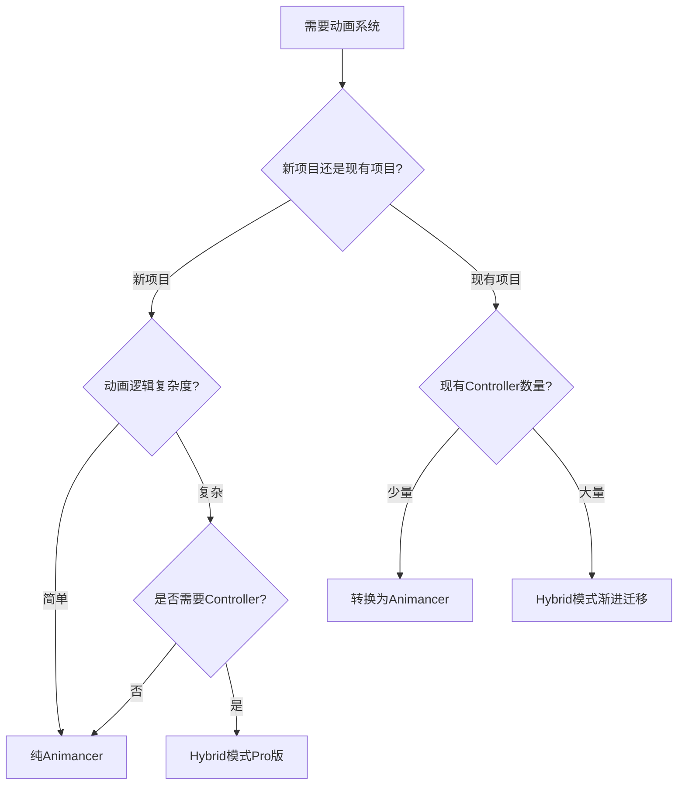

# Animancer - Animator Controllers 官方文档

## 📋 目录
- [概述](#概述)
- [使用场景](#使用场景)
- [两种集成模式](#两种集成模式)
- [Native模式](#native模式)
- [Hybrid模式](#hybrid模式)
- [代码示例](#代码示例)
- [最佳实践](#最佳实践)
- [参考资料](#参考资料)

---

## 概述

**Animator Controllers 集成**允许 Animancer 与 Unity 的 Animator Controller 系统协同工作。

> **"Unity's main animation system revolves around Animator Controllers which encapsulate some limited logic with animations."**

### 🎯 核心优势

| 特性 | 说明 |
|------|------|
| **兼容性** | 可与现有 Animator Controllers 共存 |
| **渐进迁移** | 逐步将项目转换为 Animancer |
| **混合使用** | 复杂逻辑用 Controller，简单动画用 Animancer |

---

## 使用场景

### 推荐方案

| 情况 | 方案 | 说明 |
|------|------|------|
| **新项目** | 纯 Animancer | 直接使用 Animancer（不含 Controllers） |
| **简单 Controller** | 转换为 Animancer | 用脚本替代简单的状态机逻辑 |
| **复杂 Controller** | 集成模式（Pro版） | 保留复杂的 Controller，混合使用 |
| **遗留项目** | Hybrid模式（Pro版） | 逐步迁移现有 Controller |

### 决策流程图



---

## 两种集成模式

### 对比表格

| 特性 | Native模式 | Hybrid模式（Pro版） |
|------|-----------|-------------------|
| **原理** | Controller独立运行 | Controller在Animancer内部运行 |
| **Generic骨骼** | ✅ 完全兼容 | ✅ 完全兼容 |
| **Humanoid骨骼** | ❌ 混合闪烁 | ✅ 平滑混合 |
| **性能** | ⚠️ Controller始终运行 | ✅ 按需运行 |
| **版本要求** | 所有版本 | 仅Pro版 |
| **复杂度** | 简单 | 中等 |

---

## Native模式

### 工作原理

在 Native 模式下，Animator Controller 正常运行，Animancer 独立工作。两者都可以控制同一个 Animator。

```
Animator Controller (后台始终运行)
         ↓
    Animator 组件
         ↓
    输出到骨骼
         ↑
Animancer 组件 (独立控制)
```

### 基本使用

```csharp
using Animancer;
using UnityEngine;

public class NativeModeExample : MonoBehaviour
{
    [SerializeField] private AnimancerComponent _animancer;
    [SerializeField] private Animator _animator;
    [SerializeField] private AnimationClip _separateAnimation;

    void Start()
    {
        // Controller 自动播放 Idle
        _animator.Play("Idle");
    }

    void Update()
    {
        // 按键1：使用 Controller
        if (Input.GetKeyDown(KeyCode.Alpha1))
        {
            // 停止 Animancer
            _animancer.Stop();

            // 播放 Controller 中的动画
            _animator.Play("Walk");
        }

        // 按键2：使用 Animancer
        if (Input.GetKeyDown(KeyCode.Alpha2))
        {
            // 播放 Animancer 动画（覆盖 Controller）
            _animancer.Play(_separateAnimation);
        }

        // 按键3：返回 Controller
        if (Input.GetKeyDown(KeyCode.Alpha3))
        {
            // 停止 Animancer，Controller 自动恢复
            _animancer.Stop();
        }
    }
}
```

### ⚠️ Native模式限制

#### 限制1：Humanoid 混合闪烁

```csharp
// ❌ Humanoid骨骼会出现闪烁
[SerializeField] private AnimationClip _animancerClip; // Humanoid
_animancer.Play(_animancerClip); // 与Controller混合时闪烁

// ✅ Generic骨骼正常
[SerializeField] private AnimationClip _genericClip; // Generic
_animancer.Play(_genericClip); // 平滑混合
```

#### 限制2：Controller 始终运行

```csharp
// ⚠️ 性能警告：即使停止Animancer，Controller仍在后台运行
_animancer.Stop(); // Animancer停止
// Controller 继续运行，消耗CPU
```

### 适用场景

```csharp
/// <summary>
/// Native模式适用场景
/// </summary>
public class NativeModeUseCases : MonoBehaviour
{
    [SerializeField] private AnimancerComponent _animancer;
    [SerializeField] private Animator _animator;

    [Header("Controller动画")]
    // Controller 处理复杂的移动状态机
    // 包含：Idle, Walk, Run, Jump等

    [Header("Animancer特殊动画")]
    [SerializeField] private AnimationClip _specialAttack;
    [SerializeField] private AnimationClip _deathAnimation;
    [SerializeField] private AnimationClip _cutscene;

    void PlaySpecialAttack()
    {
        // 使用 Animancer 播放特殊攻击（完全控制）
        var state = _animancer.Play(_specialAttack);
        state.Events.OnEnd = () =>
        {
            // 结束后返回 Controller
            _animancer.Stop();
        };
    }

    void Die()
    {
        // 死亡动画用 Animancer（需要事件回调）
        var state = _animancer.Play(_deathAnimation);
        state.Events.OnEnd = OnDeathComplete;
    }

    void OnDeathComplete()
    {
        // 禁用角色
        gameObject.SetActive(false);
    }
}
```

---

## Hybrid模式

### 工作原理

**Hybrid 模式**使用 `HybridAnimancerComponent` 在 Animancer 内部播放整个 Controller。

```
HybridAnimancerComponent
    ├─> ControllerState (Controller作为状态)
    └─> ClipState (AnimationClip状态)
         ↓
    输出到骨骼
```

> **⚠️ 授权要求：此功能仅限 Pro 版本**

### 基本设置

```csharp
using Animancer;
using UnityEngine;

/// <summary>
/// Hybrid模式基本使用
/// </summary>
public class HybridModeExample : MonoBehaviour
{
    // ⚠️ 使用 HybridAnimancerComponent 替代 AnimancerComponent
    [SerializeField] private HybridAnimancerComponent _animancer;

    [SerializeField] private AnimationClip _attackAnimation;
    [SerializeField] private AnimationClip _specialMove;

    void Start()
    {
        // Controller 自动播放（如果已分配）
        // 或手动播放
        _animancer.PlayController();
    }

    void Update()
    {
        // 使用 Animancer 播放特殊动画
        if (Input.GetKeyDown(KeyCode.Mouse0))
        {
            PlayAttack();
        }
    }

    void PlayAttack()
    {
        var state = _animancer.Play(_attackAnimation);
        state.Events.OnEnd = () =>
        {
            // 结束后返回 Controller
            _animancer.PlayController();
        };
    }
}
```

### 完整示例

```csharp
using Animancer;
using UnityEngine;

/// <summary>
/// Hybrid模式完整示例
/// 结合 Controller 和 Animancer 动画
/// </summary>
public class HybridCombatSystem : MonoBehaviour
{
    [Header("组件")]
    [SerializeField] private HybridAnimancerComponent _animancer;

    [Header("特殊动画")]
    [SerializeField] private AnimationClip _lightAttack;
    [SerializeField] private AnimationClip _heavyAttack;
    [SerializeField] private AnimationClip _specialSkill;
    [SerializeField] private AnimationClip _victory;

    private bool _isPlayingSpecialAnimation = false;

    void Start()
    {
        // 启动 Controller（处理移动等基础动画）
        _animancer.PlayController();
    }

    void Update()
    {
        // 防止在特殊动画期间接受输入
        if (_isPlayingSpecialAnimation) return;

        HandleInput();
    }

    void HandleInput()
    {
        // 轻攻击
        if (Input.GetKeyDown(KeyCode.Mouse0))
        {
            PlayAnimation(_lightAttack);
        }

        // 重攻击
        if (Input.GetKeyDown(KeyCode.Mouse1))
        {
            PlayAnimation(_heavyAttack);
        }

        // 特殊技能
        if (Input.GetKeyDown(KeyCode.E))
        {
            PlayAnimation(_specialSkill, fadeIn: 0.1f);
        }
    }

    void PlayAnimation(AnimationClip clip, float fadeIn = 0.25f)
    {
        _isPlayingSpecialAnimation = true;

        var state = _animancer.Play(clip, fadeIn);
        state.Events.OnEnd = OnAnimationEnd;

        Debug.Log($"播放特殊动画: {clip.name}");
    }

    void OnAnimationEnd()
    {
        // 返回 Controller
        _animancer.PlayController(0.25f);
        _isPlayingSpecialAnimation = false;

        Debug.Log("返回 Controller");
    }

    public void PlayVictory()
    {
        // 胜利动画（不返回 Controller）
        _animancer.Play(_victory);
    }
}
```

### Hybrid模式优势

```csharp
/// <summary>
/// Hybrid模式优势演示
/// </summary>
public class HybridAdvantages : MonoBehaviour
{
    [SerializeField] private HybridAnimancerComponent _animancer;

    [SerializeField] private AnimationClip _dodgeRoll;
    [SerializeField] private AnimationClip _parry;

    // ✅ 优势1：Humanoid 平滑混合
    void DodgeRoll()
    {
        // Humanoid动画也能平滑混合
        var state = _animancer.Play(_dodgeRoll, 0.15f);
        state.Events.OnEnd = () => _animancer.PlayController(0.15f);
    }

    // ✅ 优势2：Controller按需运行
    void EnterCutscene()
    {
        // 播放过场动画时，Controller不会浪费性能
        _animancer.Play(_cutsceneClip);
        // Controller 暂停运行
    }

    void ExitCutscene()
    {
        // 返回游戏时才启动 Controller
        _animancer.PlayController();
    }

    // ✅ 优势3：完全控制权
    void Parry()
    {
        var state = _animancer.Play(_parry);

        // 可以在任意时间点打断
        state.Time = 0.5f;

        // 可以精确控制速度
        state.Speed = 2f;

        // 可以添加事件
        state.Events.AddNormalized(0.3f, OnParryWindow);
    }

    void OnParryWindow()
    {
        Debug.Log("格挡窗口开启");
    }
}
```

---

## 代码示例

### 示例1：渐进迁移策略

```csharp
using Animancer;
using UnityEngine;

/// <summary>
/// 从 Animator Controller 逐步迁移到 Animancer
/// </summary>
public class GradualMigration : MonoBehaviour
{
    [SerializeField] private HybridAnimancerComponent _animancer;

    [Header("已迁移的动画（使用Animancer）")]
    [SerializeField] private AnimationClip _attack1;
    [SerializeField] private AnimationClip _attack2;
    [SerializeField] private AnimationClip _attack3;

    [Header("未迁移的动画（仍在Controller中）")]
    // Idle, Walk, Run, Jump 等基础动画仍在 Controller 中

    void Start()
    {
        // 启动 Controller 处理基础动画
        _animancer.PlayController();
    }

    void Update()
    {
        // 新功能使用 Animancer
        if (Input.GetKeyDown(KeyCode.Alpha1))
        {
            PlayAttackCombo();
        }

        // 基础移动仍由 Controller 处理
        // （在 Controller 中通过参数控制）
    }

    void PlayAttackCombo()
    {
        // 连击系统用 Animancer 实现
        var state1 = _animancer.Play(_attack1);
        state1.Events.OnEnd = () =>
        {
            var state2 = _animancer.Play(_attack2);
            state2.Events.OnEnd = () =>
            {
                var state3 = _animancer.Play(_attack3);
                state3.Events.OnEnd = () =>
                {
                    // 返回 Controller
                    _animancer.PlayController(0.25f);
                };
            };
        };
    }
}
```

### 示例2：Native 与 Hybrid 对比

```csharp
using Animancer;
using UnityEngine;

/// <summary>
/// Native 模式实现
/// </summary>
public class NativeImplementation : MonoBehaviour
{
    [SerializeField] private AnimancerComponent _animancer;
    [SerializeField] private Animator _animator;
    [SerializeField] private AnimationClip _skill;

    void UseSkill()
    {
        // ⚠️ Humanoid可能闪烁
        _animancer.Play(_skill);

        // Controller仍在后台运行（浪费性能）
    }
}

/// <summary>
/// Hybrid 模式实现（推荐）
/// </summary>
public class HybridImplementation : MonoBehaviour
{
    [SerializeField] private HybridAnimancerComponent _animancer;
    [SerializeField] private AnimationClip _skill;

    void UseSkill()
    {
        // ✅ Humanoid平滑混合
        var state = _animancer.Play(_skill);

        // Controller暂停（节省性能）

        state.Events.OnEnd = () =>
        {
            // 返回Controller
            _animancer.PlayController();
        };
    }
}
```

---

## 最佳实践

### ✅ DO（推荐做法）

#### 1. 新项目直接使用纯 Animancer

```csharp
// ✅ 好：新项目不需要 Controller
public class PureAnimancerApproach : MonoBehaviour
{
    [SerializeField] private AnimancerComponent _animancer;
    [SerializeField] private AnimationClip _idle;
    [SerializeField] private AnimationClip _walk;

    void Start()
    {
        _animancer.Play(_idle);
    }
}
```

#### 2. 复杂项目使用 Hybrid 模式

```csharp
// ✅ 好：复杂Controller用Hybrid
[SerializeField] private HybridAnimancerComponent _animancer;

void Start()
{
    _animancer.PlayController();
}
```

#### 3. 特殊动画用 Animancer，基础动画用 Controller

```csharp
// ✅ 好：职责分离
// Controller: Idle, Walk, Run, Jump
// Animancer: Attack, Skill, Death
```

### ❌ DON'T（避免做法）

#### 1. Humanoid 骨骼使用 Native 模式

```csharp
// ❌ 差：Humanoid + Native = 闪烁
[SerializeField] private AnimancerComponent _animancer; // Native
[SerializeField] private AnimationClip _humanoidClip;

_animancer.Play(_humanoidClip); // 闪烁！

// ✅ 好：使用Hybrid
[SerializeField] private HybridAnimancerComponent _animancer;
```

#### 2. 过度依赖 Controller

```csharp
// ❌ 差：所有动画都放在Controller里
// 失去了Animancer的灵活性
```

#### 3. 混用两种模式

```csharp
// ❌ 差：不要在同一项目中混用Native和Hybrid
// 容易造成混乱
```

---

## FAQ

### Q1: Native 和 Hybrid 如何选择？

**A:**

| 情况 | 推荐 |
|------|------|
| Generic 骨骼 | Native 或 Hybrid 均可 |
| Humanoid 骨骼 | **必须** Hybrid（避免闪烁） |
| 性能敏感 | Hybrid（按需运行Controller） |
| 简单项目 | Native（配置简单） |

### Q2: 可以从 Native 迁移到 Hybrid 吗？

**A:** 可以，只需替换组件：

```csharp
// 前：Native
[SerializeField] private AnimancerComponent _animancer;

// 后：Hybrid
[SerializeField] private HybridAnimancerComponent _animancer;

// 添加一行代码
void Start()
{
    _animancer.PlayController();
}
```

### Q3: Hybrid 模式支持所有 Controller 功能吗？

**A:** 不完全支持。以下功能有限制：
- ✅ 动画播放
- ✅ 参数控制
- ✅ 混合树
- ✅ 分层
- ⚠️ 部分 StateMachineBehaviour
- ❌ Sub-State Machines（部分支持）

### Q4: 性能差异有多大？

**A:**

| 模式 | CPU占用（空闲时） |
|------|------------------|
| 纯 Animancer | 0.1ms |
| Native | 0.3ms（Controller始终运行） |
| Hybrid | 0.1ms（Controller不播放时） |

### Q5: 如何调试 Controller？

**A:** 使用 Animator 窗口：

```csharp
// 在运行时打开 Window > Animation > Animator
// 可以看到 Controller 的当前状态
```

---

## 参考资料

### 📚 相关文档
- [Animator Controllers Conversion](https://kybernetik.com.au/animancer/docs/manual/animator-controllers/conversion/)
- [Controller States](https://kybernetik.com.au/animancer/docs/manual/animator-controllers/controller-states/)
- [Animator API](https://docs.unity3d.com/ScriptReference/Animator.html)

### 💡 相关类型
- `AnimancerComponent` - Native 模式组件
- `HybridAnimancerComponent` - Hybrid 模式组件（Pro版）
- `ControllerState` - Controller 状态
- `Animator` - Unity 动画控制器

---

**文档版本**: 1.0
**最后更新**: 2025-12-25
**适用 Animancer 版本**: 8.0+ (Hybrid模式需Pro版本)
