## 什么是 Gspawn - 关卡设计师？

Gspawn 是一款功能强大的工具，旨在简化在 Unity 编辑器中创建、编辑和管理各种类型视频游戏关卡的过程，使用本文档中将详细介绍的大量工具。

## 入门

开始观看由两部分组成的介绍视频教程。

- Gspawn - 简介（第 1 部分）。 （模块化环境入门）。  
Gspawn - 简介（第 2 部分）（户外环境入门）。

尽管本文档确实讨论了一些可用的热键，但它不包含完整的列表。有关热键的完整列表，请参阅 GSpawn - Level Designer/Docs 文件夹中的 GSpawn - Shortcuts 文档。

对于 HDRP 集成，请参阅 GSpawn - Level Designer/Docs 文件夹内的 GSpawn - HDRP 集成文档。

## 支持

如需支持，请联系octamodius@yahoo.com

或者在支持论坛上发帖。

## 资产

屏幕截图中使用了以下资源，它们不属于 GSpawn - Level Designer 包的一部分：

- Mana Station 的多层地下城  
- Manufactura K4 的中世纪环境包  
- Tidal Flask Studios 的梦幻村庄包  
- 3DForge 的村庄室内设计套件  
Tsunoa 的体素块包

## 安装

- 在Unity中创建一个新项目；

- 导入 Gspawn - 关卡设计器包；  
- 在顶部菜单中，单击“工具”>“GSpawn”>“初始化”：

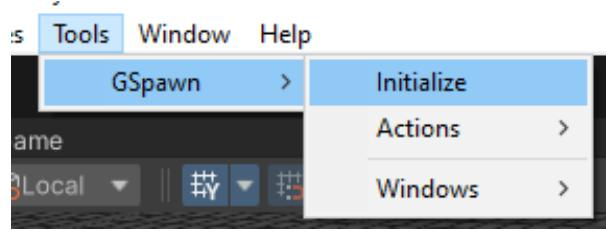

注意：单击“初始化”后，插件将创建一个数据文件夹，并在其中填充一些存储不同设置所需的资源文件。这可能需要您稍等一下，直到创建必要的文件。

完成后，层次结构视图将在场景中显示一个名为 Gspawn 的新对象，并且场景视图将显示一个网格。至此初始化完成。您需要在层次结构视图中选择 Gspawn 对象才能与插件交互。

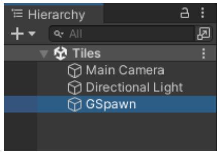

注意：您需要为项目中的每个场景执行此步骤。因此，当您完成一个场景并想要创建一个新场景时，您需要再次单击“工具”>“GSpawn”>“初始化”。

## Inspector

当选择 Gspawn 对象时，检查器将显示一些工具栏：

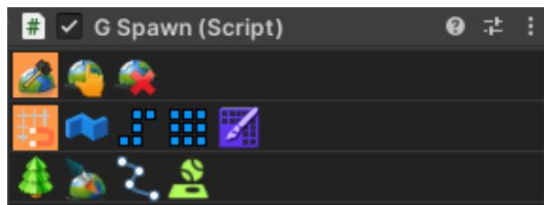

顶部工具栏有 3 个按钮。按其中一个按钮将激活一种新的操作模式。从左到右列出的不同操作模式是：

- 对象生成 - 使用不同的生成工具在场景中生成对象；  
- 对象选择 - 选择对象并使用不同的工具操纵它们；  
- 对象擦除-使用不同的擦除工具擦除对象；

在上图中，第一个按钮处于活动状态，这意味着对象生成模式处于活动状态。顶部工具栏下方的工具栏包含激活不同生成工具的不同按钮。

单击这些按钮将更改检查器 UI，以包含特定于您正在使用的工具的设置/控件。

## 相同的 UI - 不同的设置

您在使用该插件时会注意到，某些设置出现在多个位置。例如，模块化捕捉和镜像设置由不同的工具使用，您将看到它们的 UI 出现在不同的上下文中。请务必记住，每个 UI 都映射到这些设置的唯一实例。这意味着这些设置不共享。例如，当使用“模块化捕捉生成”、“模块化墙生成”、“段生成”、“盒子生成”以及在“对象选择”模式下使用时，“模块化捕捉”设置会出现在 UI 中。然而，这些工具/模式中的每一个都使用它们自己的这些设置的副本。在一个上下文中更改捕捉设置不会影响其他设置。

## 管理预制件

为了使用插件功能，您需要指定要使用的预制件。

在 Gspawn 中，预制件组织在预制件库中。每个预制件库可以包含特定类别的预制件。

为了设置预制件，您需要打开 2 个窗口：预制件库和预制件管理器窗口。

要打开预制件库管理器窗口：

打开工具 > Gspawn > Windows > 预制库管理器...

要打开预制件管理器窗口：

打开工具 > Gspawn > 窗口 > 预制件管理器...

然后，您可以将这些窗口停靠在任何您想要的位置。下图显示了这两个相邻的窗口：

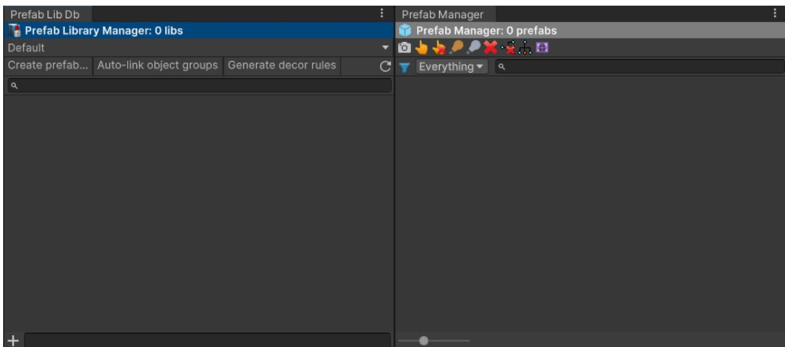

## 创建预制库

## 删除预制文件夹

创建预制件库并用预制件填充它们的最简单方法是将预制件文件夹拖放到“预制件库管理器”窗口中。只需选择一个包含预制件的文件夹，然后将其拖放到预制件库管理器内的空白区域即可。

下图显示了将预制件文件夹放入预制件库窗口后这两个窗口的状态：

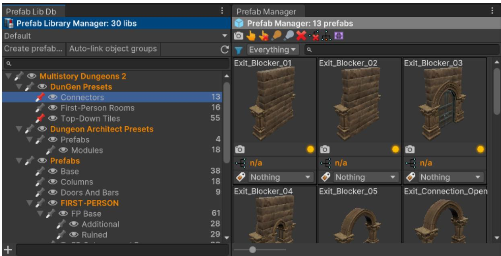

Multistory Dungeons 2 文件夹已放入预制库管理器中，并且该插件创建了类似于文件夹结构的预制库层次结构。任何空文件夹或不包含任何包含预制件的子文件夹的文件夹都会被排除。

橙色库是空的，但它们包含包含预制件的子库。当库包含预制件时，预制件的数量将显示在库名称的最右侧。

单击预制件库将更新“预制件管理器”窗口，该窗口将显示该库中存在的所有预制件的预览。单击时按住 [CTRL] 可以一次选择多个库。预制件管理器将始终显示所有选定库的内容。

注意：建议您尽量控制预制库的数量。当您使用撤消/重做时，插件需要刷新 UI，如果库的数量太大，这可能会导致轻微的滞后。

## 手动创建库

您还可以通过在最底部的文本字段中输入名称，然后单击加号图标来手动创建库。为了填充手动创建的库，您必须在项目视图中选择预制件资源，然后将它们放入预制件管理器窗口中。

## 图书馆设置可见性

每个库的名称左侧都有一个眼睛图标。单击此图标将允许您切换库的可见性。当库可见时，其预制件将显示在预制件管理器中。当不可见时，其预制件将被隐藏。这可以用作过滤机制。

如果隐藏某个库，则其所有子库也将被隐藏。

## 库图钉

如果您按“眼睛”图标旁边的“固定”按钮，这将固定该库。固定库后，按名称进行库搜索时它将始终可见。

当您尝试将预制件从不同的库复制到公共库时，这会很有用。例如，您可能想要创建一个名为 Favs 的库来存储您经常使用的预制件。您可以固定 Favs 库，然后使用搜索功能来搜索可以从中复制预制件的库。如果没有固定，如果未通过名称搜索，Favs 库将始终被隐藏，并且在将预制件复制到其中时，您总是必须一次又一次地找到它。对于更复杂的库树来说，这可能会很乏味。

## 在库之间移动/复制预制件

您可以使用以下步骤将预制件从一个库复制到另一个库：

- 在预制件管理器中选择预制件；  
- 按[CTRL + C]；  
- 选择您想要复制预制件的库（或多个库）；  
- 按[CTRL + V]；

## 或者

- 在预制件管理器中选择预制件；  
按住[ALT]；  
- 将预制件拖放到目标库中；

您还可以复制整个库：

- 选择您要复制的库；  
- 按[CTRL + C]（库将变成绿色）；  
- 选择目标库（或多个库）；  
- 按[CTRL + V]；

要将预制件从一个库移动到另一个库，请按照以下步骤操作：

- 在预制件管理器中选择预制件；  
将它们拖放到目标库中；

## 预制件预览

可以通过按住鼠标中键并移动鼠标来旋转预制件预览。 macOS 用户可以选择使用替代快捷键：[ALT + 右键单击] 并拖动鼠标。可以从 macOS 部分下的“编辑”>“首选项”>“GSpawn”>“输入”启用此功能。

在预览的顶部，您可以看到预制资源的名称。

底部的第一行包含一个小相机按钮，用于将预览旋转重置回 0，以及一个黄色发光小按钮，用于突出显示项目窗口中的预制资源。

第二行通知您预制件是否链接到对象组。

最后一行允许您将标签分配给前缀。

## 预制库配置文件

可以将预制件库组织到预制件库配置文件中。插件中的很多地方都使用了配置文件。它们本质上是一种在不同的设置/数据配置之间快速切换的方法。对于预制库，您可以拥有一个在一个场景中使用的库配置文件和一个可在不同场景中使用的不同配置文件。只能有一个活动配置文件，预制件库将仅显示活动配置文件的库。

## 创建预制库配置文件

为了创建新的库配置文件：

- 在预制库管理器窗口中，单击最顶部的下拉菜单（最初它将包含一个名为“默认”的项目）；  
- 然后点击创建新的个人资料...

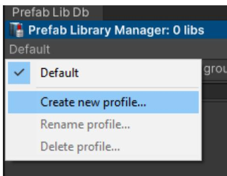

- 将出现一个新窗口：

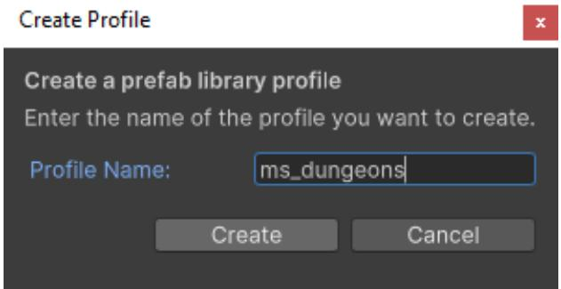

- 输入配置文件的名称，然后单击“创建”。

新的配置文件将被标记为新的活动配置文件：

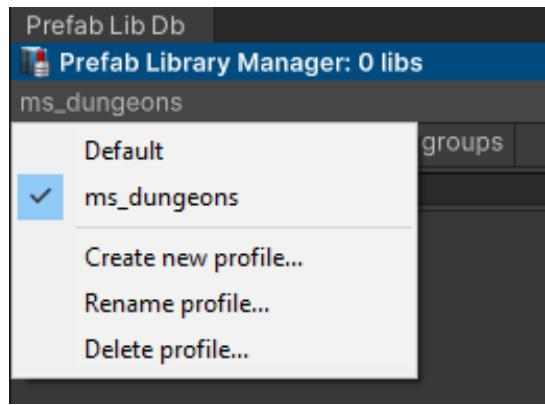

您现在可以使用前面讨论的方法用库和预制件填充配置文件。

## 生成对象工具

以下生成工具可用：

1. 模块化捕捉生成  
2. 模块化墙生成  
3. 分段生成  
4. 盒子生成  
5. 平铺规则生成  
6. 道具生成  
7. 散布画笔生成  
8. 曲线生成  
9. 物理生成

## 生成指南

一些生成工具通过在场景中创建生成引导对象来工作，您可以使用鼠标光标移动该对象来建立生成位置。生成指南只是指示下一个对象将被放置的位置。

以下生成工具使用生成指南作为指示器：

- 模块化 Snap Spawn；

模块化墙生成；  
分段生成；  
- 盒子生成；  
- 道具生成；

使用上述任何工具时，您需要在预制件管理器窗口中双击预制件才能创建生成指南。然后，在场景中移动鼠标以建立生成位置。左键单击生成。

注意：使用鼠标在场景中移动生成指南的方式取决于活动的生成工具。例如，在“模块化捕捉生成”中，指南将捕捉到网格。在 Props Spawn 中，它将被捕捉到网格或地形表面。

## 生成引导旋转

您可以使用以下热键旋转生成指南：

- [X]——绕网格X轴旋转；  
- [Y]——绕网格Y轴旋转；  
- [Z]——绕网格Z轴旋转；

上面的所有热键都将使用生成引导枢轴作为旋转枢轴。如果您希望使用生成引导边界中心作为轴心，则还必须在按下 X/Y/Z 按钮的同时按住 [SHIFT]。

您可以按 [I] 将对象旋转重置为预制资源中存储的旋转

使用这些热键旋转生成指南时，默认旋转为 90 度。如果您想更改旋转步骤，请打开“编辑”>“首选项...”

这将打开 Unity 的首选项窗口。在左侧窗格中，单击 Gspawn 父项下的“Input”：

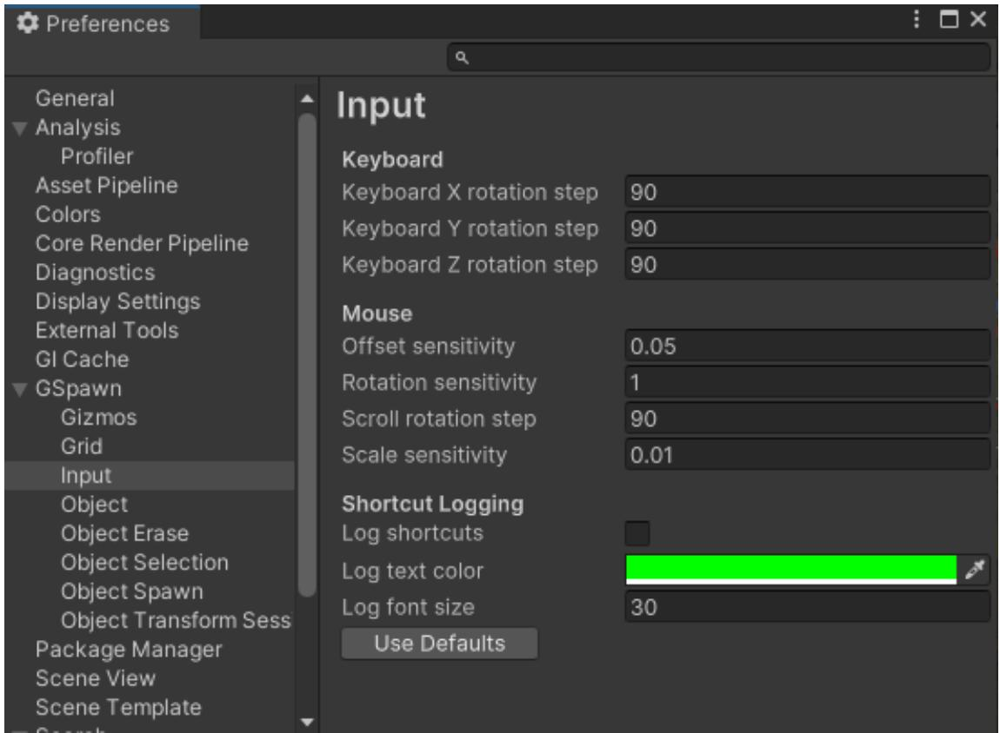

您现在可以单独更改每个轴的键盘旋转步骤。

## 从场景对象中选取预制件

您也可以直接从场景中选取预制件，而不是在预制件管理器中双击预制件预览来更改生成引导预制件。这比在管理器中搜索预制件要快得多。

只需按住 [ALT] 并左键单击场景对象即可。

注意：仅当您单击的对象是预制件管理器中存在的预制件实例时，此操作才有效。

## 模块化捕捉生成

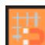

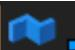

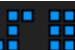

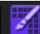

模块化捕捉表示将对象捕捉到场景网格的行为。当此生成工具处于活动状态时，当您移动鼠标时，生成指南将捕捉到网格。当您左键单击时，场景中将生成一个新对象。这允许您通过一次放置一个对象来填充您的环境。

注意：虽然模块化捕捉是一个生成工具，但模块化捕捉实际上用在不同的地方。其他生成工具（例如模块化墙、分段和盒子）也使用模块化捕捉来捕捉生成引导线。此外，对象选择模式使用模块化捕捉来捕捉选定的对象，这在更改场景时非常方便。

## 向上/向下移动

有时能够向上/向下移动生成指南很有用。您可以使用 [Q] 和 [E] 热键来实现此目的。他们将分别向下和向上移动生成指南。移动量与沿 Y 轴的网格单元尺寸相同。

如果按住 [CTRL + SHIFT] 并使用鼠标滚轮偏移参考线，也可以实现同样的效果。

按 [R] 将偏移重置回 0。

## Y轴旋转

在模块化捕捉中，您可以通过按住 [SHIFT] 并使用鼠标滚轮来旋转生成指南。这是对前面讨论的 X/Y/Z 热键的补充。

## 网格捕捉爬升

使用热键或鼠标滚轮向上/向下移动很灵活，但有时您可能需要更自动的行为。这种行为称为网格捕捉爬升，您可以在检查器中找到相关字段：

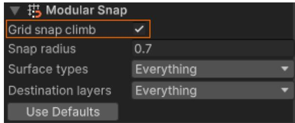

您还可以使用 [SHIFT + C] 打开/关闭网格捕捉爬升。

当网格捕捉攀爬处于活动状态时，生成指南将“攀爬”场景中的对象，并且它也将捕捉到网格。这对于应该位于其他物体顶部的物体（例如地板顶部的墙壁、墙壁上的装饰元素等）非常有效。

## 对象到对象捕捉

模块化捕捉有两种操作模式：网格捕捉（我们已经讨论过）和对象到对象捕捉。您可以按 [S] 在这 2 个选项之间切换。

当对象到对象捕捉处于活动状态时，生成引导线将不再捕捉到网格。相反，它会捕捉到附近的物体。

注意：对象到对象捕捉不适用于侧面有凹凸或装饰元素的预制件。当处理墙壁、地板或任何其他具有平坦侧面的类似结构时，它是理想的选择。它特别适合处理瓷砖块（即立方体）。

## 对齐亮点和提示

捕捉对象时，您通常希望精确，有时您可能希望对象沿某个方向排列。当使用较小的网格单元尺寸（例如 0.5 或 1）时，当对象相距很远时，这可能会变得很困难，因为很难判断它们的位置是否正确对齐。

当附近的对象沿着网格轴之一与生成引导线对齐时，该插件可以帮助您突出显示附近的对象。下图显示了一个示例：

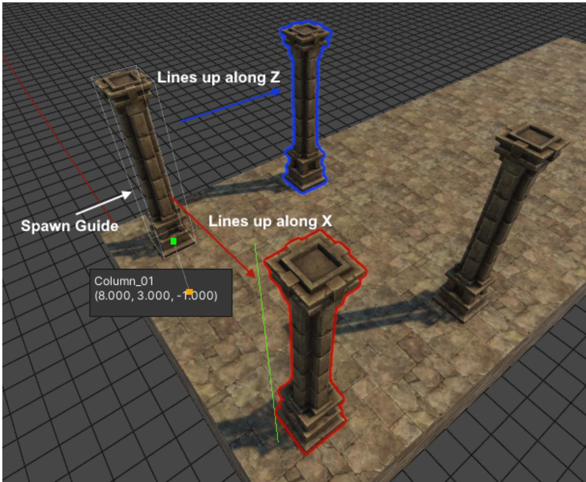

在上图中，地板顶部生成了 3 根柱子。生成引导线已放置在角落，并使用高光来确保其沿网格 X 轴和 Z 轴正确对齐。

与对齐突出显示相结合，该插件还可以为您提供对齐提示，这些提示是附加到附近对象的标签。只有那些与跨度参考线对齐的对象才会显示对齐提示。

在下图中，提示标签用于生成 3 个连续的等距列：

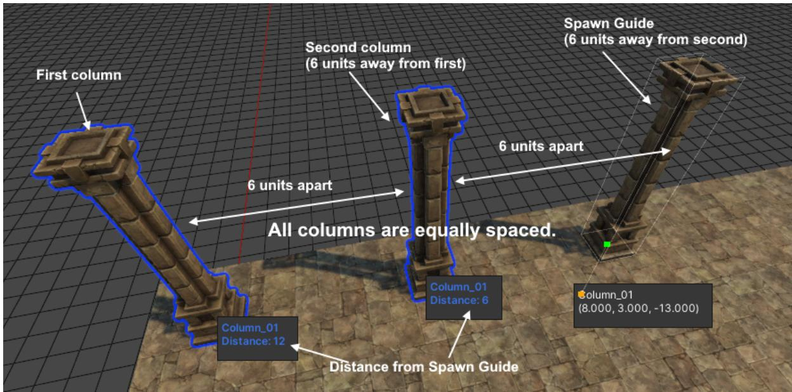

标签显示它们所附加的对象的名称和距离值。该距离值表示距生成引导线的距离。在此示例中，列从左到右生成，彼此之间的距离为 6 个单位。通过在距前一列 6 个单位的距离处生成每个新列，我们可以确保所有列的间距相等。

虽然在某些情况下非常方便，但突出显示，尤其是标签有时会造成妨碍。您可以使用以下快捷方式切换这些助手：

- [SPACE] - 切换对齐突出显示；  
- [SHIFT + SPACE] - 切换对齐提示；

## 首选项

当涉及对齐突出显示和提示时，您可以从首选项窗口更改一些设置。打开“编辑”>“首选项...”，然后在左窗格中单击“GSpawn”>“对象转换会话”：

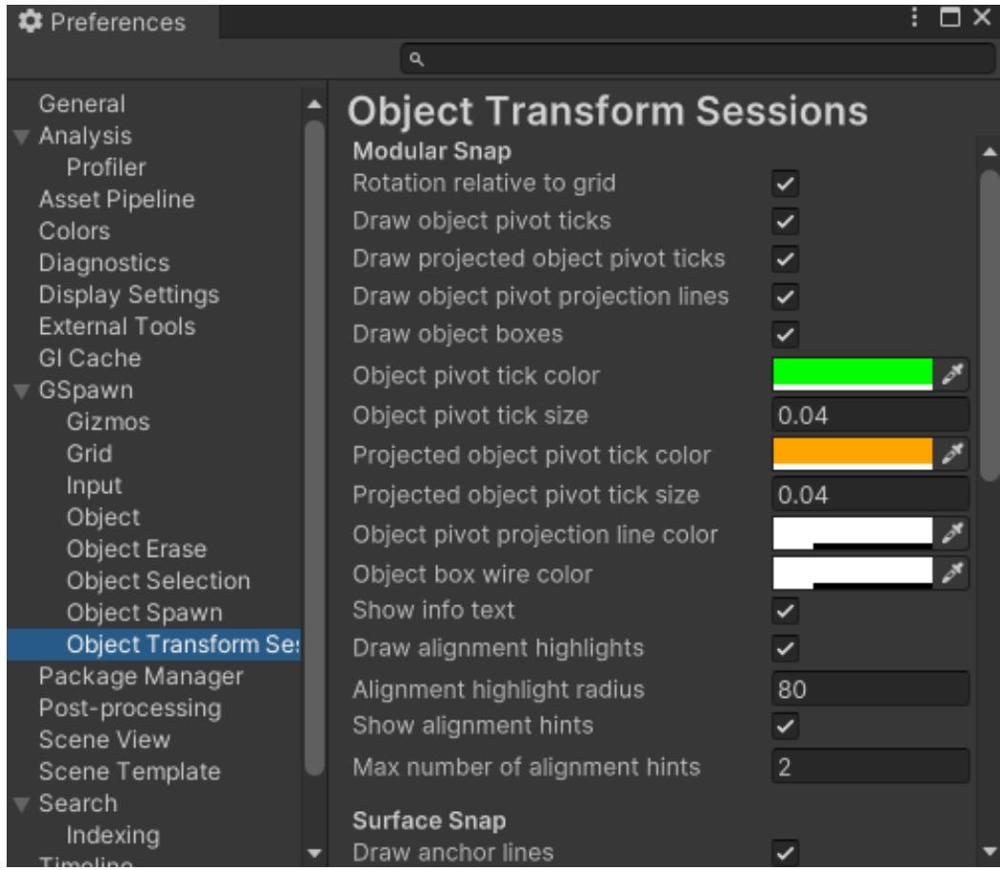

在“模块化捕捉”部分下，您可以修改影响模块化捕捉的不同设置。我们将讨论与对齐突出显示和提示相关的内容：

- 绘制对齐突出显示 - 切换对齐突出显示。热键：[空格]；  
- 对齐高亮半径 - 该数字表示世界半径，用于收集将检查对齐情况的附近对象。使用更大的数字来覆盖更大的距离，尽管默认值在大多数情况下应该足够了；  
- 显示对齐提示 - 切换对齐提示。热键：[SHIFT + 空格]；  
- 对齐提示的最大数量 - 将在场景视图中显示的提示标签的最大数量。例如，值为 2 意味着如果有 10 个对象与生成指南对齐，则其中只有 2 个对象会在场景视图中显示提示标签。为了避免混乱，通常需要较小的数量；

## 网格捕捉轴锁

捕捉到网格时，有时锁定生成引导线沿单个方向（即网格的轴之一，X 轴或 Z 轴）的移动可能很有用。您可以通过按住 [CTRL] 键来做到这一点：

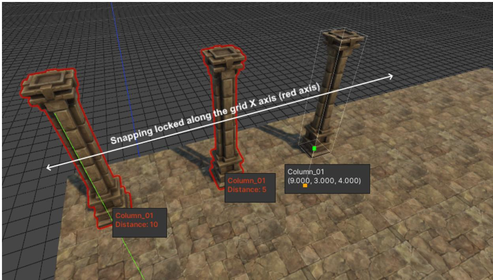

在上图中，按住 [CTRL] 键，并且当移动鼠标时，生成引导线仅向左或向右移动。通过这种方式，您可以轻松确保它与其他列对齐。

该插件将选择水平穿过屏幕的轴。在上图中，这恰好是网格的 X 轴。但是，您可以按住 [CTRL + SHIFT] 来更改轴。在前面的示例中，这将更改锁定轴，使其对应于网格 Z 轴（蓝色轴）。

## 模块化墙生成

这个生成工具对于创建墙壁非常方便。您可以使用 Modular Snap Spawn 一次放置一个墙件。然而，更快的方法是使用模块化墙生成，只需单击几下即可生成多个墙段，同时还自动处理内角和外角。

## 模块化墙预制型材

在使用此工具之前，需要进行一些设置。如果我们查看检查器，我们可以看到以下设置：

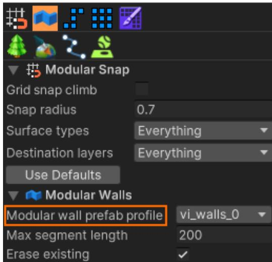

我们可以看到，我们需要指定一个模块化墙预制件轮廓。这是一个预制配置文件，其中包含插件将使用的必要数据来生成墙件。

打开工具 > Gspawn > 窗口 > 模块化墙预制件...

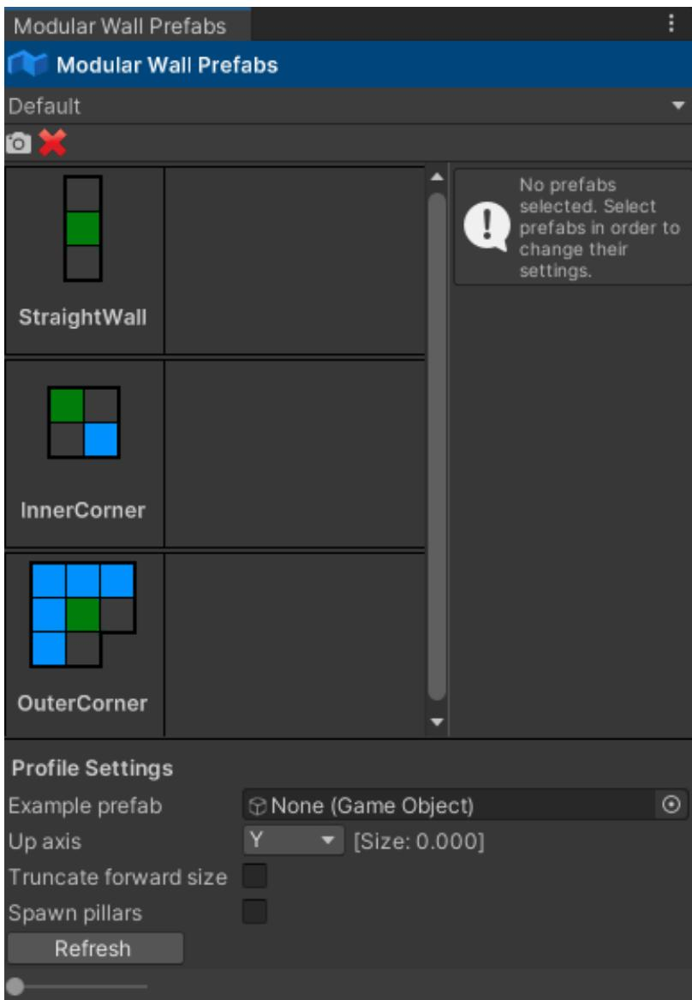

屏幕上将显示上述窗口，您需要在此处指定必要的数据。

## 墙件

在左侧窗格中，您可以看到有 3 个图标，代表不同类型的墙件。让我们来谈谈每一项的含义：

- 直墙 - 直墙件只是连接到其他 2 个相邻墙件的常规墙件；  
- 内角 - 当墙转弯且角指向墙包围区域的内部时，使用内角件；  
- 外角 - 当墙转弯且角指向墙包围区域的外侧时，使用外角件；

下图显示了本示例中将使用的 3 个预制件，每个预制件都映射到我们刚刚讨论的每个墙件：

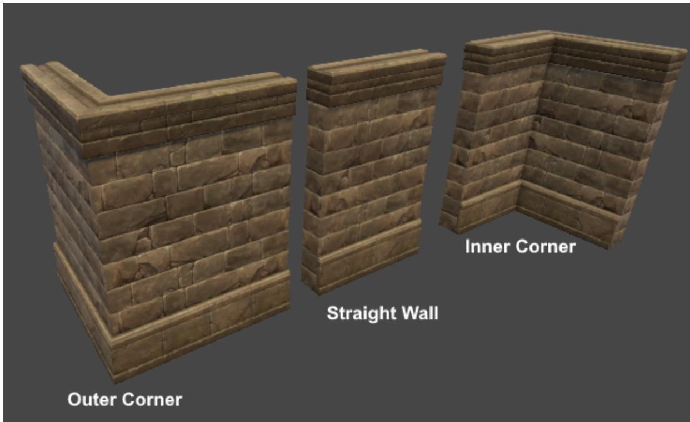

## 配置文件设置

在模块化墙预制窗口的底部，有一个标记为“配置文件设置”的部分。

第一个字段是最重要的，称为“示例预制件”。

向上轴字段允许您指定指向上方的预制局部轴。这通常是 Y 轴。

字段向前截断尺寸用于墙壁与相邻部件连接的侧面有小凸起的情况。如果存在这些凹凸，则必须检查此切换，否则墙件之间可能会出现间隙。

生成支柱切换允许您使用支柱。

## 预制件示例

示例预制件是您需要创建的预制件，其中包含以某种配置排列的所有必要的墙件，这将允许插件检测墙件如何组合在一起。

为了创建示例，预制件遵循以下步骤：

- 切换到对象选择模式。  
- 在预制管理器中找到直墙部件并将其拖放到场景中。一旦释放鼠标左键，对象就会开始捕捉到网格。左键单击以提交。  
- 使用相同的方法在场景中生成内墙和外墙件，并将它们连接到直件。  
- 生成 2 个其他直墙部件（您可以使用  $[\mathrm{CTRL} + \mathrm{D}]$  复制第一个）并将它们分别连接到外角和内角。

下图显示了我们在本示例中使用的预制资源的这种排列方式：

与每个墙件相关的标签不是随机的。它们有特殊的意义。我们稍后会回到这个话题。

选择您刚刚创建的墙件，然后在“预制件库管理器”窗口中单击顶部工具栏中的“创建预制件...”按钮：

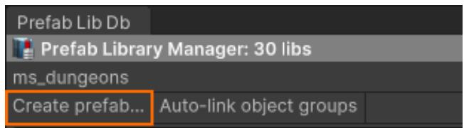

这将弹出以下窗口：

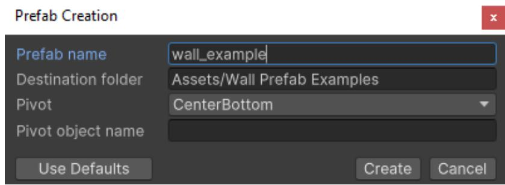

您需要为预制资源指定名称并指定目标文件夹。您可以将文件夹拖放到目标文件夹字段中。在这种情况下，其他字段并不重要。

单击“创建”。如果已存在同名预制件，系统会询问您是否要替换旧预制件。

现在单击您刚刚创建的预制资源。并打开预制件：

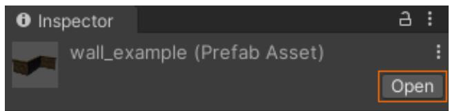

预制窗口打开后，单击每个墙件并为其指定正确的名称，如前所述：

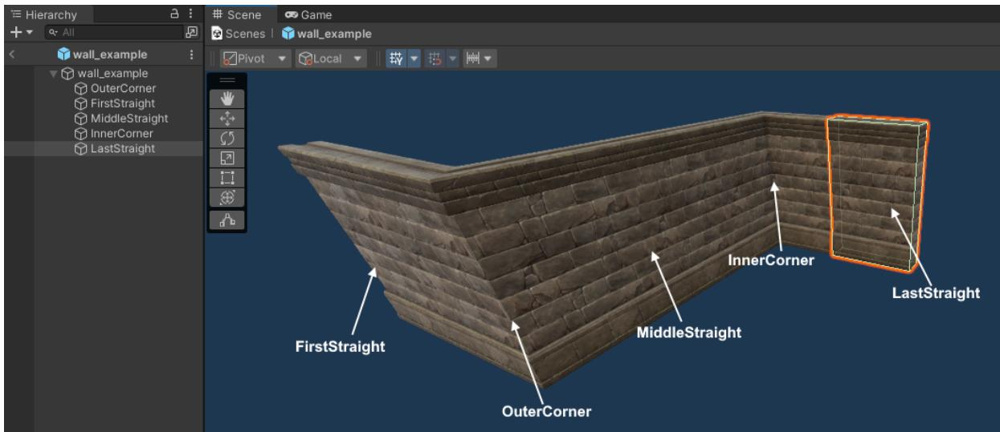

这些名称对于插件很重要，因为它允许它识别每个部分的角色。名称可以是小写、大写或混合。重要的是名称的拼写应与上图所示完全一致。

最后，将预制资源放入“模块化墙预制件配置文件”窗口中的“示例预制件”内：

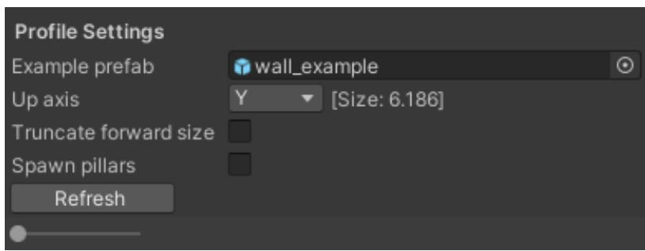

注意：从 3.3.1 版本开始，插件将尝试自动检测墙件。为了启用此功能，在将示例预制件分配给墙预制件轮廓之前，请确保在预制件管理器中选择 InnerCorner 预制件并将其标签设置为 Wall Inner Corner，如下所示：

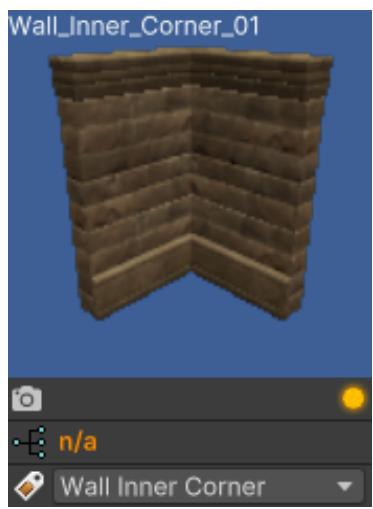

但这并不总是可行，因此您可能仍需要手动执行这些步骤。当您将示例预制件分配给模块化墙预制件配置文件时，该插件将通过在控制台窗口中显示错误并在屏幕上显示消息框来通知您是否无法自动检测墙件。

如果预制件存在任何错误（例如，命名不正确），插件将在控制台窗口中显示错误消息。

如果您需要对示例预制件进行更改，则必须按“刷新”按钮来指示插件刷新数据。

## 分配预制件

最后一步是将墙件预制件分配到墙预制件轮廓窗口中的正确插槽，如下图所示：

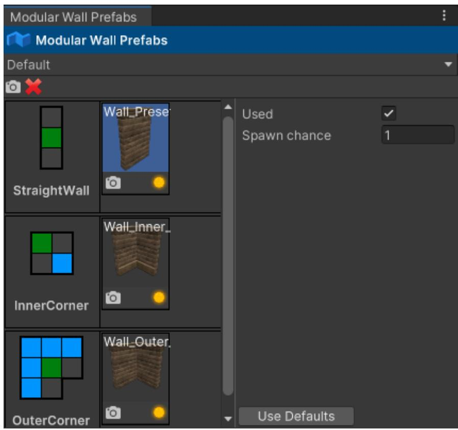

通过将预制件从预制件管理器窗口拖到相应插槽旁边的左窗格中，将每个墙件分配到右侧插槽（直墙、内角和外角）。

此时，预制轮廓就可以使用了。

注意：如果您需要多个配置文件，则必须为每个配置文件创建一个附加配置文件和一个新的示例预制件。在此示例中，需要单个配置文件并使用默认配置文件。

注意：从版本 3.3.1 开始，插件将尝试自动从示例预制件中提取预制件并将它们分配到正确的插槽。

## 产卵墙

确保模块化墙生成模式处于活动状态。在模块化墙预制型材字段中选择您想要使用的墙预制型材。

双击预制件管理器中的任何预制件（任何预制件都可以）。该插件将从与当前配置文件关联的直墙件创建生成指南。

## 生成：

- 将生成指南卡入您想要放置墙的正确位置。注意：该插件将始终保持生成指南的上轴与网格对齐。这意味着您无法围绕 X 或 Z 旋转生成指南。只有 Y 热键才有效；  
- 左键单击开始。这将禁用生成指南，并且盒子指示器将显示为近似墙件；  
- 每次连续单击都会添加 2 个垂直的墙段；  
- 当整个墙体平面图建立完毕后，按住[SHIFT]并左键单击以提交；

放置墙段时，您可以按住 [SHIFT] 并右键单击后退（即移除最后 2 个墙段）。您也可以按 [ESCAPE] 取消。

下图显示了围绕平面图的墙：

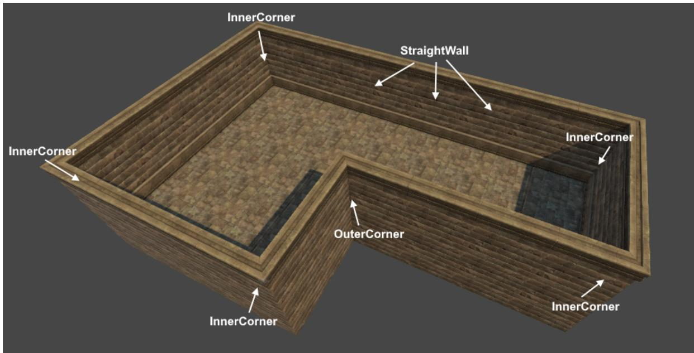

正如您所看到的，即使有一个设置阶段，一旦设置阶段完成，只需单击几下即可完成生成墙，并支持内角和外角检测。

## 每个墙块插槽有多个预制件

您可以将多个预制件分配给同一个插槽，如下图所示：

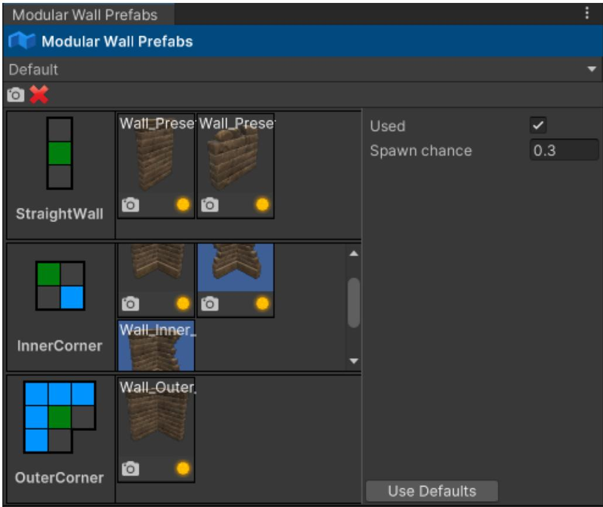

在上图中，损坏的墙件被添加到直墙槽中。两个损坏的预制件被添加到内角插槽中。所有受损预制件的生成机会字段已设置为 0.3。

结果如下图所示：

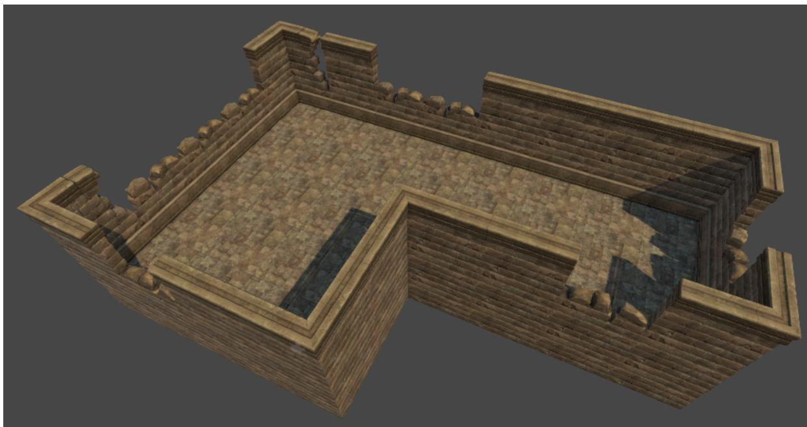

注意：只有当分配给一个槽的所有预制件共享相同的枢轴时，这才有效。例如，如果您要将所有内角墙块以相同的旋转方式放置在原点处，则墙块将完美重叠。

## 没有内/外角的产卵墙

如果您想生成没有内角/外角的墙，可以按照以下步骤操作：

1. 创建示例预制件，如下图所示：

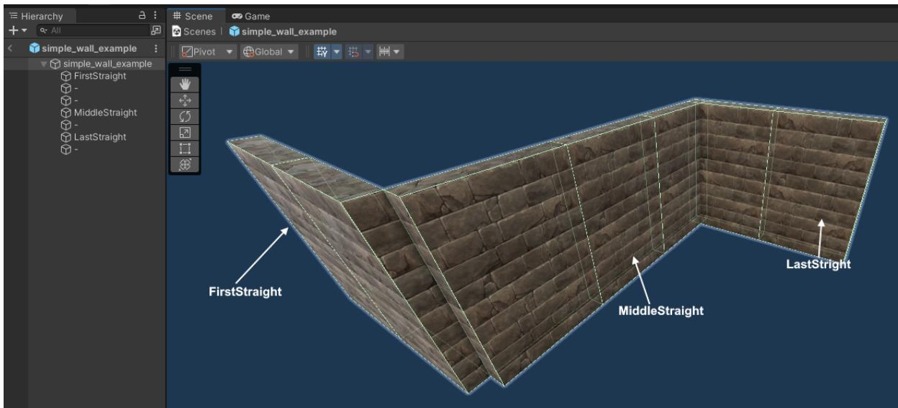

请注意，在本例中，因为我们无法访问内角和外角，所以使用 2 个直墙件来创建它们。然而，在这种情况下，这些部分不必有特定的名称。事实上，他们的名字可以是除了公认的名字之外的任何名字。在此示例中，分配给这些对象的名称是“-”。

2. 将示例预制件分配给示例预制件字段；  
3. 在墙预制型材窗口中，将直墙件分配给直墙槽；内、外槽必须留空；

下图显示了使用此新墙轮廓的生成墙的示例：

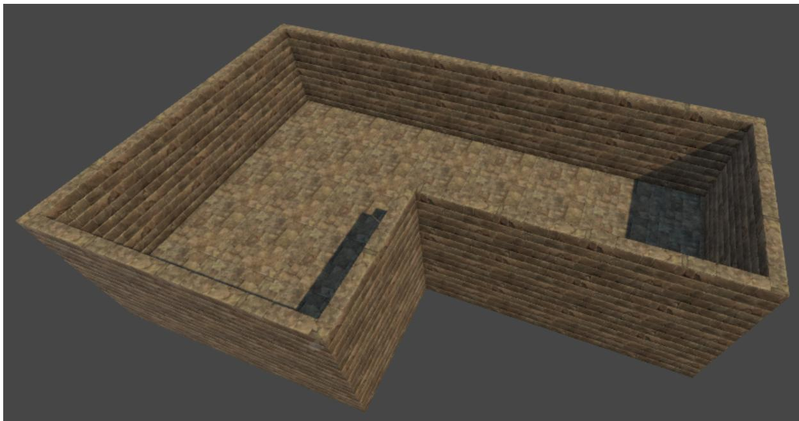

注意：当对内角和外角使用此方法时，自动墙件检测将不起作用。您必须手动命名墙件。

## 产卵拱门

您不仅限于使用此工具生成墙。例如，下图显示了如何使用此生成工具生成拱门：

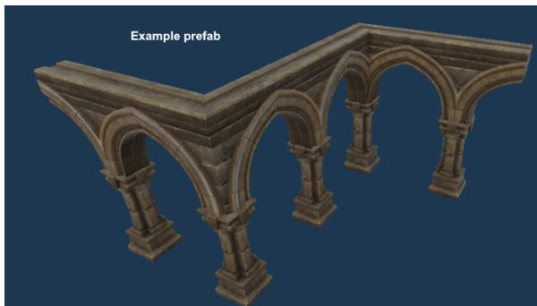

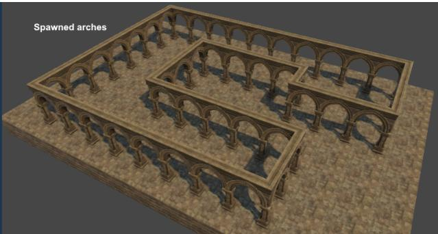

左图显示了示例预制件，右图显示了最终结果。

## 产卵柱

您还可以在不同的墙块之间生成柱子。下图显示了生成带有柱子的栏杆的示例：

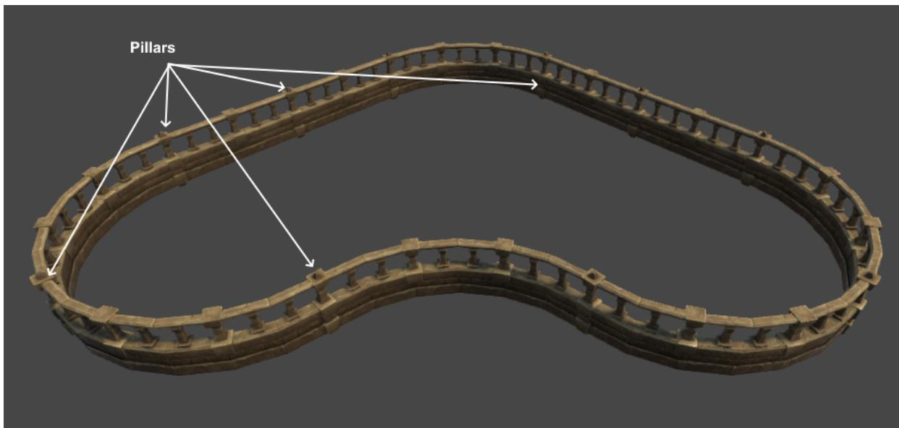

为了支撑柱子，您需要将 4 个柱子对象添加到示例预制件中。下图显示了为上面的栏杆示例构建的示例预制件：

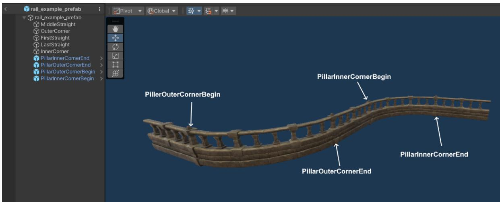

必须将 2 对柱子添加到示例预制件中：

1. 外角的起点和终点 (PillerOuterCornerBegin & PillerOuterCornerEnd)；  
2. 在内角的起点和终点 (PillerInnerCornerBegin & PillerInnerCornerEnd)；

注意：不要忘记名称很重要。大小写并不重要，但名称的拼写必须与上图所示完全一致。

接下来，您需要检查墙轮廓设置中的**生成支柱**开关，并选择包含支柱预制件的**随机预制件轮廓**：

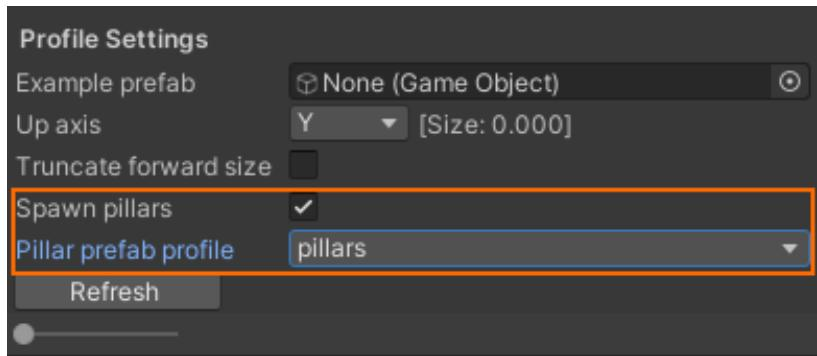

此时，您已准备好生成带有柱子的墙壁/栏杆。

另一种可以使用的支柱是位于内角和外角中间的支柱，如下图所示：

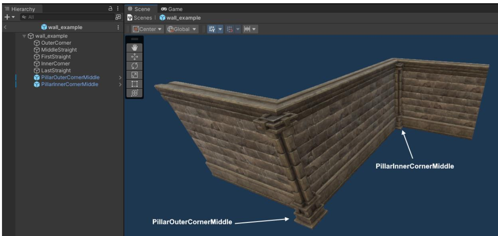

本例中使用了 2 个支柱对象：

1. 一根名为 PillarOuterCornerMiddle 的柱子位于外角的中间；  
2. 一根名为 PillarInnerCornerMiddle 的柱子位于内角的中间；

在上图中，两个柱子使用了相同的预制件。但是，您可以为每个角设置 2 个不同的预制件。在这种情况下，您需要为每个支柱预制件分配一个标签。 PillarOuterCornerMiddle 支柱必须有一个同名的标签。 PillarInnerCornerMiddle 也是如此。两个支柱都必须分配给支柱随机预制轮廓。

## 要求

为了使用模块化墙生成工具，必须满足以下条件：

- 直墙件沿连接轴的尺寸必须大于沿其内轴的尺寸（例如，不要使用立方体）；  
- 所有墙壁预制件必须具有相同的向上轴（即，如果将所有墙壁件预制件在所有轴上的旋转设置为 0，则它们必须全部沿同一轴指向上方）；  
- 所有墙件和柱子的所有轴的比例必须为 1；  
- 除 PillarOuterCornerMiddle 和 PillarInnerCornerMiddle 之外的所有支柱都必须独立旋转。这意味着，无论示例预制件中的柱子如何旋转，柱子都必须看起来“正确”；  
- 当使用具有内角和外角的墙型材时，应避免在角件后立即创建转弯的情况。这可能会在墙壁上产生重叠或间隙。下图显示了这种情况的示例：

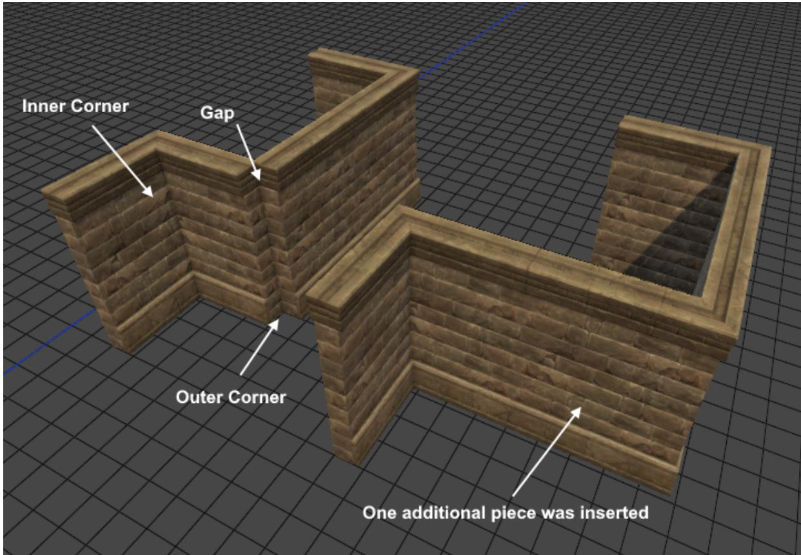

## 重用示例预制件

一些资源包包含不同类型的墙。它们的墙壁预制件看起来不同，但墙壁以相同的方式相互连接。在这种情况下，可以在不同的墙型材之间重复使用相同的示例预制件。

例如，以下示例预制件可用于为村庄内部地下室创建墙壁：

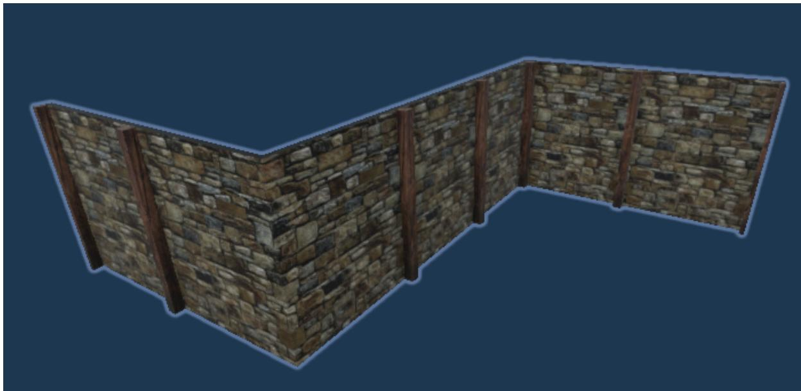

但使用相同的示例预制件，可以创建不同类型的墙：

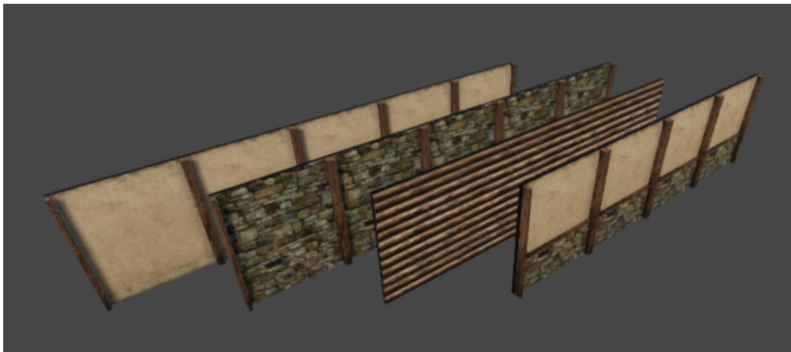

注意：您仍然需要为每种类型的墙创建新的墙预制件轮廓，但示例预制件可以在轮廓之间重复使用。

## 分段生成

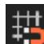

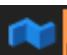

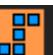

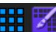

Segments Spawn 及其表弟 Box Spawn 在处理图块时非常方便。它们也可以在模块化环境中铺设地板时使用。事实上，您在“模块化墙生成”章节图像中看到的地板预制件是使用 Box Spawn 生成的。

为了使用“Segments Spawn”，请确保检查器中的工具按钮处于活动状态，如上图所示。

双击预制件管理器中的预制件以激活生成指南。这将启用模块化捕捉，您可以在场景中移动生成指南并将其捕捉到网格，就像使用其他使用捕捉的生成工具所做的那样。

为了生成，请按照以下步骤操作：

- 左键单击开始（这将禁用生成指南并显示框指示器）；  
- 每次连续单击都会添加 2 个新的垂直线段对；  
- 按住 [SHIFT] 并左键单击以提交并生成；

如果您犯了错误，您可以按住[SHIFT]并右键单击后退（即删除最后2段）。

下图显示了使用此工具生成的一系列图块的简单示例：

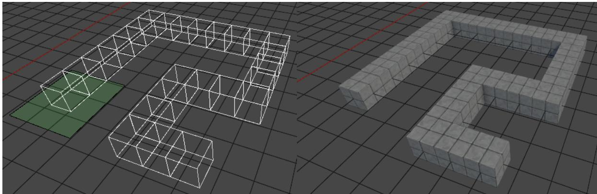

## 延伸平面

创建生成指南后，您将看到一个透明的四边形位于生成指南下方：

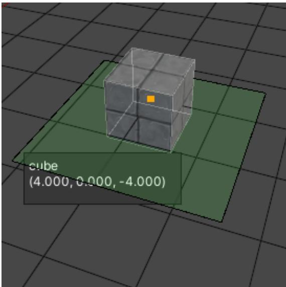

这是延伸平面，也用于 Box Spawn 模式。延伸平面表示水平延伸方向。这仅仅意味着段链（或 Box Spawn 的盒子）将沿着该平面的表面延伸。

段链（或 Box Spawn 的盒子）的高度将垂直于该平面延伸。

您可以通过按住 [CTRL] 并使用鼠标滚轮在不同的平面方向之间循环。

您可以按住 [CTRL + ALT] 并单击左键从鼠标光标下的对象或网格中选取方向。该平面将始终与生成指南的包围体面之一对齐。因此，当通过左键单击选择方向时，延伸平面将与与您用鼠标光标选取的表面最对齐的体积面对齐。

## 高度模式

有 3 种高度模式可让您更改段链的高度。在我们讨论这些高度模式之前，有必要先讨论一下电池堆。每个段都是沿特定方向延伸的电池堆的集合。每个电池堆可以有不同数量的电池。电池堆中的电池数量称为电池堆高度。每个单元格中都会生成物体。

可用的高度模式有：

- 恒定——每个堆栈具有相同的高度值；  
- 随机 - 每个堆栈将在指定间隔内具有随机高度；  
- Pattern - 每个堆栈的高度将从整数模式中获取；

下图显示了 UI 中的高度模式控件：

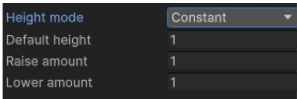

默认高度字段允许您指定启动段链时将使用的默认高度值。 “升高/降低量”字段允许您控制使用滚轮更改高度时添加/删除的单元格数量。

3 个字段（默认高度、升高量和降低量）适用于所有高度模式。对于“随机”和“图案”模式，默认高度充当基本高度值。

下图显示了使用其中每种高度模式生成的图块的示例：

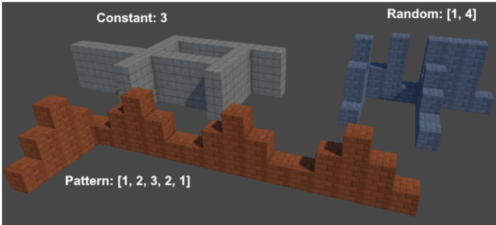

您可以通过按住 [SHIFT] 并使用鼠标滚轮来更改高度。当使用“随机”和“图案”模式时，这本质上允许您将基本高度值应用于生成的高度值。

## 预制件拾取模式

默认情况下，当您使用“分段生成”工具生成对象时，这些对象将从生成指南使用的同一预制件中生成。但可以随机化生成期间使用的预制件。

在分段生成设置 UI 中，有一个名为“预制件选择模式”的字段。可以使用以下选项：

- **生成指南 - 对象将从与生成指南关联的预制件中生成（您在预制管理器窗口中双击以创建生成指南的预制件）；**  
- 随机 - 预制件将从随机预制件配置文件中选取；  
- 高度范围 - 从整数范围 prefab_profile 中选取预制件；

下图显示了使用“随机”和“高度范围”选取模式生成的图块：

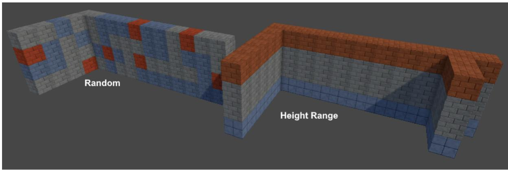

注意：当使用随机或高度范围时，您应该确保所有预制件具有相同的尺寸。否则，您可能会遇到不正确的结果。

## 设置配置文件

段设置可以在配置文件中组织：

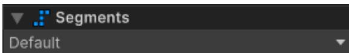

默认配置文件始终可用，但您可以创建更多。这在您需要在不同的设置配置之间切换的情况下非常有用。每次需要使用不同策略生成图块时都必须手动更改它们，这可能会很乏味。但是，如果您在配置文件中组织设置，则只需选择一个新的配置文件，设置就会自动反映更改。

注意：更改设置时，您实际上对当前活动的配置文件进行了更改。

## 盒子生成

Box Spawn 是另一种生成工具，在处理瓷砖块或铺设地板时非常有用。

为了使用 Box Spawn，请确保检查器中的工具按钮处于活动状态，如上图所示。

双击预制件管理器中的预制件以激活生成指南。这将启用模块化捕捉，您可以在场景中移动生成指南并将其捕捉到网格，就像使用其他使用捕捉的生成工具所做的那样。

为了生成，请按照以下步骤操作：

- 左键单击开始（这将禁用生成指南并显示框指示器）；  
- 左键单击生成；

Box Spawn 还支持与 Segments Spawn 相同的高度模式。此外，可以使用相同的预取策略。

## 填充模式

在 Box Spawn 中，有 3 种填充模式可用：

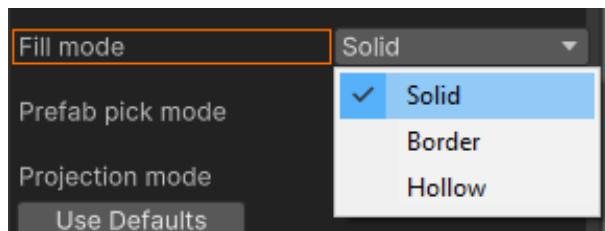

默认填充模式为实心。这仅仅意味着盒子区域将被物体填充。

第二种填充模式是边框。当此填充模式处于活动状态时，您还可以更改框边框。下图显示了生成具有不同边框大小宽度值的图块的几个示例：

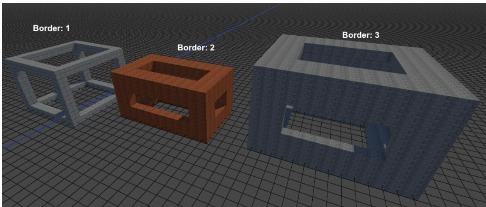

下图显示了最右侧结构的内部：

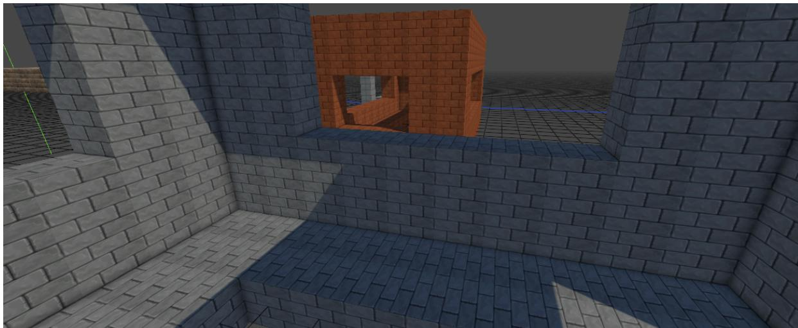

第三种填充模式是空心。这实质上创建了一个空心盒子体积。下图显示了这种结构的内部：

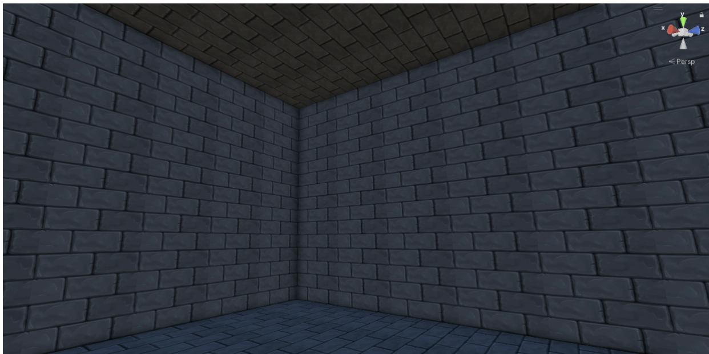

当使用图块时，这种填充模式实际上可以用作优化策略。从外部看，结构看起来与使用实体填充模式时相同。但它们的内部却是空的。这意味着需要处理/渲染等的图块更少。

这当然取决于游戏的需求。有时使用实体填充模式可能会很有用。

## 平铺规则生成

平铺规则生成工具允许您在无限网格内绘制平铺。绘制图块时，相邻图块会根据一系列指定的图块规则自动更新。这些图块规则定义每个图块打开（即连接）到相邻图块的方式。

为了使用此工具，必须执行以下步骤：

1. 创建瓷砖预制件；  
2. 创建一个 Tile Rule 预制配置文件；

3. 使用定义图块预制件彼此打开（即连接）方式的图块规则填充图块规则配置文件；  
4. 创建平铺规则网格；  
5. 画;

平铺规则生成工具将与任何可以连接的模块化预制件一起使用。如果您可以创建一堆可以使用 Unity 界面相互连接的图块，那么您应该能够通过 Tile Rule Spawn 工具使用这些预制件。但有一个例外，那就是墙壁。瓷砖尺系统无法正确处理内角和外角。因此，如果您需要创建地板上必须有墙壁的环境，最好结合使用“模块化捕捉生成”和“模块化墙壁生成”。

注意：使用 Tile Rules 绘制环境后，您可以使用 Modular Snap Spawn 或 Props Spawn 或任何其他生成工具来填充它。

## 创建平铺规则预制件

假设您有一个包含模块化预制件的资源包，并且您想要创建一堆可与图块规则生成工具一起使用的图块。最简单的方法是按照以下步骤操作：

1. 激活对象选择模式；  
2. 从预制件管理器中，将预制件拖放到场景中。当预制件放入场景中时，它将自动开始捕捉到网格。单击左键可停止捕捉。如果您想进行更改，请按 [D] 再次启用捕捉。您还可以使用移动小控件并按住 [CTRL] 进行捕捉。按[SHIFT + S]将对象沿所有轴捕捉到网格；  
3. 将每个对象固定在正确的位置；  
4. 在“预制件库管理器”窗口中按“创建预制件...”按钮；  
5. 输入预制件的名称并选择一个文件夹；  
6. 将pivot设置为TileRule，并输入Pivot对象名称；  
7. 确保选择了对象，然后单击“创建”；

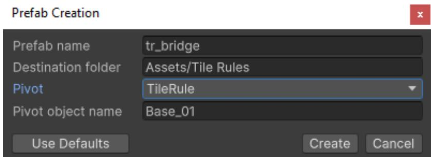

在上图中，Pivot 对象名称字段设置为 Base_01。枢轴对象代表图块中的主要对象。它是位于网格表面顶部的对象，通常是地板预制件。装饰品通常会放置在该物体周围。如果将此字段留空，插件将选择具有最大体积的对象（使用网格边界体积）。这在大多数情况下都可以，但如果您的图块由大小相似的不同对象组成，则必须在此字段中输入枢轴对象的名称。

下图显示了创建的图块预制件的示例：

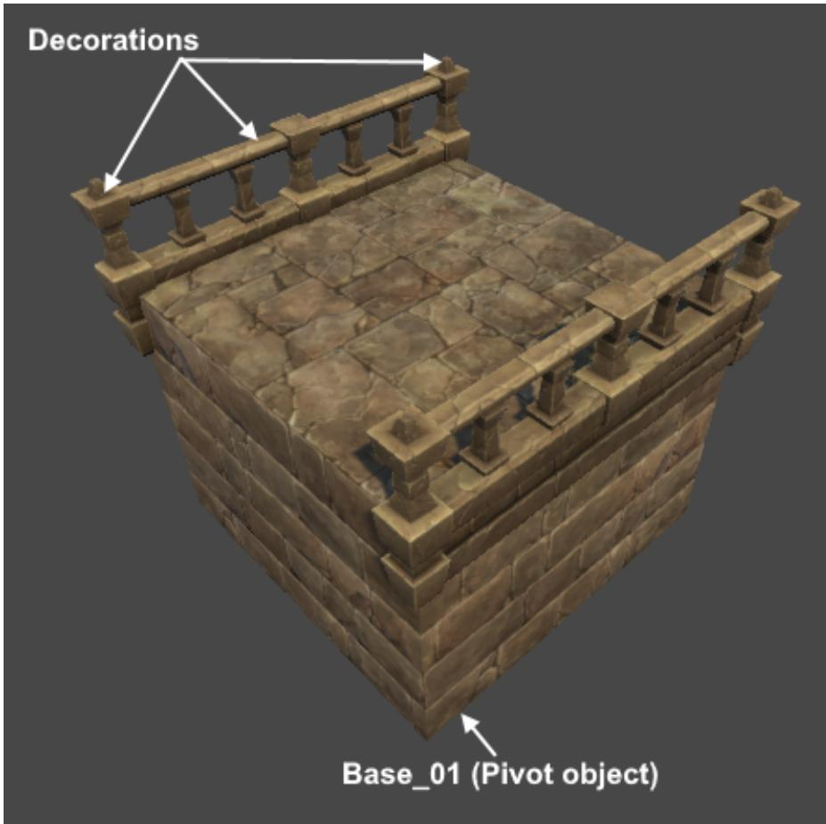

下图显示了为本次讨论而创建的图块：

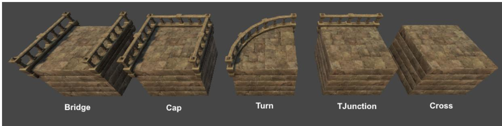

每个图块下面的标签只是约定，并尝试描述与每个图块关联的图块规则。例如，桥图块沿着某个方向连接 2 个相邻的图块。当 2 个相邻的瓷砖在角落相遇时，转弯瓷砖将它们连接起来。

创建所有图块后，请确保将它们添加到预制件库中，以便可以从预制件管理器中选取它们。

## 创建平铺规则

切片规则指定切片如何连接到相邻切片。创建图块预制件并将其分配给预制件库后，您必须创建图块规则配置文件。打开工具 > Gspawn > 窗口 > 平铺规则...

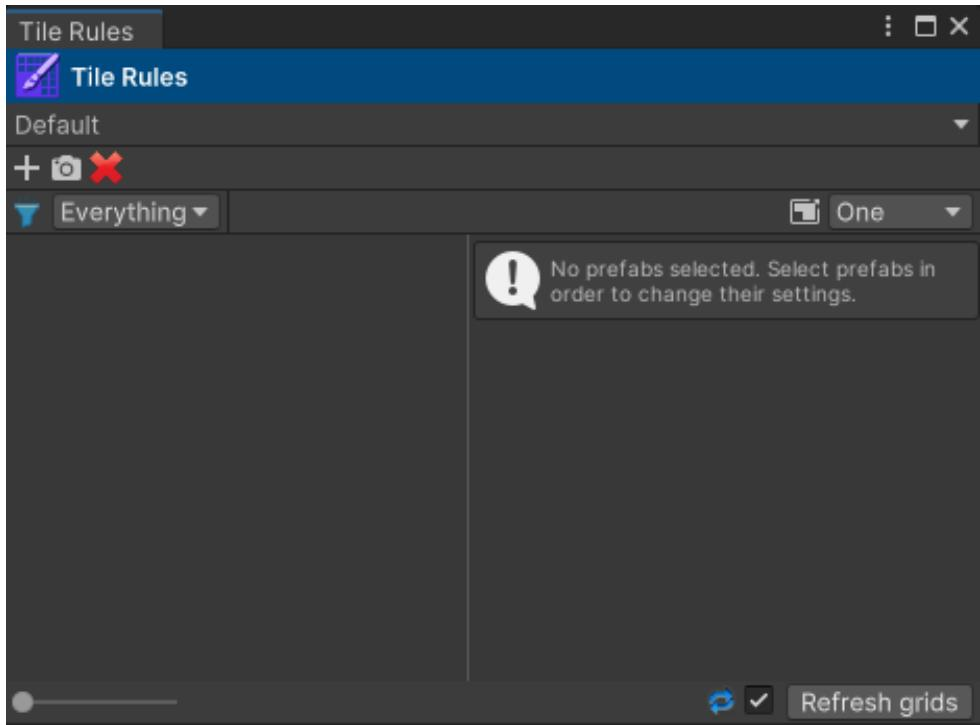

使用最顶部的下拉控件创建新的配置文件。如果您愿意，也可以使用默认配置文件。

平铺规则配置文件保存平铺规则的集合。每个图块规则可以与一个或多个预制件关联。

要创建新的平铺规则，请单击顶部工具栏中最左侧的加号图标。这将在左窗格中添加新的平铺规则：

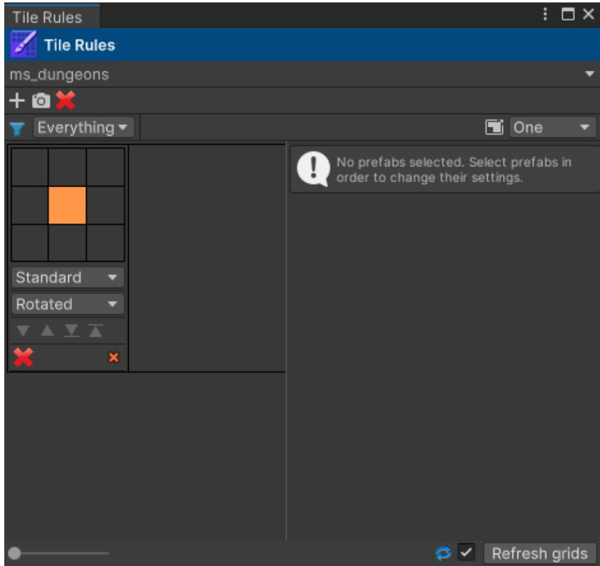

小按钮网格允许您定义规则。中间的按钮代表在网格内绘制的图块。相邻的按钮代表其相邻的单元格。如果您左键单击相邻单元格之一，它会变成绿色。当图块为绿色时，意味着中心图块朝该方向打开，因此该单元格中必须存在图块。右键单击它会变成红色。这意味着

中心瓦片在此方向上被封闭，并且没有瓦片可以驻留在该单​​元中。灰色单元格是中性的（即规则不关心该单元格中是否存在图块）。

为了将预制件分配给平铺规则，您必须在预制件管理器中选择预制件并将其拖放到平铺规则放置区域内：

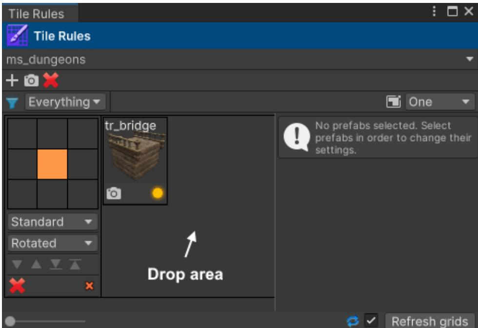

接下来，您必须左/右键单击图块按钮来定义规则。下图显示了为我们之前创建的 5 个图块中的每个图块创建的图块规则：

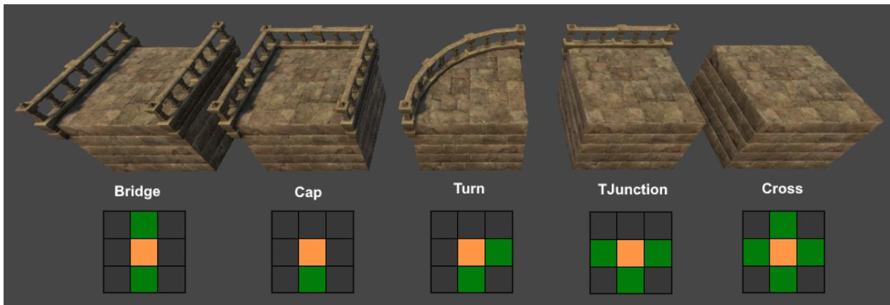

这里需要记住的一个重要细节是，平铺规则 UI 中平铺按钮的坐标系映射到世界轴，如下所述：

- 按钮网格的水平轴映射到世界X轴；  
- 按钮网格的垂直轴映射到世界 Z 轴；

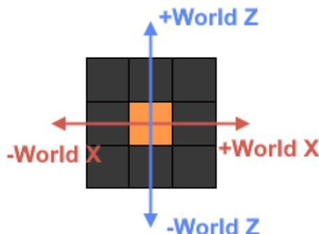

因此，当单击按钮将其变为绿色（或红色）时，您首先必须查看图块对象并查看它们在哪里打开和在哪里关闭。在上图中，图块沿着世界 X 轴排列，相机大致沿着世界 Z 轴观察。

桥图块沿 Z 轴打开，但沿 X 轴关闭（栏杆阻挡入口）。因此，瓦片规则按钮网格的底部和顶部瓦片变成了绿色。

盖板沿负 Z 轴打开。在这种情况下，只有底部瓷砖变成了绿色。

旋转图块沿正 X 轴和负 Z 轴打开。因此，右侧和底部的单元格变成绿色。

TJunction 块沿 X 轴和负 Z 轴打开。左右邻居和下面的邻居一起变成了绿色。

十字图块沿 X 轴和 Z 轴打开，因此水平和垂直邻居变为绿色。

不要忘记，您还可以右键单击单元格/图块按钮将其变为红色。这可以让您更加具体。例如，如果您想要十字图块的变体，仅当它没有被对角线上的邻居包围时才生成，您可以定义如下规则：

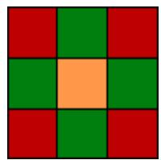

仅当图块沿 X 轴和 Z 轴被图块包围并且沿对角线没有任何相邻图块时，才会生成此变体。

定义平铺规则可能需要一些时间来适应，特别是如果您以前没有使用过平铺规则。可能需要一些尝试和错误才能得到您想要的结果。虽然我们还没有讨论绘画，但您应该知道，一旦定义了至少一条规则，就可以开始绘画瓷砖。通过这种方式，您可以创建规则、创建网格并绘制一堆图块以进行预览，然后在添加新规则或更改现有规则时看到网格自动更新。这使得尽早发现错误并做出必要的改变变得很容易。

## 创建平铺规则网格

设置平铺规则配置文件后，您必须创建一个平铺规则网格，它将用作画布。

注意：平铺规则网格不应与场景网格混淆。他们是不同的。使用“平铺规则生成”工具时，您将在平铺规则网格上进行绘画。当使用模块化捕捉生成或其他使用模块化捕捉的工具时，您将捕捉到场景网格。

确保“平铺规则生成”工具处于活动状态。找到“平铺规则网格创建”部分并填写设置：

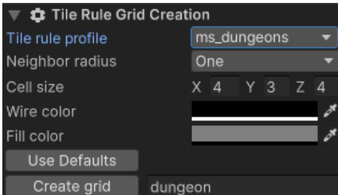

必填字段如下：

- 平铺规则配置文件 - 您创建的平铺规则配置文件。如果您选择不创建新配置文件，这可能是默认配置文件。在此示例中，平铺规则配置文件的名称为 ms_dungeon；  
- 单元格大小：网格单元格大小。对于我们在本例中使用的预制件，单元尺寸为  $< 4,3,4>$ 。为了找出网格单元的大小，您必须知道枢轴对象（定义图块的主要对象）的大小。这通常是地板预制件。您可以将预制件预览悬停在“平铺规则配置文件”窗口中以查找其大小：

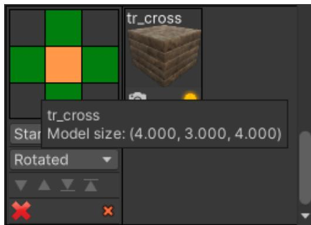

只要确保选择侧面没有装饰的预制件即可。如果没有，请选择任何预制件，然后截断值。例如，如果值显示  $< 4.023$ , 3.1200, 4.08> 那么你可以使用尺寸  $< 4$ , 3, 4>.

- 为网格命名（在本例中为地牢），然后单击“创建网格”按钮。这将在场景中创建一个同名的游戏对象。绘制图块时，所有图块都将作为该对象的子对象生成。

另外，如果您在检查器中查看，您将看到平铺规则网格项已添加到网格列表中：

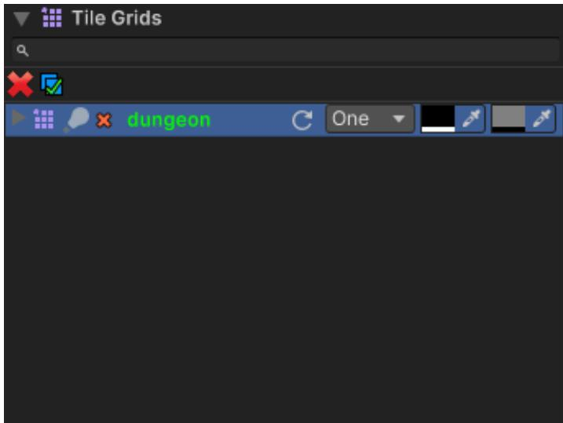

同一场景中可以有多个网格。该插件使用当前网格的概念来建立用作画布的网格。您可以单击网格列表中的网格将其标记为当前网格。当前网格显示为绿色。

下图显示了与平铺规则网格项关联的控件的含义：

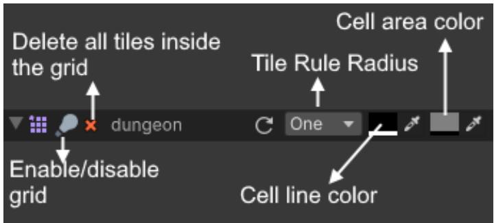

如果单击最左边的箭头，您可以展开 UI：

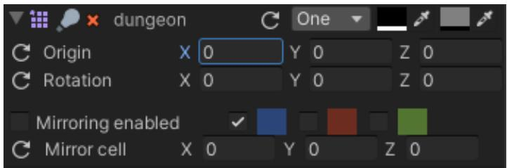

从这里您可以更改网格原点及其旋转。这实际上会改变场景中网格对象的位置和旋转。

最后几个控件允许您启用/禁用镜像、切换镜像平面以及将镜像小控件移动到指定的网格单元。

## 工具和刷子

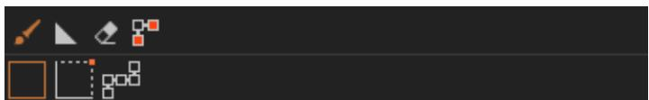

如果您查看检查器，当 Tile Rule Spawn 工具处于活动状态时，您将看到这 2 个工具栏。

第一个工具栏允许您选择当前工具。有 4 个工具可用：

- 油漆 [Q] - 使用不同类型的画笔油漆瓷砖；  
- 坡道油漆 [W] - 油漆坡道；  
- 擦除 [E] - 使用不同类型的画笔擦除图块（也可以擦除非图块，即如果在检查器中选中了擦除异物开关，则使用其他生成工具生成的对象）；  
- Connect [R] - 连接网格中的成对单元格；

第二个工具栏允许您选择当前画笔。有 3 种刷子可用：

- 盒刷 [SHIFT + Q] - 使用盒刷绘制瓷砖。左键单击并拖动以生成图块；

- [CTRL+滚轮]-改变水平尺寸；  
$\circ$  [SHIFT+滚轮]-改变高度；  
- [CTRL + ALT + 滚轮] - 上/下移动；

- Flexi 框画笔 [SHIFT + W] - 与框画笔类似，但不是使用滚轮更改水平尺寸，而是通过移动鼠标来更改它。单击左键，移动鼠标确定大小，然后再次单击左键生成；

$\circ$  [SHIFT+滚轮]-改变高度；  
- [CTRL + ALT + 滚轮] - 上/下移动；

- 线段画笔 [SHIFT + E] - 沿线段生成图块。左键单击开始，移动鼠标确定线段终点，左键单击添加新线段，[SHIFT + 左键单击] 生成。

$\circ$  [SHIFT+滚轮]-改变高度；  
$\circ$  [CTRL + ALT + 滚轮] - 上/下移动；

注意：当“斜坡绘制”工具处于活动状态时，只能使用“方框画笔”，并且其水平尺寸和高度始终为 1。

默认情况下，画笔将捕捉到鼠标光标悬停的图块。这对于避免在您希望上下移动时一直使用 [CTRL + ALT] 热键很有用。绘画时，画笔将紧贴瓷砖，而擦除时，画笔将贴近瓷砖的实际位置。

如果您希望禁用此自动捕捉行为，您可以在检查器中取消选中“捕捉到图块”切换：

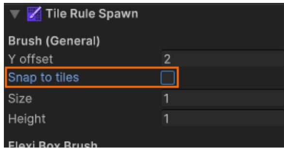

下图显示了一个简单的地牢环境，它是使用 Box 和 Flexi Box 画笔组合绘制的：

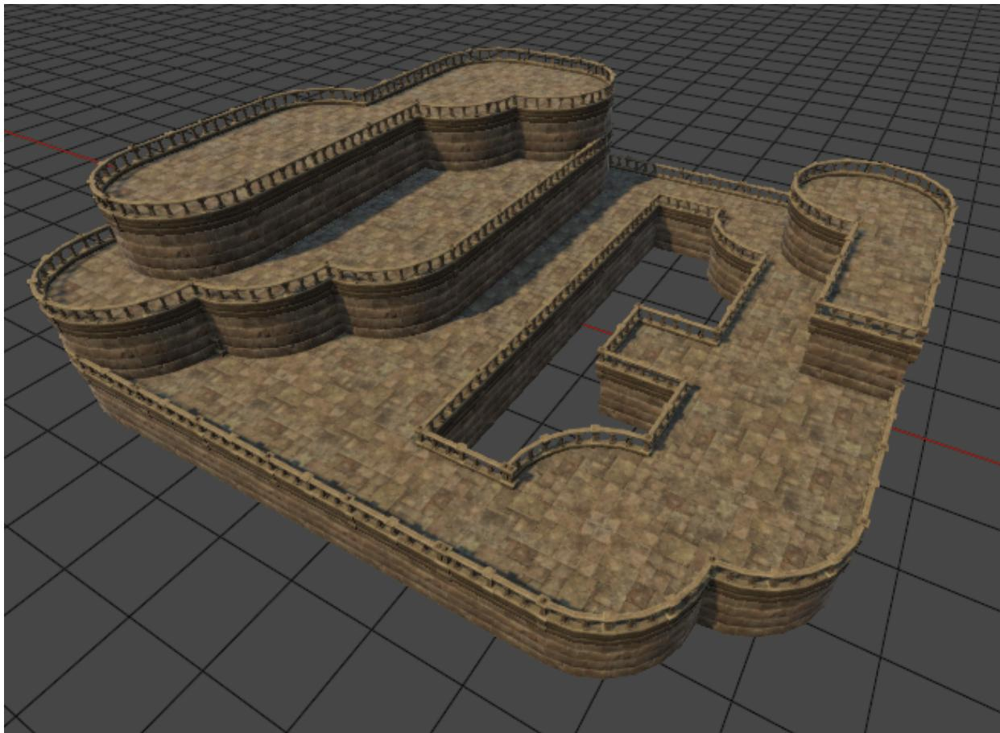

下图显示了使用分段画笔的简单示例：

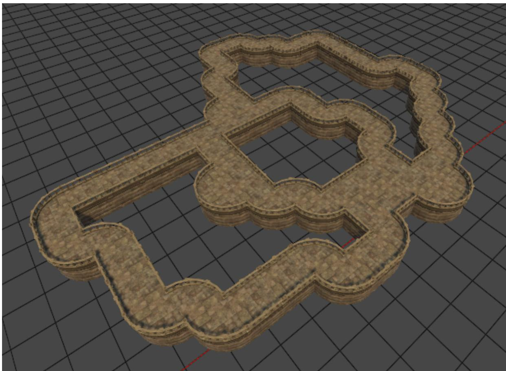

这对于快速创建路径很有用。

## 平台规则

让我们看一下之前展示的第一个环境，但这次是从另一个角度：

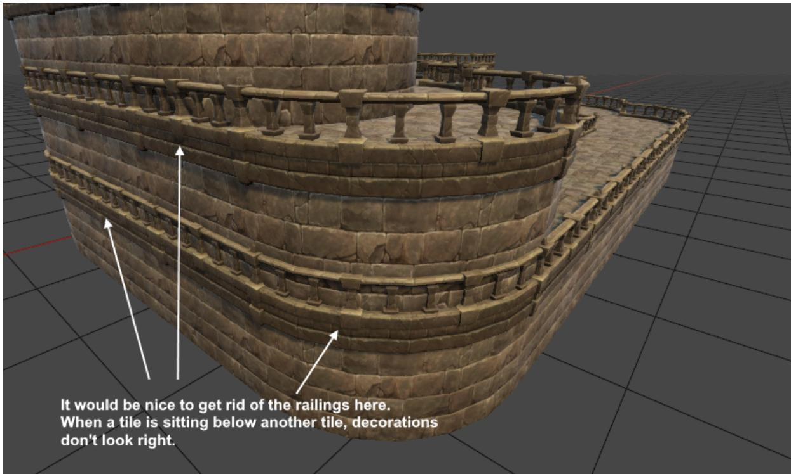

请注意，在瓷砖彼此堆叠的地方，栏杆看起来有点不对劲。虽然不完全错误（这可能是您正在寻找的），但如果我们能以某种方式找到一种方法来仅生成没有装饰的地板（基础）对象，那就太好了。

为此，我们可以创建一个新的平铺规则并将其规则类型设置为平台：

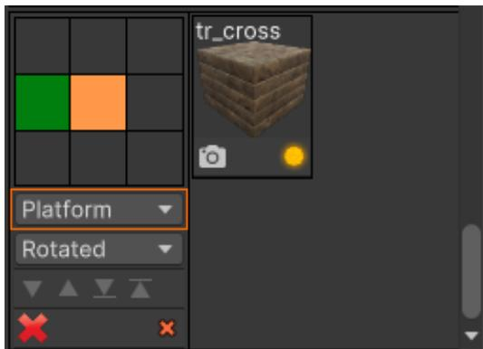

请注意，我们使用与交叉规则相同的预制件。这只是一个简单的地板物体，没有任何装饰。

此外，在单元格按钮网格下方，我们将规则类型从“标准”设置为“平台”。

单个邻居被设置为绿色，在这种情况下我们选择哪一个并不重要。这将确保每当检测到平台时都会选择该规则。

让我们再看看我们的图块：

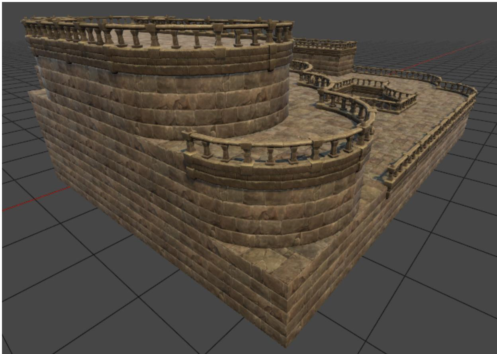

栏杆已经消失，因为插件现在可以使用平台规则。然而，我们还没有完全完成。如果我们看一下最底部的平台图块（最靠近观察者的那个），我们可以看到它位于圆角下方，但平台图块具有立方体形状。为了解决这个问题，我们必须添加第二个定义转弯的平台规则：

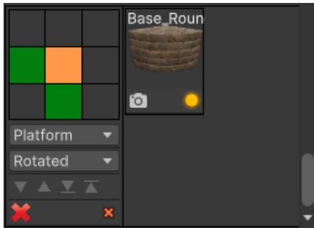

让我们再看看我们的图块：

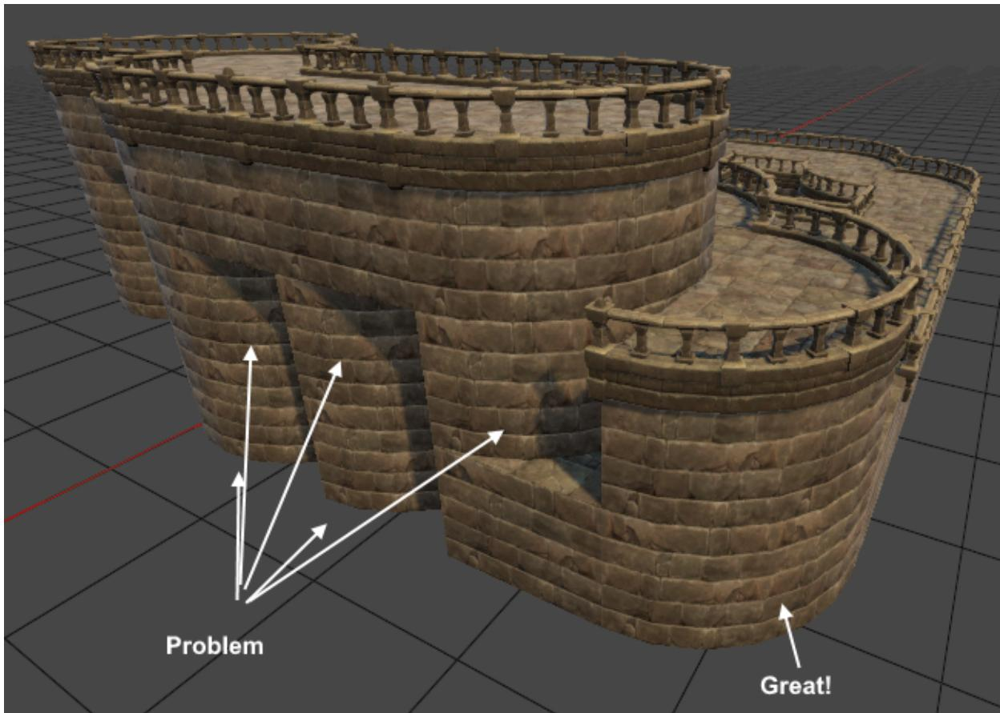

我们的问题已经解决了，但现在我们又遇到了另一个问题。由于我们添加了一条使用 2 个绿色方块的新规则，因此一些旧平台已更新以正确匹配此新规则。这些图块实际上是 TJunction 规则。因此，让我们继续添加最后一项平台规则：

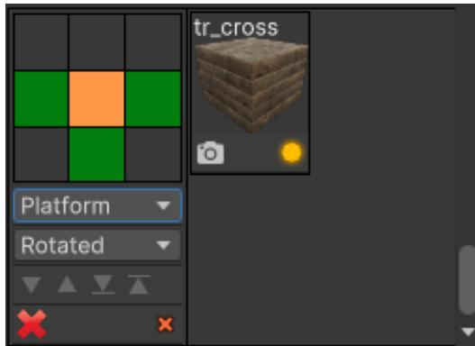

现在的结果看起来像这样，这正是我们所追求的：

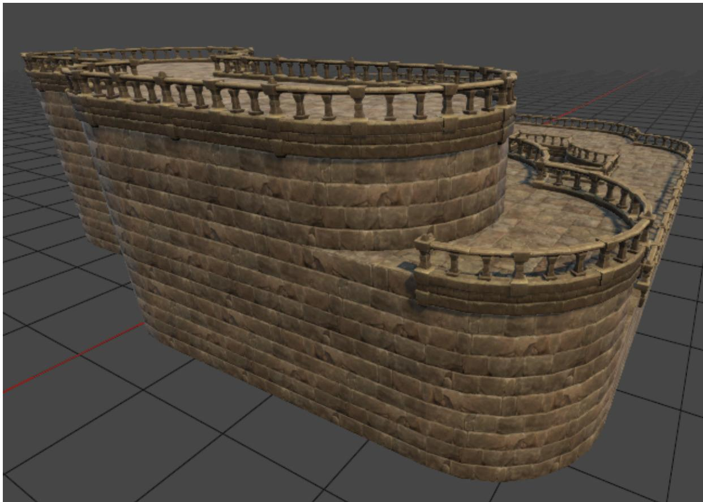

## 坡道规则

另一种类型的平铺规则是斜坡规则。您需要至少定义一项渐变规则才能使用“渐变绘制”工具。

为此示例创建了以下斜坡预制件：

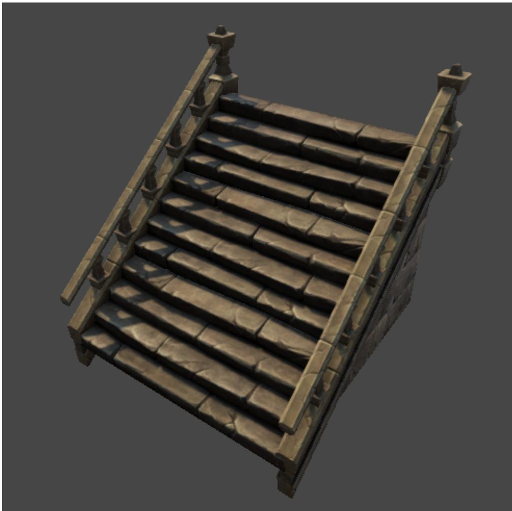

创建的斜坡规则如下所示：

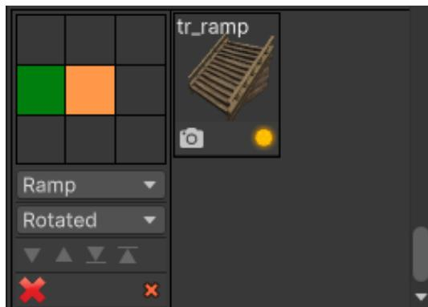

坡道沿负 X 轴打开，因此左侧邻居变为绿色。

此时，您可以激活斜坡绘制工具并绘制斜坡。

下图显示了使用坡道图块的新环境：

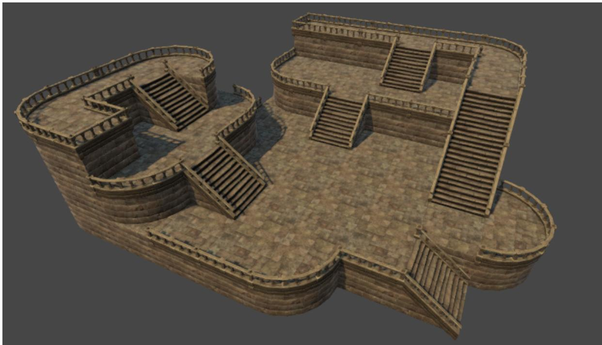

放置坡道时，可能会遇到坡道被不止一块瓷砖包围且坡道旋转可能不正确的情况。例如，考虑以下场景：

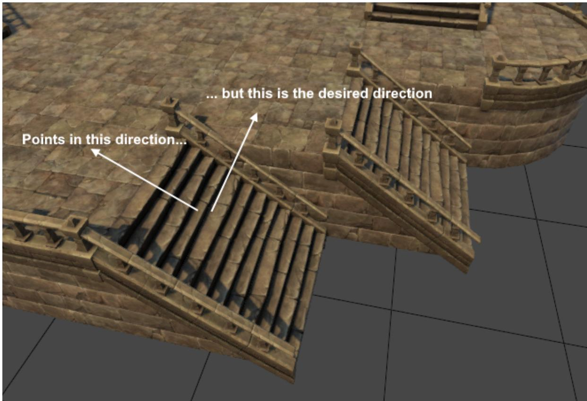

坡道指向左侧图块，但我们希望它指向前方图块。您可能可以定义多个斜坡规则，但这可能很乏味。相反，您可以将斜坡画笔放在斜坡上，然后按 [Y] 旋转它：

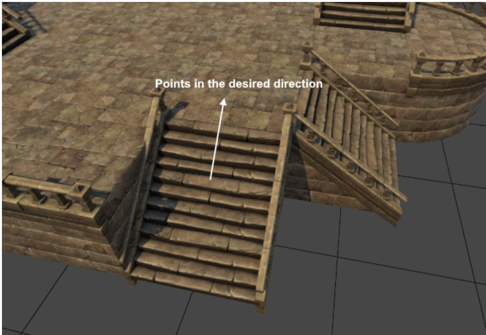

注意：当刷新图块网格时，只要所有坡道预制件以其模型姿势沿同一轴打开，坡道旋转就会正确恢复。例如，如果斜坡规则包含多个斜坡预制件，则刷新网格时，将使用预制件的生成机会属性为网格中的每个斜坡图块选取斜坡。与旧的坡道瓦片相比，拾取的坡道预制件可能会沿着不同的轴打开，这可能会导致显示不正确的结果。避免这种情况的最佳方法是确保在创建坡道预制件时所有坡道沿同一轴打开。

## 连接工具

连接工具对于创建悬挂路径非常方便。

为了使用，请确保单击检查器中的“连接”按钮将其激活：

或者按[R]。

接下来，请按照下列步骤操作：

1. 移动鼠标建立起点；  
2. 单击左键开始。这将创建 2 个垂直的瓷砖段；  
3. 移动鼠标建立终点；  
4. 左键单击生成；

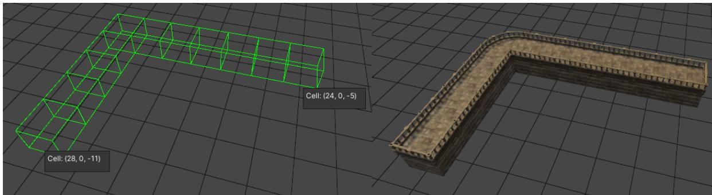

您可以按住 [CTRL + ALT] 并使用滚轮更改起点和终点的 Y 偏移。您可以在左键单击之前执行此操作以设置起点偏移，并在左键单击后更改终点偏移。

当您将鼠标光标悬停在图块上时，Y 偏移会自动更新。在这种情况下，起点/终点将捕捉到悬停图块所在的同一单元格。

按 [SPACE] 更改主轴。长轴是第一段行进所沿的轴。在上图中，第一段向前行进，第二段向右行进。按 [SPACE] 将反转这些行进方向。

下图显示了一个示例，其中起点位于网格上，终点已升高到网格上方：

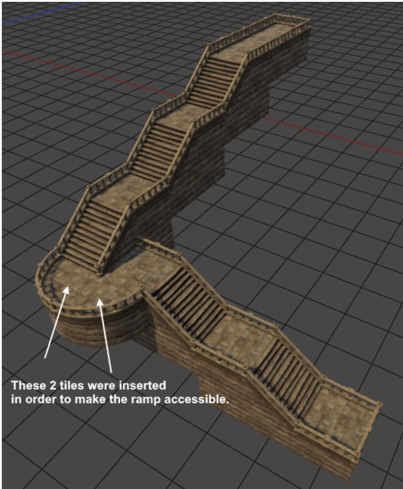

请注意，坡道是自动添加的，以便可以访问上部区域。仅当定义了渐变规则并且在“连接 UI”部分下的检查器内选中了“生成渐变”切换时，才会生成渐变。

此外，在左侧 2 段在拐角处相交的地方，插入了 2 块瓷砖，以便可以使用坡道。

下图显示了更复杂的路径网络的示例：

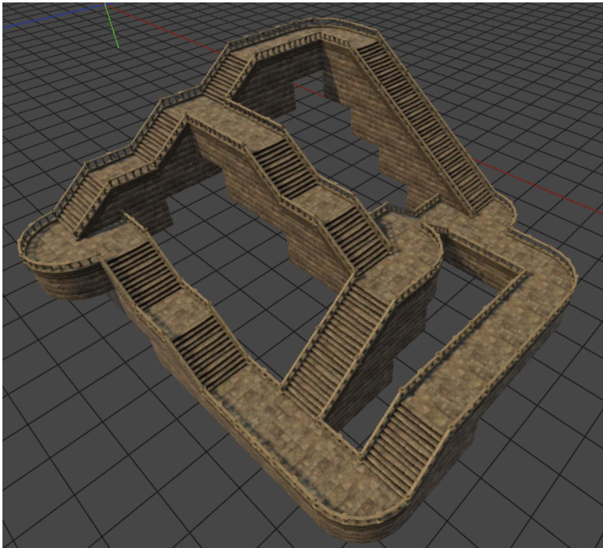

使用此工具时，有时需要小心，不要意外阻塞现有路径，如下所示：

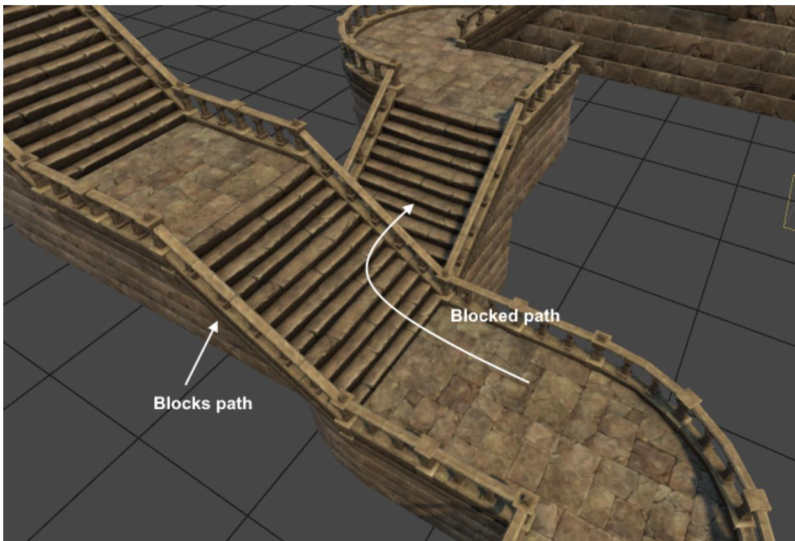

## 平铺规则优先级

绘制图块时，将按照图块规则在每个规则类型的图块规则窗口中出现的顺序对其进行评估。如果您有 2 个或更多规则使用相同数量的绿色图块，则将从下到上选择第一个规则。这可能会产生不正确的结果。

有两种方法可以处理这个问题：

- 通过将更多相邻单元格变成绿色或红色来更加具体。中性图块越少，您的描述就越具体，插件就越容易理解您的意图；  
- 使用上移/下移/移至顶部/移至底部按钮：

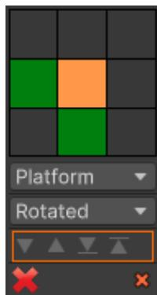

按下这些按钮将在 UI 中上移/下移规则，同时还会更改其优先级。

## 平铺规则网格刷新

当更改切片规则配置文件（更改单元格状态、添加预制件等）时，使用该配置文件的所有网格都将自动更新。

随着网格内图块数量的增加，网格刷新可能会变慢。在这种情况下，您可能需要关闭自动更新，对切片规则进行必要的更改，然后手动更新网格：

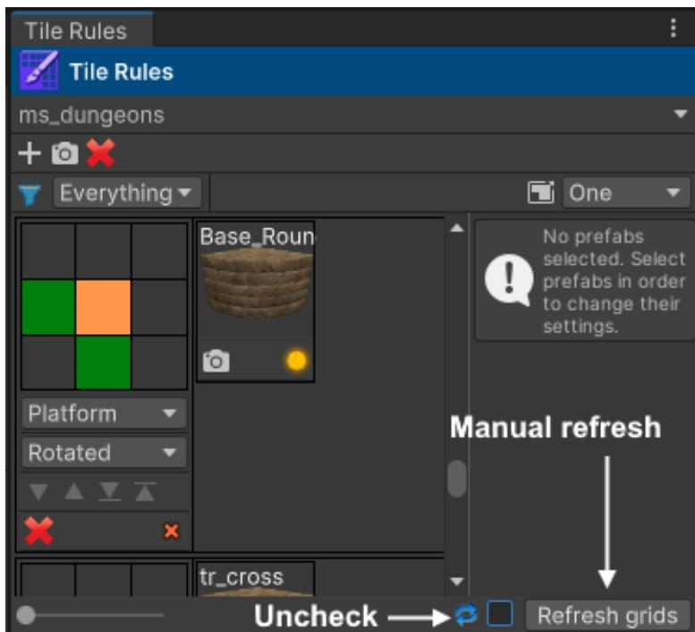

在上图中，右下角的开关已取消选中。这意味着自动刷新已关闭。可以通过按刷新网格按钮手动刷新网格。

## 平铺尺半径

默认情况下，平铺规则使用半径 1。这意味着仅考虑直接邻居。在某些情况下，您可能需要使用更大的半径。可以拥有的最大半径是 2。

为了设置平铺尺半径，您需要执行以下步骤：

1. 在平铺规则窗口 UI 中将半径设置为所需的值：

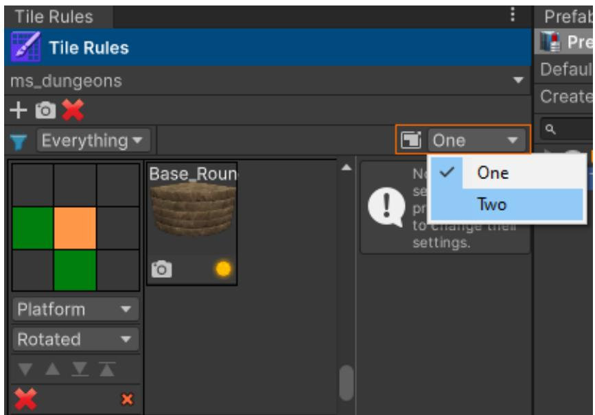

当您这样做时，您会注意到单元格按钮网格将改变外观，因为现在可以使用更多的邻居：

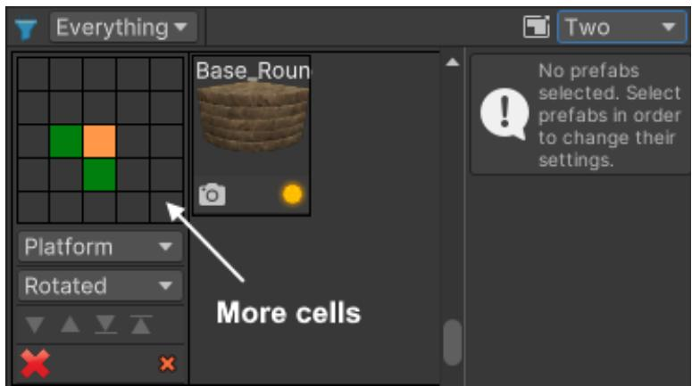

此步骤仅允许您在 UI 中使用半径 2，但除此之外实际上并没有执行任何操作。

2. 在检查器 UI 中，您必须更改与平铺规则网格关联的半径：

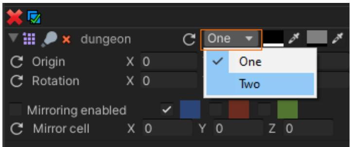

此时，在绘制/擦除图块时会考虑新的半径。

## 预制件设置

当您单击平铺规则配置文件窗口中的预制件时，右侧窗格将显示一些设置：

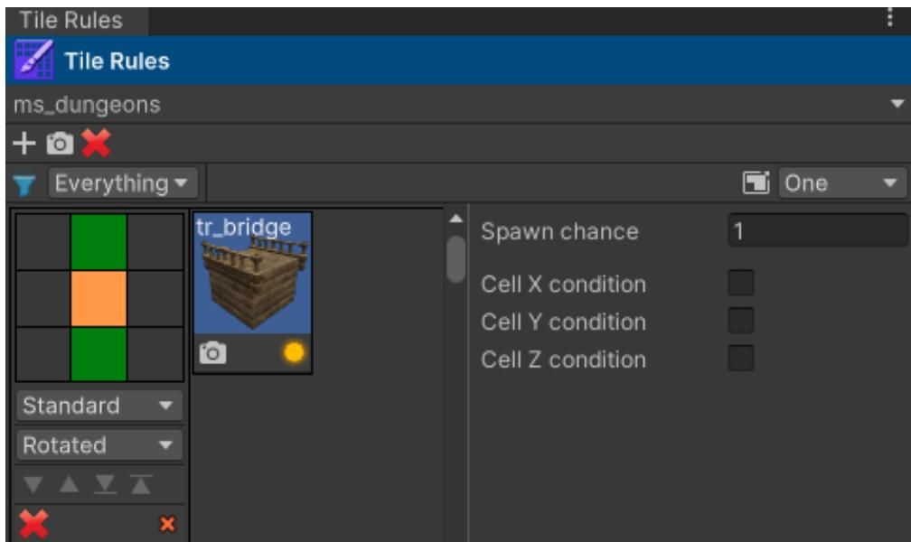

当每条规则有多个预制件时，生成机会非常有用。例如，您可能拥有想要生成的同一预制件的损坏版本。在这种情况下，您可以选择损坏的版本，并将其生成机会更改为 0.2 或更高，具体取决于您希望这些预制件在场景中出现的频率。

单元格 X/Y/Z 条件字段允许您定义预制件可以出现在图块网格中的单元格范围。例如，假设您有 2 个版本的坡道规则预制件：一个侧面有栏杆，另一个没有栏杆。当 Y 坐标位于 [0, 1] 区间时，您可能希望生成简单的 ram（无栏杆），而对于从 2 及以上的所有 Y 坐标，则生成更雄伟的版本（带栏杆）。

下图显示了更新后的斜坡规则：

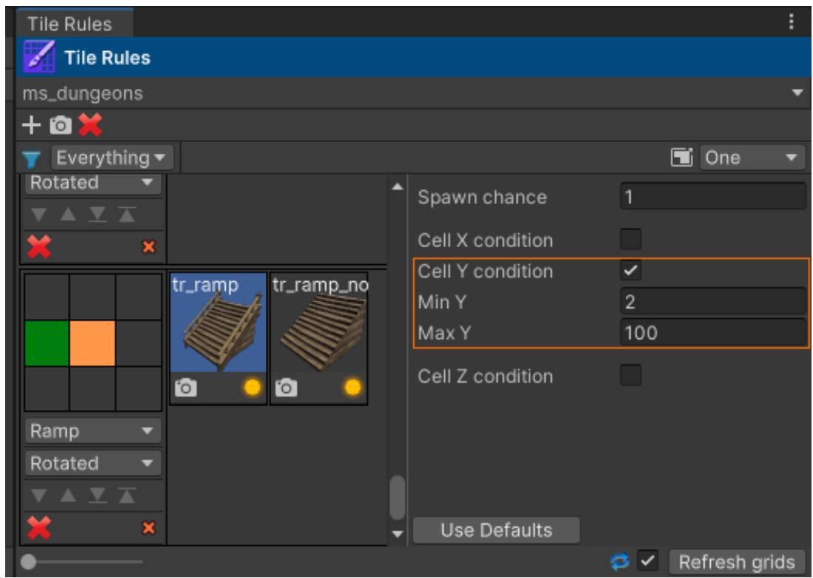

请注意，现在有 2 个坡道预制件：一个是简单的，另一个是侧面有栏杆的。侧面有栏杆的单元已检查单元格 Y 条件，并且 Y 间隔已设置为 [2, 100]。在本例中，值 100 表示“无穷大”，因为网格很少会达到如此高的高度。

简单斜坡使用 [0, 1] 区间。

下图显示了使用这些更新的斜坡规则创建的简单环境：

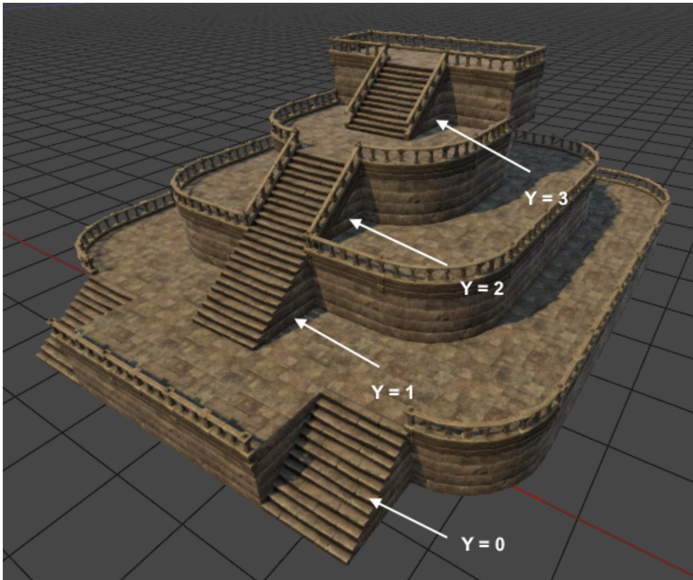

当选中任何一个单元 X/Y/Z 条件切换时，预制件就被称为已调节。绘制瓷砖时，插件将首先处理经过调节的预制件，并检查其中任何一个是否满足当前正在绘制的单元格的所有条件。第一个满足所有条件的预制件将被选中。如果所有预制件都经过调节，但没有预制件满足条件，则将使用生成机会随机选择一个预制件。

## 修复重叠

我们一直使用的瓷砖上附有这些柱子，并且柱子正好位于瓷砖与也有柱子的相邻瓷砖连接的地方。这会导致出现问题，即来自 2 个或更多连接图块的柱子彼此重叠。下图显示了一个示例：

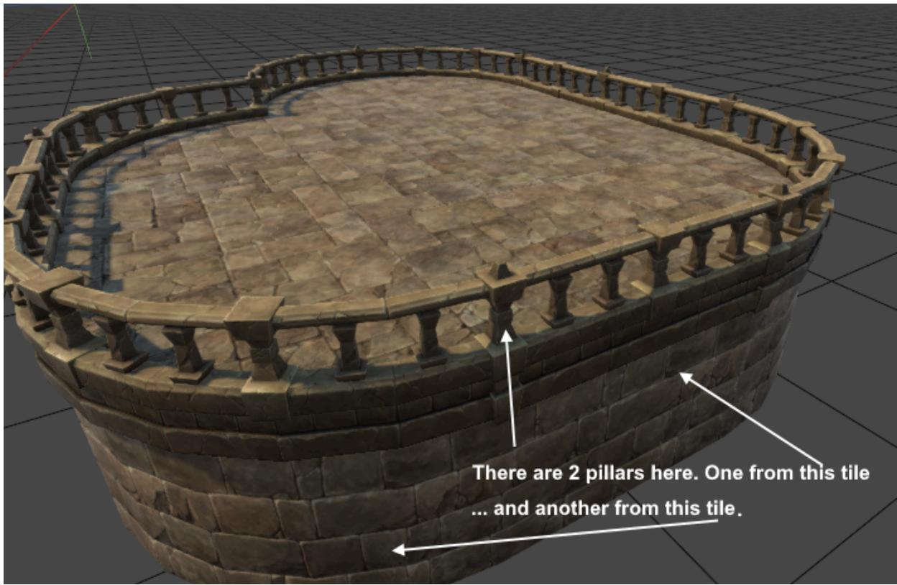

这可能会导致渲染伪影。虽然我们看不到图像中的伪影，但当移动相机时，会出现闪烁效果，因为两根柱子互相争斗，其中一根柱子被渲染。

为了解决这个问题，您必须转到检查器中的平铺规则网格列表，然后单击“修复重叠”按钮，如下所示：

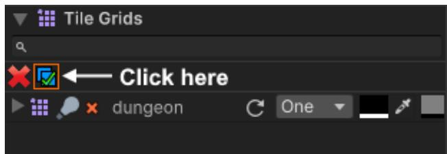

这将隐藏重叠柱子的渲染器，以便渲染单个柱子。

如您所见，这是一个手动步骤。当您绘制/擦除图块时，可能会再次出现相同的问题，因为会创建新图块，因此最好在游戏关卡完成时最后执行此步骤。

## 道具生成

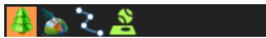

道具生成工具非常适合用道具填充场景。例如，您可以使用它用树木、房屋、栅栏、桶等填充地形。您还可以直接在其他网格表面上生成。如果您要创建模块化环境，则可以使用此工具在地板或墙壁上生成道具。

要使用，请双击“预制件管理器”窗口中的预制件。这将激活生成指南，您可以在场景中移动它。它将直接捕捉到网格或地形表面，而不是捕捉到网格（就像前面讨论的工具的情况一样）。

使用 Props Spawn 时可以使用以下热键：

- [SHIFT + 鼠标移动] - 如果启用轴对齐，则围绕表面法线旋转生成引导线；如果轴对齐关闭，则绕网格 Y 轴旋转；  
- [CTRL + 鼠标移动] - 缩放生成指南；  
- [ALT + 鼠标移动] - 从表面偏移生成引导线（对于嵌入陡峭的表面很有用）；  
- [R] - 通过将鼠标移回 0 来重置应用的偏移量；

这  $[X/Y/Z]$  &  $[\mathrm{SHIFT} + X/Y/Z]$  热键也可用于使用键盘旋转生成指南。您可以按 [I] 将对象旋转重置为预制资源中存储的旋转，然后 [O] 将比例重置为预制比例。

## 轴对齐

轴对齐是指将生成引导器的轴之一与其所在的表面对齐的想法。默认情况下，它是关闭的，但您可以通过按  $[\mathrm{SHIFT} + \mathbf{A}]$  或者通过在检查器中选中/取消选中“对齐轴”切换：

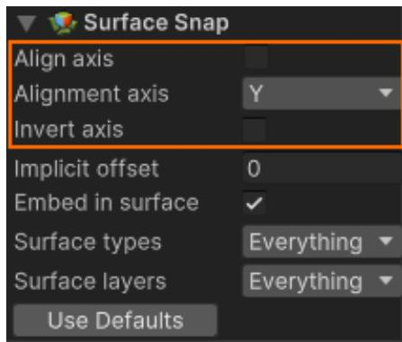

如果选中“对齐轴”，则还需要使用“对齐轴”字段指定对齐轴。对齐轴被认为是正轴。如果您想使用相应的负轴，请选中反转轴。

通常，您会希望将其保留。例如，如果您想用树木填充地形，则应关闭轴对齐。树木向上生长，与地形表面对齐时它们看起来不太正确。房屋通常也是直立的。

例如，如果您将物体放置在斜坡或坡道上或放置某种装饰元素（例如岩石表面上的细长晶体），则轴对齐可能会很有用。

## 表面偏移和嵌入表面

虽然您可以使用鼠标更改距曲面的偏移，但也可以通过更改“隐式偏移”字段的值来使用隐式偏移。当将对象放置在陡峭的表面上并关闭轴对齐以避免浮动时，这非常有用。

“嵌入表面”字段有时会有所帮助，但对于在与表面相交的底部更加不规则的对象，它并不总是能避免浮动。在这种情况下，隐式偏移和鼠标应用偏移的组合应该可以解决问题。

下图显示了放置在陡峭地形表面上的桶的示例，无论是否嵌入表面：

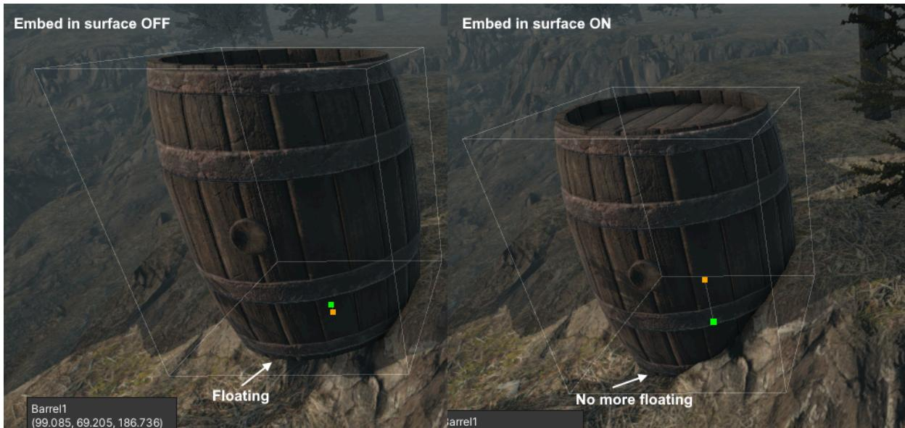

## 表面类型和表面层

默认情况下，场景中的每个对象都可以用作生成引导线可以放置的表面。然而，有时您可能想忽略某些对象。例如，如果您将道具放置在茂密的森林中，您很可能想忽略树木并仅捕捉地形。

表面类型字段允许您选择生成引导器可以位于的表面类型：

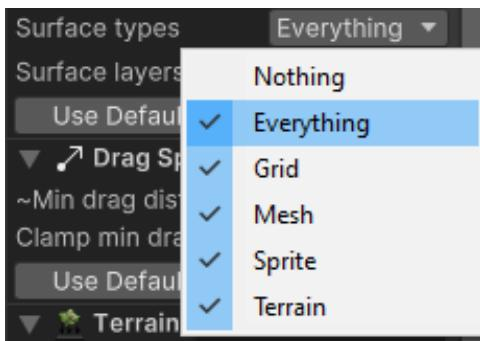

您可以做的另一件事是根据指定的图层忽略某些表面。在这种情况下，可以使用表面层字段。

## 生成指南随机化

使用 Props Spawn 时的一个有用功能是 Spawn Guide 随机化。此功能允许您随机化生成指南的旋转、缩放和预制件。生成新游戏对象后将应用随机化参数：

1. 左键单击生成；  
2. 对象以当前旋转/缩放/预制件生成；  
3. 生成指南是随机的；

随机化也适用于拖动生成。

注意：此功能在使用 Modular Snap Spawn 时也可用，尽管它没有那么有用。通常，使用“模块化捕捉生成”生成的对象应保持其原始大小和旋转。例如，您绝对不想随机化墙壁或地板的比例。这些是由艺术家以特定方式设计的，以便轻松构建模块化环境。

## 轮换随机化

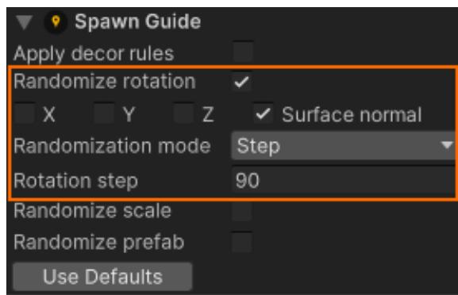

为了随机化旋转，请选中随机化旋转开关，然后选择随机化轴。默认值是表面法线，这是您通常需要的道具放置方式。

随机化模式字段可以设置为 Step 或 MinMax。 Step 将应用指定旋转步骤的随机倍数，而 MinMax 将在指定间隔内生成随机旋转值。

## 规模随机化

检查随机化比例开关。这将导致显示 2 个新字段，允许您定义最小和最大比例值。对于为某些类型的对象添加更多变化非常有用。

## 预制件随机化

预制件随机化是指在生成新对象后，生成指南将为下一个生成选择一个新的预制件。只需检查“随机化预制件”开关，然后选择包含您希望使用的所有预制件的随机预制件配置文件。

## 拖动生成

使用道具生成工具时，您可以按住鼠标左键并拖动来生成。

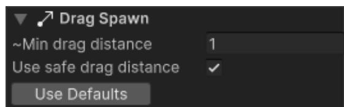

拖动时，当鼠标光标移动世界距离 >= 最小拖动距离时，将生成一个新对象。这允许您调整拖动期间生成的对象之间的距离。

建议选中“使用安全拖动距离”字段，以避免生成引导线与先前生成的对象之间出现任何重叠。注意：选中此字段后，包围对象体积的球体半径将用作最小拖动距离。

下图显示了使用生成引导比例和预制随机化以及拖动生成生成的几个桶：

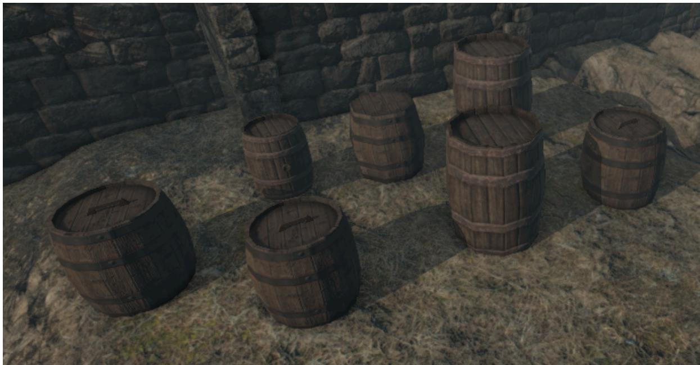

## 地形平坦化

Props Spawn 支持一项称为地形扁平化的功能。启用后，当您在左键单击或拖动生成期间生成对象时，它允许您展平生成指南周围的地形区域。

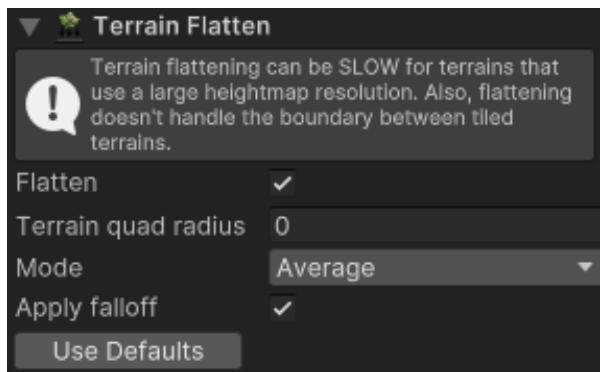

确保在 Terrain Flatten UI 部分中选中 Flatten 字段以启用扁平化。

使用地形四边形半径字段建立展平半径或按住 [CTRL] 并使用鼠标滚轮。

模式字段允许您指定如何计算新地形高度。可能的值为：

- 最低 - 地形的高度将设置为展平半径内的最低高度值；

- 平均 - 地形的高度将设置为展平半径内的平均高度值；  
- 最高 - 地形的高度将设置为展平半径内的最高高度值；

检查“应用衰减”有时可以帮助平滑硬过渡。

注意：正如您在上图中所看到的，地形平坦化有一些限制。首先，高度图分辨率非常慢  $1025 \times 1025$  及以上（这当然也取决于运行 Unity 编辑器的系统）。解决此问题的一种方法是将地形的高度图分辨率更改为较低的值（如果不会过多降低地形的质量）。要更改高度图分辨率，请按照以下步骤操作：

1. 在层次视图中选择地形对象；  
2. 在检查器中，单击地形设置按钮：

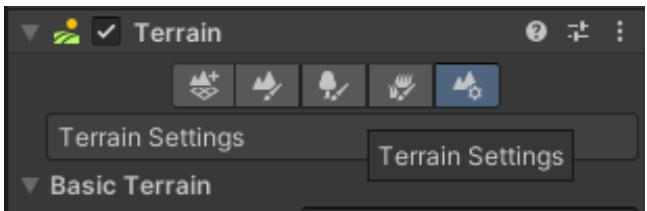

3. 向下滚动到纹理分辨率（在地形数据上）并更改高度图分辨率：

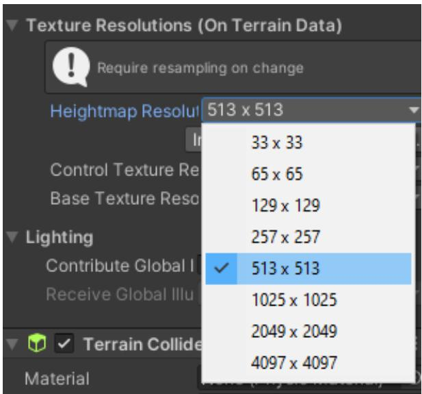

其次，它不支持平铺地形。当使用平铺地形时，您将看到扁平半径被剪裁到生成指南所在的平铺上。

## 散布画笔生成

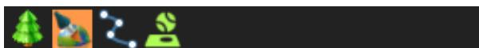

分散画笔生成工具允许您使用圆形画笔绘制对象。例如，这对于绘制森林非常方便。您可以使用它在地形上绘制对象，但也可以在平面网格物体（例如地板、墙壁）上绘制；

为了绘制对象，您首先需要创建一个散点画笔预制件配置文件，其中包含将用于绘画的所有预制件。

然后，您需要选择在检查器中创建的配置文件（本讨论中将使用默认配置文件）：

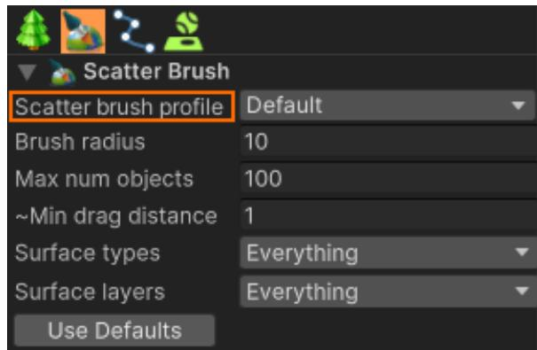

最后，按住鼠标左键并拖动以绘制对象。

您可以使用 [CTRL + 滚轮] 更改画笔半径，或者只需使用画笔半径字段在检查器内进行设置。

## 创建散点画笔预制配置文件

打开工具 > Gspawn > 窗口 > 散点画笔预制件...

屏幕上将出现以下窗口：

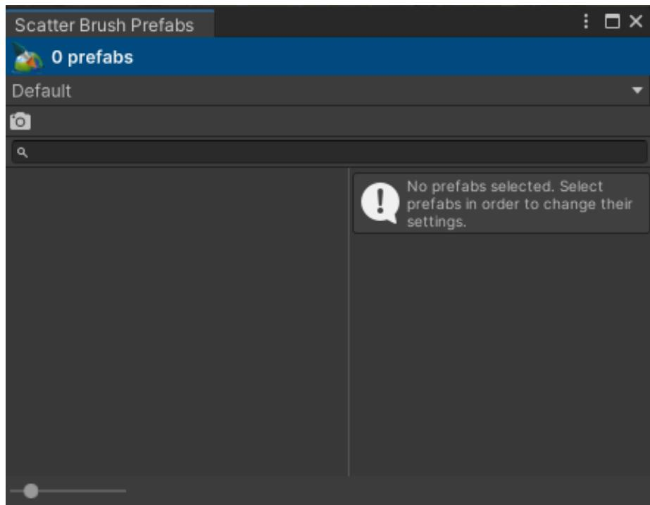

您可以使用默认配置文件或单击下拉菜单并创建新配置文件。本讨论中将使用默认配置文件。

接下来，您需要从“预制件管理器”窗口中拖动预制件并将其放入“散布画笔预制件”窗口内的左侧窗格中。下图显示了填充预制件后的同一窗口：

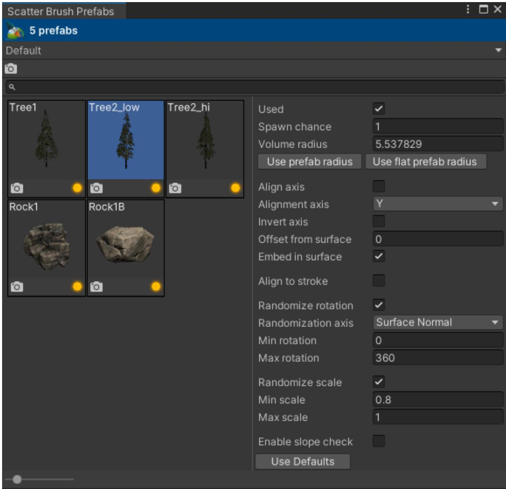

使用的属性对于暂时禁用预制件非常有用。绘画时不会生成禁用的预制件。生成机会定义了预制件被选取的频率。有效值位于 [0, 1] 区间内。

## 体积半径

体积半径表示原始（即未应用比例）预制件尺寸的近似值。默认情况下，当预制件添加到散布画笔轮廓时，其体积半径将设置为平坦体积半径。该半径表示围绕 Y 轴围绕预制件的圆柱体的半径。

体积半径字段可用于设置自定义半径。还有 2 个按钮可用于更改音量半径：

- 使用预制件半径 - 将体积半径设置为包围预制件的球体的半径。这很少有用（除非您使用球体预制件），因为它可能会导致非常大的值，特别是对于树木等高大的物体；  
- 使用平面预制件半径 - 将体积半径设置为围绕 Y 轴围绕预制件的圆柱体的半径；

下图显示了使用默认体积半径（即平面预制件半径）绘制的几棵树：

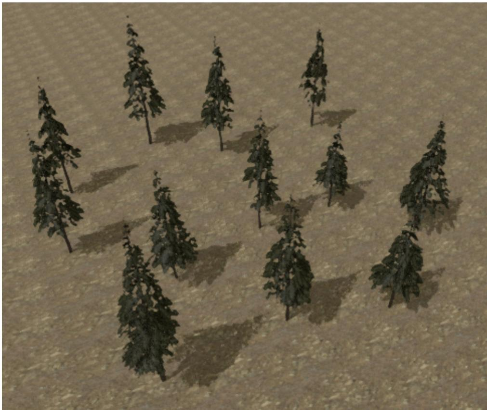

正如你所看到的，树木之间的距离相当远。这是因为体积半径。如果我们减小体积半径，我们可以获得更高的密度。下图显示了一些以体积半径为 2 绘制的树木：

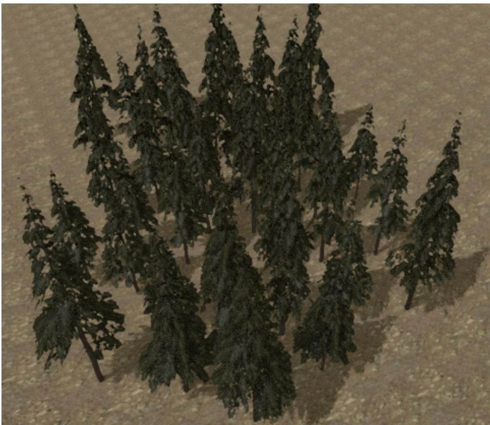

注意：当散布笔刷预制件配置文件使用太多预制件且预制件使用相当大的体积时，您将需要增加笔刷半径。否则，大多数预制件将没有机会被挑选。发生这种情况有两个原因：

1. 预制件太多意味着被挑选的机会更少；

2. 大的体积半径会占用更多的空间，因此即使这些预制件最终被挑选出来，也不会再有足够的空间了。

体积半径也可以用作简单的排斥机制。下图显示了一个示例：

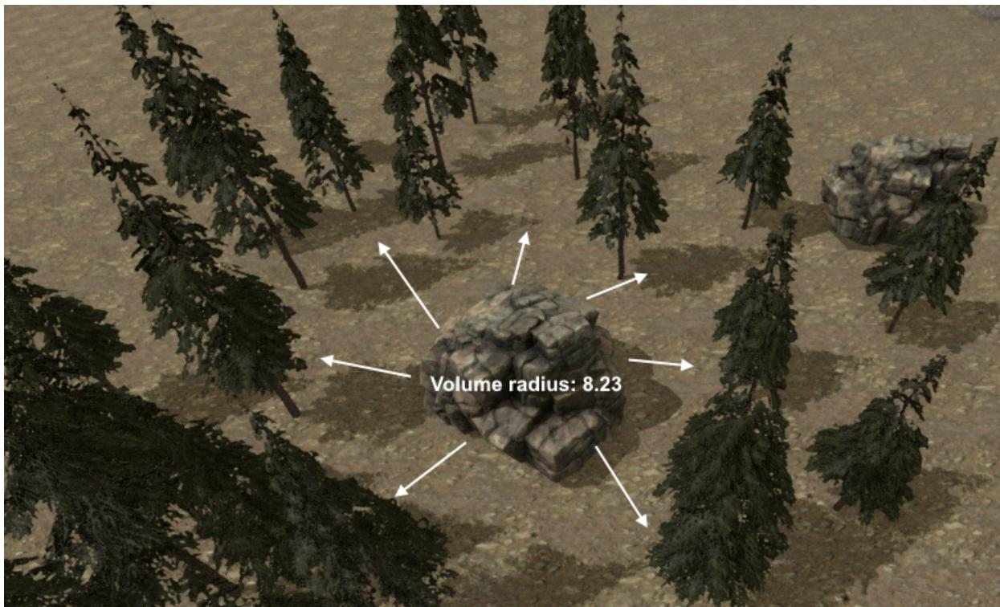

树木中间的岩石使用的体积半径为8.23。请注意岩石物体和周围树木之间有相当大的空间。

下图显示了类似的情况，但这次岩石预制件的半径已设置为 2：

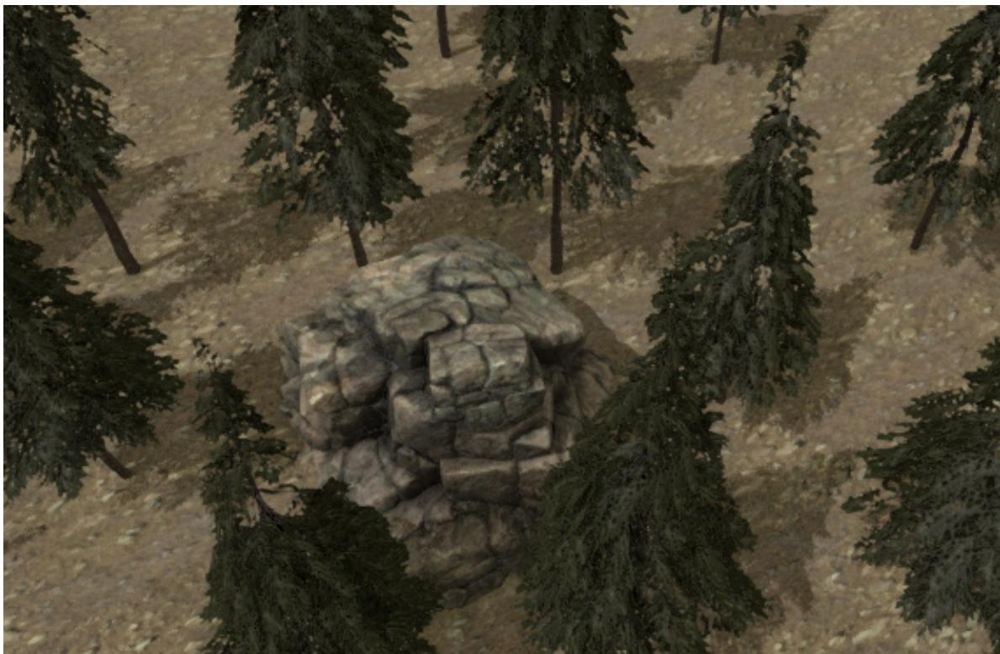

这次树木距离岩石更近了。

## 嵌入曲面并从曲面偏移

“嵌入表面”字段将尝试将对象投影到它们所在的表面上，以避免浮动。这通常最适合与表面相连的具有平坦区域的物体。对于更不规则的对象（例如岩石），您可能还需要在“距表面的偏移”字段中设置一个小的负值，以将它们向下推一点。

## 连续下坡

每个预制件都有一个名为“启用坡度检查”的字段。选中后，它将允许您输入 2 个值，分别代表最小和最大坡度：

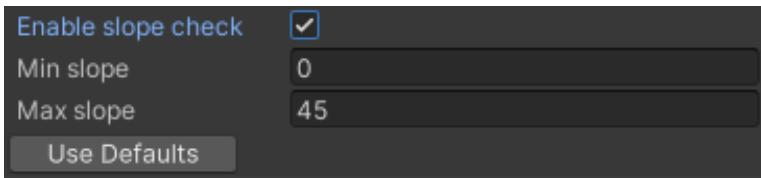

这可以防止物体在陡峭的斜坡上生成。例如，最小和最大坡度值分别为 0 和 45 意味着预制件将仅在与水平 XZ 平面的角度 <= 45 度的表面上生成。

如果我们使用最小坡度值 60 和最大坡度值 90，则对象只会在非常陡峭的表面上生成。在这种情况下，平坦表面将被忽略。

一般来说，如果您希望预制件在相对平坦的表面上生成，则可以使用一对值（例如 [0, 15]）。

## 曲线生成

曲线生成工具对于生成栅栏、森林、房屋行等非常方便。

在使用此工具之前，您需要创建一个或多个预制件配置文件。

## 曲线预制型材

曲线预制件配置文件包含可以沿曲线生成的预制件集合。例如，如果您想创建栅栏，您可以创建一个包含不同栅栏预制件的配置文件。例如，这些可以是常规或损坏的栅栏部件。

为了创建配置文件，请打开“工具”>“GSpawn”>“Windows”>“曲线预制件...”

屏幕上将出现以下窗口：

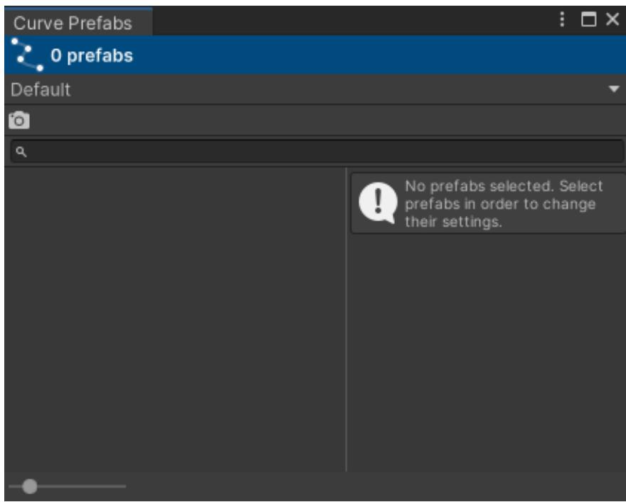

单击下拉控件，选择“创建新配置文件...”以创建新配置文件。下图显示了创建新配置文件以保存栅栏预制件后的相同窗口：

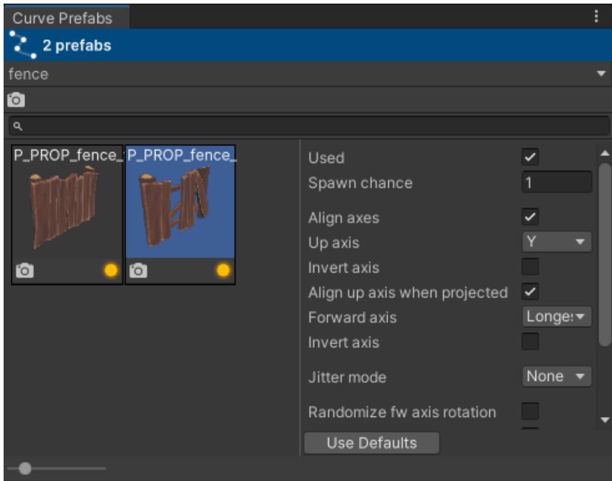

添加了 2 个围栏预制件，可用于生成围栏。为了添加预制件，您需要将它们从“预制件管理器”窗口拖放到“曲线预制件配置文件”窗口的左窗格中。

## 曲线创建设置

在检查器中，您可以在曲线创建 UI 部分下看到一堆设置：

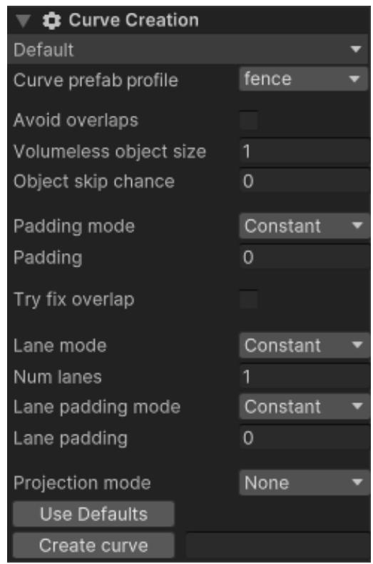

您创建的每条曲线都有其自己的关联设置，但您在上面看到的设置是用于新创建的曲线的初始设置。创建曲线后，您可以更改其设置。

最重要的字段是 **Curve prefab profile** 字段，它允许您选择要与要创建的新曲线一起使用的预制配置文件。如果您愿意，您还可以在创建曲线后更改轮廓。在此示例中，使用了我们之前创建的 **fence** 配置文件。

需要注意的重要一点是，这些设置可以在配置文件中组织。这不是强制性的，但如果您要创建不同类别的曲线，它可能会很有用，因为它可以让您避免一直更改设置。如果您在配置文件中组织设置，则只需选择配置文件，设置就会自动更新。

## 创建曲线

为了创建曲线，请为曲线命名并单击“创建曲线”按钮。这将创建一条新曲线并将其添加到检查器中的曲线列表中：

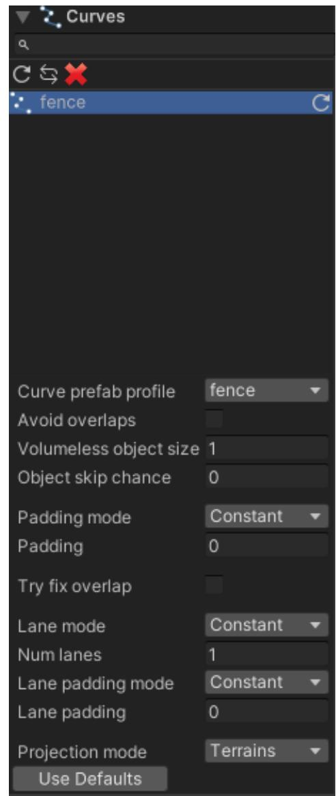

您可以拥有任意数量的曲线，并且可以在此列表中选择它们并对它们进行更改。请注意曲线列表下方的设置。这些可用于更改每条创建的曲线的设置。

将鼠标移到场景视图上，您​​将看到一个小勾号。这代表曲线的第一个控制点。为了实际构建曲线，请按照以下步骤操作：

1. 左键单击添加新的控制点；  
2. 不断添加控制点并移动鼠标确定其位置；  
3. 完成后，按住 [SHIFT] 并左键单击以提交；

下图显示了使用围栏轮廓构建的简单围栏：

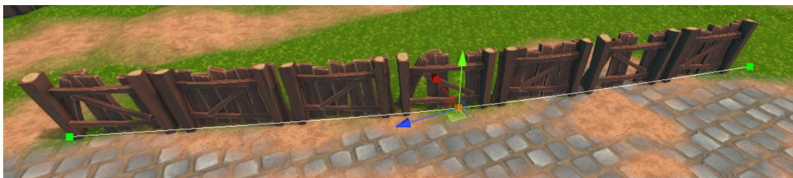

## 操纵控制点

您可以通过单击控制点来选择它们。您可以按住 [CTRL] 并左键单击来追加。您可以按  $[\mathrm{CTRL} + \mathbf{A}]$  选择曲线内的所有控制点。

您可以按 [C] 插入新的控制点。这将允许您将鼠标光标移动到曲线旁边并单击左键插入新的控制点。

有 3 个可用的小玩意：

- 移动小控件 [W] - 移动选定的控制点；  
- 旋转小控件 [E] - 围绕其中心点旋转整个曲线；  
- 缩放小控件 [R] - 从中​​心点缩放曲线；

您还可以从 Gizmo 工具栏更改当前的 Gizmo：

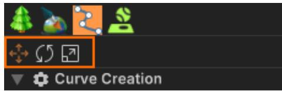

您可以按 [SHIFT + F] 将曲线投影到位于鼠标光标或网格下的对象上。

## 复制曲线

您可以按  $[\mathrm{CTRL} + \mathrm{D}]$  复制在曲线列表中选择的曲线。注意：场景视图必须具有焦点才能起作用。因此，请确保在复制之前先在场景视图中单击（任何鼠标按钮都可以）。这在某些情况下很有用，因为它可以帮助您避免从头开始构建曲线：

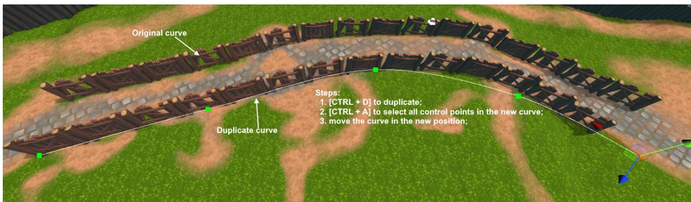

## 地形投影

将曲线放置在有许多山丘或凹凸不平的地形顶部时，移动控制点可能会导致某些对象嵌入地形内部或漂浮在地形上方。您可以通过使用前面讨论的 [SHIFT + F] 热键投影控制点来解决此问题，但有时控制点粒度不够，添加更多控制点可能不可行和/或可能无法解决问题。

处理此问题的最佳方法是为曲线内的所有对象启用地形投影。控制点不会受到影响，但对象将始终位于地形顶部。

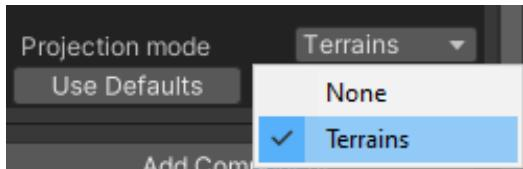

这将确保生成的对象将被投影到位于它们下方的地形的顶部，无论控制点位于何处。

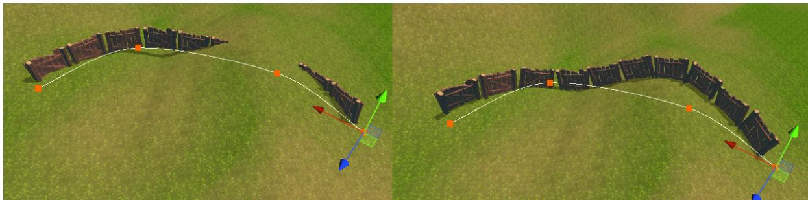

左图显示了在未启用投影的情况下曲线的外观。右图显示了启用投影功能后的结果。

默认情况下，当对象投影到地形上时，它们的上轴将与地形表面法线对齐。如果您想更改此设置，请转到“曲线预制件轮廓”窗口，选择预制件并取消选中“投影时对齐轴”字段：

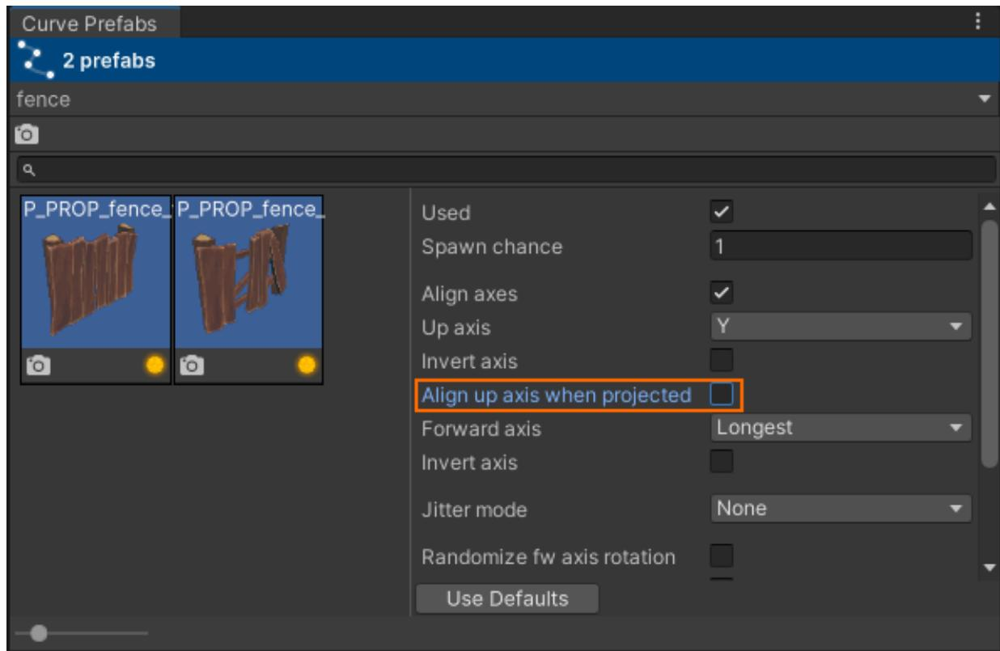

## 多车道和重叠

您可以沿着与同一条曲线平行的多条车道生成对象。下图显示了一条新曲线，它使用不同的预制件轮廓并将其通道数设置为 3：

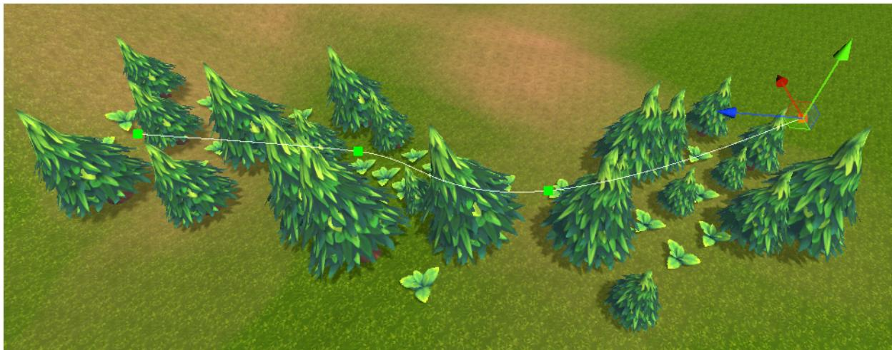

曲线设置已更改，如下所示：

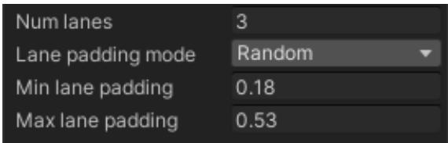

如果您希望使用曲线生成工具构建森林，则应将车道模式字段设置为随机：

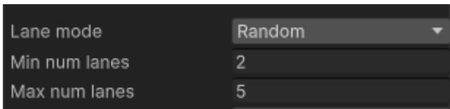

这将使每个切片的泳道数量随机化，从而产生不太均匀的结果。随机化曲线的比例并启用抖动也可以帮助：

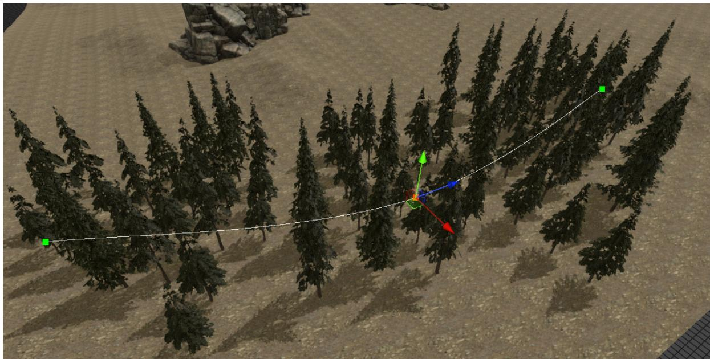

下图显示了预制件设置的快照：

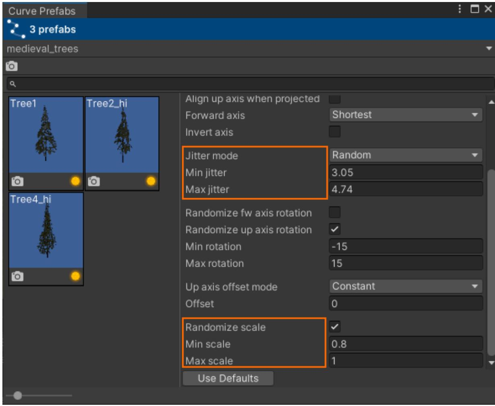

注意：当使用超过 1 个车道时，物体可能会在曲线较陡的地方重叠。您可能需要调整控制点的位置以减少重叠。

注意：当使用任何类型的随机化时，当您移动控制点时，对象将旋转。这是因为移动控制点会导致整个曲线刷新，而随机化会导致每次使用不同的值。

即使使用单车道也可能发生重叠：

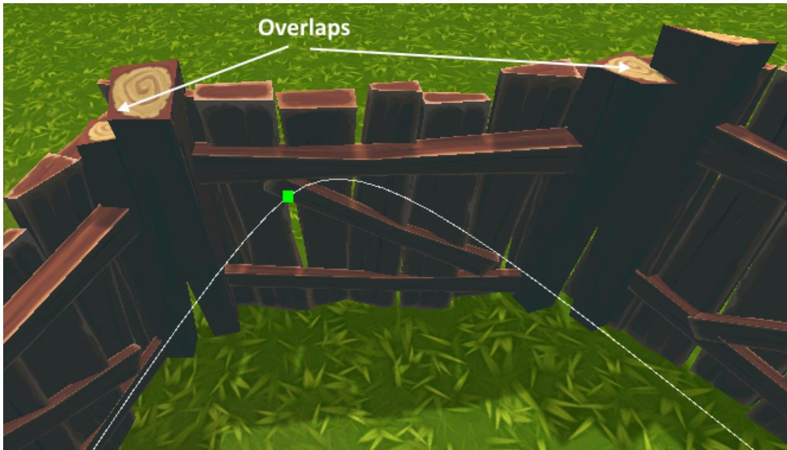

对于单车道情况，您可以检查曲线设置中的“尝试修复重叠”开关以消除重叠：

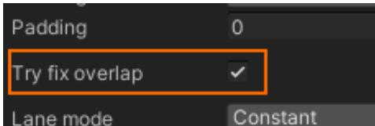

下图显示了相同的曲线，但选中了此切换：

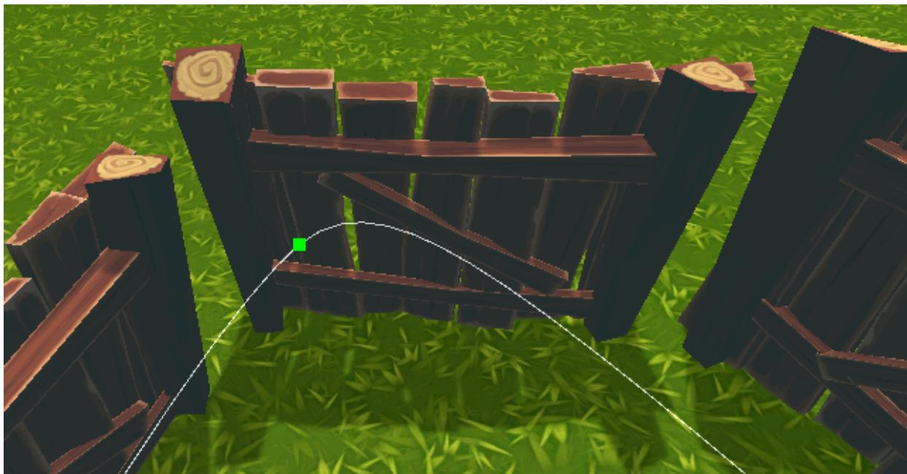

注意：顾名思义，尝试修复重叠功能将尝试修复重叠，但在某些边缘情况下此功能不起作用。此外，有时您可能会看到物体被推到一边（即远离曲线）。发生这种情况时，您将需要移动发生这种情况的区域周围的一些控制点。

## 预制前轴和上轴

曲线内使用的每个预制件都有 2 个与之关联的轴：

- 前轴 - 指向曲线移动/延伸的方向；  
- 上轴 - 垂直于曲线运行；

这些可以从“曲线预制件配置文件”窗口中设置：

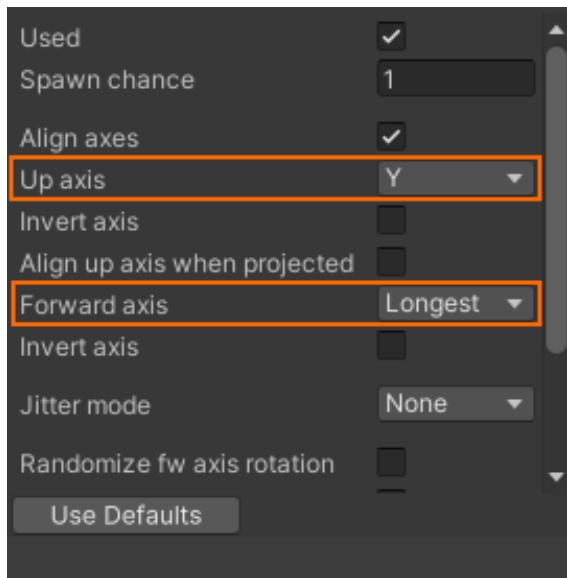

这些轴的直观表示如下：

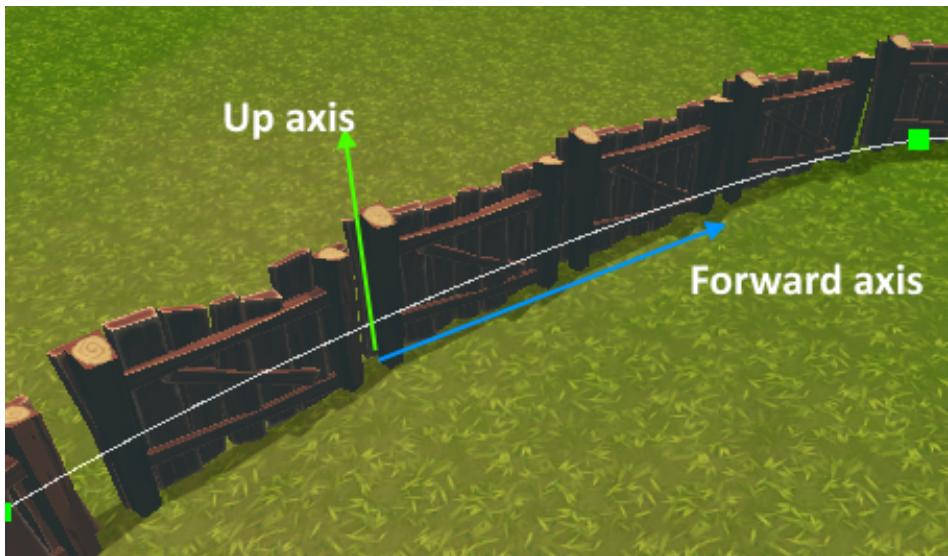

可能的值为：

- X-预制件局部X轴；  
- Y - 预制局部 Y 轴；  
- Z - 预制局部 Z 轴；  
- Longest - 最长的预制局部轴；  
- Shortest - 最短的预制局部轴；

注意：如果向前轴和向上轴映射到相同的预制局部轴，您可能会看到奇怪/不正确的结果。例如，您可以将前轴设置为最长，将上轴设置为 Y。但如果最长轴为 Y，则两者实际上是相同的。根据经验，如果物体沿着曲线看起来很奇怪，这应该是首先要考虑的事情。

## 物理生成

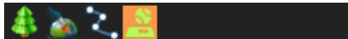

物理生成允许您使用物理模拟生成对象。

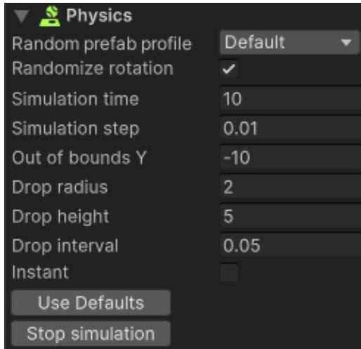

您需要做的第一件事是设置一个或多个随机预制配置文件。然后，您必须将随机预制配置文件字段设置为您创建的配置文件。当生成对象时，该工具将随机选择此配置文件内的预制件并将其放入具有物理模拟的场景中。

生成：

- 左键单击

或者

- 按住鼠标左键并拖动；

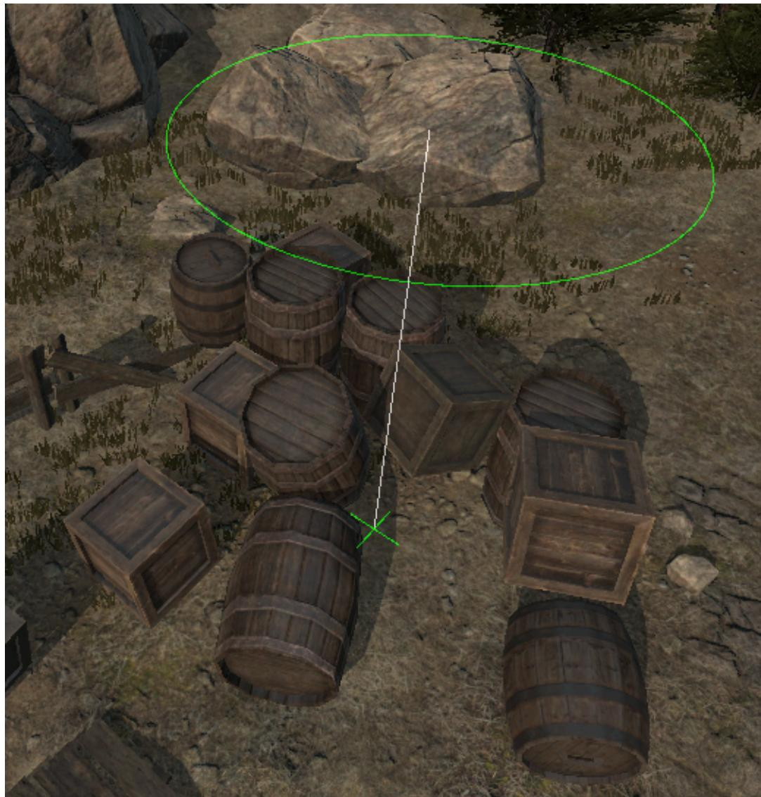

上图显示了如何使用物理生成工具生成桶和板条箱。

绿色圆圈代表放置区域。预制件是从随机预制件池中随机挑选的，并在该圆内生成随机位置。您可以按住 [CTRL] 并使用滚轮来更改半径。

白线代表跌落高度。按住 [SHIFT] 并使用滚轮更改高度。

丢弃间隔指定丢弃频率。例如，值为 0.1 表示拖动鼠标时，每 0.1 秒就会放下对象。

即时切换允许您指定模拟是否应立即进行。默认情况下，这是未选中的，这意味着您将实际看到物体如何落到地面并与环境碰撞。

您应该按照 Unity_Docs 中的建议将“模拟步长”字段保持为小于 0.03 的值。

出界 Y 字段允许您指定物理对象被视为出界的 Y 位置。当一个物体到达这个位置时，它会自动被销毁。这很有用，因为某些对象可能会在其下方可能没有任何地面的地方生成，或者它们可能会从地形等表面滚落并开始“永远”掉落。

## 撤消/重做

当取消选中“即时”字段时，您应该等到模拟完成后再进行“撤消和重做”。否则，如果您撤消然后重做，对象位置将不正确。如果您必须经常撤消和重做，最好检查即时切换。

## 装饰规则

使用道具生成工具装饰环境时，有时可能很难在所需的确切位置生成对象。下图显示了一个示例，其中盖子位于石棺对象旁边，但无法使用普通 Props Spawn 工具重现其姿态：

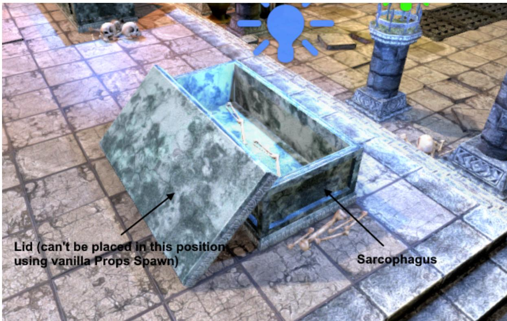

即使你尝试将盖子放在石棺顶部，仍然很困难。这就是装饰规则功能可以发挥作用的地方。该功能需要示例场景作为输入。幸运的是，几乎所有您可以从商店购买的资源包都附带由艺术家创建的高质量演示场景。加载此场景后，插件可以解析场景并检测对象相互装饰的方式。然后，您可以使用此信息来装饰您自己的场景中的对象。

## 创建装饰规则

将预制件资源文件夹拖放到“预制件库”窗口内，以用库和预制件填充其中，然后切换到您要使用的资源包附带的演示场景之一。在此示例中，使用了 3DForge 提供的名为 Village Interiors Kit 的资源包，加载的演示场景名为 The Crypt - TopDown。

在使用之前，请确保在此场景中初始化 Gspawn。

接下来，打开“预制件库”窗口，然后单击顶部工具栏中的“生成装饰规则”按钮，如下图所示：

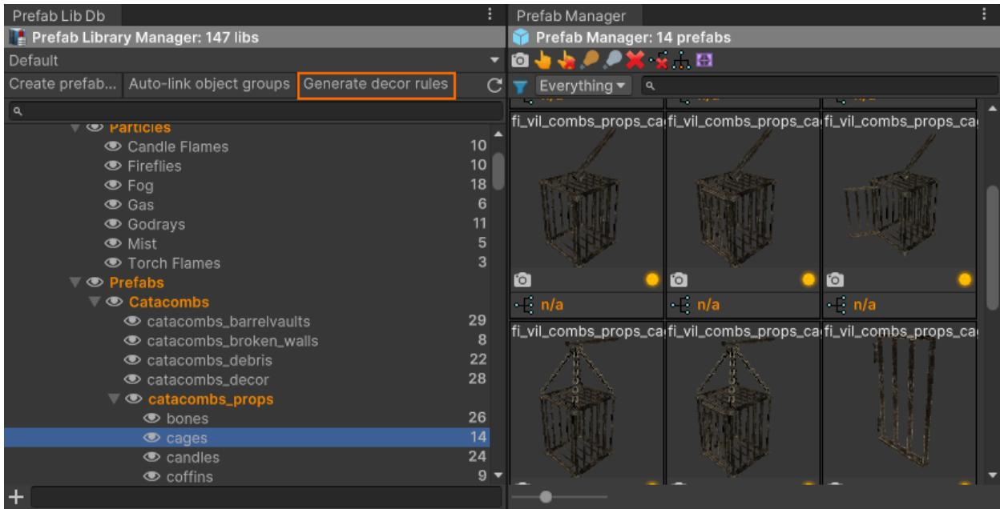

将出现一个进度条，该过程完成后，您就可以使用生成的装饰规则了。

## 使用装饰规则

为了使用生成的规则，您需要激活 Props Spawn 工具，并在检查器中的 Spawn Guide 部分下，您需要选中应用装饰规则按钮，如下所示：

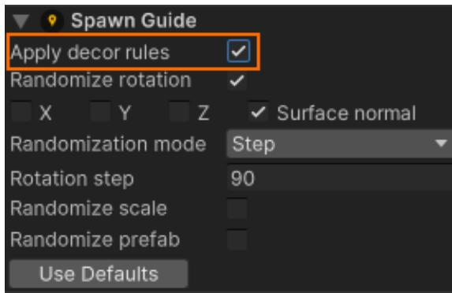

从现在开始，当您用鼠标移动生成指南时，插件将检查鼠标光标下的对象是否由生成指南的预制件装饰。如果是，生成指南将根据检测到的装饰规则自动更改其位置和旋转。

您可以通过按 [SHIFT + V] 来切换装饰规则，而不是使用检查器 UI。

注意：由于装饰规则会覆盖生成引导位置和旋转，因此您无法再使用鼠标更改旋转。但是，您仍然可以使用 X/Y/Z 键更改生成引导旋转。

注意：当您想要左键单击生成时，请确保未按下 [ALT] 键。否则，它将替换生成指南预制件。

因为预制件可以用不止一种方式装饰对象，所以可能有不止一种可用的装饰规则。您可以通过按住 [ALT] 并使用鼠标滚轮来更改当前规则。当您执行此操作时，您将看到生成指南根据激活的新规则更改其位置和旋转。

下图显示了如何将盖子放置在石棺附近：

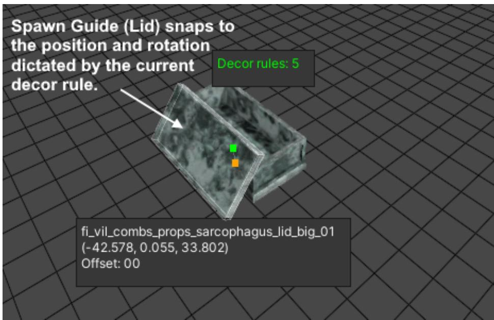

生成指南使用其中一个盖子预制件，并将鼠标光标放置在石棺上。该插件检测到盖子以 5 种不同的方式装饰石棺（注意显示可用规则数量的绿色标签），并选择其中一种规则来捕捉盖子的位置和旋转。

以下是适用于本例的其他规则：

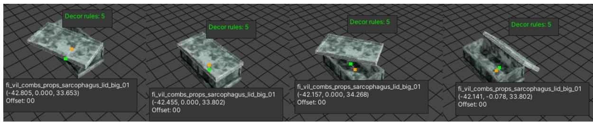

通过按住 [ALT] 并使用鼠标滚轮，可以遍历不同的装饰规则。这使您可以通过自动定位和旋转捕捉以不同的方式快速装饰对象。

这是装饰规则何时有用的另一个示例：

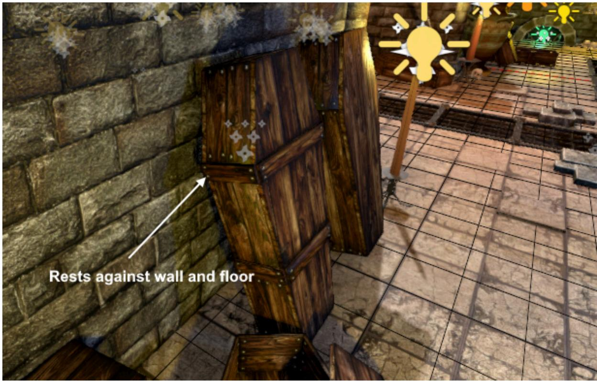

在上图中，示例场景显示了靠墙和地板放置的 2 个棺材。同样，使用香草 Props Spawn 将这些棺材放置在这个位置会有点困难，但是当使用装饰规则时，棺材会自动卡入到位：

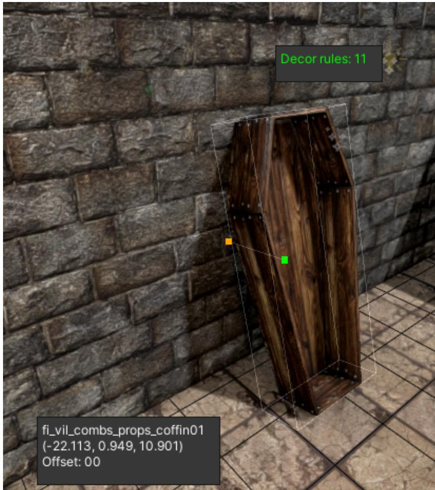

我们还可以使用相同的方法放置骨架：

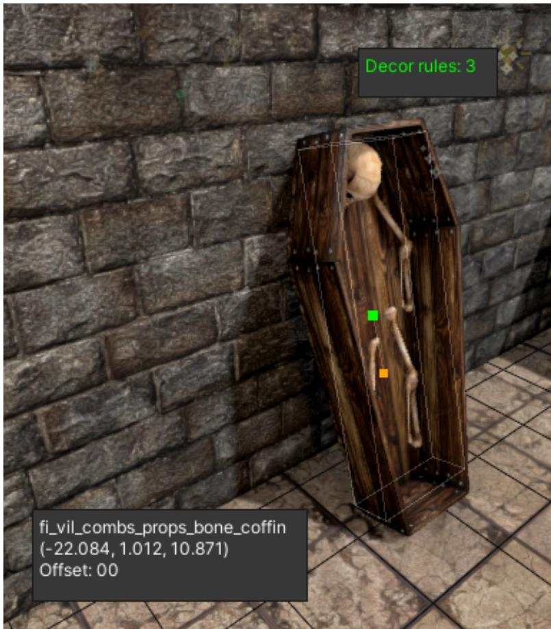

## 添加新规则

我们假设您想要使用的某些前缀不包含足够的规则。在这种情况下，您可以按照以下步骤操作：

- 创建您想要使用的演示场景的副本；  
- 在演示场景副本中，使用 Props Spawn 和移动和旋转小工具的组合创建您想要的装饰规则。例如，您可能想要为石棺盖添加更多规则。对于您想要创建的每条规则，放置一个新石棺并将盖子放置在所需的位置和旋转位置。  
- 在预制件管理器中，选择预制件（本例中为盖子预制件），然后单击下图中突出显示的按钮：

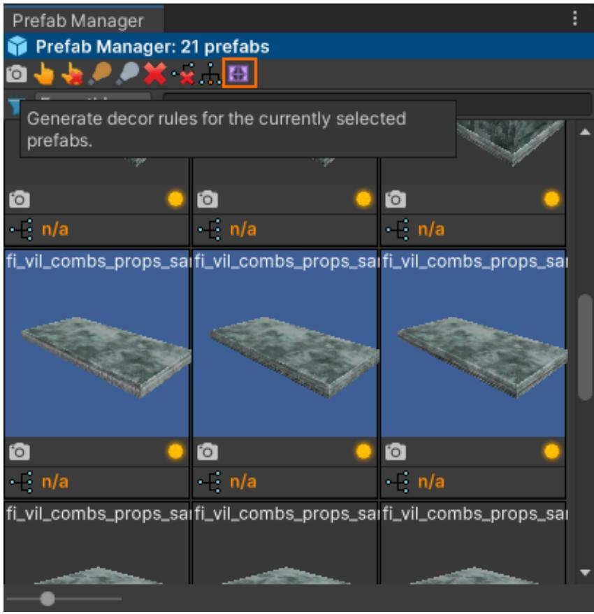

注意：每当您为预制件生成装饰规则时，旧的装饰规则都将被擦除并替换为当前活动场景中检测到的规则。这就是为什么使用存在所有可能规则的单个示例场景很重要。

## 局限性

装饰规则功能实际上取决于提供的示例输入。如果预制件不装饰示例场景中的对象，则它将无法利用装饰规则。该插件尝试使用名称匹配来借用预制件之间的规则，这有时会很有帮助。例如，如果艺术家创建了同一对象的 3 个版本：sarcophagus_01、sarcophagus_02、sarcophagus_03，但示例场景中仅存在 sarcophagus_01，则插件会将规则从 sarcophagus_01 复制到其他 2 个版本。

某些规则可能会折断生成指南，使其漂浮在地面上方。当预制件在同一区域一次装饰多个对象时，可能会发生这种情况。

## 镜像

镜像是一个非常方便的功能，它允许您处理包含对称性的关卡区域。此功能的工作原理是让您控制一个小控件，该小控件定义可以镜像对象的镜像平面。

对于以下生成工具，镜像可在选择模式和生成模式下使用：

- 模块化按扣；  
细分；

- 盒子;  
- 道具；  
- 瓷砖规则；

## 镜子小发明

下图显示了镜子小玩意的样子：

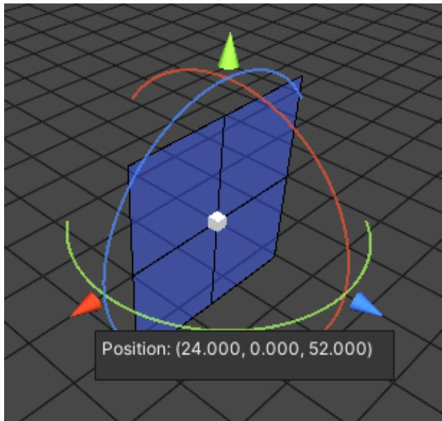

圆锥手柄允许您在场景中移动小工具。按住 [CTRL] 启用捕捉。

这些圆圈允许您旋转小工具。再次，[CTRL] 启用捕捉。默认情况下，旋转手柄是隐藏的。您需要检查镜像小控件设置中的旋转手柄字段以使它们可见。

中间的白色立方体手柄允许您通过将镜子捕捉到网格或对象边界体积来在场景中拖动镜子。当鼠标悬停在某个对象上时，镜子将捕捉到鼠标光标与该对象之间的交点，然后将其捕捉到场景网格。

要切换小控件，请按  $[\mathrm{CTRL} + \mathrm{Q}]$ .

要将镜子捕捉到视图中，请按 [CTRL + F]。

## 多个镜面

在前面的示例中，仅启用了单个镜像平面，但最多可以同时使用 3 个平面来同时沿不同轴进行镜像。下图显示了启用 2 和 3 个平面的相同小玩意：

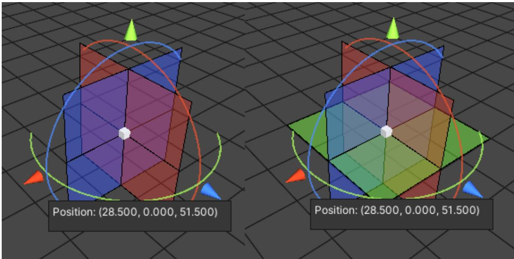

## 镜像小工具设置

下图显示了可以从 UI 更改的镜像 Gizmo 设置：

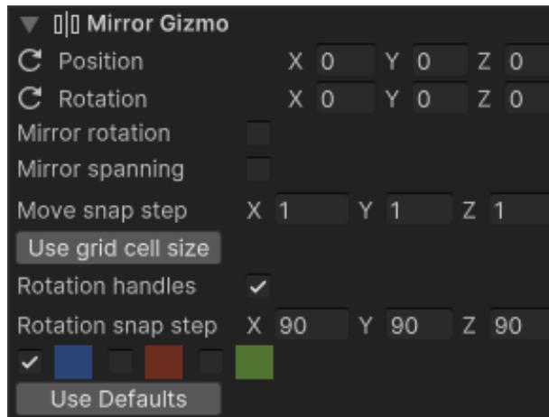

位置和旋转字段允许您从 UI 修改位置和旋转值。尽管手柄可用于相同目的，但 UI 可以让您更加精确。

如果对象旋转也应该镜像，则应检查镜像旋转开关。如果未选中，则仅镜像对象位置。

镜像跨越允许您指定是否应镜像或忽略跨越镜像平面之一的对象。

移动捕捉步骤允许您在启用捕捉的情况下控制使用手柄移动 Gizmo 时所应用的移动量。

按“使用网格单元大小”按钮会将移动捕捉步骤设置为网格单元大小。如果稍后更改网格单元格大小，则必须再次按此按钮。

旋转手柄切换允许您切换旋转手柄的可见性。例如，如果您不希望对小控件应用任何旋转（至少不使用圆形手柄），则可以取消选中此切换。

旋转捕捉步骤定义在启用捕捉的情况下使用圆形手柄旋转时使用的旋转步骤。

最后，3 个彩色方块允许您切换镜像平面的可见性。它们采用颜色编码，因此您可以轻松匹配它们。

注意：小控件设置不在不同上下文之间共享。例如，选择模式中使用的镜像设置不与模块化捕捉、分段、框等中使用的镜像设置共享。每个支持镜像的工具都有自己的镜像设置。

## 旋转镜像

在上一节中讨论了镜像小控件设置并提到了镜像旋转字段。本节将更详细地讨论该字段。

并非所有对象都需要检查此字段。例如，下图显示了一些不需要旋转镜像的对象示例：

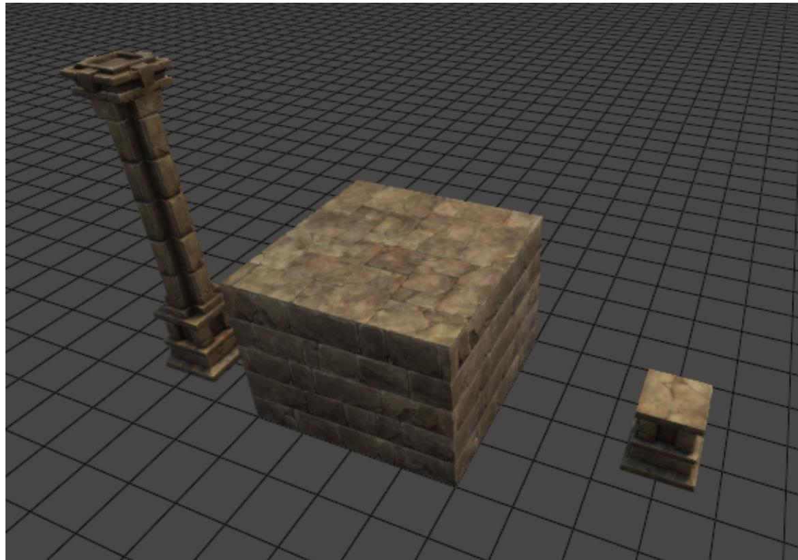

下图显示了一些需要启用旋转镜像的对象的示例：

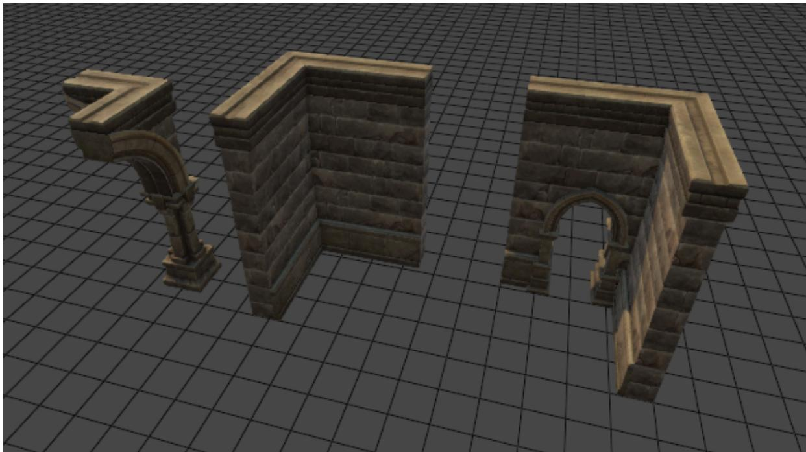

让我们使用上图中的内角对象，并在不启用旋转镜像的情况下对其进行镜像，看看它是什么样子：

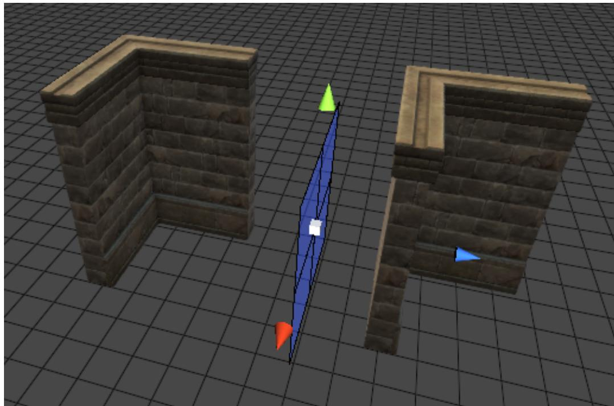

尽管有时这可能是您所需要的，但大多数时候这可能是不正确的。你需要的是这样的：

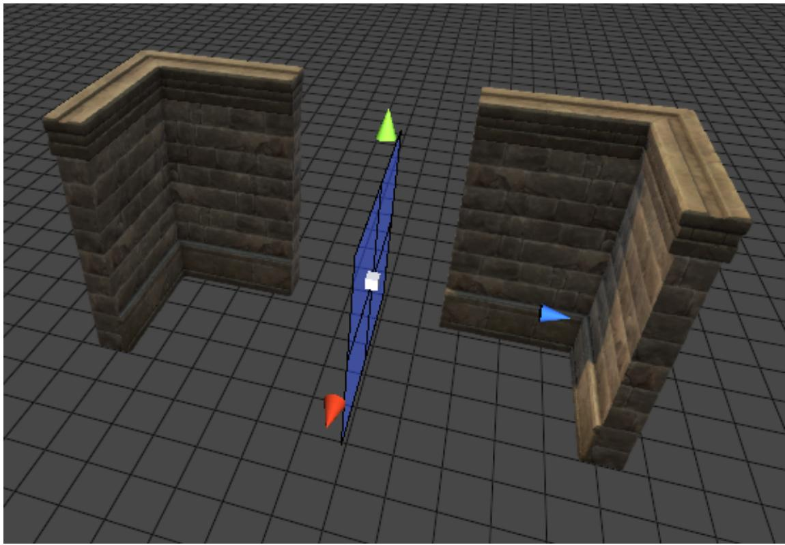

这可以通过检查镜像旋转开关来完成。

当选中“镜像旋转”开关时，如果是局部轴，则插件必须将对象的缩放比例设置为负值。这意味着如果您使用物理，您可能会在控制台窗口中看到以下警告：

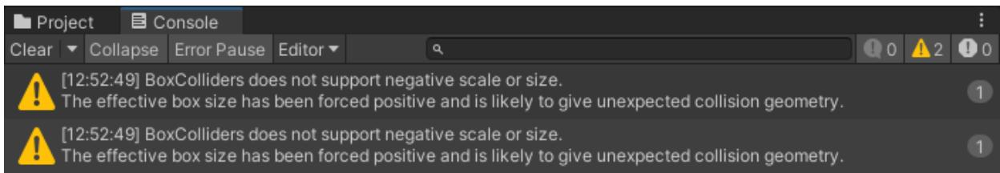

这是为了通知您，在某些情况下，负比例可能会导致碰撞检测出现问题。大多数情况下，您可以安全地忽略此消息。

但是，如果您使用的对象的盒碰撞器的中心偏离网格，使得碰撞器位于网格的一侧，则确实会出现问题。

例如，下图显示了负比例可能导致问题的情况示例：

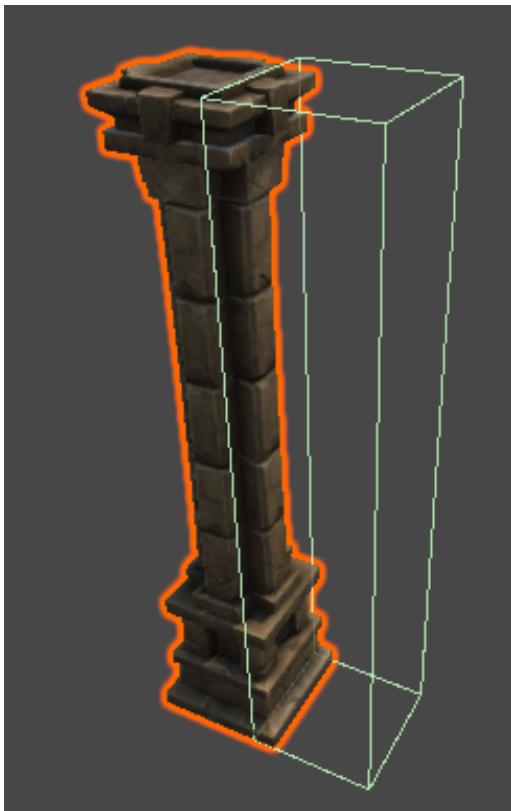

注意：为了讨论的目的，盒子碰撞器中心已有意沿 X 轴偏移。

请注意盒子碰撞器如何位于实际网格对象旁边。现在，如果我们将对象沿 X 轴的比例设置为 -1，则盒子碰撞器的位置将会翻转：

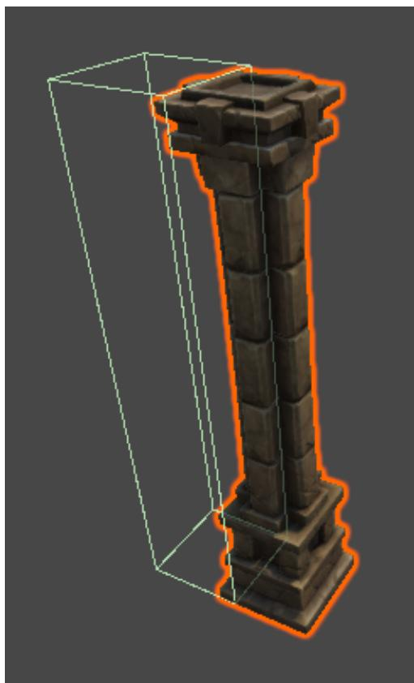

这意味着您期望盒子碰撞器位于右侧，负比例已将其翻转到另一侧，而您没有意识到这一点，并且碰撞将不再按预期发生。

## 对象生成镜像

为了在**生成模式**中使用镜像小工具，请切换到支持镜像的生成模式并激活镜像小工具。从那时起，使用该工具生成的每个对象都将进行相应的镜像。

下图显示了使用 Segments Spawn 模式使用镜像 Gizmo 的示例：

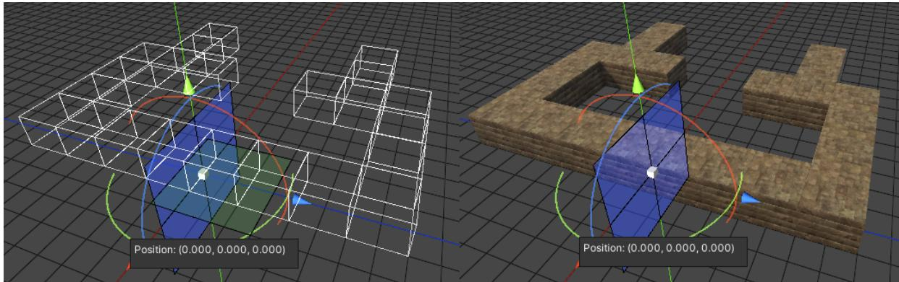

在下一个示例中，使用了 Box Spawn，并且镜子 Gizmo 有 2 个平面：

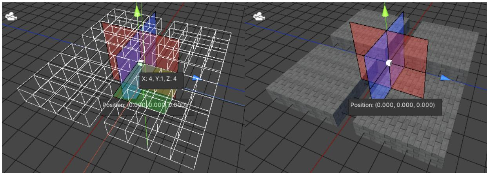

与 Tile Rule Spawn 一起使用时，镜像会受到更多限制。镜子小装置没有旋转手柄，您无法以任何方式旋转镜子。此外，镜像小工具设置对于每个平铺规则网格来说都是唯一的。

此外，如果垂直镜像，放置坡道可能会产生意想不到的结果：

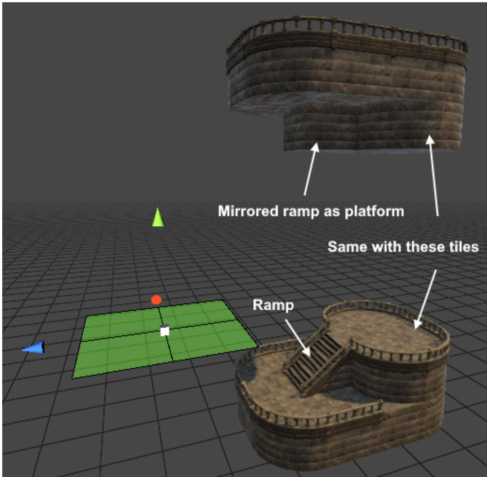

由于镜像的性质，镜面坡道瓷砖放置在上层瓷砖下方，成为一个平台。坡道所连接的瓷砖也会发生同样的情况。它们都变成了平台。对于这种环境，沿垂直轴镜像没有多大意义。但是，您可以沿水平轴（X 和 Z 轴）进行镜像。

如果您将“Tile Rule Spawn”工具与图块一起使用，则垂直镜像可能会很有用。

## 选择镜像

要镜像选定的对象，请激活镜像小控件，然后按键盘上的 [M]。

## 整数模式

整数模式只是整数值的集合，例如  $< 1, 2, 3, 2, 1>$  例如。

它们用于：

- Segments Spawn - 模式定义了段链内每个堆栈的高度（高度模式必须设置为 Pattern）；  
- Box Spawn - 一个模式定义了盒子形状沿某个方向的高度（高度模式必须设置为Pattern）；  
- Tile Rule Spawn - 可用于段画笔（高度模式必须设置为图案）；

## 创建整数模式

打开工具 > Gspawn > 窗口 > 整数模式...

屏幕上将出现以下窗口：

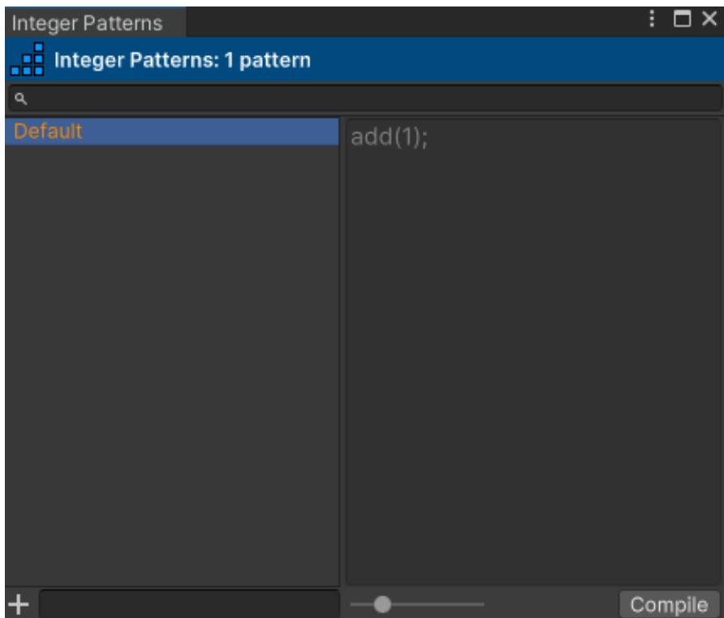

在左下角的文本字段中输入名称，然后单击加号图标以创建新模式。

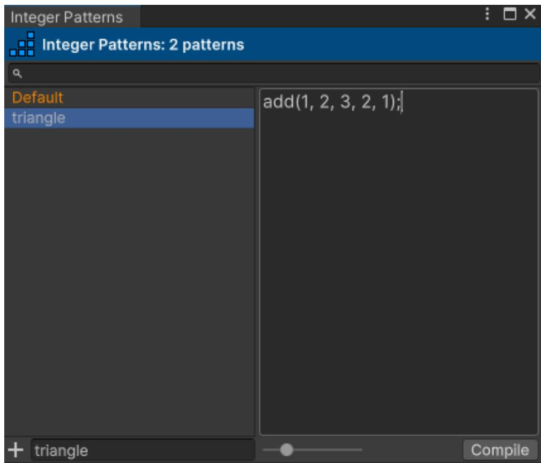

在上图中创建了一个称为三角形的图案。在右侧窗格中，我们可以看到模式语法。

按“编译”来编译模式。如果没有语法错误，则该模式现在可以使用了。每当对模式进行更改时，您都需要按“编译”。

让我们看看如果我们将其与 Segments Spawn 一起使用会发生什么：

- 激活分段生成模式；  
- 将高度模式设置为图案；  
- 将 Pattern 字段设置为三角形；

这是我们得到的结果：

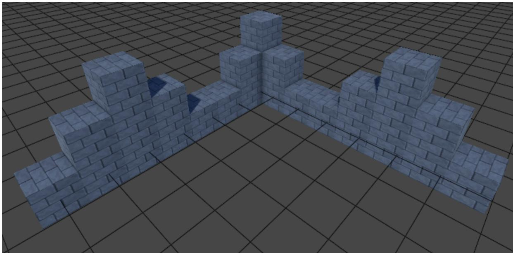

请注意如何使用整数模式来控制每个对象堆栈的高度。

无论何时使用模式（段、框、平铺规则），检查器中都有一个可用的环绕模式字段。

换行模式字段控制超过模式内值的数量时会发生的情况。模式很可能会很短，但您构建的结构可能会更长。将“环绕”模式设置为“重复”将导致高度图案环绕。在上图中，该模式重复 3 次。

将 Wrap 模式设置为 Clamp 将导致插件在没有更多值可用时使用模式中的最后一个值。

您还可以通过将“环绕”模式设置为“镜像”来镜像图案。

## 整数模式语法

为了构造一个模式，您需要在模式窗口内的右侧窗格中编写“代码”。

add 命令将一系列值附加到模式中，我们已经看到了它的实际效果。

表达式产生一系列值。在前面的示例中，表达式是由逗号分隔的值列表，例如 1, 2, 3, 2, 1。

为了向模式添加值，您需要编写 add(expr); （注意分号）其中 expr 是生成整数值序列的有效表达式。

以下是一些示例：

- 添加(3,2,2,3);  
- 添加（isoTriangle（4））；

isoTriangle 表达式创建等腰三角形，参数（本例中为 4）表示三角形高度。产生的图案是  $<1, 2, 3, 4, 3, 2, 1>$ .

- 添加（isoTriangle（-4））；

与上面相同，但产生一个倒三角形：  $< -1, -2, -3, -4, -3, -2, -1>$

- 添加（步骤（5、2、假））；

步骤表达式可用于创建类似楼梯的图案。第一个参数 (5) 表示步数，第二个参数 (2) 表示步长，最后一个参数必须设置为 true 或 false。 false 表示楼梯会向上生长。 true 表示楼梯将向下生长。本例中生成的模式是  $<1, 1, 2, 2, 3, 3, 4, 4, 5, 5>$ .

您可以向表达式添加偏移量：add(isoTriangle(4) + 3);

这会产生  $< 4,5,6,7,6,5,4>$ :

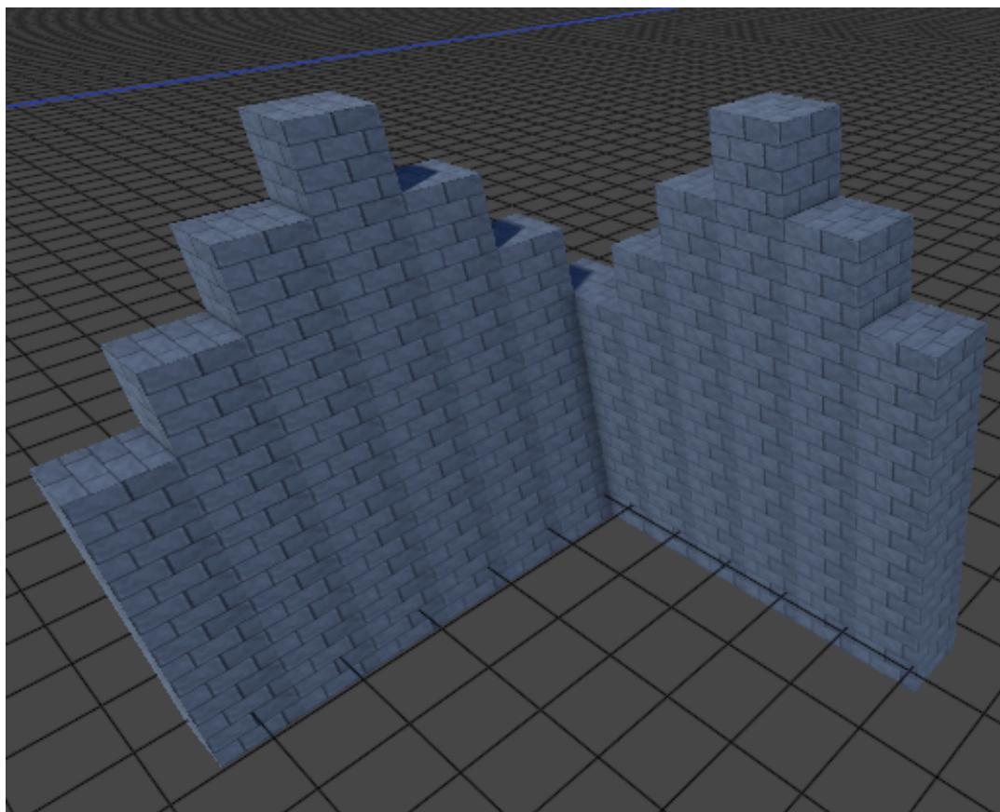

还允许负偏移：add(isoTriangle(-4) - 3);

这会产生：

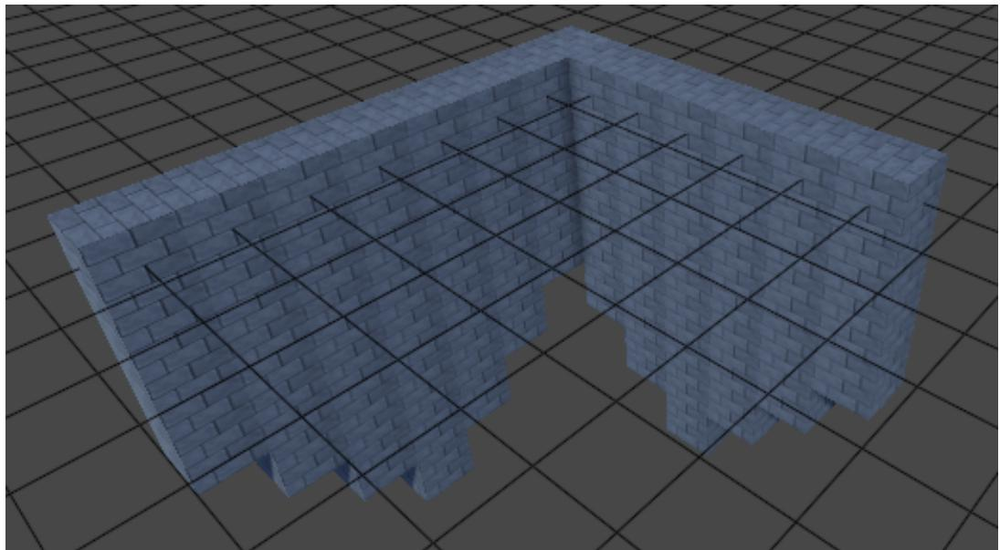

又如：add({1, 2, 2, 2, 4} + 2);

生产：

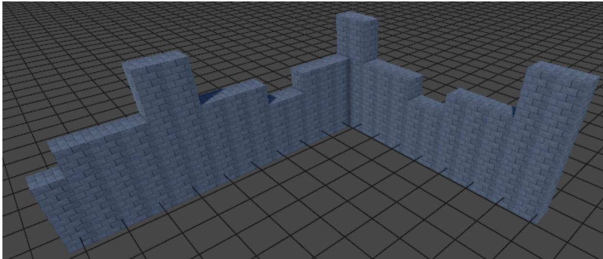

注意：定义图案时不使用偏移，也可以按住 [SHIFT] 并使用鼠标滚轮上下偏移图案。这是一种更好的方法，因为它使模式的限制更少（即，当您在模式内编码偏移量时，它始终存在，并且除非重新编译模式，否则无法更改它）。

## 整数范围预制配置文件

整数范围预制件配置文件包含预制件的集合，其中每个预制件都有 2 个称为“最小值”和“最大值”的关联字段。这两个字段定义了一个整数范围。

当 Prefab_pick 模式设置为 HeightRange 时，这在使用 Segments & Box 生成工具时非常有用。

## 创建整数范围预制件配置文件

打开工具 > Gspawn > 窗口 > 整数范围预制件...

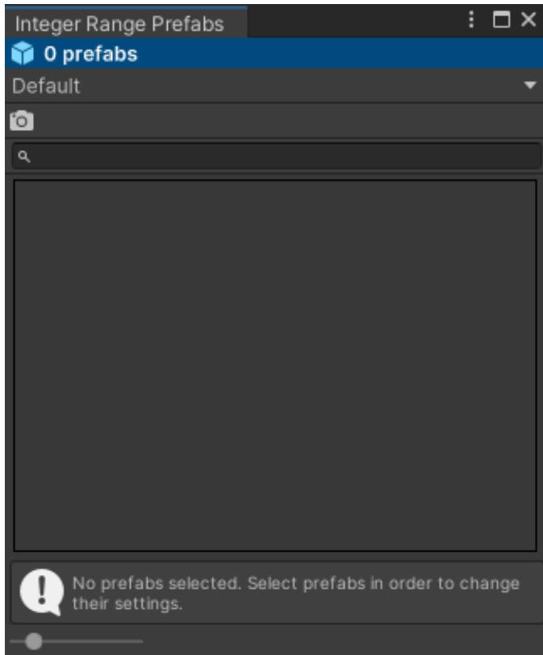

单击显示“默认”的下拉菜单并创建一个新的配置文件。下图显示了一个整数范围预制件配置文件，其中分配了一些预制件：

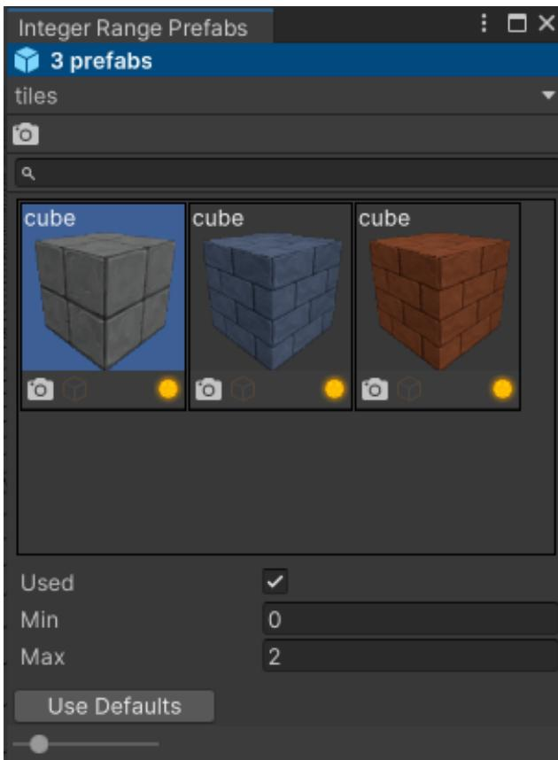

通过将预制件从“预制件管理器”窗口拖放到整数范围预制件配置文件窗口中来分配预制件。

“已使用”字段可用于暂时忽略/禁用预制件。当未选中“已使用”时，将不会选取相应的预制件。

## 使用整数范围预制配置文件

这种类型的配置文件可以与段和框生成工具一起使用。例如，使用前面定义的配置文件，我们在使用 Box Spawn 工具时可以获得以下结果：

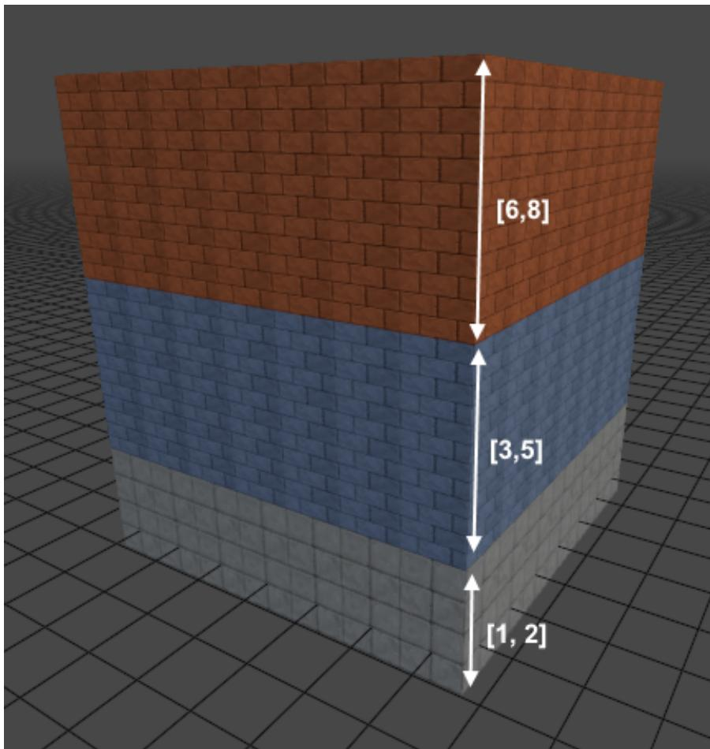

预制件被分配了以下高度范围（在配置文件中从左到右）：

[0, 2]  
[3, 5]  
[6, 8]

这些数字表示每个对象在盒子形状内的高度偏移。

注意：使用“段”和“长方体”生成工具时，值 0 始终被视为“无对象”。因此，即使第一个预制件的范围为 [0, 2]，实际上也仅考虑值 1 和 2。

## 默认选择预制件

有时，定义默认拾取预制件来处理使用整数值拾取预制件但没有任何预制件范围包含该整数值的情况可能很有用。例如，如果您要使用“盒子生成”工具并创建一个高度为 9 的盒子，但没有预制件的范围包含该值，则您可以将其中一个预制件标记为默认拾取

预制件。如果没有这样的预制件可用，则不会在高度偏移 9 处生成任何对象。

下图显示了需要启用的按钮，以便将预制件标记为默认选择预制件：

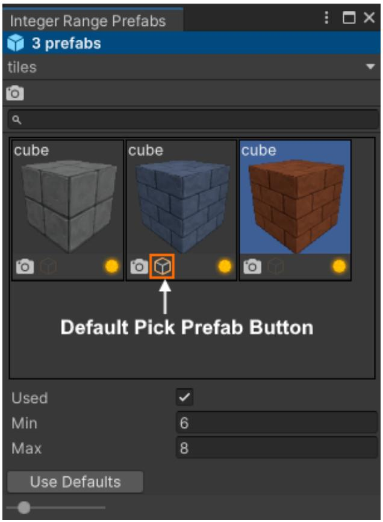

每个配置文件只能使用一个默认预制件。

## 随机预制型材

随机预制件配置文件包含预制件的集合，其中每个预制件都有一个与其关联的概率值。

当 Prefab_pick 模式设置为随机时，这在使用“段和框”生成工具时非常有用。随机预制配置文件也与物理生成工具一起使用。

## 创建随机预制件配置文件

打开工具 > Gspawn > 窗口 > 随机预制件...

屏幕上将出现一个新窗口。单击下拉菜单创建新的配置文件，然后从“预制件管理器”窗口拖放预制件：

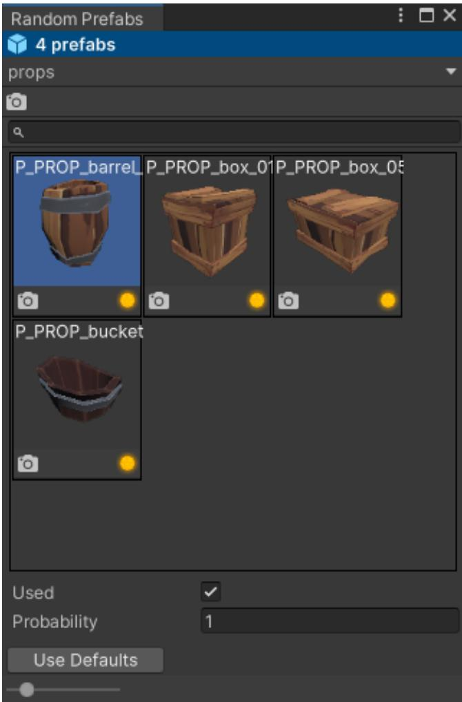

上图显示了一个道具配置文件，其中包含一些可与Physics Spawn 一起使用的预制件。

使用概率字段来控制预制件被选取的可能性。 “已使用”字段可用于暂时忽略/禁用预制件。当未选中“已使用”时，将不会选取相应的预制件。

## 场景网格

场景网格用于捕捉对象。如果您计划构建模块化环境，那么建立适当的网格单元大小非常重要。

打开工具 > Gspawn > 网格设置...

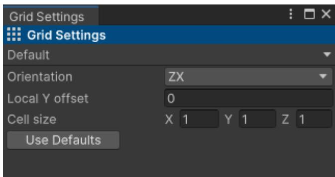

所有轴的默认单元格大小均设置为 1。该值非常适合沿 X 和 Z 的尺寸为整数（例如 3.0、4.0 等）的预制件。但是，如果您使用的预制件的尺寸包含小数部分（例如 2.5 或 3.5），则应将网格单元尺寸设置为较低的值，例如 0.5 或 0.25。

## 选择网格单元格大小

从所有轴上的网格单元大小为 1 开始。尝试通过将一堆墙壁/地板碎片折在一起来测试它。如果各部分未按预期相互连接，请执行以下步骤：

- 检查您使用的艺术包是否附带自述文件或文档。您可以在这些文档中找到您应该使用的单元格大小。如果不：

- 确保生成指南使用主要构建块之一，例如墙角或地板；  
o 按键盘上的 [K]。这将自动将沿 X 轴和 Z 轴的网格单元尺寸设置为预制件的尺寸；  
- 检查“网格设置”窗口中的单元格大小。如果像元大小有 0.5 小数部分（例如 1.5、3.5），请将 X 和 Z 像元大小设置为 0.5。对于使用其他小数部分的数字（例如 1.25、3.75），将 X 和 Z 像元大小设置为 0.25。

## 更改单元格大小

您还可以通过按住 [CTRL + SHIFT + ALT] 并使用鼠标滚轮来更改单元格大小。 X 和 Z 单元尺寸将以 0.25 个单位的增量变化。屏幕中间将出现一个标签，显示当前网格单元格的大小：

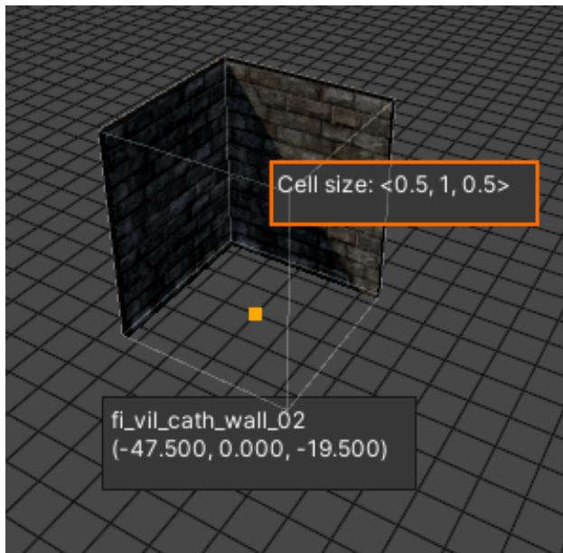

## Y/垂直单元尺寸

您在场景视图中看不到沿 Y 轴的像元大小。但它在模块化捕捉期间使用热键向上/向下移动生成指南时使用。生成引导线将以 Y 单元格大小的增量移动。此外，当对象捕捉到网格时，它们的位置也将沿着 Y 轴捕捉。

一般情况下，您可以将此值保留为 1。

## 向上/向下移动网格

您可以使用网格设置窗口内的“局部 Y 偏移”字段更改网格沿其局部 Y 轴的位置。您还可以使用 [ ] 和 [ ] 键以 Y 单元格大小的增量向上/向下移动网格。

您还可以按住 [G] 并左键单击某个对象，将网格捕捉到鼠标光标下方的位置。按住 [G] 并双击将捕捉到对象边界范围。其工作原理如下：

- 如果光标位于对象的下半部分上方，它将捕捉网格以位于对象的顶部；  
- 如果光标位于对象上半部分下方，它将捕捉网格以位于对象下方；

在处理多层环境时，此功能非常有用。

## 对象选择

此模式允许您处理场景中的现有对象，选择它们并使用不同的工具进行操作。

注意：无法选择属于平铺规则网格的对象。

要激活此模式，请单击主工具栏左侧的第二个按钮或只需按键盘上的 [2]。

## Gizmos 工具栏

下图显示了当对象选择模式处于活动状态时变得可见的小控件工具栏：

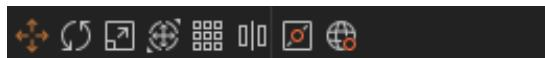

下面列出了这些按钮，从左到右以及任何适用的热键：

- 移动小工具 [W]；  
- 旋转小工具 [E]；  
- 比例尺小玩意[R]；  
- 移动/旋转/缩放（通用）小发明 [T]；  
挤压小玩意 [U]；  
- 镜像小工具 [CTRL + Q]；  
- 变换枢轴；  
- 变换空间；

注意：移动、旋转、缩放和通用小控件支持通过按住 [CTRL] 键进行捕捉。可以使用 Unity 的 UI 更改捕捉值：

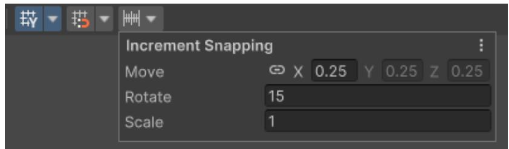

## 单击选择

您可以左键单击对象来选择它。按住 [CTRL] 并左键单击可附加到当前选择或取消选择已选择的对象。

当您单击预制件实例的游戏对象时，整个预制件层次结构都会被选中。

Unity 编辑器允许您再次单击同一对象以选择单击的实际子对象。默认情况下，GSpawn 中禁用此功能，但您可以通过打开“编辑”>“首选项”窗口来启用它。单击左侧窗格中的 Gspawn > 对象选择项，然后选中允许子选择开关：

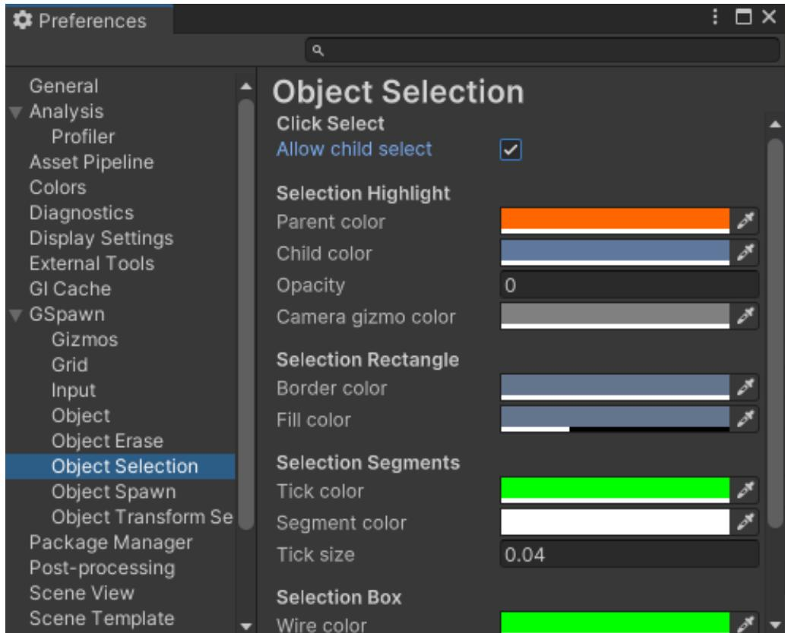

默认情况下关闭此功能的原因是它有时很容易出错。例如，您可能希望使用表面捕捉将预制件实例的层次结构捕捉到地形表面。但您可能不小心单击了其中一个子对象并选择了它。如果该子对象是 LOD 组的一部分，您最终将更改单个 LOD 对象的位置，而所有其他对象仍保持在同一位置。这可能会导致出现奇怪的行为。另一个示例是意外选择子对象并使用拉伸小控件，而实际上您想要拉伸整个层次结构。

## 多选工具

多重选择允许您使用不同的选择工具一次选择多个对象。

在小工具栏下方，有另一个工具栏，可让您选择要使用的多重选择工具：

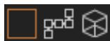

可以使用以下工具（在工具栏中从左到右）：

- 选择矩形 [SHIFT + 1] - 使用 2D 矩形选择对象；  
- 选择段 [SHIFT + 2] - 使用 3D 段链选择对象；  
- 选择框 [SHIFT + 3] - 使用 3D 选择框选择对象；

## 选择矩形

单击左键并拖动鼠标在屏幕上绘制一个矩形。将选择与矩形完全重叠的对象。

拖动时按住 [SHIFT] 将取消选择对象。

## 选择部分

为了使用：

- 移动鼠标建立起点；  
- 左键单击开始；

每次连续单击都会添加一个新段。

行动：

- [SHIFT + 左键单击] - 提交；  
- [SHIFT + 右键单击​​] - 删除最后一段（即后退）；  
- [ESCAPE] - 取消；

下图显示了此工具可能有用的情况：

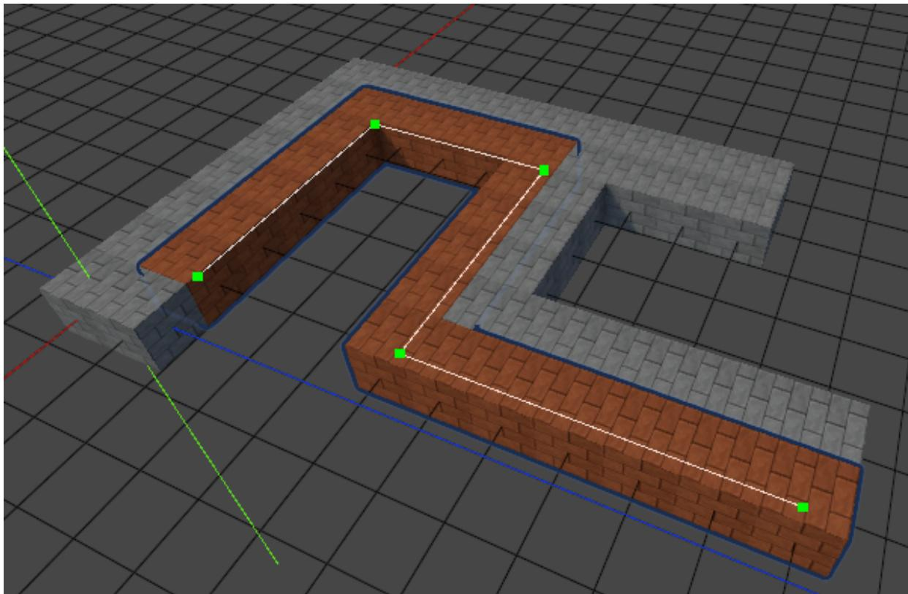

如果您想删除棕色砖块，则必须手动单击每个砖块。使用选择矩形不起作用，因为它还会选择灰色砖块。然而，使用分段工具，我们只需单击几下即可绘制一条选择路径并覆盖棕色砖块。

移动鼠标时，线段端点将捕捉到网格或对象边界体积中心。

捕捉到网格时，捕捉点将是单元格角之一或单元格中心点，具体取决于哪一个更接近鼠标光标。

## 选择框

该工具对于选择对象/图块块非常有用。使用瓷砖时非常方便。

为了使用：

- 移动鼠标建立起点；  
- 左键单击开始；  
- 移动鼠标使框水平延伸；  
- 左键单击开始垂直延伸；  
- 移动鼠标垂直延伸；  
- 左键单击提交；

按 [ESCAPE] 取消。

下图显示了使用此工具选择的图块块：

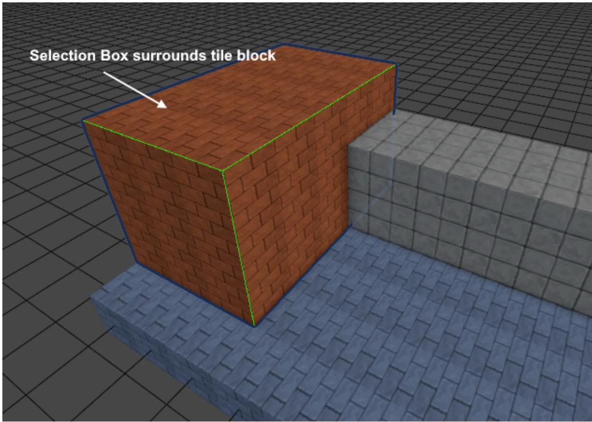

## 预制件更换

在选择模式下工作时，一个非常有用的功能是预制件替换机制，它有 3 种风格：

- 选择对象，按住 [ALT] 并左键单击“预制件管理器”窗口中的预制件 - 这会将所选对象替换为您在管理器 UI 中单击的预制件；  
- 选择对象，按住 [ALT] 并左键单击场景视图中的预制件实例 - 这会将所选对象替换为您在场景中单击的预制件；  
- 选择对象，在预制件管理器中选择预制件，按住 [CTRL + ALT]，然后左键单击预制件预览 - 这会将所选对象替换为从预制件管理器中选定的预制件组中随机选取的预制件；

## 选择 UI 工具栏

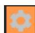

选择 UI 工具栏允许您为不同目的启用不同类型的 UI：

- 设置 - 包含不同类型的设置（例如选择、拉伸小控件、镜像小控件）；  
- 变换工具 - 此 UI 包含一系列设置和操作按钮，这些设置和操作按钮属于不同类型的工具，可用于操作/变换选定的对象；  
- Misc——杂项；

## 设置

## 选择过滤器

选择过滤器允许您指定可以通过单击或使用多选工具来选择的对象类型：

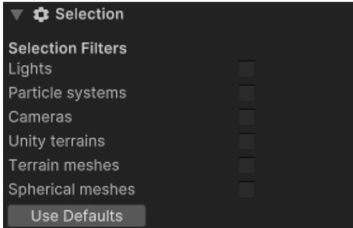

默认情况下，只能选择网格和精灵对象，并且永远不能禁用它们。

## 转换工具

## 模块化捕捉

您可以选择多个对象并使用模块化捕捉将它们捕捉到网格。模块化捕捉已经在 Modular Snap Spawn 中讨论过，因此这里不再赘述。

唯一的区别是您可以同时控制多个对象。

要开始捕捉，请按 [D]。这将启用模块化快照会话并允许您进行必要的更改。左键单击以提交。

## 表面捕捉

表面捕捉允许您选择多个对象并将它们捕捉到地形或网格表面。这与使用 Props Spawn 工具相同。不同之处在于您可以一次捕捉多个对象。

要开始捕捉，请按 [C]。这将启用模块化快照会话并允许您进行必要的更改。左键单击以提交。

## 投影

投影允许您将选定的对象投影到场景网格上或其他对象上。

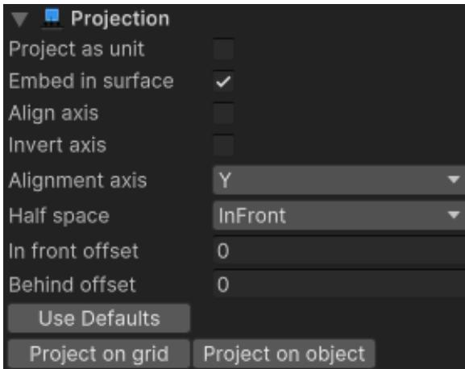

要投影到场景网格上，您可以按“Project on grid”按钮或按 [SHIFT + G]。

要投影到另一个场景对象上，您可以按投影到对象按钮或按 [SHIFT + F]。接下来，您必须左键单击场景中的对象。

投影时，项目作为单元字段将所有对象视为一个单元（即单个实体）。这意味着如果选中，属于不同层次结构的对象将在投影后保留其相对位置。否则，它们被独立处理并单独投影在投影表面上。

半空间字段允许您选择要投影的位置：前面或后面。向后投影有时可能很有用，例如，如果您想将吊灯等对象投影到天花板上。

注意：在网格上投影时，投影将沿着用鼠标光标选取的三角形的法线进行。

## 顶点捕捉

顶点捕捉允许您使用对象的顶点来捕捉对象。这类似于 Unity 自己的顶点捕捉功能。

使用方法：

按住[V]；  
- 移动鼠标以拾取属于所选对象之一的顶点；  
- 左键单击并拖动以捕捉到附近的对象顶点或网格；

## 盒式按扣

框捕捉几乎与顶点捕捉类似，但不使用对象顶点，而是使用对象包围体角点和中心。

使用方法：

按住[B]；  
- 移动鼠标选择一个方框角或其中心（取决于哪一个更接近鼠标光标）；

- 左键单击并拖动以捕捉到附近的对象边界或网格；

## 杂项

## 选择成长

考虑以下小场景：

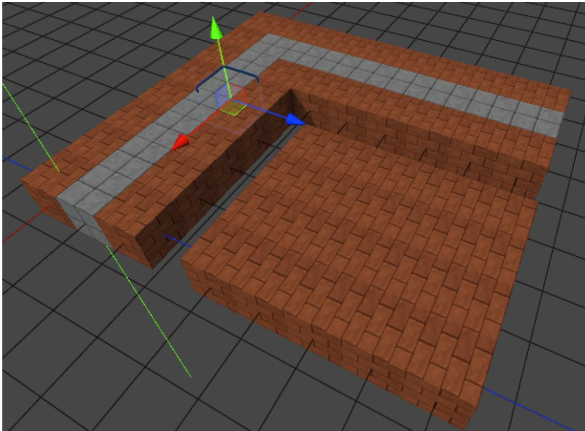

选择其中一个灰色图块，我们希望扩展选择范围以包括 L 形状的所有图块。按 [SPACE] 即可：

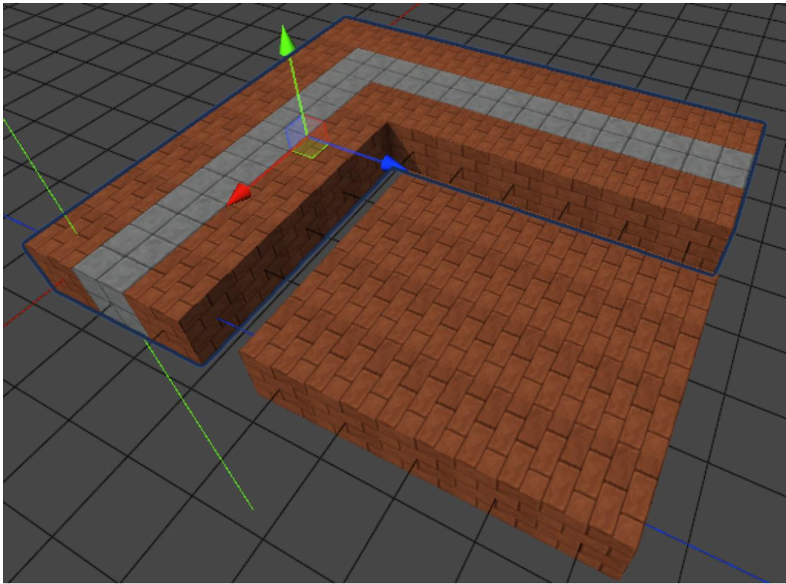

如果我们想限制选择仅包含属于原始选择的预制件，我们可以通过检查预制件约束字段来更改增长设置：

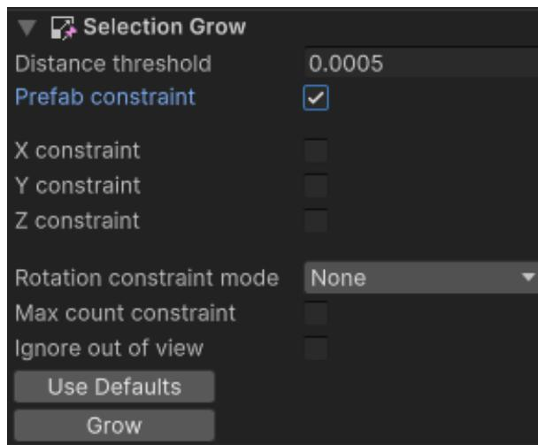

假设我们从选择的单个灰色图块开始，这一次，增长操作将仅包括灰色图块：

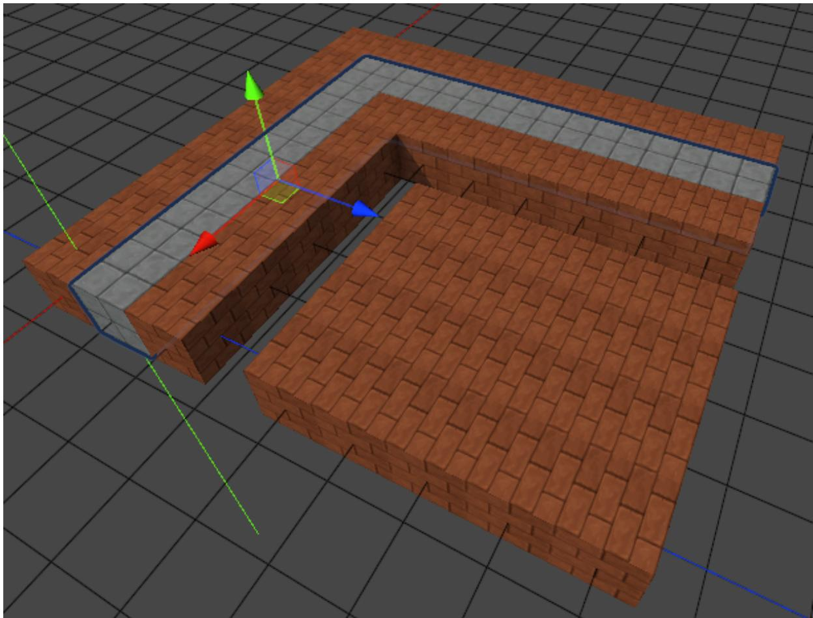

距离阈值允许您指定对象之间的距离容差。例如，假设我们还想选择上图中方形的棕色瓷砖。我们将距离容差设置为 1 并按“增长”（假设未选中预制件约束或最初选择了灰色和棕色瓷砖）。

X/Y/Z 约束切换允许您约束增长操作可以延伸的方向。

## 从选定的对象创建预制件

您可以按照以下步骤轻松地从选定的对象创建预制件：

- 在选择模式下选择对象；  
- 打开预制件库窗口；  
- 单击创建预制件...按钮：

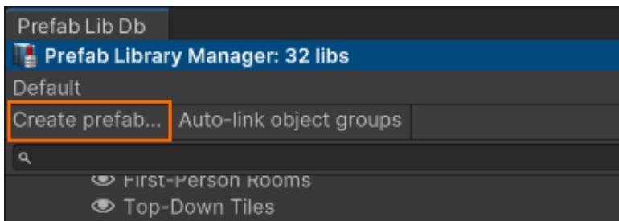

- 屏幕上将出现一个新窗口：

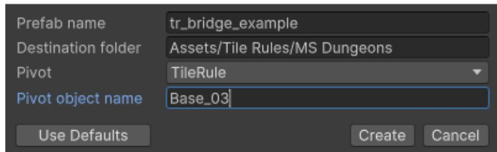

配置完所有设置后，按“创建”按钮。这将在指定文件夹中创建预制件。如果同名预制件已存在，系统会询问您是否要覆盖它。

预制件创建字段：

- Prefab name - 预制资源的名称；  
- 目标文件夹 - 将放置预制资源的文件夹。您可以手动输入名称，也可以将文件夹拖放到文本字段中；  
- 枢轴 - 允许您指定生成的预制件的枢轴所在的位置；  
- 枢轴对象名称 - 如果此字段为空，则将使用整个预制层次结构的包围体来计算枢轴。否则，该名称应该是其边界体积将用于枢轴计算的对象的名称。当透视字段设置为平铺规则时，此字段非常有用；

下图显示了为创建桥图块规则而选择的 3 个对象：

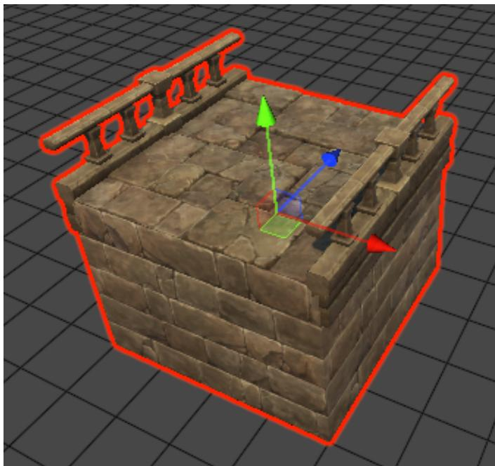

使用此功能创建切片规则时，应将枢轴设置为 TileRule，并将枢轴对象名称字段设置为通常位于切片规则网格表面上的对象的名称。在上图中，这是名称为 Base_03 的地板对象。如果枢轴对象名称为空，插件将选择具有最大边界体积的对象并使用它来计算枢轴。

## 挤出小玩意

挤出小工具允许您沿特定方向复制对象。

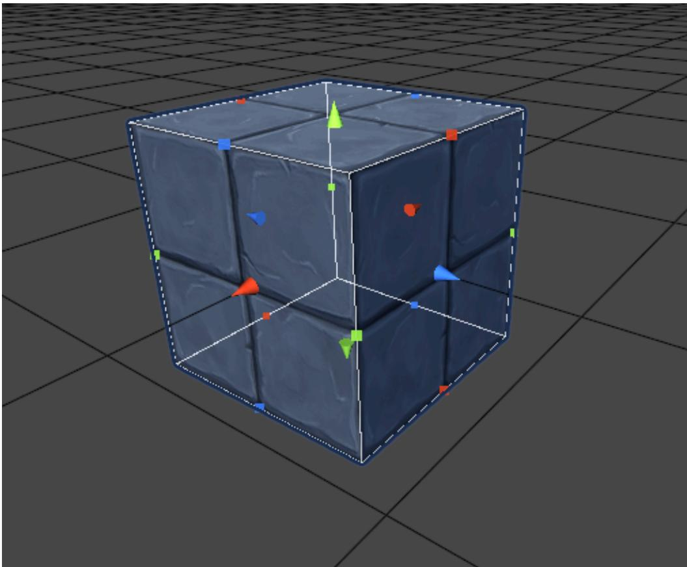

锥形手柄允许您沿一个轴挤出，而小点允许您同时沿 2 个轴挤出。以下是沿一个轴拉伸的示例：

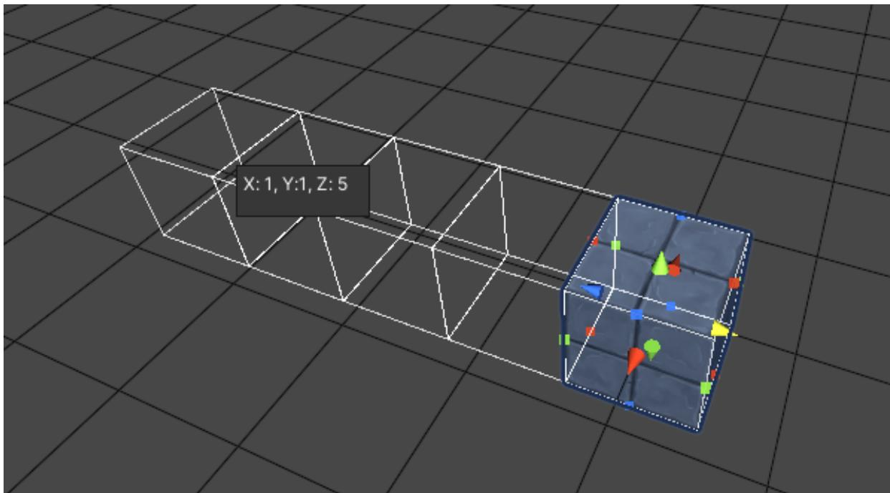

以下是同时沿 2 个轴拉伸的示例：

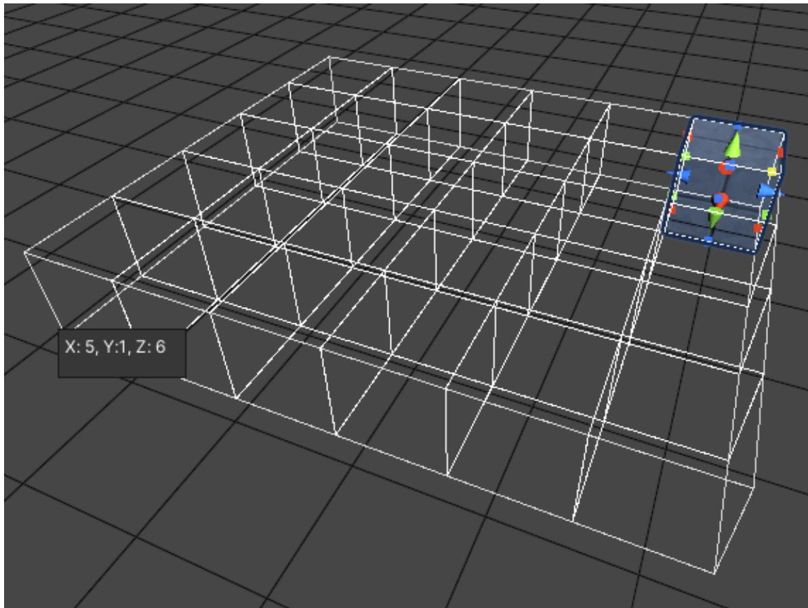

挤出后，由此产生的对象将被添加到选择中。这允许您“链接”挤出操作。

在下图中，对象首先沿红轴挤压，然后整个结果沿蓝轴挤压：

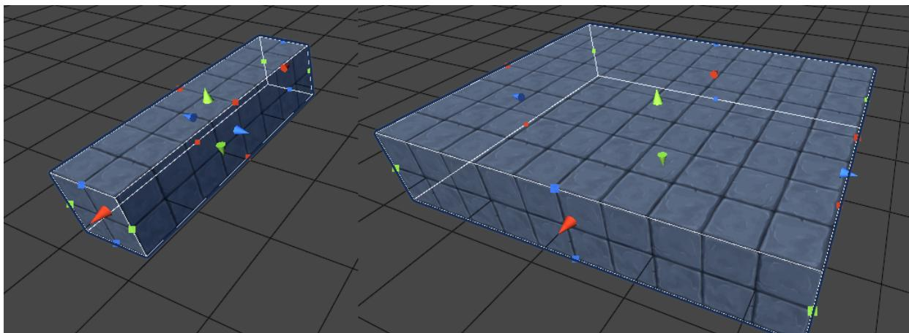

## 不可选择的对象

无法使用选择工具选择以下对象：

- 不满足类型过滤条件的对象；  
- Gspawn 游戏对象；  
- 属于禁用拾取的图层的对象：

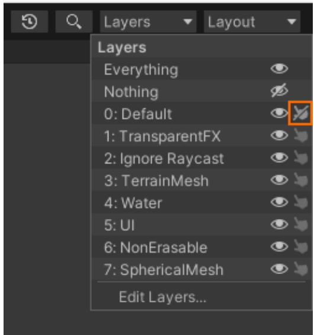

- 在层次结构窗口中禁用拾取的对象：

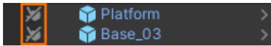

- 平铺规则网格的子级；

## 选择转移

该插件维护自己的选定对象列表。有时，使用插件界面选择一堆对象然后将选择传输到 Unity 的选择界面可能会很有用，反之亦然。例如，您可能希望修改组件属性，而这只能使用 Unity 的标准接口来完成。

您可以按  $[\mathbf{ALT} + \mathbf{T}]$  快速执行此传输操作。

## 对象擦除

对象擦除模式允许您使用不同的擦除工具擦除场景中的对象。

注意：属于平铺规则网格的对象无法被删除。

要激活此模式，请单击主工具栏左侧的第三个按钮或只需按键盘上的 [3]：

## 擦除工具

可以使用以下擦除工具：

- 擦除光标 [SHFIT + 1] - 使用鼠标光标擦除对象；  
- 2D 擦除笔刷 [SHIFT + 2] - 使用 2D 圆形笔刷擦除对象；

- 3D 擦除笔刷 [SHIFT + 3] - 使用 3D 圆形笔刷擦除对象；

您可以从 UI 更改擦除画笔的半径，也可以使用 [CTRL + 滚轮] 达到相同目的。

当您想要快速删除特定区域中的大量对象时，光标和 2D 画笔非常有用。

3D 画笔非常适合清理地形上的区域，甚至地板或墙壁。例如，您可能有一个关卡区域，其中的平坦墙壁上包含一系列装饰。您可以将刷子放在墙上并拖动它来清理该区域。

下图显示了使用擦除画笔擦除一堆道具的示例：

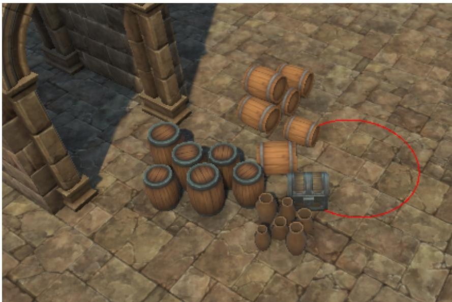

与散布画笔生成工具结合使用时，3D 画笔也非常有用。

## 擦除蒙版

有时您可能想防止某些对象被删除。这是通过屏蔽它们来实现的：

- 切换到选择模式；  
- 选择您想要遮盖的对象；  
- 切换到擦除模式；  
- 单击“蒙版选定”按钮：

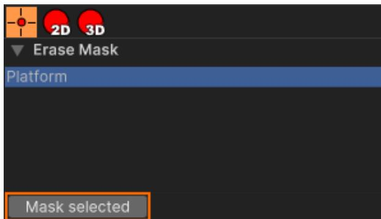

选定的对象将添加到“擦除蒙版”列表中，如上所示。在此示例中，一个名为 Platform 的单个对象被屏蔽。

## 不可擦除的对象

无法使用擦除工具擦除以下对象：

- 蒙版物体；  
Gspawn 游戏对象；  
- 属于已标记为不可擦除的图层的对象；  
- 地形网格物体；  
球形网格物体；  
- 在层次结构窗口中禁用拾取的对象：

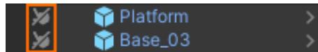

对象组；  
- 平铺规则网格的子级；

## 擦除剔除平面

光标和 2D 画笔工具支持称为擦除剔除平面的功能。这可以用于您想要删除一堆对象但忽略它们后面的对象的情况。

您可以通过两种方式启用剔除平面：

- [转移];

或者

- 检查检查器中的默认启用剔除平面字段。在这种情况下，[SHIFT]将禁用剔除平面（即反向工作）；

注意：剔除平面适用于简单的对象（例如图块），但不适用于更不规则的网格，因为这些网格可能有许多不同的三角形指向各种方向，并且在这种情况下预测剔除平面变得更加困难。

## 擦除高度

使用 3D 画笔时，您可以指定一个高度值，该高度值实际上会将圆形变成圆柱体。这对于擦除稍微高于画笔所在表面的物体非常有用。它是一种容差值。

可以看到一条垂直线从画笔中心伸出并沿着圆平面法线延伸。这充当高度的指标：

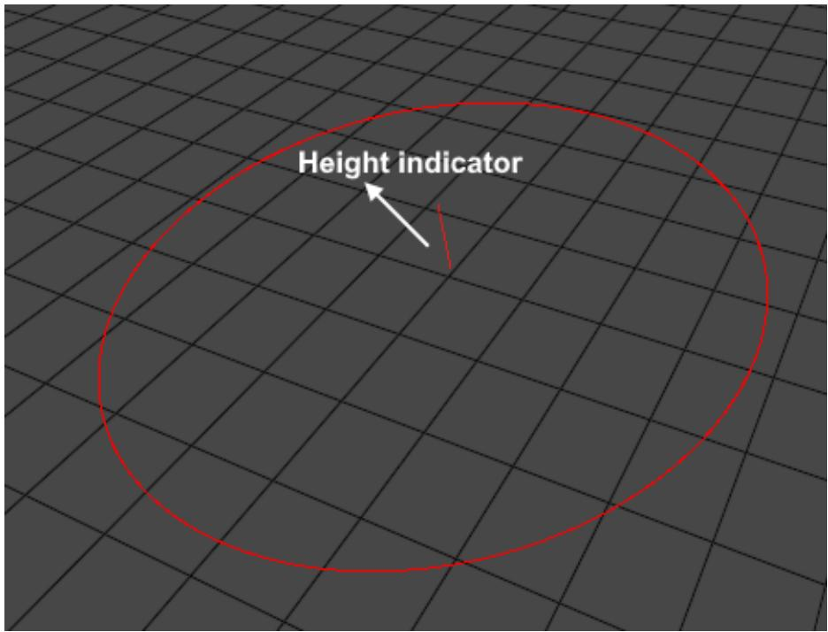

## 对象组

对象组是组织场景的好方法。您可能希望将场景组织成更符合逻辑的结构，而不是在根级别生成对象。

对象组只是一个场景对象，充当子对象的容器，可用于按类别组织对象。

例如，可以使用以下对象组层次结构来组织场景：

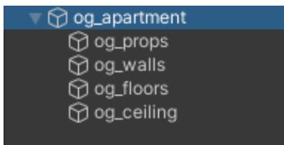

这只是一个示例，但此层次结构可用于创建公寓场景。 Prop 对象可以进入 ogprops 组，地板可以进入 og_floors 等。

注意：og_ 前缀只是一个约定。您可以根据需要命名对象组。但是，对象组不能有重复的名称。如果您尝试使用已使用的名称创建对象组，插件将在该名称后附加后缀。

## 创建对象组

打开“工具”>“GSpawn”>“窗口”>“对象组...”

屏幕上将出现以下窗口：

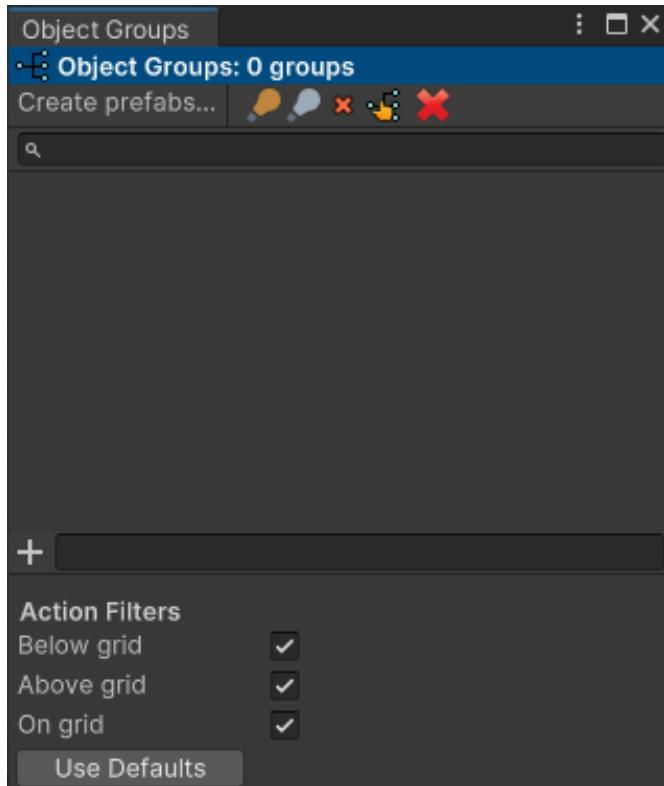

创建对象组的一种方法是在底部文本字段中输入名称，然后按其旁边的加号图标。

另一种方法是使用 Unity 的界面创建空对象（例如，在层次结构窗口中右键单击并按“创建空对象”），然后将这些对象拖放到对象组窗口内。下图显示了将前面讨论的对象组层次结构拖放到对象组窗口中后的同一窗口：

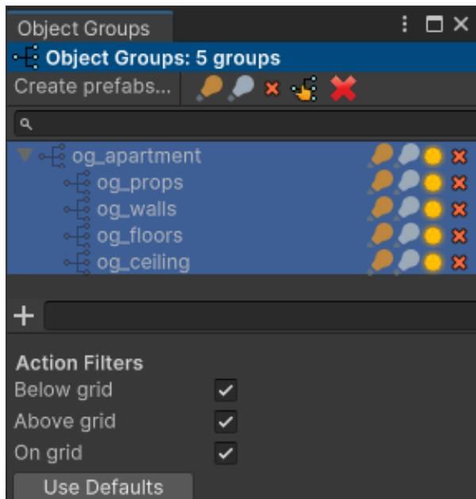

在此示例中，首先在层次结构窗口中选择 og_apartment 组及其所有子项，然后将其放入对象组窗口中。如果仅选择 og_apartment，则其子项将不会添加到对象组窗口中，并且它们不会被识别为对象组。

## 删除对象组

要删除对象组，请在“对象组”窗口中选择它们，然后按

[删除]。这不会删除场景对象。它只是告诉插件停止将它们视为对象组。

如果您还想删除场景对象，请按顶部工具栏中的红色 X 按钮。这也将删除场景对象。

注意：建议避免使用 Unity 界面删除对象组（例如，在层次结构视图中选择它们并从那里删除它们）。这可能会导致控制台窗口中出现错误。

## 对象组操作

在每个对象组的右侧，可以使用以下按钮执行不同的操作（从左到右）：

- 激活对象组子对象；  
- 停用子对象组；  
- 在层次结构窗口中突出显示对象组；  
- 删除直接子级（仅删除非对象组子级）；

顶部工具栏还有一些可用的操作：

- 创建预制件... - 打开一个新窗口，允许您从每个顶级对象组创建预制件。在此示例中，将为整个 og_apartment 层次结构创建一个预制件。当必须在多个场景中使用相同的对象组层次结构时，这一点非常有用；  
- 激活/停用选定的对象组；  
- 删除选定对象组的子对象；  
- 将选定的对象分配给选定的组；  
- 删除选定的对象组 - 当使用[DELETE]键从对象组窗口中删除对象组项时，对象不会从场景中删除。该插件只是停止将它们视为对象组。但是，按下此按钮也会从场景中删除对象；

在某些类型的关卡（例如公寓或多层环境）上工作时，激活/停用对象组非常方便，因为它允许您切换场景不同部分（例如地板、墙壁等）的可见性，以使某些区域更易于访问。

## 动作过滤器

在“对象组”窗口的底部，有一个名为“操作过滤器”的 UI 部分。这些过滤器适用于每个对象组右侧的激活/停用子按钮。

过滤器在处理多层环境的情况下非常有用。例如，您可能有一个名为 og_floors 的对象组，其中包含场景中的所有地板对象。假设您正在构建的环境有 3 层。您可能希望将道具放置在第二层，但隐藏第一层和最后一层以增加可见性。为此，您可以按照以下步骤操作：

- 按住  $[\mathbf{G}]$  并左键单击第二层的对象。这将捕捉网格，使地板放置在网格表面上；  
- 在“对象组”窗口中，取消选中“在网格上”开关，然后按“楼层”组右侧的“停用组子项”按钮：

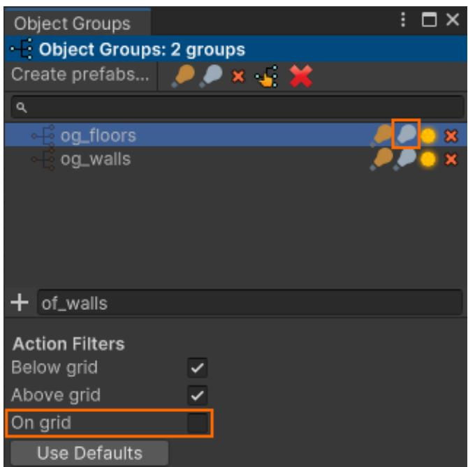

这将停用场景中位于网格下方或上方的所有地板对象。位于网格表面上的那些不会受到影响，您现在可以根据需要使用它们。

## 将对象组链接到预制件

创建对象组后，必须将预制件链接到对象组。这将确保每当生成预制件时，该对象都会成为链接对象组的子对象。

确保“对象组”和“预制件管理器”窗口均已打开。

接下来，请按照下列步骤操作：

- 在预制件管理器中选择预制件；  
- 将预制件拖放到对象组窗口中的对象组项目之一上，或者将对象组拖放到选定的预制件上；

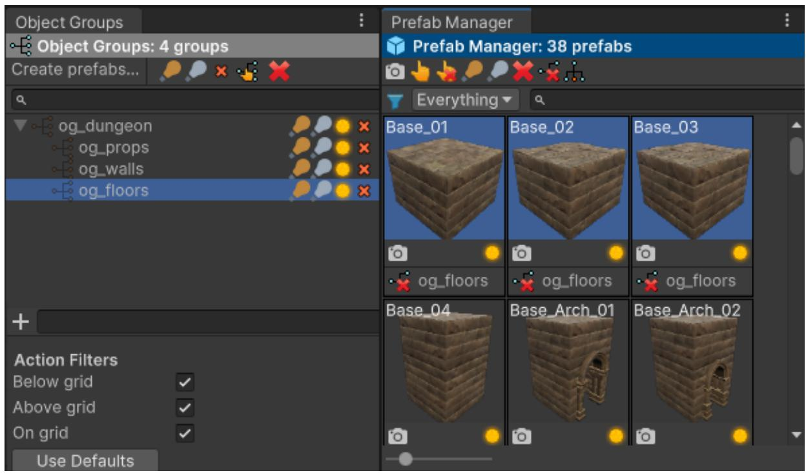

在上图中，在预制件管理器中选择了 3 个预制件，并将 og_floors 对象组分配给这些预制件。当预制件链接到对象组时，对象组的名称将显示在预制件预览下方。您可以按群组名称左侧带有红色 X 的小按钮来取消链接。

此时，这 3 个预制件已附加到 og_floor 对象组，并且每当它们在场景中生成时，它们都会成为该对象的子对象。

在“预制件管理器”窗口的顶部工具栏中，您可以看到以下按钮（以及其他按钮）：

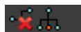

第一个按钮将取消所有选定预制件与其对象组的链接。

第二个按钮可用于您可能已在场景中生成预制件并决定稍后创建对象组的情况。它将指定选定预制件的实例作为链接对象组的子项。如果选定的预制件未链接到对象组，它们将附加到默认组（如果有）。如果没有可用的默认组，它们将驻留在场景根目录中。

注意：使用“平铺规则生成”工具时，预制件将始终附加到平铺规则网格，即使它们链接到对象组也是如此。

## 默认对象组

当您处理不希望分配给任何特定对象组的预制件，但同时又不希望它们驻留在场景根目录中时，默认对象组非常有用。

在这种情况下，创建一个新的对象组，然后左键单击对象组窗口中项目左侧的图标：

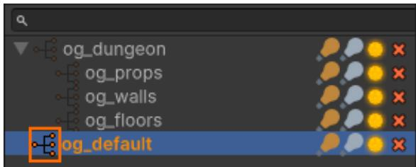

上图显示了一个已标记为默认对象组的新对象组。

从现在开始，任何未链接到对象组的预制件都将附加到 og_default。

如果您希望取消某个组的默认组标记，可以再次单击突出显示的按钮。该按钮的作用类似于切换开关。

注意：每个场景只能有一个默认对象组。

## 对象组和多个场景

场景之间不共享对象组。当您将对象组链接到预制件时，这些链接仅存在于发生链接的场景中。当切换到新场景时，您将必须创建新的对象组并再次链接。

注意：请勿在场景之间移动对象组。不支持此功能。

您可以采取以下两件事来加快此过程：

- 使用“对象组”窗口中的“创建预制件...”按钮。这将允许您在不同场景之间复制对象组层次结构。创建新场景时，实例化预制件并将创建的层次结构拖放到“对象组”窗口中；  
- 在将组链接到预制件方面，有一种方法可以重用以前场景中的链接。仅当在场景之间使用相似的对象组层次结构时，这才有用。打开预制件库窗口：

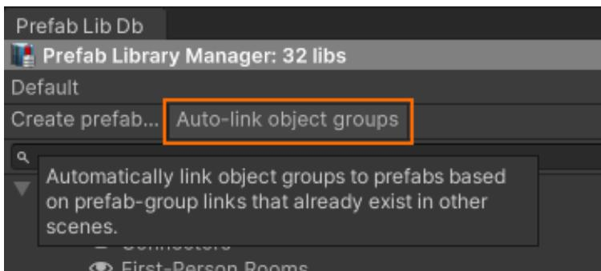

现在单击“自动链接对象组”按钮。这将遍历所有库中的所有前缀，并将每个预制件链接到一个名称与另一个场景中存在的组之一匹配的组。

同样，最后一点仅在使用类似的对象组层次结构时才有效。否则，您将必须手动链接。

您可以做的是创建一个“通用”对象组层次结构，其中包含将在所有场景中使用的所有对象组。例如：

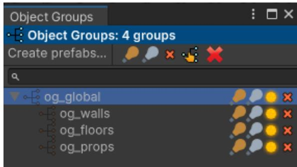

通过这种安排，当您单击“自动链接对象组”时，预制件将始终链接到有效的组（前提是一开始就分配了一个组）。

## 对象层

打开工具 > Gspawn > 窗口 > 对象层...

这将弹出以下窗口：

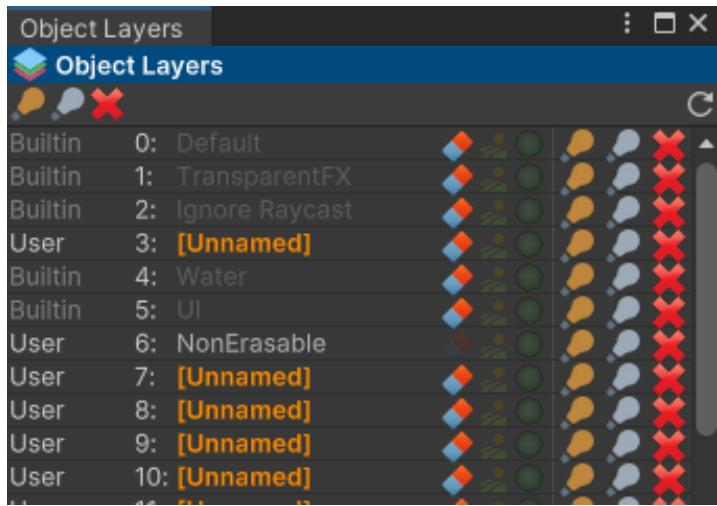

这是 Unity 允许您使用的所有图层的列表。不同之处在于，每一层都有一些与其关联的属性和操作。

图层名称右侧的第一列图标允许您控制图层属性：

- 可擦除切换 - 如果打开，则可以使用擦除工具擦除属于这些层的对象。在上图中，除了名为 NonErasable 的图层之外，所有图层都是可擦除的。您可以看到它的橡皮擦图标呈灰色。  
- 地形网格 - 如果打开，属于该层的对象将被视为地形网格；  
- 球形网格 - 当然，属于该层的对象被视为球形网格；

第二列图标允许您执行某些操作，例如激活、停用和删除属于相应图层的对象。

您可以通过双击列表中的图层项目来更改图层名称。 [ENTER] 提交或 [ESCAPE] 取消。

您有时可能需要使用存储为网格资源而不是常规 Unity Terrain 的地形。例如，也许您使用建模包来创建自己的地形。插件需要知道何时出现这种情况，以确保某些类型的功能按预期工作（例如表面捕捉）。

为了告诉插件必须将网格对象视为地形，您必须执行以下步骤：

- 将地形对象分配给特殊图层；  
- 将该图层重命名为有意义的名称（例如 TerrainMeshes）；  
打开工具 > Gspawn > 窗口 > 对象层...  
- 将图层（在此示例中为 TerrainMeshes）标记为地形网格图层：

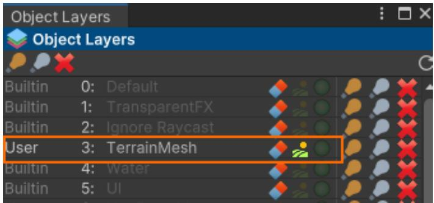

## 地形上轴

Unity Terrains 始终使用世界上轴作为其上轴。如果您的地形使用不同的轴，您必须遵循以下步骤：

- 选择地形网格对象；  
- 将其在所有轴上的旋转设置为 0；  
- 地形的山丘现在将沿着世界轴之一指向。假设它们指向负 Z 轴；  
- 打开“编辑”>“首选项...”并在左侧窗格中找到“GSpawn”项目层次结构；  
- 单击对象子项：

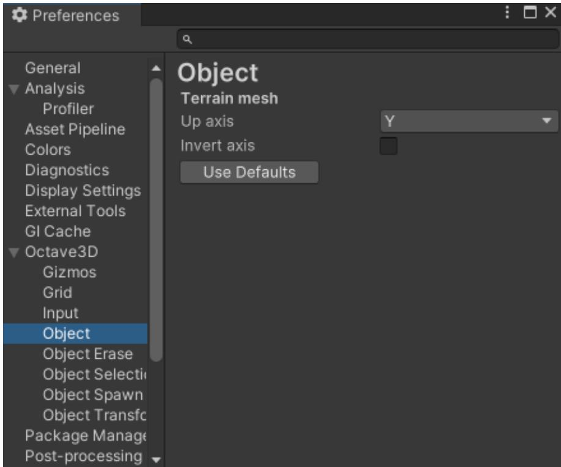

- 默认情况下，上轴设置为 Y。将其更改为 Z；  
- 检查反转轴，因为在本例中我们假设山丘指向负方向  $Z$  轴;

此时，您可以根据需要旋转地形对象并将其与表面捕捉一起使用。

## 球形网格

如果您希望创建将对象放置在球体顶部的场景，则需要将这些球体对象标记为球形网格。这允许插件在球体表面正确捕捉对象。

为了告诉插件必须将网格对象视为球体，您必须执行以下步骤：

- 将球体对象分配给特殊层；  
- 将该层重命名为有意义的名称（例如 SphericalMeshes）；  
打开工具 > Gspawn > 窗口 > 对象层...  
- 将图层（在此示例中为 SphericalMeshes）标记为球形网格图层：

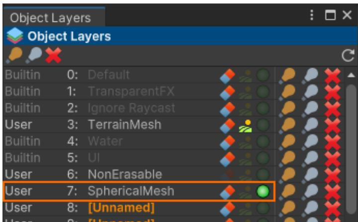

为了减少绘制调用，您可以组合共享相同材质的网格。打开工具 > Gspawn > 窗口 > 网格合并...

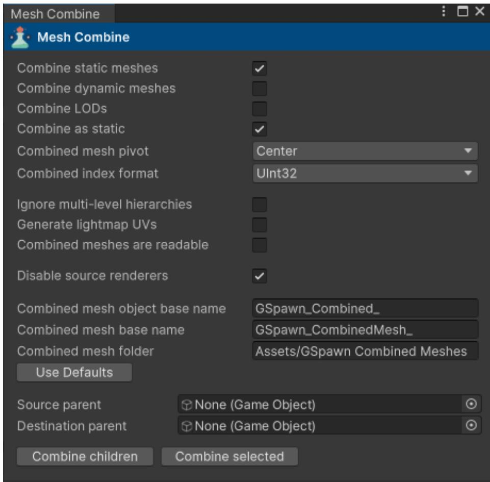

下面讨论这些字段：

- 组合静态网格物体 - 如果您希望忽略与已标记为静态的对象关联的网格物体，请取消选中此选项；  
- 组合动态网格体 - 如果您希望忽略与已标记为动态的对象关联的网格体，请取消选中此选项；  
- 组合 LOD - 如果选中，具有 LOD 的网格体也将参与组合过程。如果您想忽略 LOD 网格，请不要选中此选项。选中此字段后，将出现一个新字段，允许您选择要选择用于烘焙的 LOD 索引；  
- 组合为静态 - 如果选中，组合后的网格对象将被标记为静态；  
- 组合网格枢轴 - 允许您选择组合网格的枢轴；  
- 组合索引格式 - 允许您指定组合网格索引的索引格式（16 位与 32 位）；  
- 忽略多级层次结构 - 如果选中，则仅组合独立对象。这些对象没有父对象，也不是任何其他对象的子对象；  
- 生成光照贴图 UV - 如果您正在使用光照贴图，请选中此项；  
- 组合网格是可读的 - 如果您希望从脚本读取组合网格数据，请选中此项；  
- 禁用源渲染器 - 如果选中，则当网格组合过程完成时，将禁用原始网格对象的网格渲染器；

- 组合网格对象基本名称 - 对于每个组合网格，插件将创建一个网格将附加到的游戏对象。这是对象名称的前缀。插件会在末尾添加材质名称以及数字，例如 01；  
- 组合网格体基本名称 - 每个组合网格体都保存为资产，这是网格体资产的名称前缀。该插件将添加材质名称和哈希值；  
- 组合网格文件夹 - 这是保存所有组合网格的文件夹的名称。  
- 源父对象 - 这是包含要组合的网格的父对象。使用对象组时，您可能希望指定顶级对象组以确保共享相同材质的所有网格都组合在单个网格中：  
- 目标父对象 - 这是将容纳所有组合网格对象的父对象：

按“合并子对象”可合并“源父对象”的所有子对象，并将结果存储在“目标父对象”中。

按“组合所选”仅组合所选对象并将结果存储在“目标父级”中。

## 数据文件夹

当您安装插件时，将在 Gspawn - Level Designer 文件夹内创建一个 Data 文件夹。这是所有数据以资产形式存储的地方，这种安排允许您切换到不同的场景而不会丢失数据。

该文件夹必须存在于项目中才能使插件能够运行。如果您决定删除数据文件夹，您将在屏幕上看到以下消息：

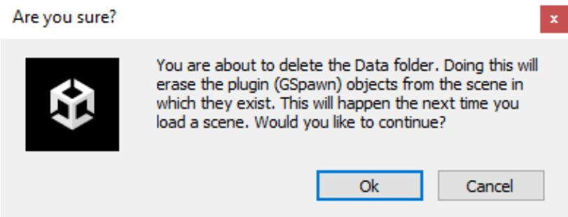

如果您按“确定”，则下次加载这些对象存在的场景时，所有插件对象（GSpawn 对象）都将被删除。

## 导出数据

尽管属于同一项目的场景之间的数据得到维护，但一旦开始新项目，所有数据都将丢失。但是，您可以将数据导出为 Unity 包并将该包导入到新项目中。

打开工具 > Gspawn > 窗口 > 导出数据...

屏幕上将出现以下窗口：

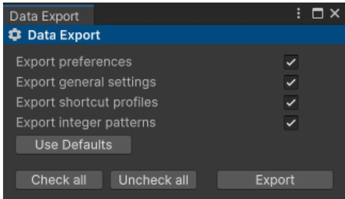

这些开关允许您指定要导出的数据。其中大多数都是不言自明的，也许导出常规设置除外。这是指您可以在检查器 UI 中看到的大多数设置。以下是一些示例：

- 模块化捕捉设置（生成模式或选择模式）；  
- 表面捕捉设置（生成模式或选择模式）；  
- 镜像小工具设置（生成模式或选择模式）；  
- 选择设置；  
- 删除设置等；

您不能导出以下内容：

- 预制库配置文件；  
- 对象组；  
曲线；  
- 擦除蒙版；  
- 引用资产或场景对象的任何其他数据；

## 提示和陷阱

- 不要将对象组附加到可以擦除的对象（例如网格、精灵等）。这可能会导致使用擦除画笔时意外删除对象组。相反，尝试确保所有对象组要么作为其他组的子对象附加，要么根本没有父对象；  
- 不要在不同场景之间移动对象组。该插件使用全局 id 在内部存储它们，当对象移动到不同的场景时，该 id 似乎会发生变化。这可能会导致意想不到的结果；  
- 组合网格时，如果选中“生成光照贴图 UV”切换，则网格组合过程可能会很慢。如果您看到进度条在某个时刻卡住，请不要误认为插件崩溃了。如果你稍等一下，你会看到进度条又恢复了活力；  
- 组合网格时，按“组合子项”或“组合所选”按钮有时会显示一个消息框，显示“没有组合网格”。发生这种情况时，您应该检查组合静态/动态网格体字段。如果两者均未选中，则没有对象可以参与组合过程。此外，例如，您可能只处理静态网格物体，但未选中“组合静态网格物体”字段。与动态网格相同；

- 如果您在“环境”选项卡内的“照明”窗口中使用天空盒材质，则预制件预览将受其影响。如果这会影响预制件的质量，您应该禁用天空盒材质，从“工具”>“GSpawn”>“操作”>“刷新预制件预览”重新生成预制件预览，然后再次启用天空盒材质。如果您发现自己经常添加和删除预制件，则可能必须禁用天空盒材质，直到完成场景的工作；  
- 使用 **Curve Spawn** 时，不使用多个车道，有时使用由以不同配置排列的多个对象制成的预制件（例如，包含捆绑在一起的几棵不同大小的树的预制件）有时可能会产生更好的结果。同时，尽量保证单个预制件覆盖的面积不要太大。大型物体并不总是正确地投影到地形等表面上，尤其是在存在陡峭表面的情况下；  
- 更改颜色空间时，控制台可能会充斥着有关无效渲染纹理格式的警告消息。为了解决这个问题，请切换到播放模式并返回。无论这些警告是否出现，当您更改颜色空间时，您始终必须刷新预制件预览。为此，请单击“工具”>“GSpawn”>“操作”>“刷新预制件预览”；

## 已知问题

- 有时您无法再使用窗口滚动条。发生这种情况时，请调整拥有滚动条的窗口的大小。滚动条现在应该可以正常工作了。如果仍然不起作用，请切换到播放模式并返回；  
- 如果您是一名程序员，您会经常编译脚本。脚本重新编译后，您可能无法再移动场景视图相机或执行其他类型的操作。如果发生这种情况，只需单击 UI 项目（例如层次结构视图中的项目）。这将解决问题；  
- 保存场景时，您有时可能会在控制台中看到以下消息：

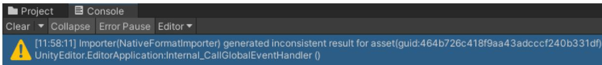

不过，这似乎并不影响任何事情。这似乎是 Unity 中的一个已知错误。更多信息请点击这里。