更好的动画活动

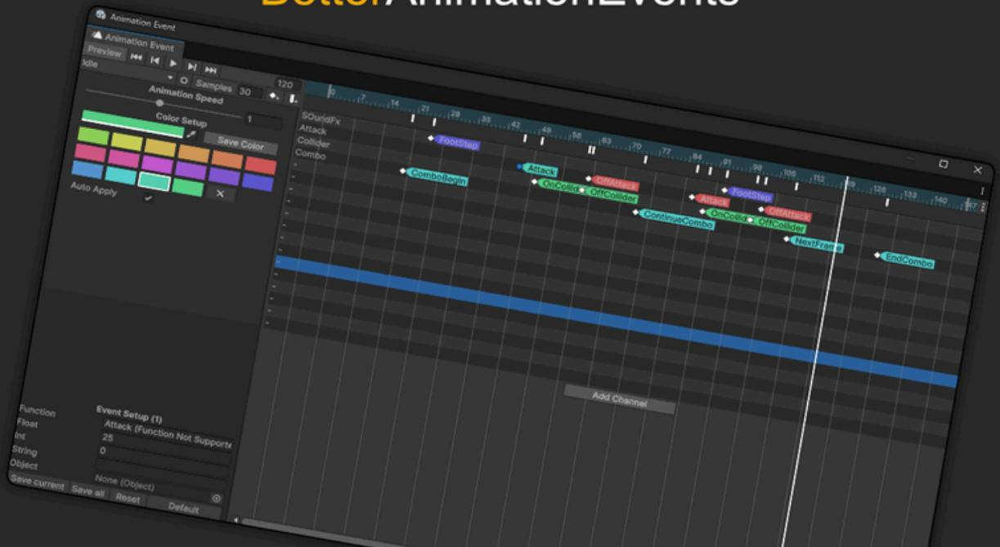

感谢购买

如果您有任何问题或反馈，请联系我们！

# 入门

打开窗口/动画/动画事件

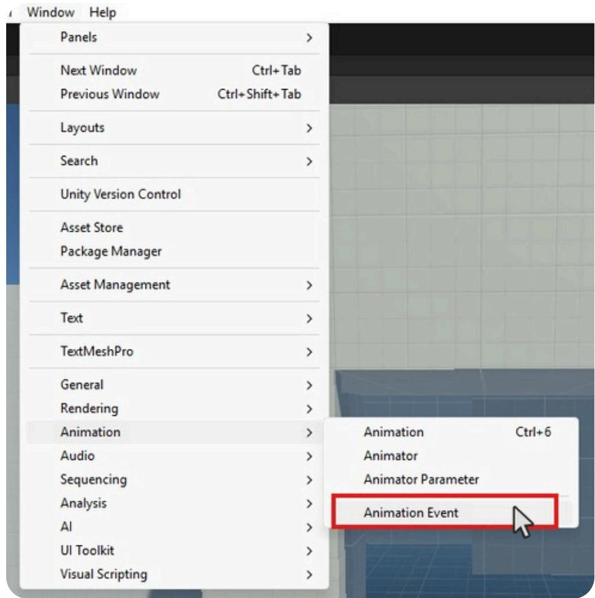

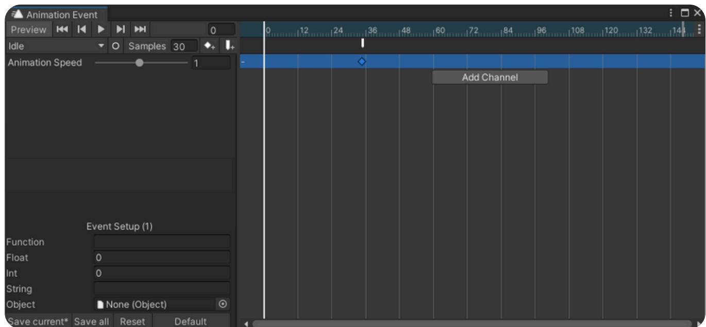

（如果已选择动画器，该工具将在加载时自动检测它）

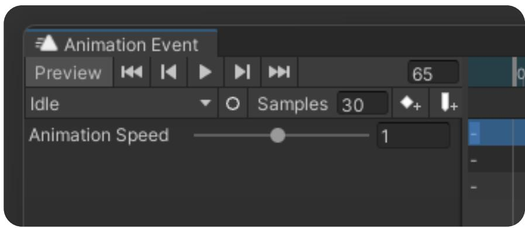

控制菜单的工作方式与 Unity 的原生动画编辑器类似，但具有一些额外功能

选择一个具有动画器的游戏对象，该动画器在层次结构中具有动画控制器

选择要编辑的动画剪辑

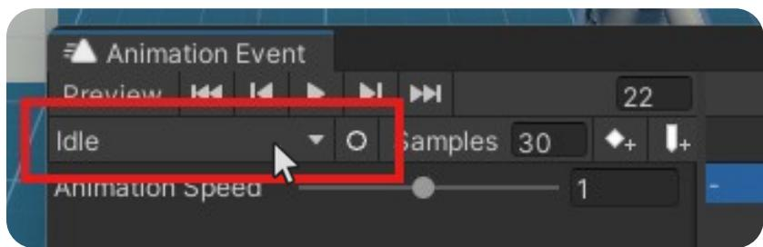

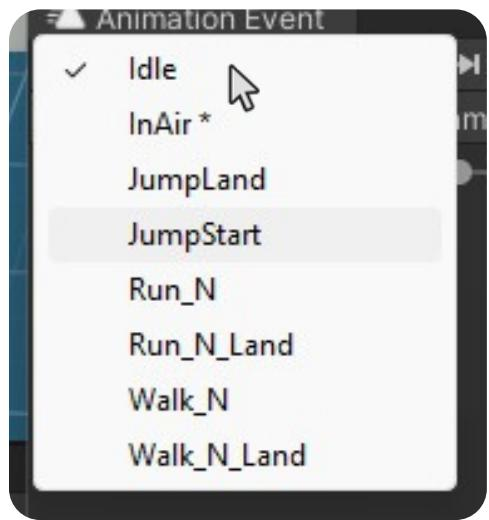

# 添加事件

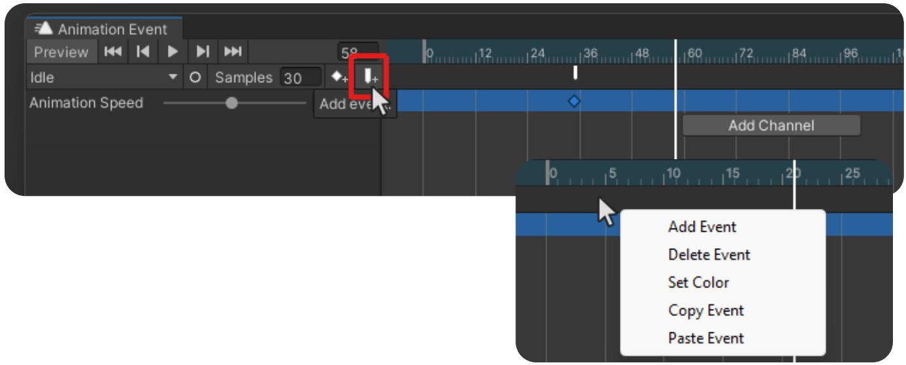

这将在选定的帧上添加一个事件，或者右键单击该栏将显示选项菜单。

# 设置活动

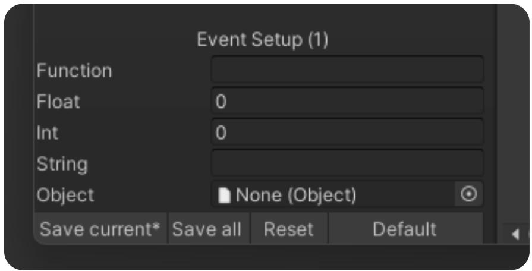

定制活动。

# 保存事件

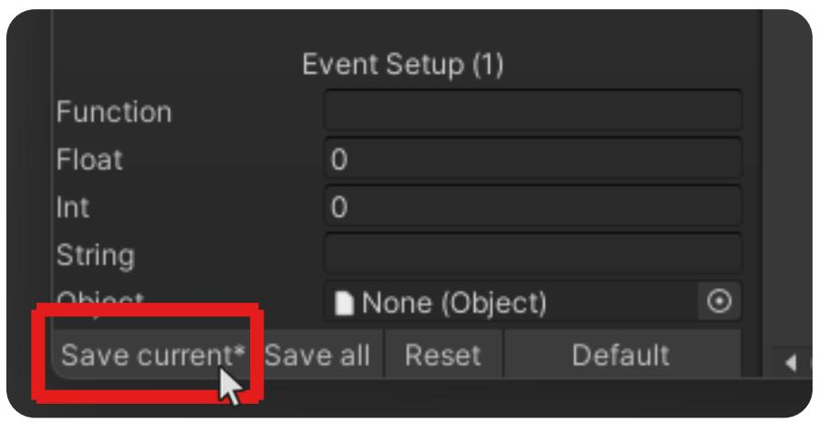

这将覆盖原始动画剪辑事件

（“*”表示当前剪辑是否已保存）

# 保存所有事件

它将保存列表中的所有动画剪辑。

# 重置事件

它将把当前剪辑中的所有事件编辑和通道恢复到原始状态。

单击“默认”以更改“事件设置”窗口

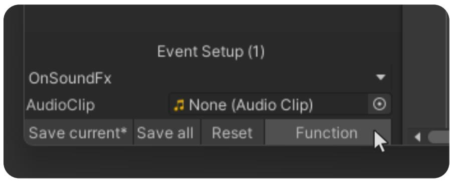

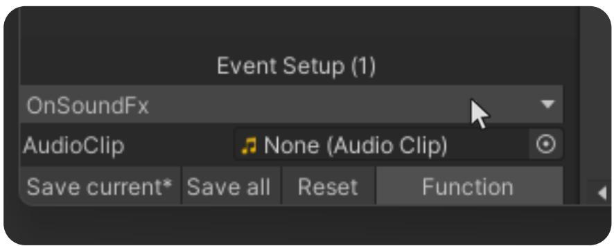

您可以在此处选择附加到动画师游戏对象的脚本中可用的功能

# 动画速度

控制动画速度

动画速度

1

您还可以使用动画曲线通过在菜单选项上切换来控制速度

动画速度

秒数

镜框

显示采样率

设置采样率

显示悬停信息

显示所有剪辑

显示姓名标签

使用曲线计算速度

# 颜色设置

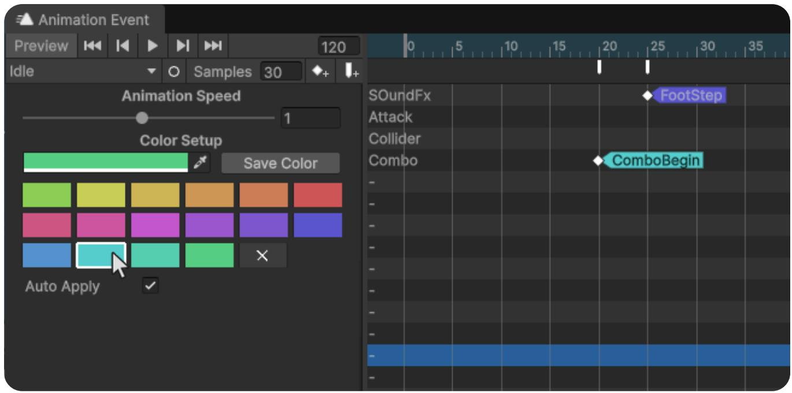

创建自定义颜色并将其应用到动画事件以使轨道更易于阅读和组织

选择动画事件并单击以着色。自动应用会将选定的颜色应用到新的动画事件

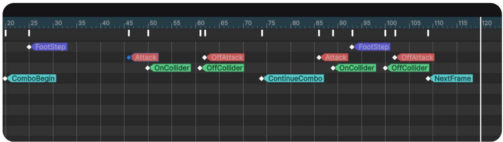

# 频道设置

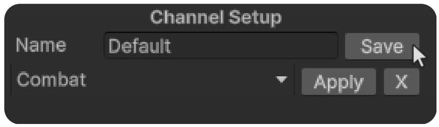

通过手动修改通道并单击“保存”来创建模板。

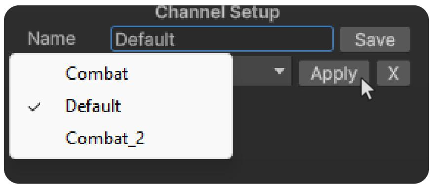

您可以在此处选择要应用于当前所选剪辑的模板。

# 时间轴

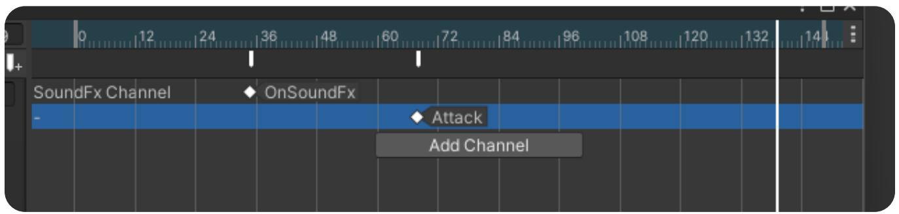

您可以像在 Unity 的原生动画编辑器中一样进行平移和缩放

# 添加频道

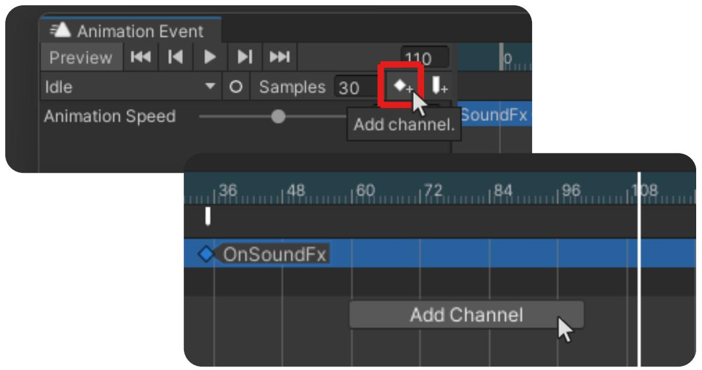

双击任意通道为其命名或右键单击显示选项菜单

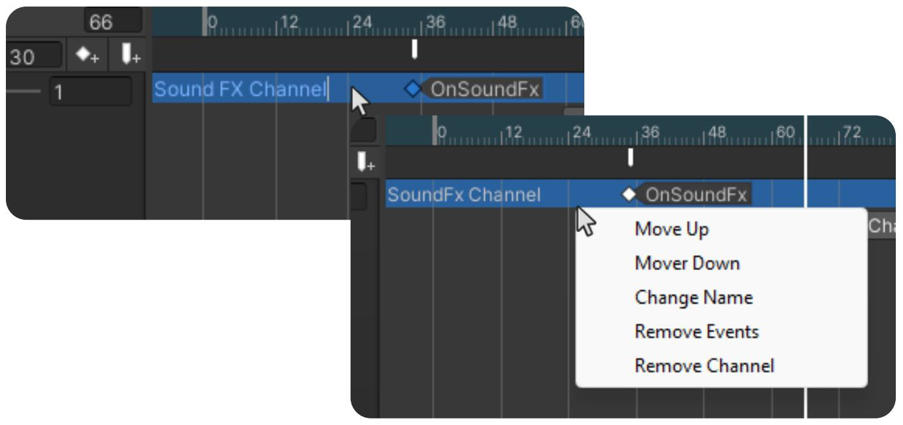

# 事件多重选择

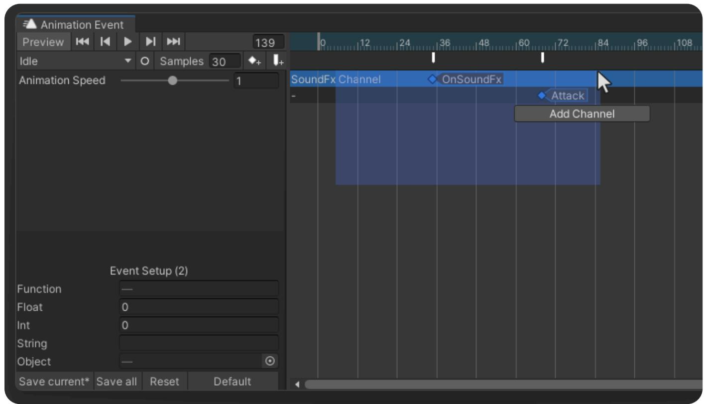

通过多重选择，您可以轻松地同时编辑多个事件。

# 取消选择事件

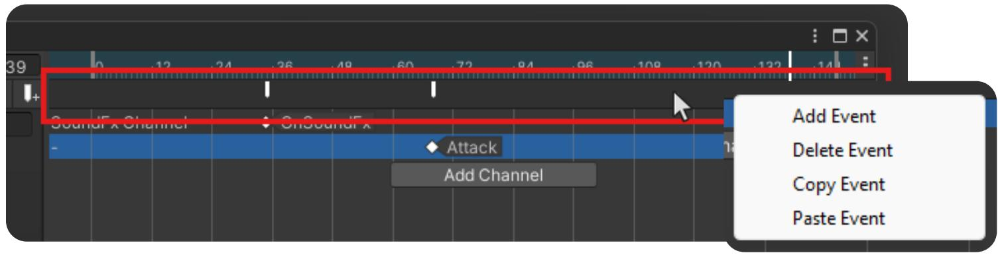

单击显示的栏将取消选择所有选定的事件

右键单击将显示事件选项

# 快捷方式

使用“左键单击”拖放选定的事件。

使用滚轮放大或缩小时间轴。

单击鼠标中键并拖动以平移时间线。

按“F”使整个动画剪辑适合时间线。

按“删除”可删除一个或多个事件。

使用“Ctrl+C/V”复制并粘贴事件。

使用“左移”选择或取消选择事件。

# 附加功能

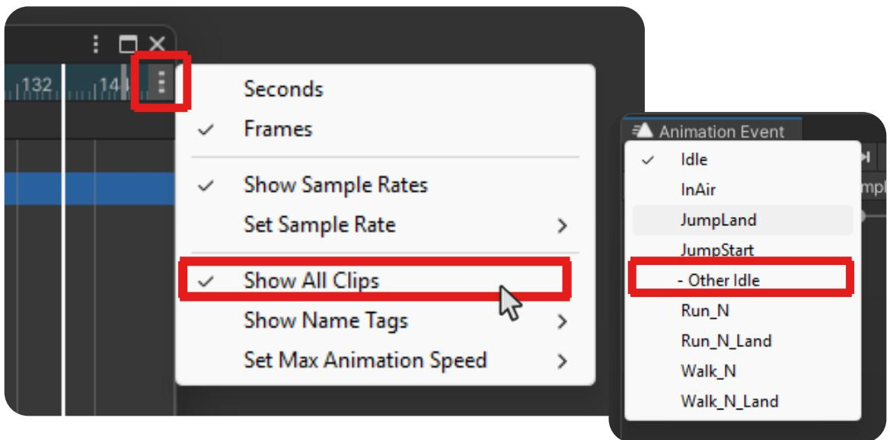

显示所有剪辑

此切换将切换为显示所有先前选择的动画师的所有动画剪辑，并用“-”标记它们

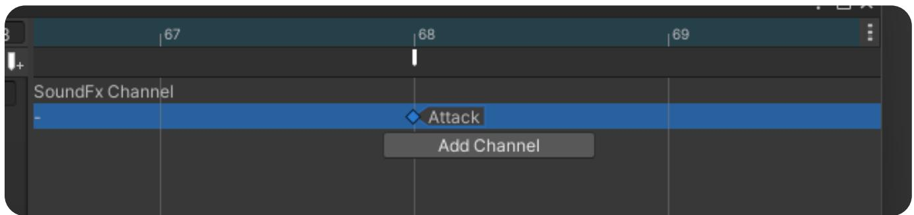

# 快速变焦

按 F 将放大所选事件

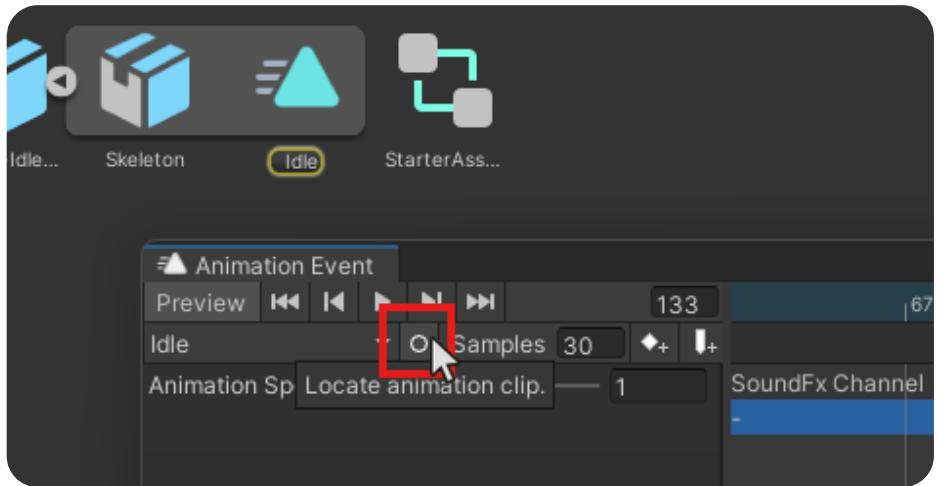

# 定位动画剪辑

它将在文件夹中找到动画剪辑

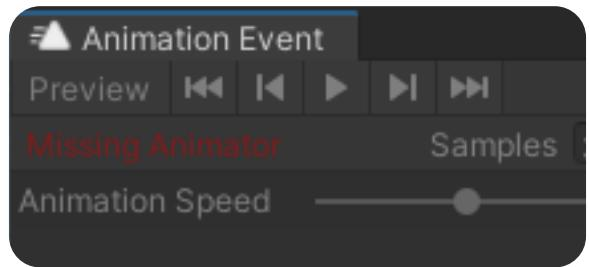

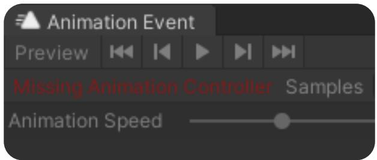

# 警告

# 失踪的动画师

在层次结构中使用 Animator 选择游戏对象

# 缺少动画控制器

确保 Animator 有动画控制器

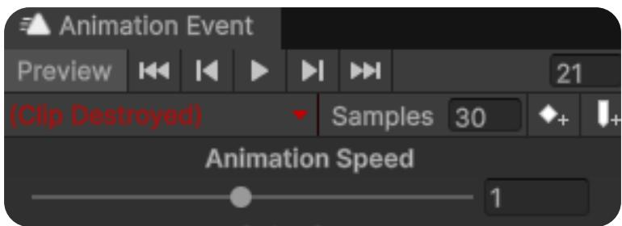

# 剪辑损坏或丢失

选择一个剪辑以继续编辑。