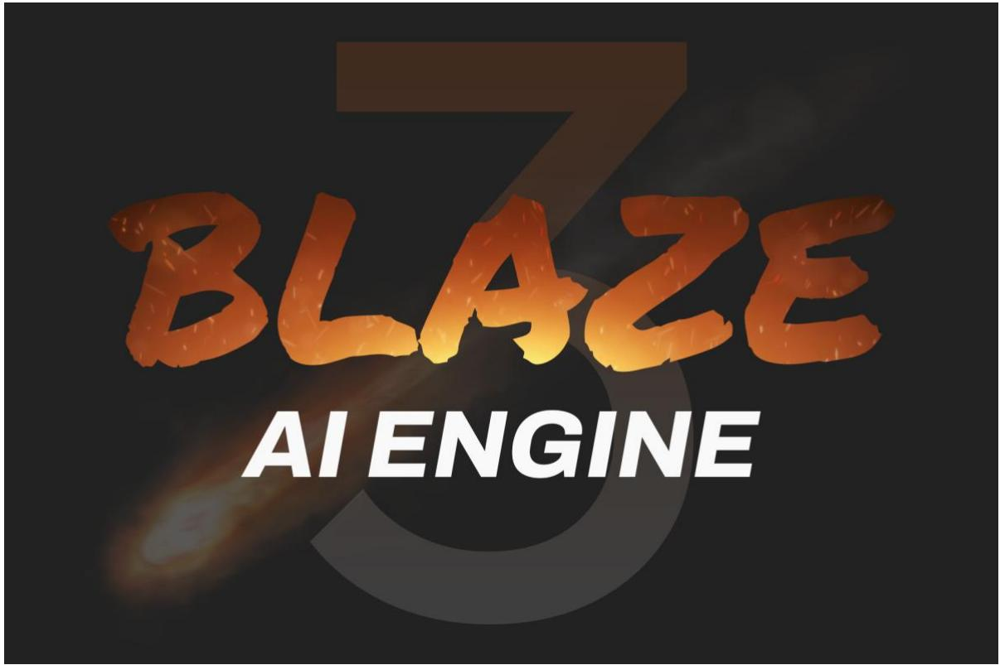


# Blaze AI 文档

如有任何问题和支持，请访问 Discord 或者您可以直接给我发电子邮件：pathiralgames@gmail.com

Blaze AI 特定 Discord 服务器位于此处

在此处查看 Pathiral 的更多资产

入门第 3 页

动画......第7页

音频......第9页

视觉和探测敌人。第11页

设置近战/远程 AI 第 16 页

设置掩护射手 Al 。第20页

为 Cover Shooter Al 设置封面......第 24 页

警报层和对标签的反应......第 28 页

打到第30页

健康第33页

死亡第35页

分心。第37页

距离剔除。第40页

同伴模式。第43页

公共属性和 API。第 47 页

添加剂 Blaze 脚本。第52页

行为的内部 API。第54页

转换行为/武器和逃跑 第 57 页

布娃娃 .... 第 62 页

目标/玩家死亡 .... 第 70 页

离网链接/攀爬梯......第 71 页

备用状态（表情）.... 第 76 页

敌人经理......第79页

音频管理器....第 80 页

编写新行为......第 83 页

跟踪/调试 AI 状态 .... 第 85 页

Blaze AI 教程（由 Discord 用户创建：@hrohabil）|制造干扰

# 入门

1. 将空的 Plane 游戏对象添加到场景中。这将是人工智能行走的基础。

2. 现在确保选择了平面并添加组件 > Navmesh Surface - 您可能必须从包管理器下载 AI 包才能显示这些选项。添加组件后，按“烘烤”。

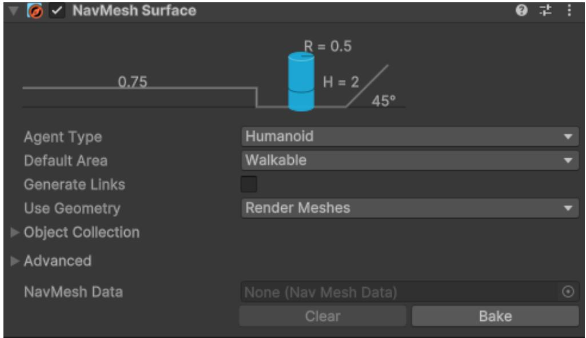


3. 用于在场景中添加障碍物。单击对象，添加组件 > 导航网格障碍，然后单击雕刻

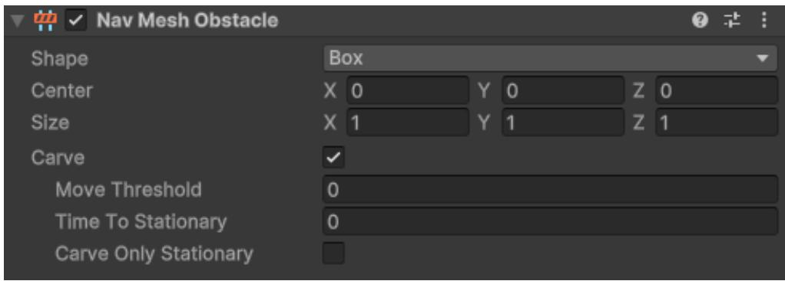


4. 将 Blaze AI 组件添加到您的角色游戏对象中。

5. 您会发现还添加了一些必需的组件。比如Animator和NavMeshAgent。

6. 单击“状态”选项卡，您将找到每个属性都需要脚本的属性。您也会在检查器的其他地方找到它。您还会发现“添加行为”按钮。单击它，它将自动添加默认行为并将它们设置为各自的属性。

# 添加行为

7. Blaze 为每个同名的状态属性提供了一个行为脚本。例如，“正常状态行为”属性具有“NormalStateBehaviour”脚本等。您还可以制作自己的自定义行为脚本并拖放至所需状态。

8. 在添加的正常状态行为组件上，通过添加空闲和移动的动画名称来设置属性 - 我们将在本文档后面介绍动画。在入门后的动画部分 - 以及所需的速度、音频等...

9. 现在返回 Blaze AI 检查器 > 常规选项卡 > 航点。默认情况下，启用随机化。随机化意味着不会读取航路点，而是人工智能将在每个周期生成一个新的随机点。换句话说，将在指定半径内随机巡逻导航网格。

10. 在常规选项卡的 Vision 类内。您可以通过将敌人的图层添加到“敌对和警报图层”中并将其标签名称添加到“敌对标签”中来设置敌人。另一方面，“要检测的层”是您设置障碍物以及希望视觉检测到的内容的位置。如果未设置图层，则将通过游戏对象看到它。敌方需要至少有一台对撞机。多个碰撞器也可以。有关此内容的更多信息，请参阅“添加敌人”部分。

按下播放键后，你会发现你的人工智能正在四处走动。

大多数属性上都存在工具提示。只需将鼠标悬停在任何属性上，就会弹出更多信息。

# 动画

在检查器内的某些部分，您会发现需要设置某个事物的 Anim 和 AnimT。像这些：

<table><tr><td>移动动画</td><td>行走</td></tr><tr><td>动画T</td><td>0.25</td></tr></table>

# 现在这些是什么意思呢？

让我们从简单的开始吧。 AnimT 是动画过渡时间。从当前动画到相关动画的时间量。

Anim 是动画名称。 Unity 引擎内部称为动画状态名称。这是哪个：

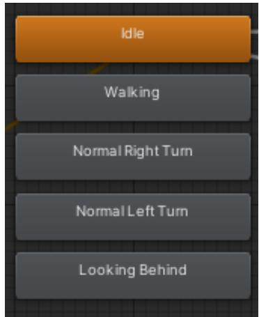


这是动画器中动画的名称。就是这样！

确保在需要循环的动画设置中启用循环，例如（空闲、跑步、行走等...）

必读：在 Blaze 的大部分部分中，此动画字段是一个弹出菜单，可自动读取动画制作器内的动画。因此，您只需选择即可，但请注意：1.弹出窗口仅读取子状态内的第一级嵌套动画。也就是说，您可以拥有任意多个不同的

您喜欢的子状态只是不要将子状态嵌套在子状态内。 2.弹出窗口仅读取200个动画，如果您想要更多，请输入BlazeAIEditor.cs脚本，搜索animationStateNamesArr并将数组大小设置为您想要的任何值。

您可以在 Animator 中更改动画状态名称，如下所示：

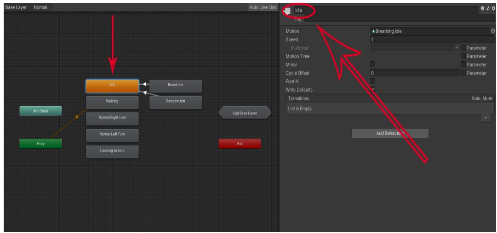


单击动画，然后更改右上角的名称。但是，请记住您已经更改了动画状态名称，因此您必须在 Blaze AI 中更改其名称以匹配动画器。

您不需要在动画之间进行转换。只需将动画拖/放到 Animator 中，然后根据需要组织它们，并在 Blaze 中写下它们的名称。就是这样！

# 音频

所有要在 Blaze 内播放的音频及其行为都设置在一个可脚本化对象内，该对象称为音频可脚本化。

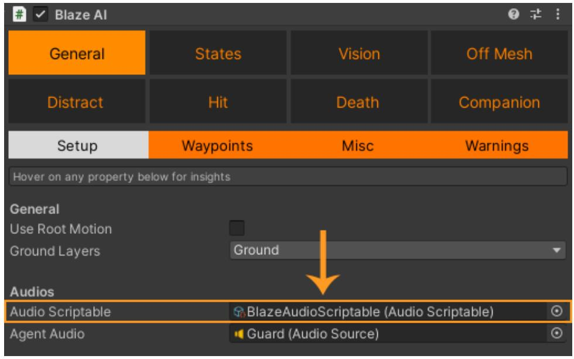


Blaze 提供了创建音频脚本并将音频剪辑设置为所有必要的状态和操作的选项。创建一个像这样的音频脚本：（在项目空间中右键单击）

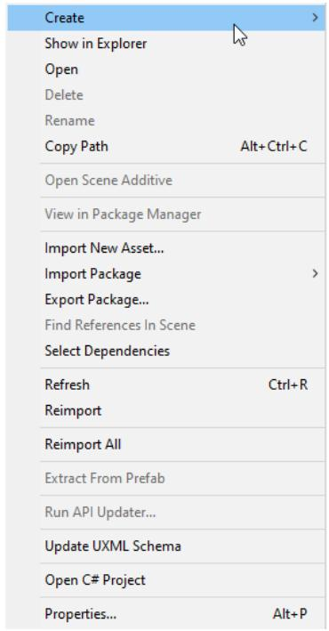


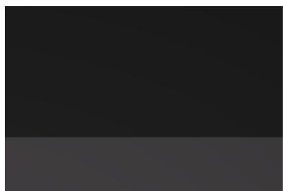


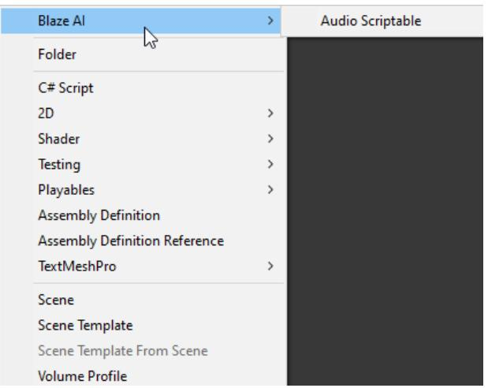


对于每个状态/操作，您可以添加无限数量的音频。当进行音频呼叫时，系统将在该状态下随机选择一个音频，如果只设置了一个，则将始终播放该音频。如果为空，则不会播放任何音频。

将播放所有音频剪辑的代理的中央音频在“代理音频”属性中自动设置。

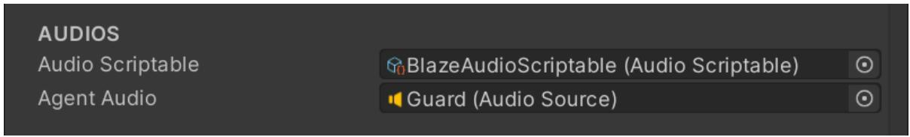


您还可以选择手动设置 AI 将使用的您喜欢的另一个音频源。

要播放正常和警报行为的巡逻音频，您应该使用音频管理器。

# 视觉和探测敌人

只需转到主 Blaze AI 检查器 -> 视觉选项卡并按照步骤操作即可。

选择“设置”子选项卡，并确保下面的“显示视觉”部分全部被选中：

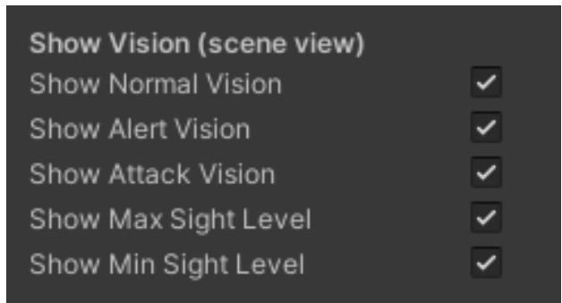


这将在场景视图中绘制所有状态的视图，以便您可以轻松地对其进行可视化和调试。

现在您可以设置 Vision Position 属性并将视觉放置在 AI 的眼睛上。如您所见，我将 Y 轴设置为 2。

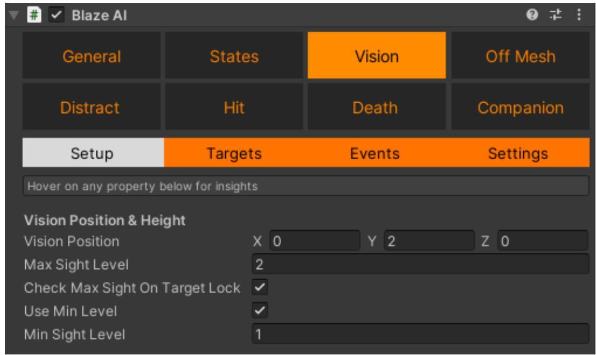


它应该看起来像这样：

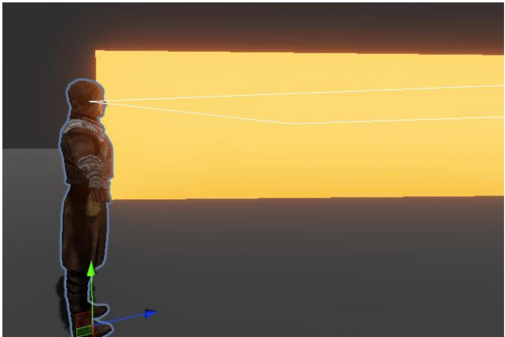


使用这些属性为每个状态设置 AI 的视角和范围。攻击状态锥角最好为 360 度，以便在攻击状态下检测各个方向的敌人。

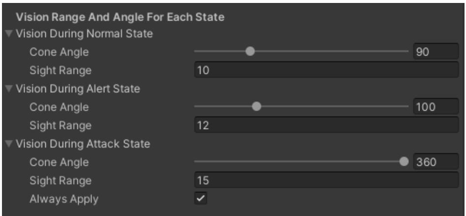


现在是时候设置最大可检测视力水平和最小视力水平了。

转到场景视图，你会发现AI有两个标记，一绿一红。绿色的是最大可检测级别，使用“最大视线级别”属性进行设置，任何高于此绿色的内容都不会被检测到。虽然红色是使用“最小视线级别”属性设置的，但低于此红色的任何内容也不会被检测到。

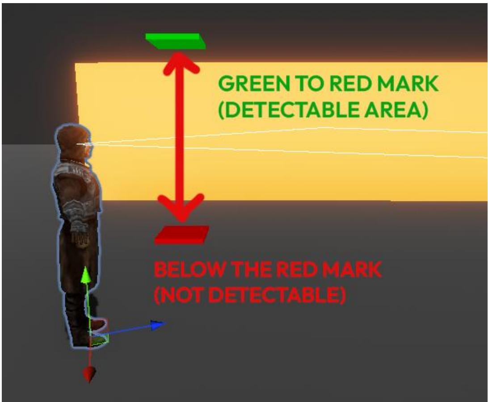


如果“使用最小级别”设置为 false，则将检测低于最大视线的所有内容，并且不会有最小检测点。

现在要检测实际的敌人，请转到“目标”子选项卡。

设置要检测的图层：这必须包含您希望 AI 视觉检查的所有图层，包括障碍物、墙壁等……任何具有此处未添加的图层的游戏对象都将被透视。这里不需要添加敌人的层。

P.S：为了获得更好的性能，请确保设置用作障碍物、地面等的图层...不要设置为“全部”或“默认”。

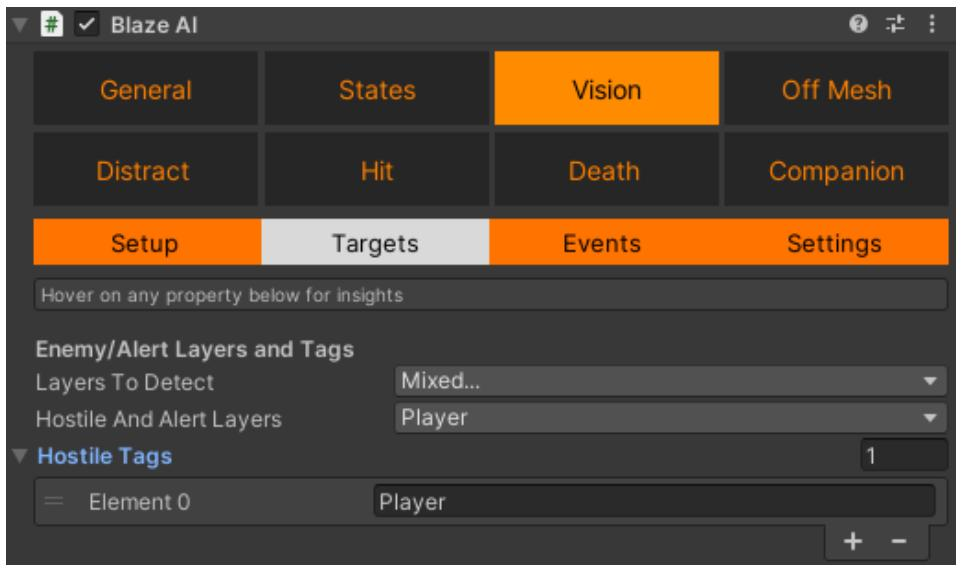


设置敌对和警报层：这应该包含敌人碰撞器的层。所以在这里设置敌人的层。如图所示。

在敌对标签中，设置玩家的标签名称或任何您希望 AI 识别为敌对的名称。

如果你正在制作 VR 游戏。然后从“设置”子选项卡中禁用多射线视觉，因为它可能会导致问题。

要返回 Al 的当前目标，请执行：blaze.enemyToAttack;

# 检测敌人的最后一件重要事情

最后，您的玩家/敌人需要至少检测到一个对撞机。多重碰撞器没问题。敌人碰撞器可以设置为Is Trigger，就可以了。这就是检测敌人所需的全部。

# 视力计

在“设置”选项卡中启用“使用视力表”——当 AI 检测到目标时，它会将其视力表从 0 增加到 1，其速度取决于您设置的值。当视力表达到 1 时，目标将被完全检测到，并且人工智能将参与。在潜行游戏中非常方便。

将鼠标悬停在每个速度属性上，它会解释速度的用途。

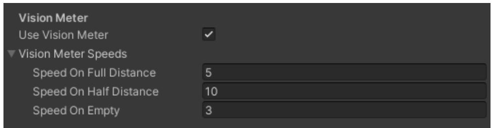


# 蜜蜂

要了解 Al 当前的视力表是什么，只需阅读：blaze.visionMeter – 它从 0 到 1。

要读取视野计瞄准的潜在敌人是什么，请读取： blaze.potentialEnemyToAttack - 返回游戏对象或 null。

# 设置近战/远程人工智能

按照以下步骤设置你的近战/远程人工智能。

- 转到主 Blaze AI 检查器  $>$  状态选项卡  $>$  单击添加行为按钮。

- 您会发现脚本已添加到游戏对象中，并在“状态”选项卡的状态行为中进行设置。

- 如果您不打算使用掩护射击模式，请继续从游戏对象中删除添加的掩护射击行为和前往掩护行为脚本。

- 确保“状态”选项卡中的封面射击模式已关闭。

- 现在展开攻击状态行为脚本并确保您位于移动选项卡中。

- 将“移动速度”和“转动速度”属性设置为您喜欢的任何值。前者是你希望人工智能处于攻击状态的速度，这包括追逐、在被呼叫时移动到目标位置以及接近距离以对目标发起攻击。后者同样适用于人工智能转向路径拐角的速度。

- 空闲动画是 AI 处于战斗姿态、等待轮到攻击时播放的动画名称。设置那个。

- 移动动画是当您的 AI 追逐玩家、被另一个 AI 呼叫到目标位置或移动到玩家以发起攻击时播放的移动动画名称。

- 现在转到“攻击”选项卡。

- 远程属性会调整计算，使 AI 表现得像远程敌人。因此，如果您希望 AI 是远程的，则设置为 true；如果 AI 是近战的，则设置为 false。

- 与敌人的距离属性是目标与 AI 之间的距离，在该距离中，AI 将在战斗姿态（空闲动画）中等待轮到攻击。此外，如果 AI 和目标之间的距离超过此属性中设置的距离，AI 将追逐其目标以缩小距离。

- 攻击距离是实际攻击期间 AI 与其目标之间所需的距离。例如，如果你的 AI 是近战型，你希望这个值非常小，比如 0.5 - 1。因为 AI 需要更接近目标。当触发攻击时，AI会移动以接近距离，然后在达到距离时发起攻击。

- 攻击层检查更多地用于远程。这是为了避免人工智能互相碰撞。因此，如果你想避免误伤，请将其设置为其他 AI 的图层。

- Attacks 是一个列表（可以动态更改），您可以在其中设置每个攻击动画名称、每个攻击的持续时间以及是否希望每次攻击伴随音频。每个攻击周期将随机选择一次攻击。

- 攻击事件是您可以设置发起攻击时触发的事件的地方。伴随着攻击动画。

- 间隔攻击：让我们首先了解为什么会出现这种情况。默认情况下，AI 会向它看到的任何敌方添加一个名为 BlazeAIEnemyManager 的脚本。该脚本管理每个AI的攻击，使它们一一攻击。默认情况下，该脚本的调用时间为 5 秒。因此每 5 秒就会调用一个随机 AI 来攻击目标。这可以通过检查员进行更改，它是公共财产。您可以在编辑器中将此脚本添加到您的播放器并更改值。但是，如果你想让所有人工智能都攻击而不考虑这种限制怎么办？这就是该属性的用武之地。启用此属性将打开另一个属性，您可以设置最小值和最大值两个值。每个周期都会生成一个随机数作为等待时间，完成后 AI 无论如何都会发起攻击。即使有另一个AI即将攻击。这有时也称为突发攻击。对于恒定时间，将两个值设置为相同的数字。这对于像僵尸这样的敌人来说是有好处的，因为他们无论如何都会一起攻击，并且每次攻击之间的等待时间很短。对于远程 AI 也有好处。

最后要提到的是伤害系统取决于你。您需要为 Als 创建自己的健康状况（查看本文档中的健康部分以及 Hit & Death 演示中的健康脚本）和实际伤害系统（查看本文档中的 Hit 文档）。为了让 AI 检测实际目标，请查看本文档中的检测敌人部分。

# 设置封面射手 AI

请按照以下步骤设置掩护射击游戏 AI。

- 转到主 Blaze AI 检查器  $>$  状态选项卡  $>$  单击添加行为按钮。

- 您会发现脚本已添加到游戏对象中，并在“状态”选项卡的状态行为中进行设置。

- 如果您不打算使用用于近战和远程的攻击状态行为，请继续从游戏对象中删除添加的攻击状态行为脚本。

- 确保“状态”选项卡中的封面射击模式已打开。

- 现在展开 Cover Shooter Behaviour 脚本并选择 Movement 选项卡。

- 将“移动速度”和“转动速度”属性设置为您喜欢的任何值。前者是你希望人工智能处于攻击状态的速度，这包括追逐、移动到目标位置以及从/到掩体。后者（转弯速度）同样适用于人工智能转弯到路径拐角的速度。

- 空闲动画是 AI 在等待拍摄周期时播放的动画名称。

- 移动动画是当您的 AI 追逐玩家、被另一个 AI 呼叫到目标位置、移入/移出掩体时播放的移动动画名称。

- 现在选择“攻击”选项卡。

- 与敌人的距离是 AI 不惜一切代价应保持的最大距离。如果距离增加超过此属性中设置的值，AI 将追逐其目标以接近此距离，然后在附近寻找掩护。 AI 会消除超出此设定值的覆盖物。

- 攻击距离是 AI 在射击周期中应移动到的实际距离。问问自己，当人工智能向目标射击时，你希望它距离目标多近。作为掩护射击者，最好始终保持与“与敌人的距离”相同的值。但你绝对可以将其设置为其他任何值。

- 攻击层检查是为了避免误伤。在启动射击周期之前，AI 将发射射线并检查此属性中设置的任何图层是否已被击中。如果是这样，人工智能将避免攻击，直到有一条清晰的路径才会攻击。您可以将此属性设置为其他 AI 代理的图层。因此，在人工智能攻击之前，它会检查是否有任何朋友挡道，如果有则停止。当路径畅通时，它将恢复拍摄。

- 射击动画是您在拍摄时要播放的实际射击动画名称。

- Shoot Every 是 AI 触发拍摄周期的时间间隔（以秒为单位）。问问自己：你希望这个 AI 每隔多少秒射击一次？这会在每个周期生成一个介于最小值和最大值之间的随机数。当该值生成并且计时器完成时，AI 将移动到玩家并射击。对于恒定时间，将两个值设置为相同的数字。

- 单次拍摄持续时间设置单次拍摄的时间量（以秒为单位）。拍摄周期由多个镜头组成。

- 每次射击之间的延迟 触发下一次射击之前的延迟时间量。

- Total Shoot Time 总拍摄周期时间。你希望人工智能持续向敌人射击多久。取最小值和最大值之间的一个数字，并生成一个介于两者之间的随机数字。对于恒定时间，将两个值设置为相同的数字。

- 攻击事件是您设置每次射击时触发的事件的地方。这是你应该使用子弹功能的地方，它可以播放粒子系统、伤害敌人、发射射线等等......

其他一切都是不言自明的，并且具有提供更多信息的工具提示（通过鼠标悬停）。

为了使 AI 在低盖上方进行拍摄，一个技巧是将“视觉”选项卡中的“视觉位置”设置为高于低盖高度，如图所示。

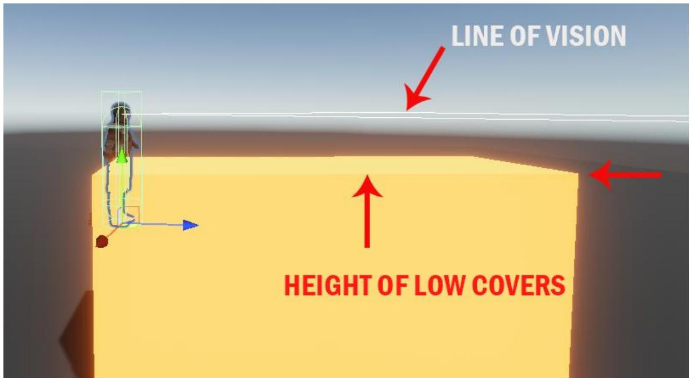


这样，当人工智能找到掩体并进行攻击时，它会立即起身从低掩体射击，而无需绕着掩体跑来更好地观察目标。您将在下一节中学习如何设置封面，请记住这一点。

最后要提到的是伤害系统取决于你。您需要为 Als 创建自己的健康状况（查看本文档中的 Health 部分）和实际伤害系统（查看本文档中的 Hit 文档）。为了让 AI 检测实际目标，请查看本文档中的检测敌人部分。

# 为封面射手 AI 设置封面

在执行这些步骤之前，请确保您已在平面上烘焙导航网格。如果没有，请按照入门部分操作。

- 创建封面游戏对象或插入封面模型并给它们一个盒子碰撞器。

- 然后使用“窗口”>“AI”>“导航”打开“导航”窗口。

- 现在您已经打开了导航菜单。单击层次结构中的所有封面游戏对象，然后转到“对象”选项卡并检查“导航静态”并将“导航区域”设置为“不可步行”，如下所示

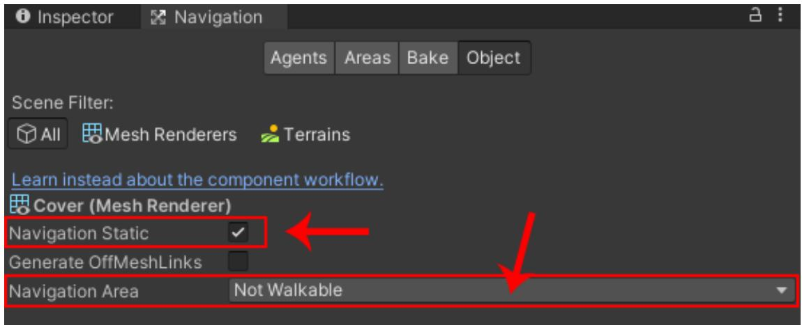


- 现在转到“烘焙”选项卡并单击“烘焙”。

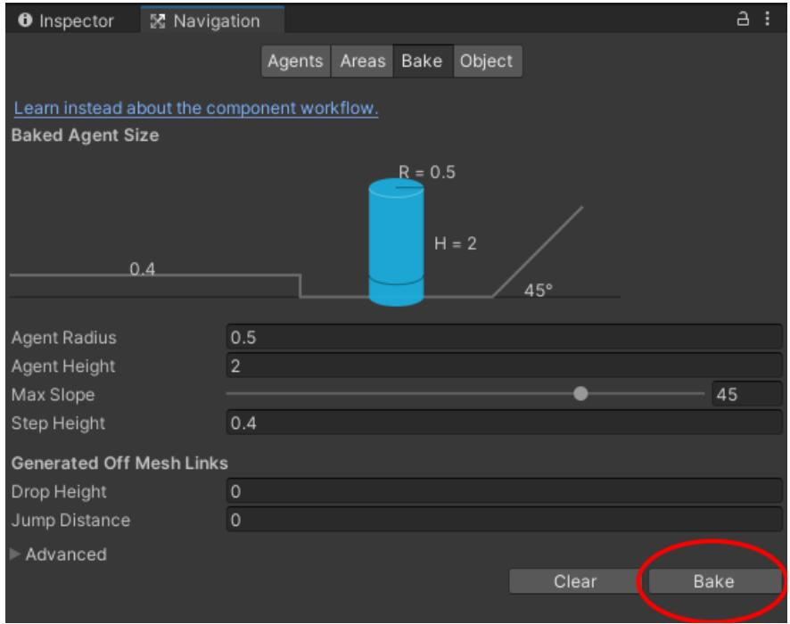


- 现在，您会在场景视图中发现您的盖子已在其周围雕刻了导航网格。

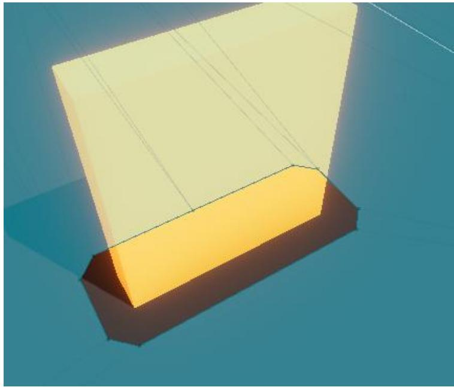


- 封面设置的最后一件事是给你的封面添加一层。最好为您的封面提供一个独特的图层，而不是将其设置为“默认”。

- 现在您已经设置了封面，是时候回到人工智能了。展开“Going To Cover Behaviour”脚本。

- 将覆盖层属性设置为覆盖层。

- 隐藏灵敏度是指您希望隐藏点的程度。您很少会编辑此内容。所以就将其保留为 -0.25 即可。

- 搜索距离是围绕 Al 搜索掩体的距离。启用其下方的“显示搜索距离”，在场景视图中，半径将显示为浅蓝色线球体，以便您可以直观地了解距离有多好。

- 最小覆盖高度是符合搜索条件的最小覆盖高度。要获取任何游戏对象的覆盖高度，只需添加组件 BlazeAIGetCoverHeight 并单击按钮即可。它会告诉你这个游戏对象的高度。它需要有一个对撞机。

- 高覆盖物高度 如果选择的覆盖物高度大于或等于该值，则该覆盖物将被视为高覆盖物，并且将播放高覆盖物动画。如果选择的掩护小于此，则它是低掩护。

- High Cover Anim 当 AI 隐藏在高度大于 Min Cover Height 属性的掩体后面时播放的动画。

- Low Cover Anim 当覆盖高度等于 Min Cover Height 时播放的动画名称。

- 旋转到掩体正常 如果选中，当 AI 到达掩体时，它会旋转，使其回到掩体。

现在你的人工智能可以完美地检测到掩体并隐藏在它们后面。其他一切都是不言自明的，并且具有提供更多信息的工具提示（通过鼠标悬停）。

# 手动设置盖子位置

有时您可能需要手动添加封面位置，而不是依赖自动化系统。这可能是因为您的网格不均匀/复杂，导致系统很难自动选择准确的网格。添加手动位置：

- 单击您的封面游戏对象

- 添加组件：BlazeAIOverManager

- 在 CoverPositions 数组中添加位置。

- 每个物体一侧一个位置就可以了。

- 启用 ShowCoverPositions 将显示场景视图中的位置，并让您使用手柄定位它们。

就是这样！现在，当人工智能去覆盖时，它会自动选择一个自动点，并转而前往最近的手动设置点。

# 警报层/对某些标签做出反应

如果您阅读了前面的“添加敌人”部分，您可能会问，什么是警报层？

警报层是警报标签层（位于 Vision 类中的“敌对标签”下方）。警报标签是具有标签名称的游戏对象，您希望 AI 对其做出反应，并将 AI 转变为 Saw Alert Tag 状态。 AI将触发警报视觉并播放警报状态的移动动画。查看演示 3（仅限完整版）。

首先，在 Vision 中的 Alert Tags 类内的 Alert Tag 属性中添加要做出反应的游戏对象的标签名称。

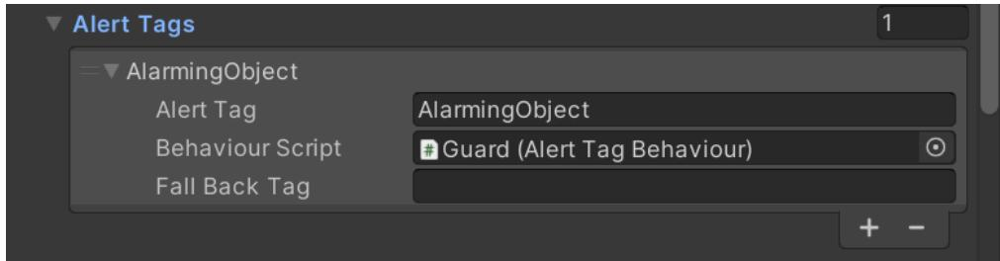


正如您所看到的，我希望 AI 能够做出反应并收到带有标签名称 AlarmingObject 的任何游戏对象的警报。

第二个属性是当看到此标记名称时您想要启用的行为脚本。您可以为每个警报标签设置不同的行为。 Blaze 附带一个默认脚本，其中包含许多属性来自定义行为。

只需将组件添加到您的 AI：警报标签行为

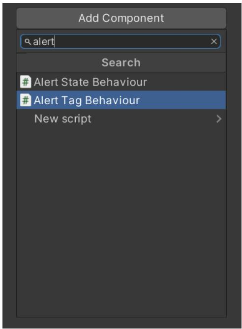


添加组件后，将其拖放到警报标签中的“行为脚本”属性。

最后一件事是 Fall Back Tag 属性。当 AI 看到带有警报标签的游戏​​对象时，它会立即将对象标签更改为后备标签，以免自身或其他 Al 再次对其做出反应。无论您在此属性中设置什么，都将成为游戏对象的新标签名称。默认情况下，如果将此属性留空，游戏对象将回退为“未标记”。

就是这样！现在，当人工智能看到警报标签时，行为脚本将在持续时间结束时启用。它将返回到警报状态。

# 打

首先，要让AI转到命中状态，你需要先添加它的行为。因为与任何其他状态一样，状态需要一种行为来指示它如何在该特定状态下采取行动。真的很简单。要研究的示例演示是 Hit & Death 演示。

首先转至 Blaze 中的“Hit”选项卡并单击“Add Behaviour”按钮。这会将 Hit State Behaviour 脚本组件添加到您的 AI 游戏对象并将其设置为其属性。

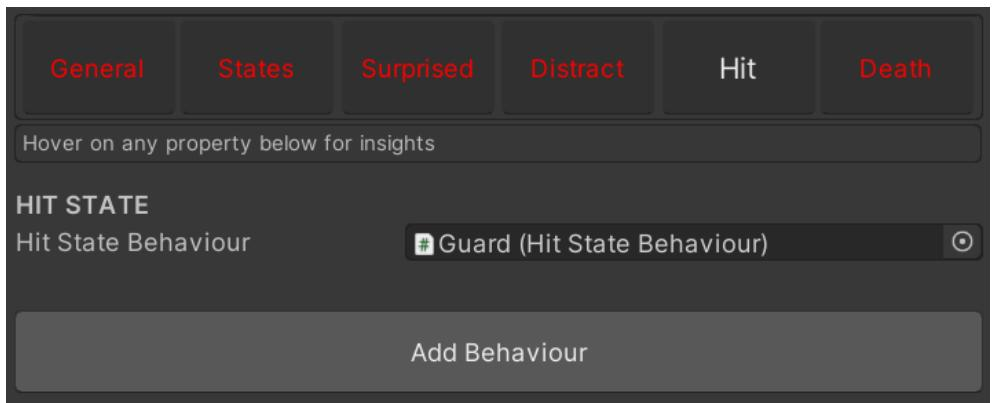


这是添加到Al后的脚本。

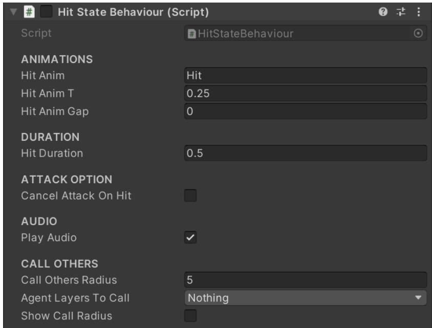


与其他行为一样，该脚本将被禁用。那挺好的。

要将 AI 切换到命中状态，只需调用 Blaze 公共方法 Hit(GameObject hitter = null, bool callOthers = false)。

这会将 AI 转至命中状态并播放命中动画和音频，并在命中持续时间属性（命中状态行为脚本中）中设置的时间内保持该状态，然后退出。

上面看到的 API 只有两个参数：

击球手参数：如果击球手被传递，则退出击球状态后，AI将转为攻击状态，并移动到击球手的位置并查看位置。如果没有通过，退出命中状态后AI将转为警戒并继续巡逻。默认情况下它设置为 null。

您可以使用它来设置是否希望玩家攻击是匿名的。

// AI会在命中状态后移动以检查位置 blaze.Hit(player.gameObject);

// AI在命中状态后会转入警戒状态并继续巡逻 blaze.Hit();

两者都是有效的，但取决于您想要做什么。

callOthers参数：如果设置为true，则会呼叫附近的座席。如果击球手也被传球，它会呼叫 Als 到击球手位置。如果击球手没有被传球，它会呼叫 Als 到它自己的位置。从命中状态行为检查器配置呼叫半径和代理层。

// 将击中 AI 并调用其他 Als 到玩家位置

 blaze.Hit(player.gameObject, true);

// 将击中 AI 并调用其他 Al 到当前 AI 位置

 blaze.Hit(null, true);

对于属于击中行为一部分的布娃娃击倒，请查看布娃娃部分。

# 健康

你问的健康呢？好吧，健康取决于你。这意味着您可以使用资产附带的资源。您可以在 Hit & Death 演示中测试它。该脚本位于演示 > 资源 > 脚本 > Health.cs 中。或者您可以编写自己的或使用您最喜欢的健康资产。 Blaze 为您提供选择的自由。

这也意味着您需要编写另一个简单的脚本来调用 Blaze 的 Hit() 并减少您的健康脚本的点数。让我们一一检查一下。

首先，健康脚本非常简单：

```txt
using UnityEngine;   
public class Health : MonoBehaviour { public int healthPoints  $= 100$  .
```

这个健康脚本或类似脚本应该在你的人工智能上。这个想法是在攻击时，你将这个 healthPoints 变量减少攻击伤害量。

然后，您应该在另一个脚本中为您的播放器提供某种命中管理器功能，该功能可以处理减少生命值并调用 Blaze 的命中状态。


像这样的东西：


```java
public void HitAI(int damagePoints)   
{ blaze.Hit(gameObject); healthScript.healthPoints  $\equiv$  damagePoints;
```

所以这将在你的玩家身上，这就是当你的玩家击中 AI 时你所调用的。

# 死亡

您不必设置任何行为。您只需调用公共 blaze 方法 Death(bool callOthers = false, GameObject player = null) 即可。检查死亡演示。对于布娃娃死亡，请查看布娃娃部分。

设置死亡属性位于主 Blaze AI 检查器的“死亡”选项卡中。

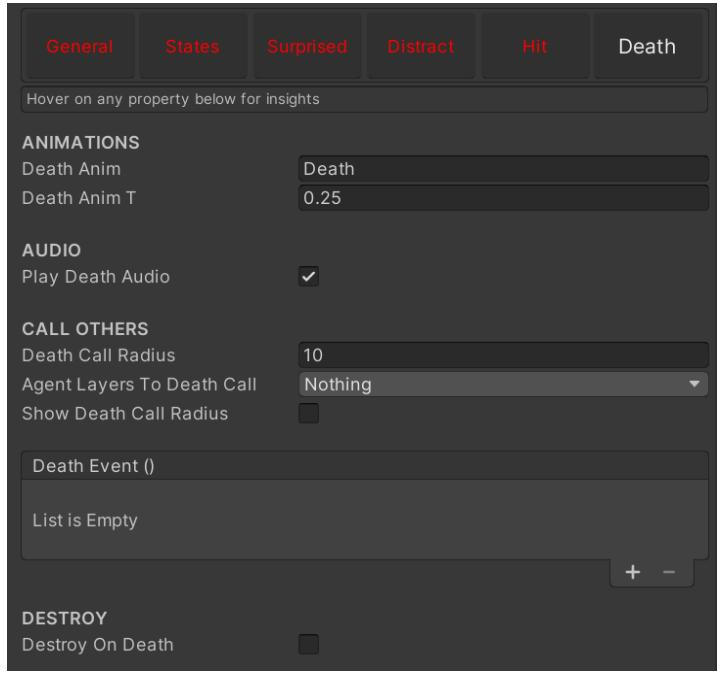


# 参数：

Death() 方法有两个参数，两个参数都是可选的，默认值分别为 false 和 null。

callOthers：是当AI死亡时是否要呼叫其他Als到某个位置。你要么通过 true，要么通过 false。默认为假。配置巡检员呼叫的半径和层数。

玩家：如果第一个参数（callOthers）为真，则作为玩家游戏对象发送其他AI来检查其位置。它需要一个游戏对象，并且默认设置为 null。如果在 callOthers 为 true 时未传递此参数，则 AI 会将其他人呼叫到其自己的位置。

```javascript
// will kill Al and call other Als to current location blaze.Death(true);
```

```txt
// will kill AI and call other AIs to player location blaze.Hit(true, player/object);
```

您还可以在 AI 上安装一个脚本来检查健康点。如果它小于或等于 0，则调用 Death()。

```txt
void Update()   
{ if (healthScript.healthPoints  $\Leftarrow$  0）{ // this won't call others since nothing is passed blaze.Death(); }
```

当然，最好的方法是让 healthPoints 成为一个属性，并检查设置器内的健康点。但这种方法也很有效，而且如果你是初学者的话会更容易。

# 干扰

首先转到 Blaze AI 检查器中的 Distract 选项卡。

启用可以分散注意力。然后单击“添加行为”按钮。

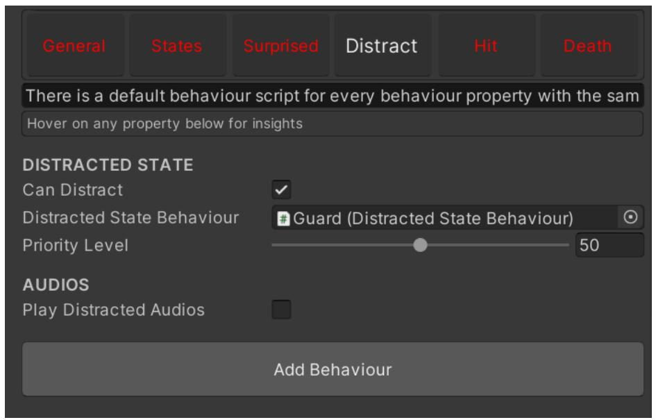


这会将默认的分心状态行为添加到您的 AI 中并将其设置为其状态属性。

添加的脚本是您希望人工智能在分心时如何行动。所以按照你想要的方式填写。

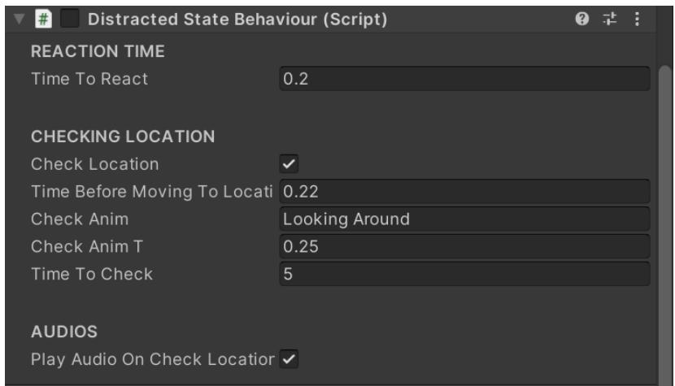


# 现在有两种方法可以分散人工智能的注意力。

您可以通过执行以下操作在单个特定 AI 上调用 Distract(Vector3 location, bool playAudio) 方法：

 blazeScript.Distract locationOfDistraction, true);

第一个参数是干扰的位置。

第二个参数是AI是否应该播放音频。

第二种也是最受青睐的方法，也是分散群体注意力的方法是使用脚本：Blaze AI Distraction。将此脚本添加到您想要分散注意力的任何游戏对象/位置。

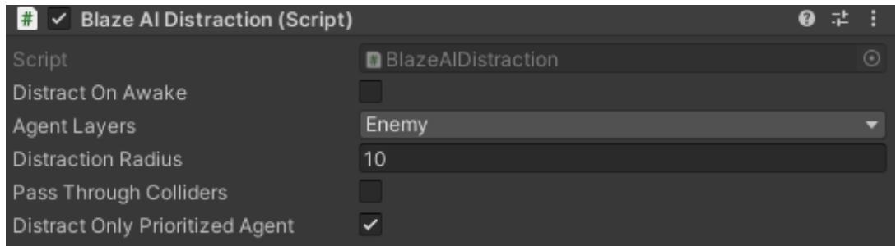


设置属性后（我们将获取它们），您可以使用脚本的公共方法触发干扰：

触发干扰()。所以你可以这样做：

BlazeAIDistraction 脚本 = GetComponent<BlazeAIDistraction>();

script.TriggerDistraction();

这是首选方式，因为它可以为您完成大部分工作，并且还可以分散多个人工智能的注意力。

或者，您可以使用图像中看到的第一个属性在清醒时触发干扰。

现在来说说属性：

代理层：您想要分散注意力的 Als 层。

干扰半径：检查和干扰Als的半径。您可以在场景视图中将干扰半径视为黄色线球体，该球体随该属性的值而变化。这样你就可以直观地看到分心半径有多大。就这样：

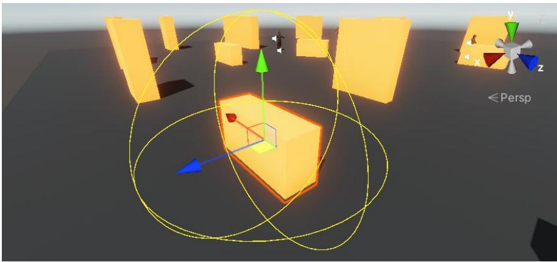


穿过碰撞器：您是否希望干扰物穿过墙壁和物体并分散人工智能的注意力？

仅分散优先级代理：如果启用，则只有组中具有最高分散注意力优先级的 AI 才会转身面对分散注意力的情况。如果禁用，整个小组都会面对并看着干扰物，但只有最高优先级的人会检查位置。

要了解干扰如何发挥作用，请查看干扰演示。

# 距离剔除

这是一个很棒的系统，可以通过禁用远离玩家或摄像机的 Als 并在范围内重新启用它们来大幅提高游戏性能。它的设置也非常容易。请注意：这也有 API，因此请检查 API 部分。

首先在场景中创建一个空游戏对象并向其中添加 Blaze AI 距离剔除脚本。

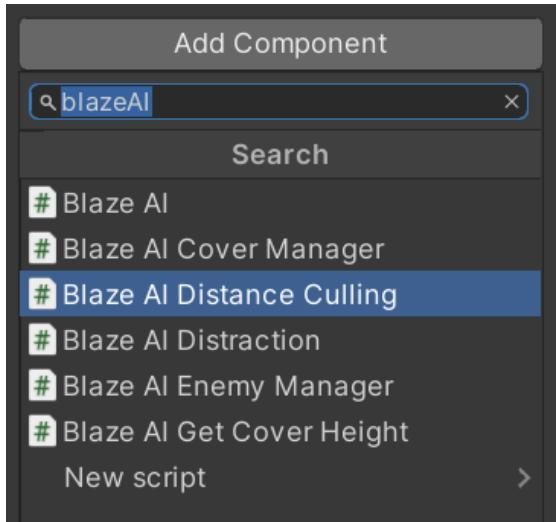


这将是在您的空游戏对象上添加的脚本。

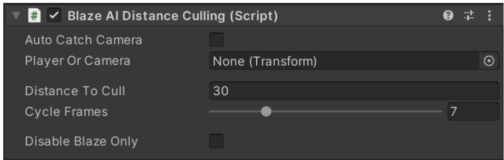


距离剔除使用玩家或摄像机来计算到 Als 的距离，您可以根据您的游戏选择最佳的距离。

如果相机是最好的，您只需启用自动捕捉相机即可。这将使主摄像头处于唤醒状态。因此不需要更多的手动工作。

但是，如果您的相机在运行时生成。禁用自动捕捉相机，当相机准备好并生成时，任何脚本中都有一个函数可以执行以下操作：

BlazeAIDistanceCulling.instance_playerOrCamera = Camera.main.transform;

如果你想比较与玩家角色的距离。您可以禁用自动捕捉相机并将播放器变换缝合到属性播放器或相机，如第 21 页的图像所示。

Distance To Cull 是当 AI 超过此值时您想要禁用 AI 的距离。

循环帧是一种通过在每组帧运行剔除循环来进一步提高性能的方法。默认情况下，它每 7 帧运行一次。除非作为游戏性能不佳的最后手段，否则您不应该使用此功能。

仅禁用 Blaze 将仅禁用 blaze 组件并播放正常或警报状态的第一个空闲动画。取决于您设置在唤醒时使用的状态。启用此功能将使您的剔除看起来更自然，没有弹出窗口，因为它不会禁用游戏对象。 （会让你的人工智能看起来好像在等待）

现在您已经为距离剔除设置了“中央管理器”。剩下的就是指示 Blaze AI 使用此功能。

转到您的 AI，在常规选项卡中打开 Blaze 检查器。向下滚动并启用距离剔除。

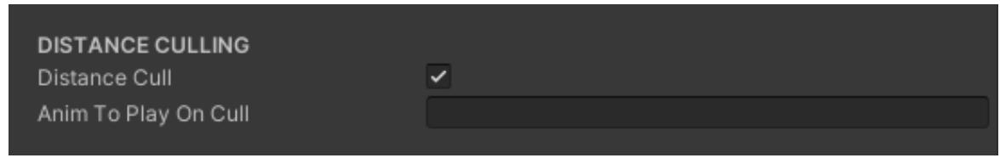


当您启用距离剔除时，会出现一个新属性“剔除时播放动画”。在此属性中设置 AI 被剔除时要播放的动画名称。仅当我们之前看到的主剔除管理器中启用了“Disable Blaze Only”时，才会考虑这一点。如果您不想设置动画，也可以将其留空。

就是这样！现在，当您玩游戏并将玩家或摄像机移离任何 AI 时，它会禁用该 AI 并在范围内重新启用。

# 同伴模式

使用同伴模式，您可以将任何 Blaze AI 交给您的朋友，并让它与您并肩作战。你甚至可以用它让一个人工智能成为另一个人工智能的伴侣。

首先转到同伴选项卡，然后单击“添加同伴行为”

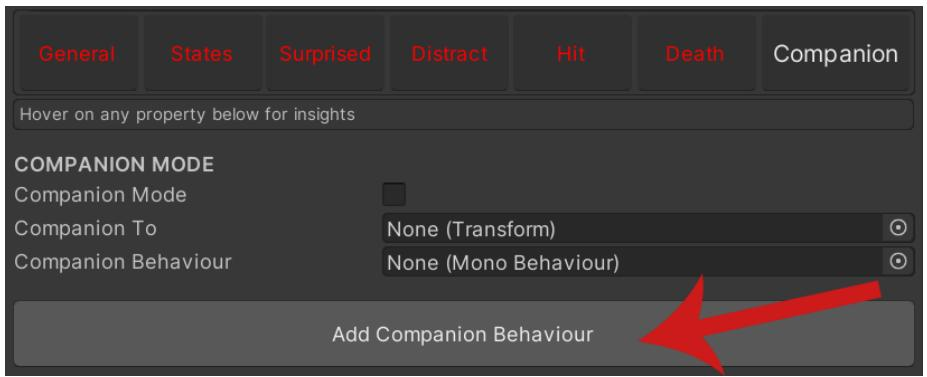


点击后你会注意到两件事。

首先，Companion Mode 属性已设置为 true。其次，同伴行为属性已设置为新添加的脚本。

接下来是将您的播放器（或任何其他播放器）拖放到“Companion To”属性中。这意味着设置您希望人工智能成为同伴的游戏对象。

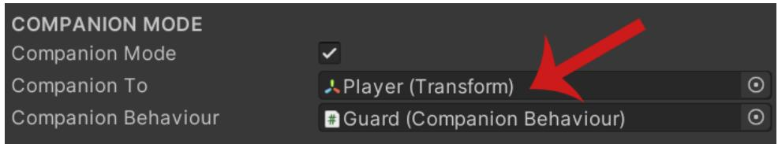


这在运行时也有效。所以你可以动态地改变它。

现在我们已经完成了主要检查器部分的工作。现在转到新添加的脚本CompanionBehaviour来设置属性。

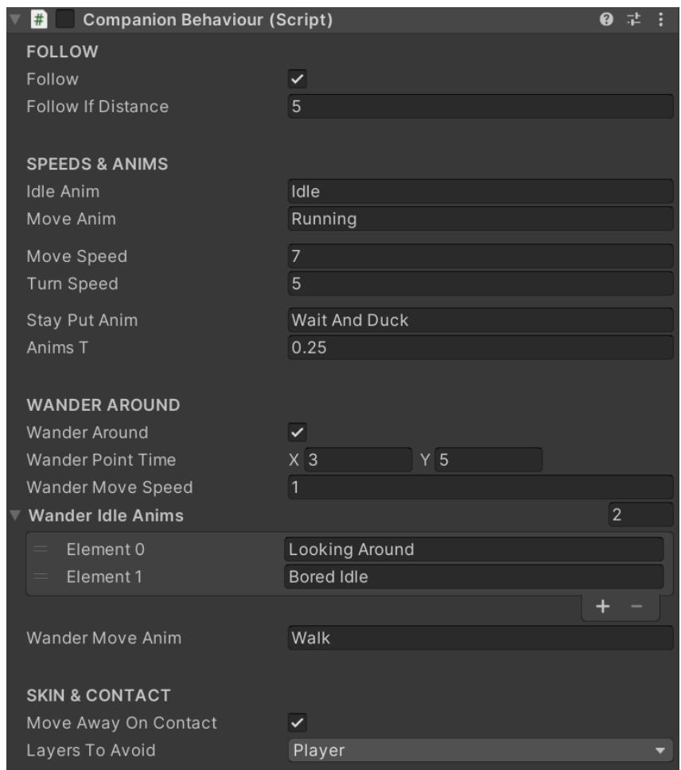


# 特性：

Follow ：默认设置为 true，这意味着 AI 将跟随同伴。如果设置为 false，这意味着 AI 已被命令保持原地不动，并且 AI 将强制保持原地不动，同时无限期地播放“原地不动”动画，直到跟随再次恢复为 true。

跟随距离：设置播放运行动画时 AI 应跟随的距离。当距离较小时，AI 将停止并播放空闲动画。

如果距离行走：如果 AI 与同伴之间的距离小于或等于此距离，AI 将使用行走动画和行走速度行走。该值必须始终大于 Follow If Distance 属性。

四处走动：使用此选项，您可以在满足距离时让 AI 在玩家周围徘徊。这可以为你的游戏增添更多活力，因为人工智能会四处游荡。漂移半径是 Als navmesh 代理高度 * 2 + 0.5。

徘徊点时间：再次移动之前在每个徘徊点花费的时间。对于每个漂移点，将在两个设定值之间生成一个随机值。对于恒定时间，将两个 (X 和 Y) 值设置为相同的值。

Move Away On Contact ：将此属性设置为 true 将使 AI 在接触到下面设置的图层时移动到随机位置。当玩家接触时，你可以用它来让 AI 移动。

要避免的层：当人工智能接触到这些设置层中的任何一个时，它会移动到随机位置。当玩家接触时，你可以用它来让 AI 移动。

# 音频

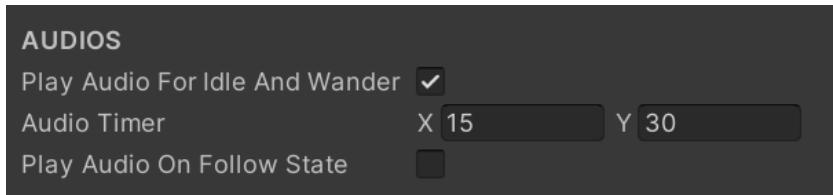


空闲和徘徊时播放音频：让您的同伴在空闲或闲逛时每隔设定时间（音频计时器）播放随机音频

徘徊。在音频脚本中设置音频。检查本文档中的音频部分以了解音频脚本是什么。

音频定时器：每个周期将在两个值之间选择一个随机时间。对于恒定时间，将两个值设置为相同的数字。

在跟随状态时播放音频：这将使同伴在跟随状态更改时播放音频。在音频脚本中，您将找到两个属性：Companion On Follow 和 Companion On Stop。在这些中，您可以为每一个设置音频。例如，如果您将 follow 状态设置为 false。你可以让人工智能说“好吧，我会留在这里”，就像它受到命令一样，当 follow 被设置为 true 时，它​​可以像“我正在路上”一样。

# 同伴系统如何运作？

简而言之：当启用同伴模式时，同伴行为将在正常和警报状态下运行，而不是默认行为。至于攻击状态，默认的攻击行为会运行，以使同伴与同伴一起攻击其他敌人。

# 配套 API？

配套 AI 支持任何其他 Blaze AI 的 API。您可以使用API​​将其调用到某个位置，设置其攻击敌人等...请查看本文档中的API部分并使用您喜欢的API。

# 公共属性和 API

检查器中的所有类/变量都可以使用驼峰式命名约定以编程方式访问。只制作第一个字母小写。

# 例如：

使用根运动 -> blaze.useRootMotion

Vision 类中的视线级别 -> blaze.vision.sightLevel

以下是方便调用的公共属性和 API（方法）：

# 特性

state - 返回以下任一状态的状态枚举：

状态正常

状态警报

状态_攻击

状态.goingToCover

状态分散

状态.惊讶

状态.sawAlertTag

State.returningToAlert

国家打击

状态.死亡

状态.spareState

animManager.currentState - 返回当前动画名称的字符串。

enemyToAttack - 返回 AI 所针对的敌人的游戏对象。

潜在的敌人攻击 - 如果启用了“使用视觉计”，则返回 AI 正在检测的敌方游戏对象。

waypointIndex 返回（int）航路点的当前索引。

enemyColPoint - 返回检测到的敌人的碰撞点。可用于最后一个敌人位置。

VisionMeter - 返回视力表的值。如果启用使用视力计。从 0 到 1。当检测到敌人时增加到 1，如果没有检测到敌人则减少到 0。

agentAudio - 返回 Blaze 使用的 AI 的主音频源（在启动时动态生成）来播放音频。

distanceToEnemy - 返回 AI 和目标敌人之间的距离（浮动）。将此与“enemyToAttack”结合使用，以确保首先存在目标敌人。

isAttacking - 当 Al 移动到攻击位置或已经在攻击时返回 true (bool)。

isAttackingAnim - 当 AI 攻击动画播放时返回 true (bool)。

sawAlertTagName - 返回所见警报标签的名称（字符串）。

sawAlertTagPos - 返回带有警报标签的所见游戏对象的位置 (Vector3)。

Cover Shooter Behaviour属性：（先获取CoverShooterBehaviour然后调用）

hitPoint - 返回 AI 射击的 Vector3 点。

ShootingAt - 返回正在射击的游戏对象。有助于了解 AI 是否正在射击玩家或其掩体。

# 蜜蜂

MoveToLocation (Vector3 location, bool randomize = false) - 将代理移动到某个位置。第二个参数是是否要随机化位置点。这对于避免多个 Al 停在完全相同的点很有用。

IgnoreMoveToLocation() - 使用此函数可以忽略先前强制移动到某个位置的操作。

StayIdle() – 强制 AI 保持空闲状态，然后在空闲时间结束后再次移动。如果AI处于攻击状态或即将掩护状态，则无法使用此方法。

IgnoreStayIdle() - 忽略保持空闲调用并让 AI 返回巡逻状态。

IsIdle() - 返回一个布尔值以检查 AI 是否空闲。空闲是指 AI 到达航路点并等待空闲计时器完成后再再次巡逻或调用 StayIdle() API。

Distract (Vector3 location, bool playAudio=true) - 将单个特定 AI 分散到某个位置。

IsOnOffMeshLink() - 返回一个布尔值，无论 Al 是否处于非网格链接上。

Attack() - 强制 AI 攻击其目标。这只能在AI已经有目标的情况下使用，否则它要攻击什么？将此与检查enemyToAttack != null 一起使用以确保AI有目标。

StopAttack() - 停止 AI 的攻击。

ChangeState（字符串状态）——使用此方法，您可以仅在正常和警报之间更改 Al 的状态。该方法采用“正常”或“警报”字符串，并将 Al 的状态更改为特定的通过状态。

SetTarget (GameObject敌人, bool randomizePoint = false, bool AttackVisionForFrame = false) – 为Al设置一个敌人并检查它的位置。第二个参数是您是否希望 Als 停在该位置，但要进行一点随机化，以避免 Als 聚集在同一点。如果第三个参数为 true，Al 的视野将转向单帧的攻击状态，如果它在该帧中捕获任何敌方，它将参与战斗。这对于掩体射手来说特别有用，因为阿尔斯的攻击视野会忽略障碍物和掩体。所以传递第二个参数可以帮助Al直接抓住敌人，而不是先去敌人的位置。

Hit (GameObject敌人= null, bool callOthers = false) - 使用此方法来击中AI。有关更多信息，请查看本文档中的命中部分。

KnockOut (GameObject敌人 = null, bool callOthers = false) - 调用此函数将淘汰AI。

Death (bool callOthers = false, GameObject敌人= null) - 杀死AI。有关更多信息，请查看本文档中的“死亡”部分。

DeathDoll (float timeToRaqdoll, bool callOthers = false, GameObject敌人= null) - 用动画杀死AI，然后在中途杀死布娃娃。有关更多信息，请查看本文档中的布娃娃部分。

AddDistanceCulling () - 这会将 AI 添加到距离剔除管理器。

RemoveDistanceCulling (bool enableObject = false) - 从距离剔除管理器中删除此 AI。采用可选参数。如果传递为 true，则还将启用游戏对象（如果它已被距离剔除禁用）。默认为 false。

CheckDistanceCulling() - 检查此 AI 是否已添加到距离剔除管理器中。返回 true 或 false。

animManager.Play(string animName, float animTransitionTime) – 使用这个公共方法，即使 Blaze 被禁用，您也可以播放任何您想要的动画。

TakeCover (GameObject playerEnemy) – 使 AI 到达最佳掩体。

# 附加脚本

这些是提供的额外脚本，可增强 Blaze AI 的功能。

BlazeAIEnemyManager – 这是 Blaze 在看到敌对游戏对象时添加的，如果它已经添加到敌对对象中，则 Blaze 不会再次添加它。该脚本组件是敌人管理器，使 Blaze AI 一次攻击一个敌方。你可以在编辑时预先添加这个，以便能够控制AI的攻击间隔。将 callEnemies 属性设置为 false 将阻止任何 AI 攻击目标。

BlazeAlDistraction – 将此脚本添加到您想要分散注意力的任何游戏对象中。使用 TriggerDistraction() 以编程方式触发此干扰。这是完整触发的方式：

GetComponent<BlazeAlDistraction>();TriggerDistraction();

这将使任何 Blaze AI 分心并查看分心触发源方向。显然，您还可以在调用 TriggerDistraction() 的函数中播放音频。这将模拟或看起来好像人工智能听到了声音并被它分散了注意力。声音干扰，这就是游戏中的运作方式。

BlazeAIGetCoverHeight – 将此脚本添加到带有碰撞器的任何覆盖障碍物中，然后单击“获取覆盖高度”按钮，它将在检查器中打印它的高度。将其与掩体发射器设置一起使用，以便能够设置高和低掩体高度。

StayInPosition - 只要 AI 处于正常和警报状态，该组件就能使 AI 保持在原来的位置。将此脚本添加到 Blaze 所在的 AI 中。

BlazeAICoverManager – 处于掩护射击模式的 Blaze AI 将此脚本添加到它们要掩护的任何障碍物中，并在占领属性中设置其变换。当离开封面时，它们会从前面提到的相同属性进行变换。

BlazeAldistanceCulling - 将此脚本添加到场景中的任何空游戏对象，然后在 AI 的 Blaze 检查器中启用距离剔除。当距离超过距离剔除脚本中设置的距离时，AI 将禁用。

# 行为的内部 API

这些是 blaze 中的 API，您可以在编写自己的行为脚本时使用。您将看到所有这些方法实际上都在标准行为中使用。

MoveTo (Vector3 location, float moveSpeed, floatturnSpeed, string moveAnimName = null, float animT = 0.25f, string Direction = "front") -> 将 AI 移动到位置。当移动到某个位置时返回 false，当 AI 到达该位置时返回 true。

位置：移动到的目的地。

moveSpeed：移动到目的地时的移动速度。

TurnSpeed：移动到目的地时的旋转速度。

moveAnimName：要播放的移动动画的名称。

animT：从当前动画到移动动画的过渡时间。

方向：设置运动的方向向量。采取“前”、“后”、“左”或“右”。默认设置为前面。

TurnTo (Vector3 location, string leftTurnAnim=null, string rightTurnAnim=null, float animT=0.25f, floatturnSpeed=0) -> 在播放动画时将 AI 转向某个方向。转动时返回 false，转动完成时返回 true。该方法将自动确定选择哪个转弯动画（左或右）

location：转向的位置。

leftTurnAnim：左转动画名称。

rightTurnAnim：右转动画名称。

animT：从当前动画到转动动画的过渡时间。

转弯速度：转弯的速度。

RotateTo (Vector3 位置，浮动速度) -> 将 AI 旋转到位置。

location：旋转到的位置。

速度：旋转速度。

NextWayPoint() -> 将公共 waypointIndex 属性设置为下一个航点索引并返回目的地的 Vector3。

CheckWayPointRotation() -> 检查到达的航点是否有航点旋转。如果当前路径点有旋转，则返回 true，否则返回 false。

WayPointTurning() -> 将 AI 转向航路点旋转并在完成后返回 true。

SetState(State stateToTurnTo) -> 设置 AI 的状态。

stateToTurnTo：您希望 AI 转向的状态。接受（BlazeAI.State.normal等...）检查Blaze AI脚本中的状态枚举。

# 改变行为/武器和逃跑

Blaze 的设计使您能够在运行时切换任何状态的行为脚本。为人工智能的行为提供更多自由。

例如，我们希望人工智能在其生命值低于  $30\%$  并且处于攻击状态。这将需要彻底改变攻击状态行为。 Blaze 完全适合哪个。

我将创建一个新脚本，该脚本将成为 AI 的逃离行为，在启用时将其移动到该位置。该脚本将播放运行动画并执行以下操作：

// 移动角色

navmeshAgent.Move(moveLocation);

我将把这个新脚本添加到 AI 中，并创建另一个新脚本来跟踪运行状况，并在运行状况小于时将攻击状态行为切换为新行为  $30\%$ .

```txt
MonoBehaviour fleeBehaviour;   
BlazeAl blaze;   
void Start() { fleeBehaviour  $=$  GetComponent<FleeBehaviour>(); blaze  $=$  GetComponent<BlazeAl>();   
}   
void Update() { if (health <= 30) { Blaze_attackStateBehaviour  $=$  fleeBehaviour }   
}
```

通过对攻击状态行为进行交换，Blaze 将自动禁用旧的脚本行为并启用新的逃离行为脚本。现在，驱动攻击状态的是新的控制行为。将人工智能移动到远离目标的位置。

# 更改攻击武器或攻击模式

这种行为切换的另一种快速而简单的形式是启用/禁用 coverShooterMode 属性（在 Blaze 中），这将使 AI 在游戏时在攻击状态行为和掩护射手行为之间切换。您还可以向单个 AI 添加多个攻击状态行为，并将链接到 Blaze 的行为与另一种行为切换。这就是如何让AI改变攻击方式/武器。对于实际的武器更换动画，请将其与备用状态结合起来。

# 逃跑

现在，在阅读本节的第一部分（切换行为）之前，对您来说很重要。所以你知道你可以在运行时改变行为，你可以让敌人的人工智能自然地攻击，然后在某些情况下让他们逃跑。

也就是说，您可以使用 Blaze 附带的更高级的逃离行为脚本。

比方说，我们想要制作某种动物人工智能。当它看到玩家时，它会立即逃跑。这很容易。

- 我们首先将逃跑行为添加到 AI 中。

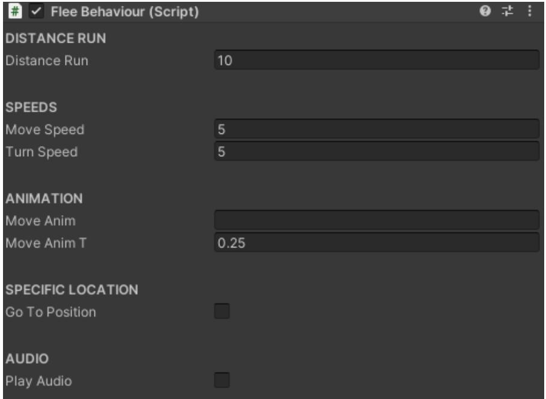


- 在“距离跑”中设置您希望 AI 逃离的距离。

- 设置逃跑时的移动和转弯速度。

- 在Move Anim中设置奔跑动画。

- 如果您希望AI在逃跑时前往特定位置而不是随机奔跑，您可以启用“前往位置”。将会出现一堆其他属性，您可以在“设置位置”中设置位置。

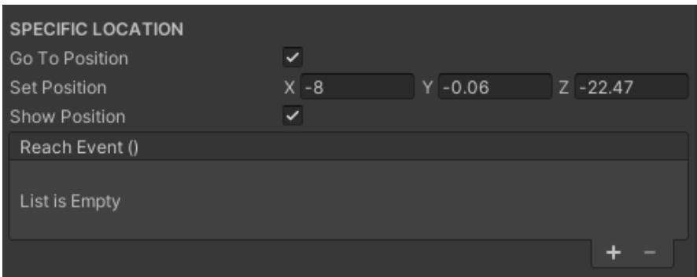


- 您还可以使用到达事件在 AI 到达特定位置时触发事件。

- 如果启用“显示位置”，则可以轻松地将场景视图中的“设置位置”位置视为绿色球体。就这样：

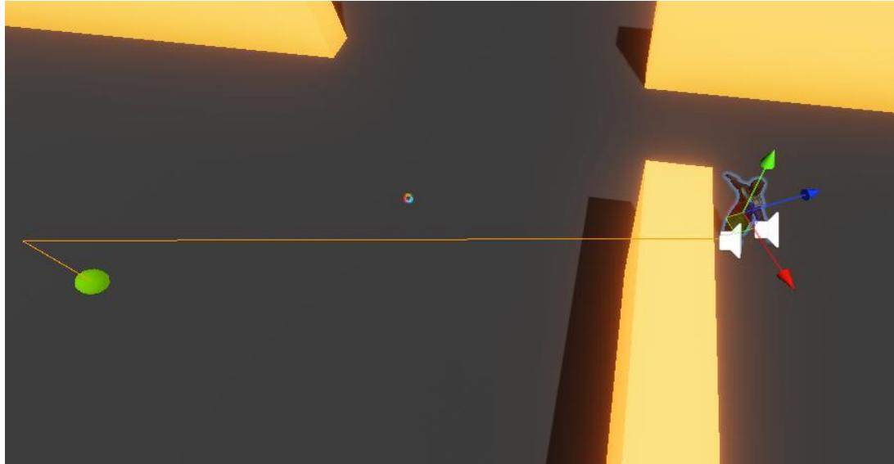


- 最后，我们需要将“状态”选项卡中 Blaze 检查器内的“攻击行为”替换为“逃跑行为”。只需将逃离行为拖放到该属性即可。

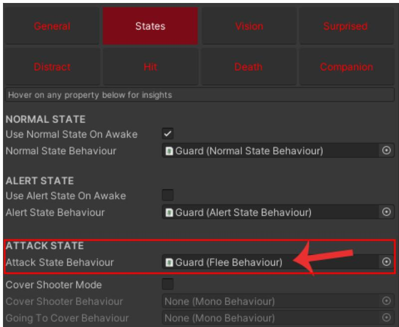


- 确保您已在 Vision 类中设置了敌对对象。如果您不知道如何操作，请阅读视觉和检测敌人部分。

- 现在，当动物AI看到玩家时，它会转为攻击状态，但控制攻击状态的行为是逃跑行为。所以动物AI逃跑了。

# 布娃娃

Blaze 在死亡和淘汰赛（击中状态的一部分）下支持布娃娃。但是，首先您需要使用 Unity 的布娃娃向导或任何其他工具来设置布娃娃  $3^{rd}$  像 PuppetMaster 这样的派对资产。在这里，我将使用 Unity 的。

右键单击层次结构中的 AI，然后转到 3D 对象 > 布娃娃。

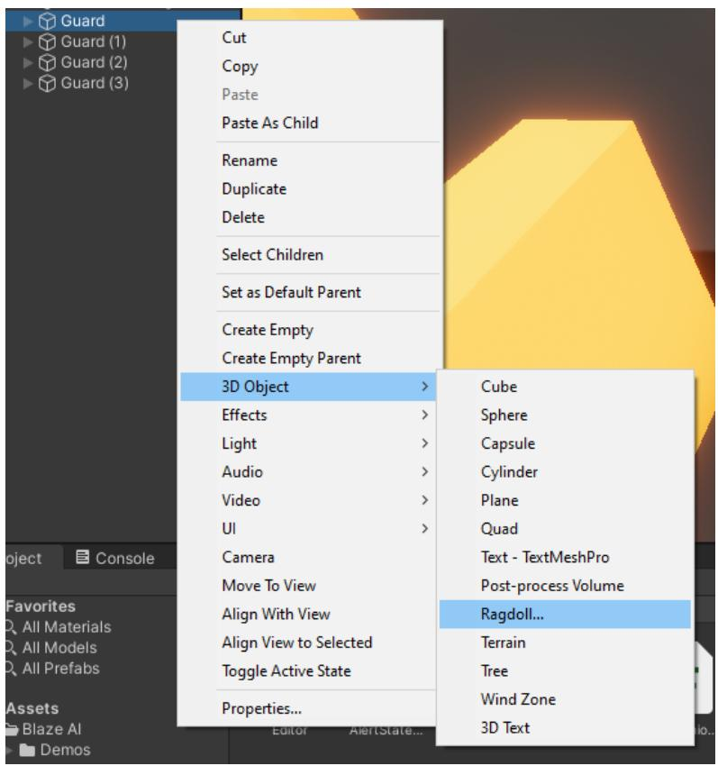


然后将相应的变换拖放到 AI 游戏对象中以设置角色的骨骼，然后单击“创建”。

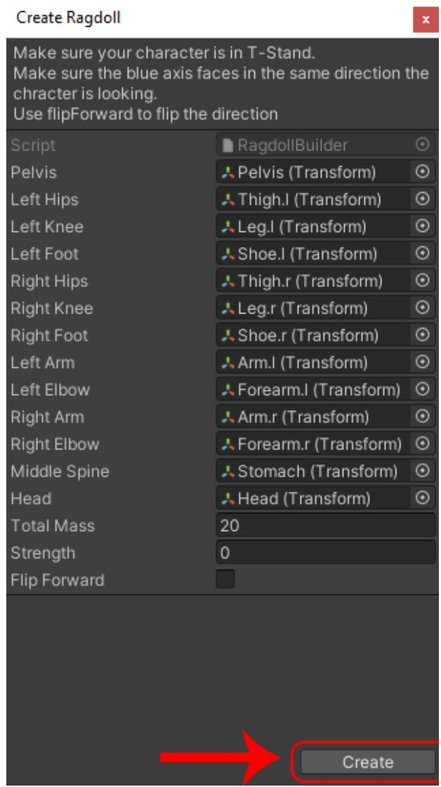


创建布娃娃后就可以使用它了。我们将从死亡中的布娃娃开始，然后检查淘汰赛。

# 布娃娃之死

转至 Blaze AI 主组件中的“死亡”选项卡并启用“使用布娃娃”。

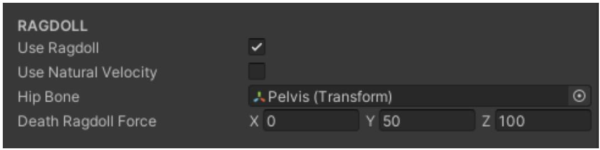


你会发现出现了一堆属性。让我们来看看它们。

使用自然速度：启用此功能不会对布娃娃施加任何额外的力。相反，它将使用自然速度。禁用此功能将使您能够对布娃娃施加力。

髋骨：这是施加力的地方。将其设置为骨盆或胸部变换。如果您要添加一些不属于布娃娃的自定义变换，请确保它具有 Rigidbody 组件。

死亡布娃娃力：您想要施加到布娃娃的力。这可以在调用 Death() 之前通过代码动态更改，以根据死亡方式改变力量。

现在你完成了！你已经设置好了一切，唯一缺少的是实际上触发死亡状态。您只需调用公共函数 blaze.Death() 即可做到这一点。当它被调用时，人工智能将随着布娃娃物理而死亡。如果你想播放死亡动画，然后在中途播放布娃娃，例如在隐身杀戮中，则调用 blaze.DeathDoll(float timeToRagdoll) – 但请注意：必须启用“在死亡”选项卡中使用布娃娃。

要重置 AI，只需调用：ChangeState("normal");或 ChangeState(“警报”);取决于你想要哪个状态。布娃娃将自动重置。

# 淘汰赛中的布偶

淘汰赛基本上就是让人工智能布娃娃，并在一段时间后它会再次站起来。这是命中状态行为的一部分。

按照本节开头所述设置布娃娃后。将 Hit State Behaviour 组件添加到您的 AI 中（在 Hit 部分中提到）

您将在“命中状态行为”中找到两个部分。击倒和击倒力量。这些属性是您设置淘汰赛的地方，所以让我们来看看它们。

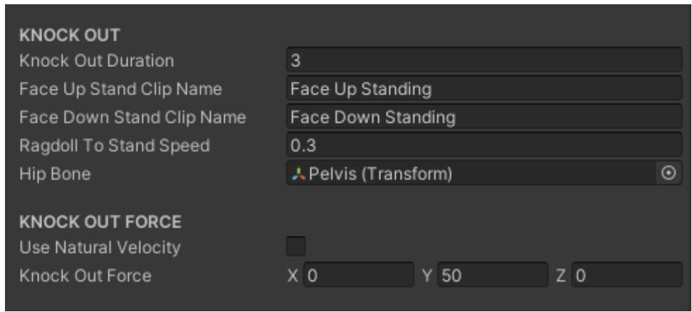


击倒持续时间：设置您希望人工智能保持布娃娃状态（击倒）的时间。

接下来的两个属性“面朝上支架剪辑名称”和“面朝下支架剪辑名称”很棘手。 Animator中的动画状态名称和实际剪辑名称必须相同。不然的话，就不行了。

这是一个例子：

这是我在动画器中制作的两个起床动画。就像我们在 Blaze 中经常做的那样。

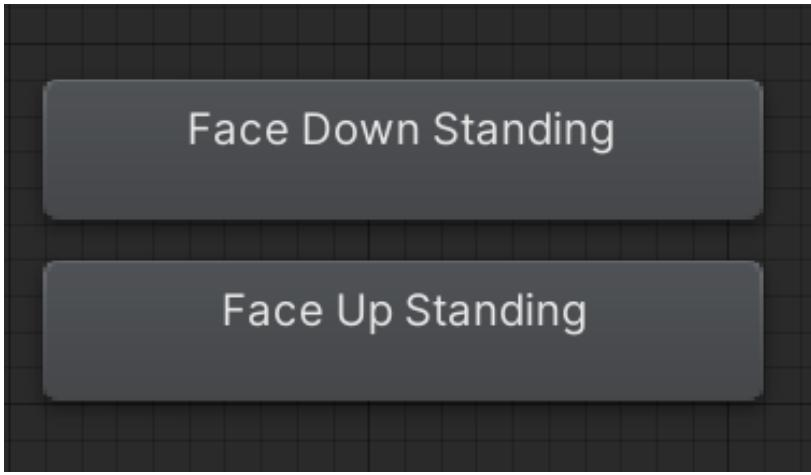


现在我需要确保实际的剪辑名称相同。如果我点击“面朝下站立”，我就会得到这个。

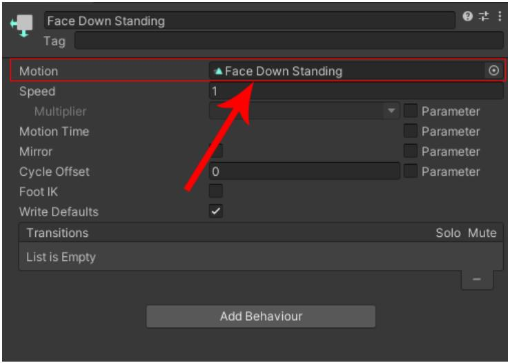


确保剪辑名称与动画器中的状态相同。如果没有，很容易。只需单击动画文件，转到动画选项卡，然后如下所示重命名为动画器中的相同名称。

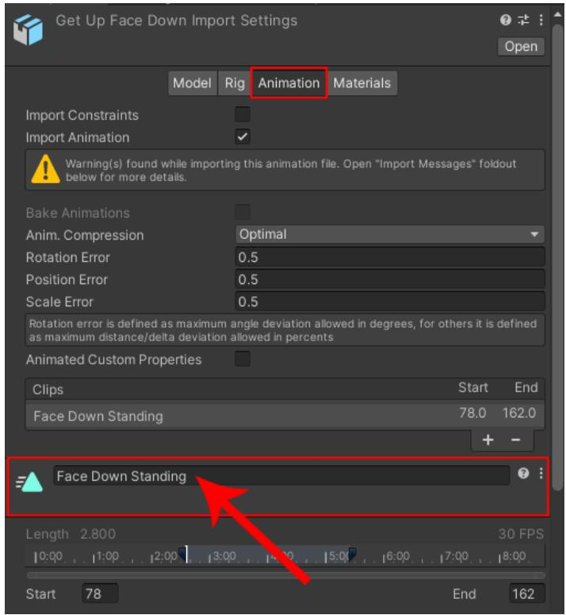


更改名称后点击下方的Apply即可应用新名称。

现在让我们回到属性。

Face Up Stand 剪辑名称：如果布娃娃后面的 AI 面朝上（背面），那么它将使用此动画站起来。

面朝下站立剪辑名称：如果布娃娃后面的 AI 面朝下（趴着），那么它将使用此动画站起来。

布娃娃站立速度：布娃娃到站立动画之间的过渡速度。

髋骨：将其设置为骨盆。这很重要并且有两个功能。首先，对这块骨头施加敲击力。其次，该骨骼用于确定 AI 是面朝上还是面朝下。

使用自然速度：如果启用，则在击倒时不会向布娃娃施加额外的力。相反，它将使用给定时间的自然速度。

击倒力：添加您想要施加到布娃娃的力。您可以通过代码动态更改此设置，以根据导致淘汰的原因应用不同的力。

现在您已经设置了属性，剩下的实际上是调用淘汰赛。这很简单。只需执行 blaze.KnockOut() 即可。

它需要两个带有默认值的参数。

KnockOut（游戏对象敌人 = null，bool callOthers = false）

如果你通过了敌人的游戏对象，将其击倒。站立后AI会转为攻击状态并移动至敌方位置。

第二个参数是你是否想让被击倒的Al给别人打电话。如果敌人的游戏对象也被传递，那么 Als 将被调用到敌人的位置。如果没有传递敌人参数，那么 Als 将被调用到实际被击倒的 Al 位置。

# 目标/玩家死亡

当你杀死你的玩家时，你会注意到人工智能仍在攻击和攻击死去玩家的身体。这是因为人工智能仍然检测到它前面有一个敌对的游戏对象，并且没有任何东西告诉它不要管它。

解决这个问题的方法非常简单。当玩家死亡时，只需将其标签名称更改为任何非敌意的名称，例如“Untagged”。人工智能将不再检测到任何敌方，因此将脱离交战，留下死亡的目标/玩家并继续巡逻。

死亡时更改玩家的标签名称，很简单：

```txt
if (healthPoints <= 0) {  
    player.gameObject.tag = "Untagged";  
}
```

# 关闭网状链接

Blaze AI 完全支持离线网状链接。首先，您需要实际生成离线网格链接。为此：请观看以下内容：

1-Unity 的离网链接教程

2-生成导航网格链接

完成关闭网格链接的设置并且所有内容都已连接后，就可以开始使用 Blaze 了。

只需转到主 Blaze 检查器中的“Off Mesh”选项卡并启用“Use Off Mesh Links”即可。

将会出现一堆属性供您轻松填写。

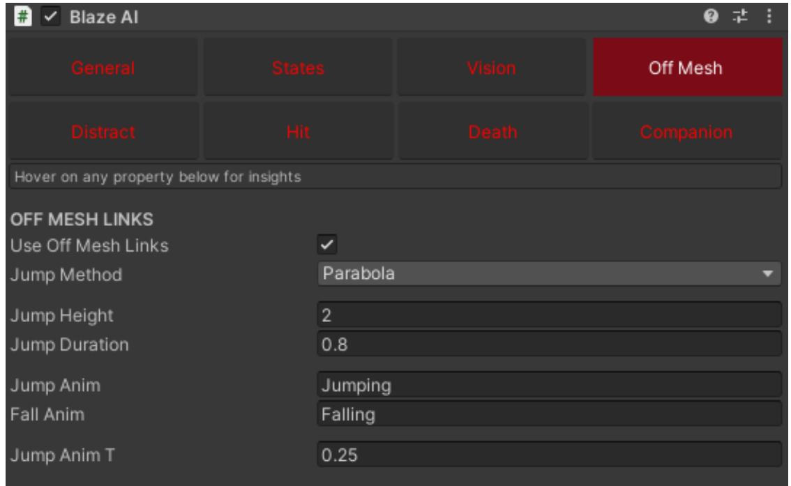


当最终目的地的Y点大于或等于Al的transform.position时，播放跳跃动画。如果最终目标Y点低于transform.position，则会播放下落动画。

如果你不想有下降动画，你当然可以将其设置为跳跃动画，没有任何问题。

这就是跳跃！现在，如果你设置一个路径点到人工智能需要通过链接的位置，它会自动跳转并为你处理一切。

请注意：如果禁用“使用非网格链接”并且非网格链接组件“导航区域”设置为“跳转”，则 AI 将完全忽略通过该链接的目的地。仅当“使用关闭网格链接”设置为 true 时，AI 才会寻找可跳转的导航区域。

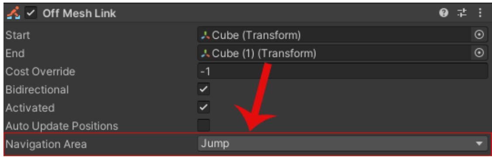


# 爬梯

请注意，火焰只能爬上梯子，不能爬下。

首先，让我们设置梯子。将您的梯子游戏对象添加到场景中。必须是直角 90 度。并给它一个独特的层。我会给我一个“梯子”层，它需要有一个碰撞器，最好是一个盒子或网格碰撞器。

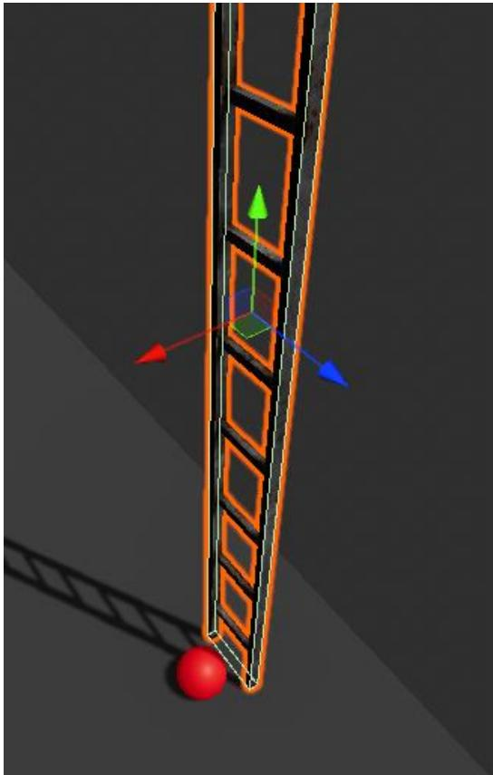


添加关闭网格链接及其靠近梯子的起始位置。我的是下面的红色球体，向您展示。这是阶梯的开始。

在梯子后面添加地面上脱离网格链接的结束位置，如下所示：

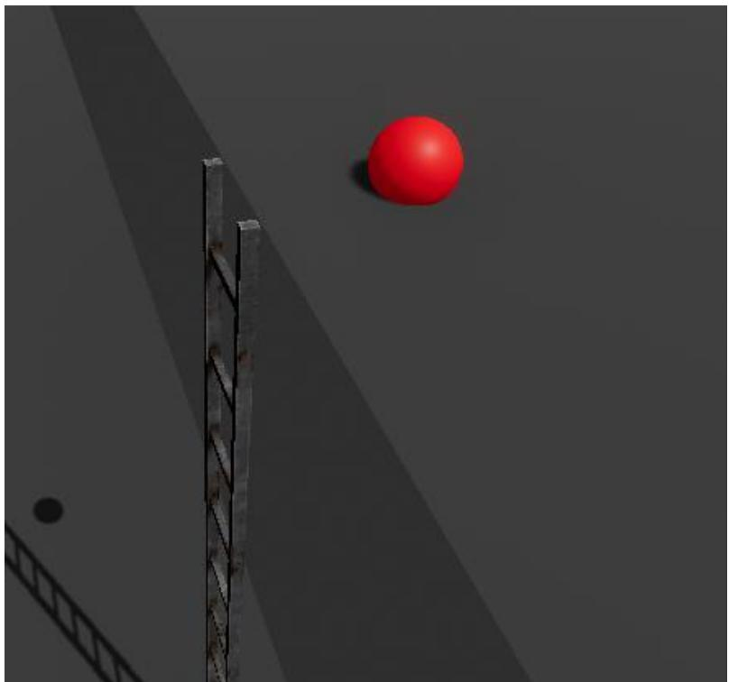


现在我们已经完成了梯子的设置。

返回 Blaze，选择 Off Mesh 选项卡，确保启用 Use Off Mesh Links，然后启用 Climb Ladders

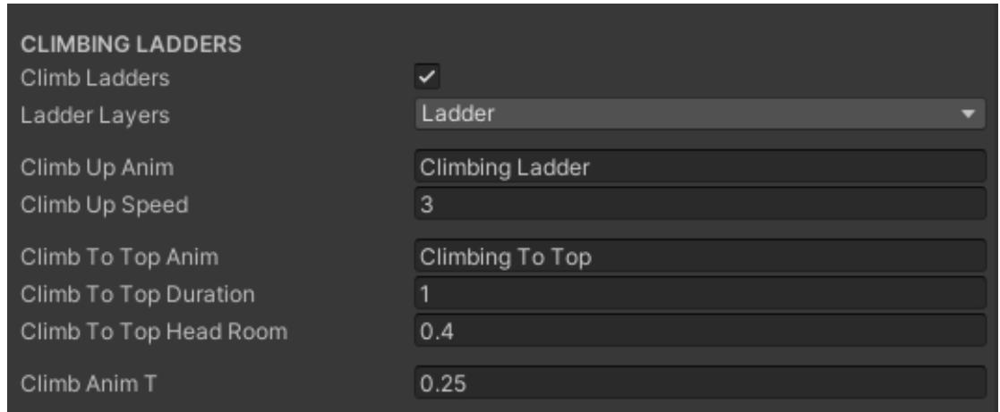


- 设置我们之前制作的梯子层。请记住，该层必须是带有碰撞器的层。

- 设置攀爬动画和攀爬速度。

- 爬到顶部动画和持续时间是当 AI 到达梯子顶部并向平面移动并离开梯子时播放的动画。所以设置动画和持续时间。

- 爬到顶部头部空间 给 AI 多少头部空间来指示它已到达梯子的顶部。不同的人工智能类型之间的差异是不同的，因为它们的高度不同，这需要你进行一些尝试和错误。这会触发爬升到顶部子状态。

现在设置一个到不同平面的路径点，并使用梯子进行非网格链接。将会发生的情况是，当人工智能处于非网格链接时，它会检测到梯子并开始攀爬。

# 它是如何运作的？

当 AI 位于启用了爬梯的离线网格链接时，它将触发一个以代理为半径的重叠球体。如果它检测到任何具有梯子层的游戏对象，则它开始播放攀爬动画。

如果它没有检测到任何东西，它就会跳跃。

如果 AI 与梯子位于同一个离线网格链接上，但“攀爬梯子”设置为 false，那么它会跳跃。

# 备用状态（表情）

备用状态是一项功能，可让您激活临时自定义状态，该状态可播放任何动画、触发事件，然后通过自动计时器或使用 API 手动退出该状态。此类功能可以用作表情来嘲讽玩家在战斗中、阻止玩家攻击或运行自定义行为等......

以下是如何开始：

- 将 Blaze AI Spare State 组件添加到 Blaze AI 所在的 AI 中，并将一个项目添加到列表中。

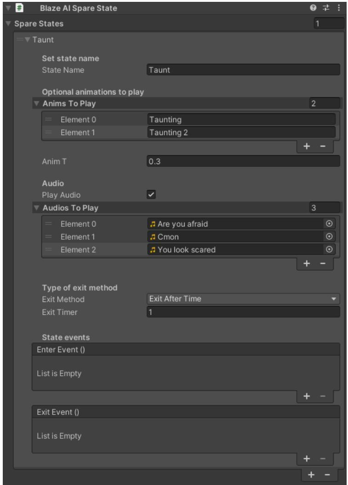


- 在“州名称”中，为州命名（这很重要，因为该名称将用于调用州，因此请确保它是唯一的）

- （可选）在*要播放的动画*中，您可以在列表中添加动画，并且在调用状态时将选择并播放随机动画。如果使用此功能，请记住将 *Anim T* 属性设置为良好的过渡时间，例如 0.25。如果您不想播放动画，可以将两者留空。

- （可选）与音频相同，您可以选择在“要播放的音频”中插入音频剪辑并启用“播放音频”。当状态被调用时，这将播放随机选择的音频。

- 在退出方法中，您有两种退出状态的方法。选择“Exit After Time”（在“Exit Timer”值过去后自动退出状态）或“Manual Exit”（手动退出），这将需要调用 API：blaze.ExitSpareState() 才能退出状态。

- 在状态事件中，您可以设置状态的进入和退出事件。

- 设置备用状态后，您可以在游戏中随时调用它： blaze.SetSpareState("stateName");

# 重要API

调用状态： blaze.SetSpareState("stateName");

要调用具有特定动画和音频的状态： blaze.SetSpareState("stateName", animIndex, audioIndex);

要调用具有特定动画的状态并随机化音频： blaze.setSpareState("stateName", animIndex);

要调用具有特定音频的状态并随机化动画： blaze.SetSpareState("stateName", -1, audioIndex);

手动退出： blaze.ExitSpareState();

检查 AI 是否处于备用状态或检索备用状态信息：SpareState stateInfo = blaze.CurrentSpareState();

如果 Al 不处于空闲状态，则返回 null。   
如果Al处于空闲状态则将返回SpareState类型的数据。

# 敌人经理

当 AI 捕获敌对游戏对象（玩家）时，它会自动向其添加 BlazeAIEnemyManager 组件。这是人工智能生命周期中的重要组成部分。

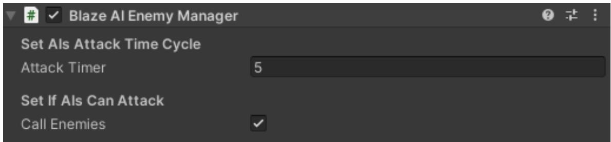


您也可以在编辑器中手动添加这个敌人管理器。

攻击计时器是指管理者调用 AI 对其进行攻击之前的时间。

呼叫敌人是标记是否可以攻击该经理的属性。如果禁用，AI 将永远不会攻击并等待此属性变为真。当你的玩家正在进行终结且你不想被打断时，最好使用此功能，这样你就可以暂时禁用此功能。

# 敌人管理器的用途

它安排了阿尔斯人的攻击。让阿尔斯队以一分的优势进攻。这种情况仅发生在攻击状态行为中禁用了间隔攻击的 ALS 上。如果启用该属性，AI 将使用自己的计时器管理自己的攻击，而不考虑任何其他 AI。掩护射击模式是相同的，有自己的计时器。

# 重要API

敌人管理器.targetedBy：使用这个敌人管理器 API，你可以检查你的玩家是否成为任何 AI 的目标。这将返回 Blaze AI 类型的列表 (List<BlazeAI>)，其中包含所有已看到并与经理互动的 AI。

敌人管理器.潜在敌人：这将返回可能使用视野计瞄准玩家的人工智能。因此，如果人工智能启用了视觉计，并且它的条形正在递增（尚未检测到您！），因为您位于它的视野中，那么您将使用此 API 在这里找到人工智能。用它来检查您的玩家是否处于潜在危险中。这将返回 Blaze AI 类型的列表 (List<BlazeAI>)

# 音频管理器

音频管理器仅用于播放AI在正常和警报状态下的巡逻音频。所有其他状态音频均由 AI 本身触发和播放，而不是由该管理器触发和播放。

以下是如何开始使用巡逻音频：

- 创建一个空游戏对象并添加组件 Blaze AI Audio Manager。

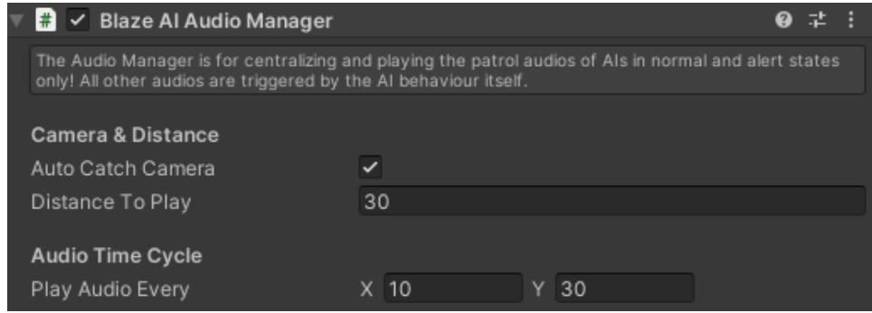


- 当摄像机或玩家距离播放距离属性足够近时，Als 将播放巡逻音频。如果您想使用相机进行远距离拍摄，可以启用“自动捕捉相机”。您的相机必须具有 MainCamera 标签，否则将无法找到。

- 如果您想改用播放器变换，则只需禁用“自动捕获相机”并将播放器拖/放到要绘制的“相机”或“播放器”属性中即可。

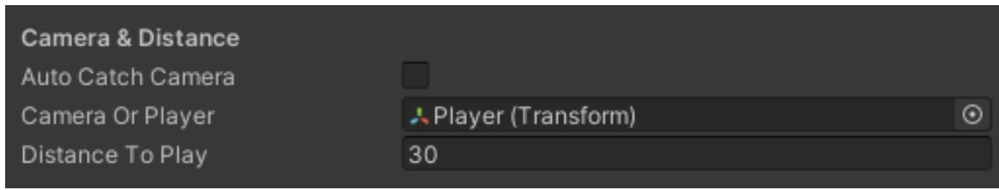


- 当玩家和AI（或摄像机和AI）之间的距离小于或等于播放距离时，该距离内的Al将播放他们的巡逻音频。设置您喜欢的距离。

- Play Audio Every 属性的两个值之间将生成一个随机时间。计时器结束后，人工智能将播放巡逻音频。对于恒定时间，将两个字段设置为相同的值。

- 最后，返回正常和警报行为并启用播放巡逻音频。

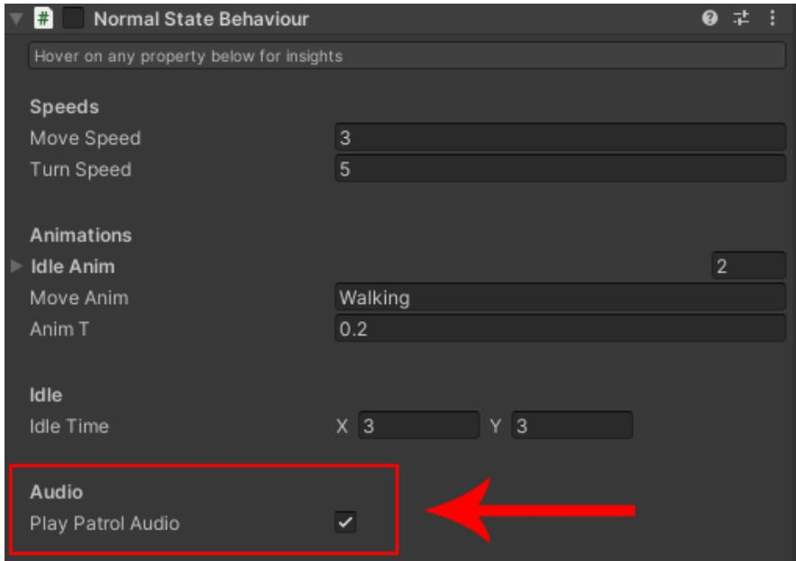


现在有了这个音频管理器，巡逻中的 Al 音频不会互相干扰，只有那些离玩家足够近的音频才会被允许播放。

请记住，音频管理器仅用于播放巡逻音频。为了实际设置音频，您可以将它们添加到音频脚本中，如此处所述。

# 编写新行为

Blaze 使您能够从头开始编写新行为并将它们链接到引擎以进行自定义操作。这非常简单，但有一些基本点需要注意。

创建一个新的 C# 脚本并在编辑器中打开它。

首先，您必须使用命名空间 BlazeAISpace 包装您的类名。这可以在红色矩形 1 中看到。（下一页的屏幕截图）

其次，从 BlazeBehaviour 扩展您的类，而不是默认的 MonoBehaviour。这可以在红色矩形 2 中看到。不用担心，您仍然可以访问 MonoBehaviour 的内容。

第三也是最后一点，您必须编写并重写 3 个主要函数：

- Open() 相当于 OnEnable()

- Close() 相当于 OnDisable()

- Main() 相当于 Update()

这 3 个函数也必须是公共的。

Main() 是您运行大部分代码的地方，因为它与 Update() 完全相同。

# 下一页截图

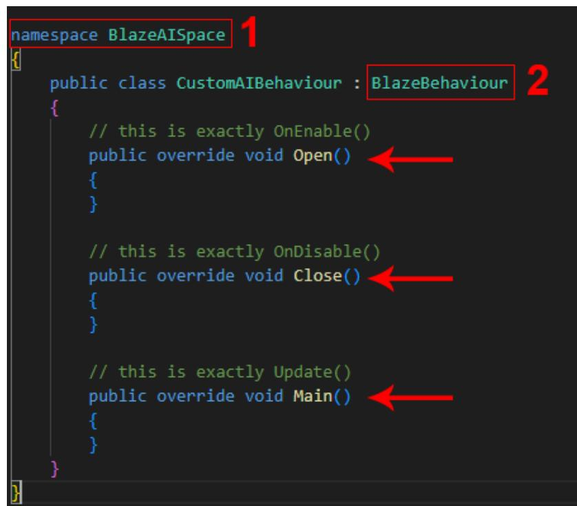


您可以正常使用其他 MonoBehaviour 函数，例如 OnValidate()、Reset()、OnDestroy() 等...

# 跟踪/调试 AI 状态

Blaze AI 附带了一个工具，可以帮助您跟踪 AI 当前所处的状态。使用起来非常简单。

只需将 Blaze AI 状态跟踪器组件添加到 Blaze AI 所在的位置即可。意思是，在同一个游戏对象上。

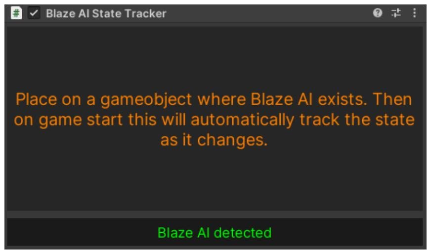


该工具甚至会帮助您并通知您是否已检测到 Blaze AI，如底部栏中的绿色文本所示。

现在只需玩游戏，该工具就会在 Al 发生变化时打印它的状态。

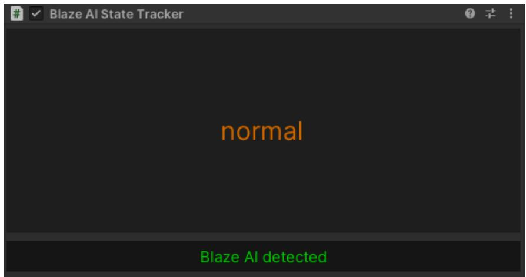
