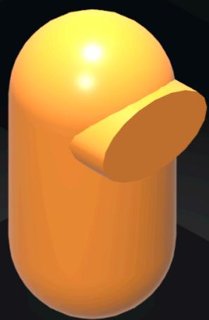
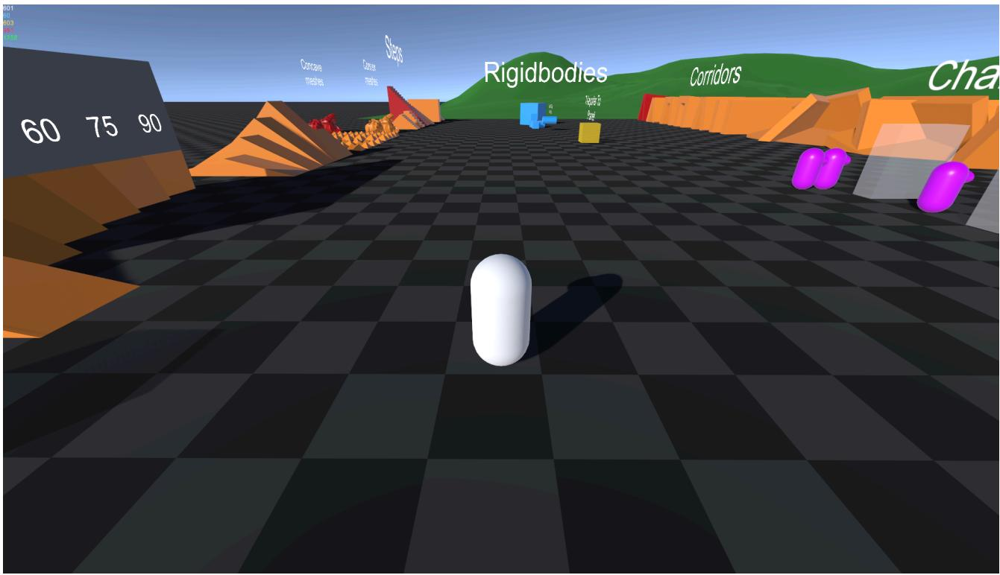

# 运动角色控制器

# 运动角色控制器

用户指南

支持电子邮件：store.pstamand@gmail.com

# 快速入门

# 角色游乐场场景

要立即尝试示例字符控制器：

1. 将 KinematicCharacterController 包导入 Unity

2. 打开 KinematicCharacterController/Examples/Scenes 下的“CharacterPlayground”场景

3. 按播放键并尝试示例角色

场景布置如下：

- “Player”对象负责向玩家的角色和相机发送输入，并为角色提供有关相机方向的信息

- “角色”对象是您在游戏模式下控制的角色

- “Camera”对象是游戏的相机

- “关卡”对象包含所有其他关卡几何图形和内容，排列在不同的模块中

- 按下播放按钮后，会通过类似单例的实例化自动生成“KinematicCharacterSystem”对象，以便以正确的顺序处理更新所有角色和移动平台

控制措施是：

W、S、A、D 移动

- 鼠标环顾四周

- 鼠标滚轮可放大/缩小相机

跳跃空间

C 蹲下

# 封装概览

# 封装结构

- Core：该文件夹包含角色系统的核心脚本。如果您使用此软件包，则必须绝对保留这些脚本。

- ExampleCharacter：此文件夹包含一个可选的示例角色和相机，旨在演示上述核心脚本的用法。如果不需要，可以删除整个文件夹，但演练文件夹依赖于它。

- 示例：此文件夹包含其余可选示例内容。如果不需要，可以删除整个文件夹，但演练文件夹依赖于它。

- 演练：此文件夹包含一系列完整记录的角色控制器功能实现示例。有关详细信息，请参阅“演练”文档。如果不需要，可以删除整个文件夹。

# 核心脚本

- KinematicCharacterMotor：这是角色系统的核心。该脚本根据给定的速度、方向和其他因素解决所有角色移动和碰撞。

- PhysicsMover：此脚本移动运动物理对象（移动平台），以便角色可以正确地站在其上并被它们推动。

KinematicCharacterSystem：按照正确的顺序处理模拟 KinematicCharacterMotors 和PhysicsMovers。

- ICharacterController：创建一个实现此接口的类并将其分配给 KinematicCharacterMotor 以实现您的角色控制器

- IMoverController：创建一个实现此接口的类并将其分配给PhysicsMover以实现您的移动器控制器

# 示例脚本

- ExampleCharacterController：处理与 KinematicCharacterMotor 的通信，以创建可移动的角色。

- 示例移动平台：使用数学函数移动PhysicsMover 并创建移动平台。

ExamplePlayer：处理ExampleCharacterController 的输入，充当摄像机和角色的管理器。

- ExampleAIController：模拟场景中 AI 角色的输入

- ExampleCharacterCamera ：一个可以围绕角色旋转的简单相机脚本

# 如何使用这个包

# 会发生什么？

众所周知，角色控制器很难很好地完成，而且每个游戏对它们的需求都有很大不同。可能性是无限的。因此，运动学角色控制器不会尝试预先打包每个问题的所有可能的解决方案。相反，它专注于解决创建高度动态和响应性的角色控制器的困难的核心物理问题，并将所有其余的交给您。这种设计理念确保您有能力制作为您的特定游戏量身定制的角色控制器，并且可以完全适应任何项目架构。

这个包希望您编写自己的代码：玩家输入、摄像机处理、动画，甚至角色移动（告诉它它的速度应该是多少，它的方向应该是什么）等等......然而，它提供的是一组低级组件，可以处理复杂的角色物理求解，并帮助您相对轻松地编写完全自定义的角色控制器。

“CharacterPlayground”场景中提供了一个示例角色控制器，但这实际上只是一个用作概念证明和/或学习资源的示例。它并不意味着是适合任何项目的最终解决方案。

# 它是如何运作的？

整个包围绕“KinematicCharacterMotor”组件展开，该组件代表角色胶囊并在给定一组输入（速度、旋转等）的情况下正确解决运动问题。当你给它一定的速度时，它会运行它的运动代码并使其在表面上适当地碰撞/滑动。此外，它还为您提供有关其接地状态、移动平台上的手柄、推动其他刚体的手柄等的正确信息……这就是您构建角色控制器的基础。

为了将这些输入提供给 KinematicCharacterMotor，您需要创建自己的实现 ICharacterController 接口的自定义类，并将其分配给 KinematicCharacterMotor.CharacterController 变量。通过这样做，您的类现在将开始接收来自电机的“回滚”。大多数这些“回滚”都可以解释为 KinematicCharacterMotor 提出的问题：

- UpdateVelocity：“我现在的速度应该是多少？”

- UpdateRotation：“我现在的方向应该是什么？”

Is ColliderValidForCollisions：“我可以与这个对撞机发生碰撞，还是应该直接穿过它？”

ETC....

这些回调都是由 KinematicCharacterMotor 在角色更新循环中在正确的时间自动调用的，因此您不必担心事情的执行顺序。通过实现它们，您可以准确地告诉 KinematicCharacterMotor 您希望它如何表现。

同样的原则也适用于移动平台的创建。在这种情况下，“PhysicsMover”扮演与 KinematicCharacterMotor 相同的角色，“IMoverController”扮演与 ICharacterController 相同的角色。通过实现PhysicsMover的回调，您可以准确地告诉您的移动平台您想要它去哪里。

该包的“Example”和“Walkthrough”文件夹下包含的所有内容实际上并不是运动角色控制器系统的一部分。它们只是帮助您入门的学习资源。

# 如何开始？

我建议使用两种主要方法来开始学习这一切：

1. 阅读用户指南的“示例角色概述”部分

2. 找到“演练”文档和项目文件夹。这包含一系列非常深入的练习，并提供完整的资源。它将引导您从 A 到 Z 一步步创建整个自定义角色控制器，并且还包含使用PhysicsMovers 创建移动平台的示例。

该项目还提供 HTML 形式的 API 参考。只需解压 .zip 并打开“APIReference.html”即可访问它。

# 角色概述示例

本节将总结几个组件如何协同工作以在“CharacterPlayground”场景中创建示例角色。打开场景并按照本节进行操作。

# 组件

以下是对角色重要的主要组成部分：

- ExamplePlayer（在 Player 对象上）：这是处理玩家输入的类，并充当角色和相机之间的链接

ExampleCharacterCamera（在 Camera 对象上）：这处理要遵循的围绕指定变换的相机移动

- ExampleCharacterController（在角色对象上）：这是实现电机回调的实际自定义角色控制器脚本。如果您想创建自定义角色控制器，您需要自己执行其中一项操作

- KinematicCharacterMotor（在角色对象上）：与角色控制器来回通信的包的核心组件。它的工作主要是解决给定速度和旋转的所有角色物理问题

请注意，没有什么会强迫您将播放器、摄像机和控制器中的东西分开。这只是做事的一种方式。这里唯一必需的组件是 KinematicCharacterMotor。

# ExamplePlayer 中的输入处理

在其 Update() 中，ExamplePlayer 脚本处理相机和角色的输入（分别在 HandleCameraInput() 和 HandleCharacterInput() 中）。

对于相机，它使用 UpdateWithInput() 将鼠标移动和滚轮移动发送到 ExampleCharacterCamera

对于角色，它构建一个包含角色所需的所有输入信息的结构，并使用 SetInputs() 将其发送到 ExampleCharacterController

# 相机移动

当从ExamplePlayer调用UpdateWithInput()时，相机脚本会自动根据该输入计算新姿势，并立即应用它。

# 人物动作

当从 ExamplePlayer 调用 SetInputs() 时，ExampleCharacterController 会处理所有这些输入并存储有关其移动方向、外观方向、跳跃和蹲伏状态等的信息。

稍后，当 KinematicCharacterSystem 对所有角色调用其更新周期时（默认情况下，这发生在固定更新中），ExampleCharacterController 将在从 KinematicCharacterMotor 接收到的各种回调中使用已处理的信息。在 UpdateVelocity 中，它将处理计算当前速度应该是多少。在 UpdateRotation 中，它将计算新的旋转，等等......

有关 KinematicCharacterSystem 的更多信息，请参阅下一节

# 运动角色系统概述

本节概述了所有“核心”脚本如何协同工作以正确处理角色移动并创建角色系统。您的 KinematicCharacterMotors 和PhysicsMovers 需要非常特定的执行顺序才能按预期工作。这是由 KinematicCharacterSystem 类处理的。

# 组件注册

当KinematicCharacterMotors和PhysicsMovers被创建时，它们在OnEnable()中将自己注册到KinematicCharacterSystem中。同样，它们在 OnDisable() 中注销自己。然后，KinematicCharacterSystem 将以正确的顺序处理所有注册的 KinematicCharacterMotors 和PhysicsMovers 的更新行为。

# 基本模拟循环

在FixedUpdate()中，如果AutoSimulation为true，KinematicCharacterSystem将执行以下操作：

- 预模拟插值更新()

o 处理在完成任何运动之前保存所有已注册的电机和动子初始姿势。

○ 手柄精加工插补

- 模拟（）

计算所有物理移动器的速度（基于它们的目标姿势）。

o 在所有 KinematicCharacterMotor 上调用 UpdatePhase1()，这会解决初始重叠并处理接地逻辑。

o 将所有物理移动器直接放置在目的地。

- 在所有 KinematicCharacterMotors 上调用 UpdatePhase2()，这会解决运动问题并计算电机的最终姿态。然后，将电机移动到目标姿势。

PostSimulationInterpolationUpdate()

这将使所有电机和动子变换移动到 PreSimulationUpdate() 中保存的姿势

# 手动模拟

如果需要精确控制模拟，可以将 KinematicCharacterSystem.AutoSimulation 设置为 false。这将使您有责任自己处理模拟。这在网络环境中很有用，您可能需要在同一帧内多次调用 Simulate() 来重新模拟过去的输入。

查看 KinematicCharacterSystem.FixedUpdate() 以观察默认的自动模拟循环是如何完成的

# 附加信息

# 重要角色控制器注意事项：

- 如果您确实想“传送”您的角色而不是使其移动，请使用 KinematicCharacterMotor.SetPosition()

- 切勿使角色成为移动变换的子角色。

- 角色游戏对象的有损尺度必须是  $(1,1,1)$ ，否则物理计算将无法正常进行。这意味着该对象的所有父对象也必须有一个  $(1,1,1)$  规模。如果不遵守此条件，您将在编辑器中收到错误。但是，您可以自由地为子对象设置任何您想要的比例。

- 如果您想在游戏过程中调整胶囊的大小，请始终使用 KinematicCharacterMotor 的“SetCapsuleDimensions”方法，因为它会缓存有关胶囊尺寸的信息，这些信息稍后会被大多数运动代码使用。

# 物理查询能力

KinematicCharacterMotor 使用非 GC 分配方法进行物理查询，这意味着它具有固定大小的数组来存储这些查询的结果。默认情况下，它最多可以支持 32 个 RaycastHit 结果和 32 个碰撞体重叠结果。如果您需要更多，请随意修改 KinematicCharacterMotor 中的“MaxHitsBudget”和“MaxCollisionBudget”常量。

# 插值法

您可以通过修改 KinematicCharacterSystem 中的“Interpolate”来激活或停用所有 KinematicCharacterMotors 和PhysicsMovers 的插值

# 根部运动

如果需要，您可以使角色随着动画根运动而移动。您需要做的就是将动画的根运动 (animator.deltaposition) 存储在自定义角色控制器的 OnAnimatorMove() 中，并将其转换为速度 (animator.deltaposition / deltaTime)，以便您可以在电机的“UpdateVelocity”回调中设置电机的速度。旋转和“UpdateRotation”回调也是如此。演练中提供了这样的示例。